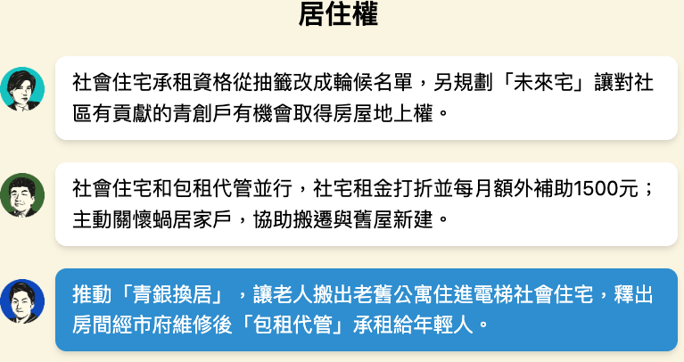
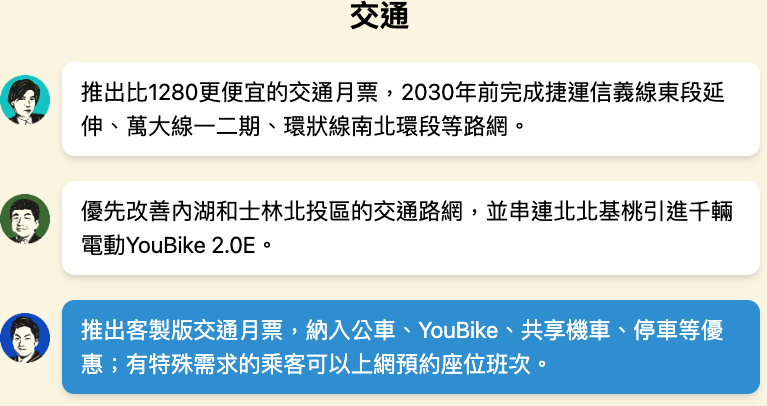
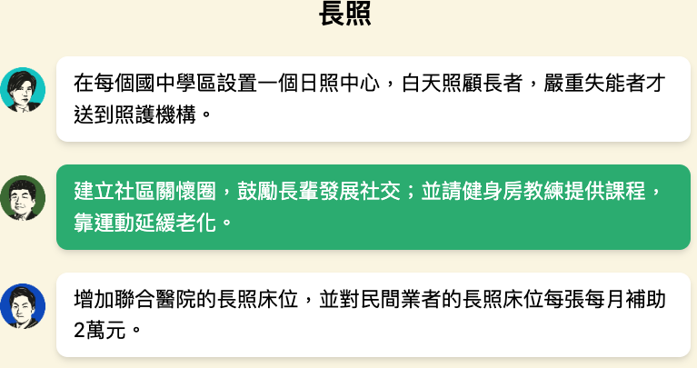
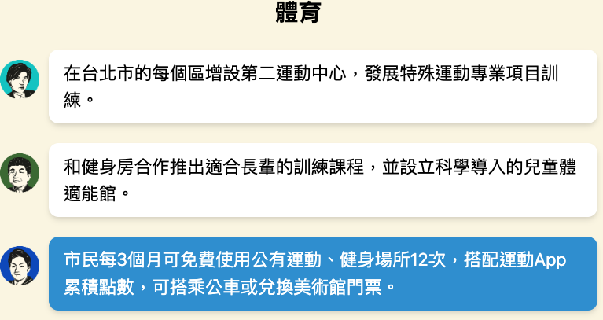
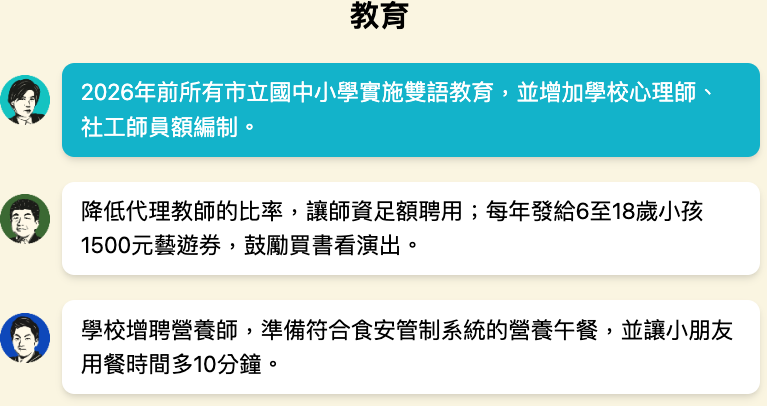
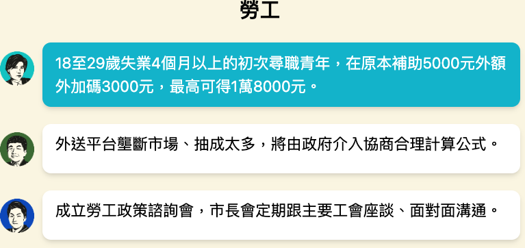
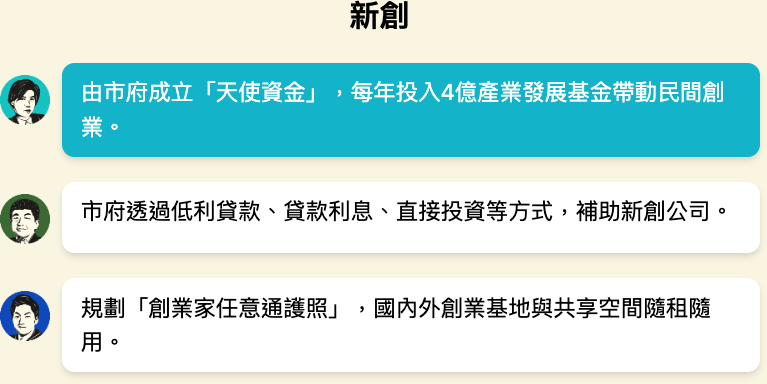
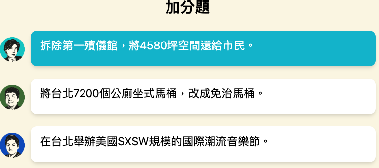
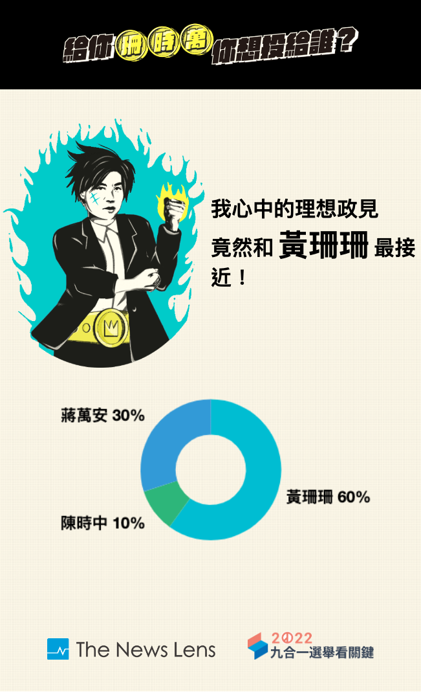
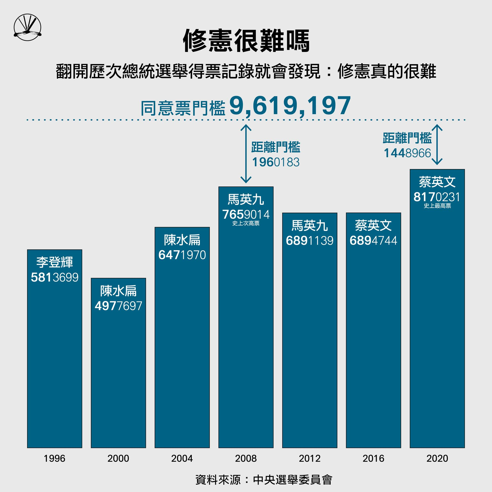


**Warning!** 本文章涉及我個人的政治觀點，可能既不客觀又不合理，如果你難以忽略我可能跟你保持不一樣的想法，不推薦繼續閱讀


雖然是不至於到忘記自己投給誰，但發現如果不寫一下推導的過程，還是有可能忘記自己是怎麼決定要投給誰的。

今年做的功課：
- [給你珊時萬，你想投給誰](https://www.thenewslens.com/election/2022/game)
- 馬力歐陪你喝一杯
  - [蔣萬安](https://podcasts.apple.com/tw/podcast/id1192212072?i=1000584215163)
  - [黃珊珊](https://podcasts.apple.com/tw/podcast/id1192212072?i=1000583404891)
  - [陳時中](https://podcasts.apple.com/tw/podcast/id1192212072?i=1000585060507)
- 選舉公報
- [呱吉的 2022 地方選舉投票指南](https://www.youtube.com/watch?v=961mDh6SvMI)

## 台北市第 6 選區市議員 (大安、文山)

[選舉公報](https://web.archive.org/web/20221121232419/https://eebulletin.cec.gov.tw/111/02%E8%87%BA%E5%8C%97%E5%B8%82/02%E5%B8%82%E8%AD%B0%E5%93%A1/%E8%87%BA%E5%8C%97%E5%B8%82%E7%AC%AC06%E9%81%B8%E8%88%89%E5%8D%80.pdf)

27 選 13，直覺上應該挺好上的，但其中 10 個都是現任議員，所以新人應該是沒什麼太大的機會。扣掉幾個經過辛亥加油站附近常看到國民黨議員的名字，剩下有聽過的就只有苗博雅、林穎孟、簡舒培。簡舒培其實就只是聽過名字，除了大巨蛋這個關鍵字會跟他連起來 (但說實話這個議題我沒興趣、加上我估計蹭話題的成分多一點)，其他他做了什麼是真的沒印象。因為呱吉以前的直播，他蠻常會提到跟苗博雅、林穎孟在不同議題上合作，所以自然這兩個就是我比較熟悉的，沒其他意外應該就是兩個挑一個。

關於苗博雅，呱吉在他的投票指南裡說，苗博雅是他心目中難得一見的政治奇才，特別是對各種事務和議題的拿捏得當，問政也是句句直指核心。再加上看新聞報導也都是正面的居多，估計應該是穩穩的，怎麼選怎麼上。

林穎孟的部分就比較尷尬一點。從議員職權內的工作來說，其實他算是做了蠻多事情，也做的不差。但他在 2018 年的選舉其實是低空飛過，倒數第二名，外加 2020 年跟他的助理爆發勞資糾紛、陷入詐領助理費的風波，用膝蓋想就知道他今年估計是要下去了。

所以我的選項歸納出來就是，要嘛穩穩的投苗博雅，要嘛就是找到我可以合理化投林穎孟的選擇，最後我的推論大概是這樣

- 勞資糾紛的問題，我從呱吉直播、和其他新聞畫面裡聽到的感覺是，他也許不是一個好的 team manager，而且在處理關於人的事情還太年輕，並沒有太多經驗，又感情用事，但這並不能用來否認他在問政方面上的能力，就當作不經一事不長一智吧。
- 助理費就有點頭痛，林穎孟其實不是這屆選舉唯一陷入這個風波的人，他的炸彈早在 2020 年就種下去，也拆完了 (最後不起訴)。真正的主戰場其實是在新竹市市長候選人高虹安身上，他充其量只是被餘波掃到。最後我自己解套的說法就是基於兩個點
  - 檢方不起訴 啊司法就說沒有了 硬要說有要幹嘛
  - 呱吉說林穎孟的狀況跟高虹安的狀況有很大的不同，所以並不代表高虹安的火燒的很大就代表林穎孟也要一起陪葬 (只是他說之後有空再解釋為什麼不一樣，如果我投了他也上了但解釋不過去，我可能就該去清一下業障)

最後就是，反正苗博雅會穩穩的進去，對我來說，這兩個人在議會裡雖然可能不會正面合作，但年輕進步派的聲音多一個是一個。

結論：投了林穎孟，然後他還是下去了，門檻一萬票只拿了四千票，慘哦

## 台北市市長

[選舉公報](https://web.archive.org/web/20221123023210/https://bulletin.cec.gov.tw/01%E9%81%B8%E8%88%89%E5%85%AC%E5%A0%B1/03%E7%9B%B4%E8%BD%84%E5%B8%82%E9%95%B7/111%E5%B9%B4/%E8%87%BA%E5%8C%97%E5%B8%82%E5%B8%82%E9%95%B7.pdf)

最早應該是在去年台灣防疫成績還不錯的時候，就有看到某一些媒體開始醞釀民進黨可能會派陳時中出來選。別的候選人不說，其實我對這個選項的第一個感覺其實是不捨。我覺得作為一個防疫工作的指揮官，陳時中不是沒有錯誤，但我覺得在多重宇宙的不同劇本裡，抽中陳時中的這一本台灣真的是燒了好香。對我來說，他就是一個老實人，紮實的在做每件事，但我覺得把他推向台北市市長這種一線戰場，也不是說他不能勝任，而是如果在未來他的某個不堪的過去被挖出來，或是在某些決策上出現失誤，會導致他這幾年為台灣的努力瞬間化為泡影，他的形象和人格也勢必會大受打擊。所以對我來說，這一票投給陳時中與其說是支持他，我覺得更像是把他推入火坑。

後來開始忙了好一段時間，就都沒什麼關注到選舉相關的新聞了。真的到比較接近的時候是玩了「給你珊時萬」的政見配對遊戲

我其實以前就有想過這個作法，就是有沒有可能選民投票只投政見，然後就直接讓政見跟大家票選吻合度最高的人當選，但算了改天有空再來寫這個。

然後我花了一個晚上的時間一邊整理雜事一邊把三個候選人上「馬力歐陪你喝一杯」的 Podcast 聽完。其實我對他們在節目上講了哪些議題不是真的那麼有興趣，我聽的目的其實是想感覺一下，我有沒有辦法看 (其實是聽) 穿這個人。從這個角度來說，陳時中跟黃珊珊其實沒有太大的區別，這兩個人就是老實人，把每一件小事都安的妥妥的，但其他的花招自然就沒什麼好期待的。蔣萬安我就看不太透，他有感覺到他很積極的在嘗試把節目的 rundown 導向他想講的地方，再加上某些問題回答的太過完美，甚至抑揚頓挫都拿捏的非常好，充分展現他口條俐落的一面，但這讓我難以讀出他形成這些想法的動機。他的政策大部分都蠻有創意的，至少在我有關注政治以來，很少有看過這麼有意思的，但要我相信國民黨的幕僚團隊有辦法真的把這些東西付諸實現，我就沒什麼信心了。

原本這裡想寫一段民進黨在這次選舉的垃圾決策、奧步、網軍、黑金、黑道勾結，但反正新聞都很多了，就不浪費我的時間了。我只補充一點新聞比較少講到的，我覺得民進黨作為一個立場比較偏進步思想的政黨，卻沒有好好的提攜後進的年輕人，導致選舉需要搬出防疫指揮官來選，真的是令我滿失望的。

好啦，寫到這裡答案應該很明顯了：蔣萬安對我來說認同感不夠強烈；陳時中我本來就不忍投；黃珊珊雖然不熟，但至少政見我是認同的，執行力夠，我看不出來投他會有什麼太大的問題

## 18 歲公民權

這題應該沒什麼好想的，上一次總統大選的時候我 19.9 歲，所以錯過了一波大的。我覺得會有下修 18 歲這個問題，根本就是憲法一開始就寫壞了。

我原本以為這應該會是一個，輕鬆~~點亮~~通過的公投，直到我看到這個

<!-- instagram ClWKSmzPE9o -->

我才突然意識到，這門檻真的是高的雞巴，綜觀台灣的投票史，根本就沒投出過這麼高的票數，這樣要投過，也太難了吧。

另外值得一提的是，某次聽到一集[博恩的 Podcast](https://podcasts.apple.com/tw/podcast/id1605731163?i=1000586930332) (在大約 30:20 的地方開始) 就有提了一些反方論點，很多還真的是我從來沒有想過。相較於一些電視新聞上某些保守派的老人言論，這些確實是比較少被提出來討論、而且值得想一下的問題。

## Misc

今年觀察到的一些其他選舉的狀況，筆記一下，幾年後也許可以當笑話看

- 今年選舉真的有夠無聊，沒什麼迷因就算了，吵的議題也很無聊，什麼[論文抄襲](https://zh.wikipedia.org/wiki/%E6%9E%97%E6%99%BA%E5%A0%85%E8%AB%96%E6%96%87%E6%8A%84%E8%A5%B2%E6%A1%88)、助理費詐領、[研究案](https://zh.wikipedia.org/wiki/%E8%BE%B2%E5%A7%94%E6%9C%83%E8%BE%B2%E6%A5%AD%E9%9B%BB%E5%AD%90%E5%8C%96%E7%99%BC%E5%B1%95%E7%AD%96%E7%95%A5%E5%88%86%E6%9E%90%E8%88%87%E8%A6%8F%E5%8A%83%E7%A0%94%E7%A9%B6%E5%A0%B1%E5%91%8A%E7%96%91%E7%BE%A9%E6%A1%88)，我還以為政治人物作為應該都很清楚娛樂產業是怎麼運作的，唉
- 我以前把苗栗國當笑話在看，但看完[這篇新聞](https://www.thenewslens.com/article/176949)才發現原來這不是笑話。議長鍾東錦比國民黨還大，脫黨參選還可以穩穩的車過去，靠的都是多年的綁樁和「炒米粉場」。
- [顏色不分藍綠支持性專區顏色田慎節，當選嘉義市議員](https://www.thenewslens.com/article/177196)
- [時代力量](https://www.thenewslens.com/article/176331)的力量正被台灣民眾黨快速侵蝕，台灣究竟會邁向三黨制還是多黨制呢
- 民進黨的地方選舉真的是選的有夠爛，議會最大黨幾乎全部都是藍的，從來沒綠過
  - 雖然沒有證據，但我私心認為長期透過「抗中保台」來提款民意，已經開始成為票房毒藥，再加上網軍過度氾濫，黨內派系刀光劍影，就算我淺綠，這麼沒有誠意的選項，我到底要怎麼投下去
- 當年蔣萬安和吳怡農兩個是平起平坐一起選立委的，啊怎麼轉眼間一個已經選到市長了，另外一個還在撿剩下的
