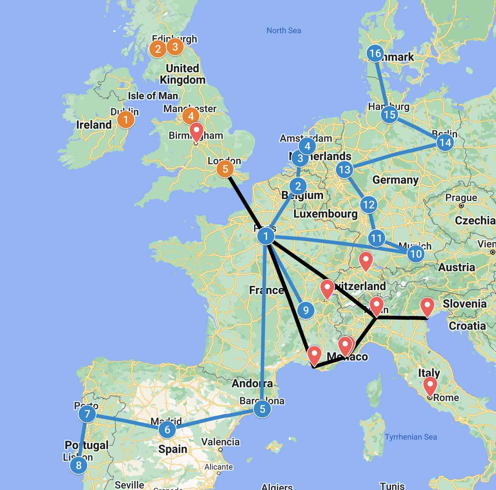
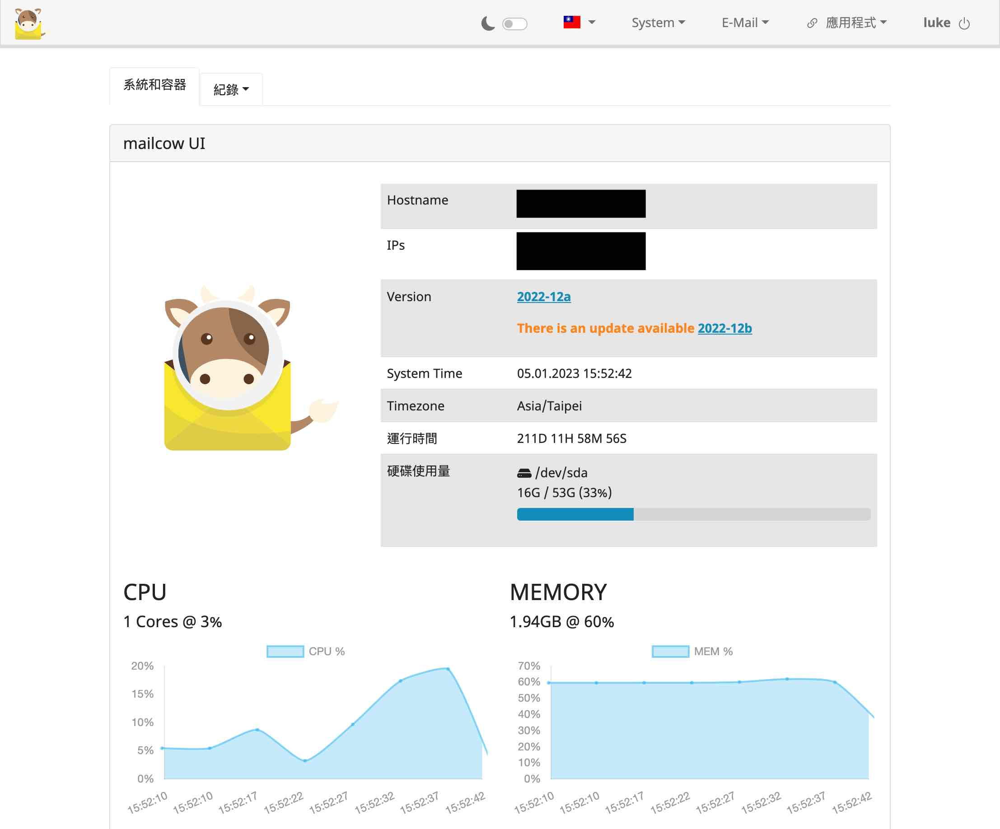

2022 應該是這幾年算是過的特別豐富的一年，值得好好記錄一下

## Jan. ~ May. - 🇫🇷 法國交換

- 2 月的專題週去了 🇧🇪 比利時、🇳🇱 荷蘭
- 3 月初的春假去了伊比利半島的 🇪🇸 西班牙、🇵🇹 葡萄牙
- 3 月中有 🇫🇷 里昂 的週末小旅行
- 4 月學期結束之後一路去了 🇩🇪 德國、🇩🇰 丹麥、🇮🇪 愛爾蘭、🇬🇧 英國

與其說是交換，不如說是頂個學生的名義來一趟歐洲大遊行。一開始是真的想要去認真的學點專業的東西、學點法文、交一些外國朋友，但後來發現學校的假其實比我原先預期的來的多很多，所以實際上最後大部分時間幾乎都是自己一個人在到處旅行。

如果用一句話濃縮我最深刻的感受，就是「自由得來不易」；這可以有兩種解讀，一個是，親眼在很多博物館看到歷史課本上的戰爭，那些建立了今天很多國家民主體制的戰爭。另一個是，即便是在民主的國家，也多的是沒有錢、沒有身分、沒有工作能力、或是大環境正在遭逢巨變而難以生活的人。我能夠在沒有任何負擔的條件下，成為疫情後第一批出去周遊列國的學生，真的是不知道上輩子修了多少福氣。

其他旅程上的啟發，就留到之後陸續寫成文章放上來吧。

## Jun. ~ Sep. - 🎭 劇坊公演、📖 GRE、📖 TOEFL

眼尖的人可能會發現上面的地圖還標了一些瑞士、南法和義大利的城市，那些都是原本有想，但後來沒去的計畫。在歐洲的時間，其實我一直都有在參與中興劇坊這邊公演都籌備，實際上的工作其實不多，就是有人提問題的時候我就出一張嘴給意見，然後開會來和大家聊八卦而已。但一開始就是打算提早結束歐洲的行程，然後回台灣參與我畢業前最後一次的社團活動。

後來在大概 4 月，接近公演的時候，我開始接收到公演可能會取消的訊息。後來沉澱過後還是決定照計畫在 5 月回來，想說就算取消我也可以提前開始唸書準備考 GRE 和 TOEFL。

後來比較賭爛的是，都已經提前回來唸書考試了，考了好多次還是沒有考到原本設定的目標，而且一路拖到跟後面的進度撞在一起。

## Sep. ~ Dec. - 🪖 ~~國軍~~替代役 Online + 🏛 申請美國研究所

基本上我交換回來，只要等到法國的成績單就可以回中興辦畢業，可是法國學校那邊原本接待交換生的職員離職，新來的職員又去放暑假了 (還有很多中間來來回回的 je ne sais pas 和 ce la vie，非常法國的部分 xDDDDD)。總之成績單拖了很久才拿到，但也剛好，反正只要不拖到延畢或是補繳學費，我就可以透過控制畢業的時間來間接控制我收到兵單的時間。最後壓在 9/13 入伍替代役 237 梯，扣掉我高中和大學軍訓課抵的時間，就剛好在 2023/1/1 退伍。

其他當替代役的細節大概也是......之後再寫吧。

同一時間也剛好要開始準備申請美國研究所需要的 statement 和其他文件，然後多虧了我前面 4 個月沒把考試考好，所以現在明明已經沒空了，還是會想說要最後再衝一下。雪上加霜的是，因為最早的 deadline 被壓在 11/30，所以拖到退伍再來認真弄基本上就不可能，如果最後我真的退伍還在弄，那就代表一定是出了大事。

所以我 10 月和 11 月的每日作息基本上就是：

- 早上7 點起床，8 點進消防署上班
- 下午 5 點下班，吃完晚餐開始唸 TOEFL
- 晚上差不多 10 點去洗個澡刷個 YouTube 休息一下
- 11 點開始爬文收集資料和弄申請的東西
- 2、3 點上床睡覺

再外加週末去考試，真的會有一種回到高中，書念不完生活一團糟的既視感。那段時間身邊的人看到我就說：「哇 你在 2 個月就要退伍了欸，好快哦。」殊不知這句話在我耳裡聽起來其實更像是「你的 deadline 只剩下一個月了哦，是不是要爆啦 🙃」

## 📋 Misc

其他今年的小成就：

- 在法國交換的時候，用空閒的時間架了自己的 Email server
  - 然後在接下來一年的時間內陸續把\*\*所有\*\*之前 Gmail 申請的網路帳號切換到新的 email
    - \*\*所有\*\*大約是 400 多個，我也很意外我到底為什麼會有這麼多帳號
  - 甚至還發了 [PR](https://github.com/mailcow/mailcow-dockerized/pull/4657) 幫這個專案加了繁體中文的翻譯
    - 本來只是翻譯，最後直接升級成幫人家寫決定語言的演算法，昏倒
  - 自架 email 這件事在某方面來說比我想像中的簡單，在另一方面來說卻又困難到不行，之後再寫
- 算是把這個 blog 的架構弄出了一個雛形，剩下一些小細節還沒想好要怎麼處理
  - 照片跟著 git 長期而言似乎不是一個好主意，只是這個未爆彈要等到我真的寫了夠多文章才會爆開，再加上這個問題的複雜度有點高，現在花時間處理意義不大，留到之後再說
  - 照片的呈現效果不是很理想，但不引入外部 library 似乎不好解
  - 需要有留言板嗎......?
  - 到底要不要做 analytics 啊，我的文章真的會有很多人看 (?)
  - 私心有點希望可以做到 JavaScript-less，但不太確定技術上可不可行，還有意義是什麼
- 開始有比較認真的去關注國際新聞和政治局勢，只是目前感覺缺乏系統性的方式來做這件事

## 結論

如果知道提早回來也不會考比較高，我應該會選擇照原定計畫去南法和義大利玩吧 (瑞士還是等到我財富自由好了，貴死)。還有真的不要把申請季和當兵ㄍㄡˇ在一起，真的是不作死就不會死。如果可以給我選，也許排到 2023 年初再進去當應該會相對不緊湊一點，像我現在退了反而還沒什麼事做，唉。

2022 該做但沒做的 + 2023 展望就明天再寫好了，嘻嘻
