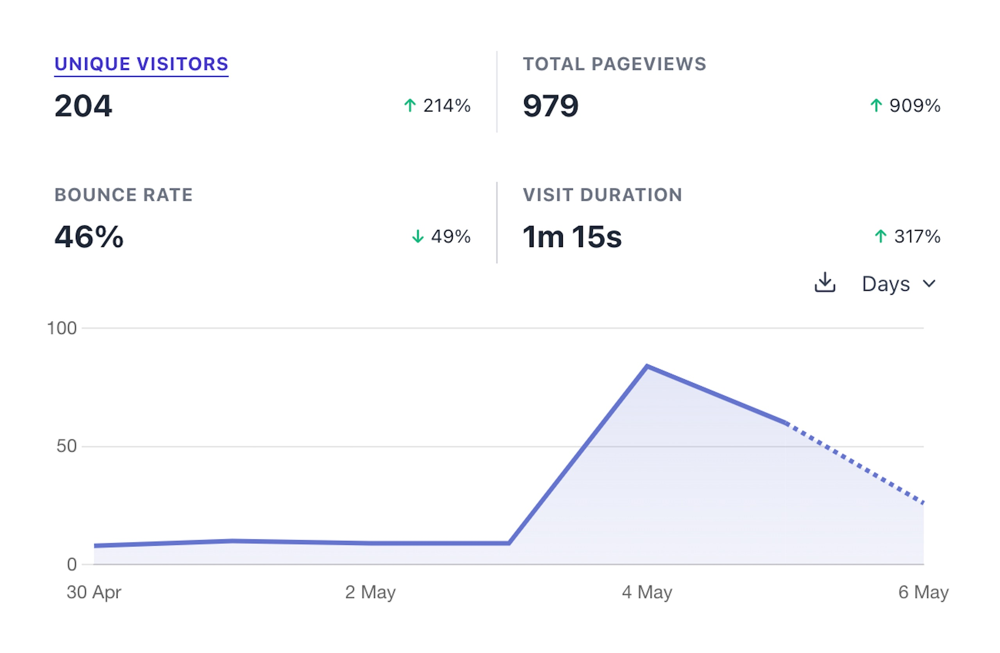
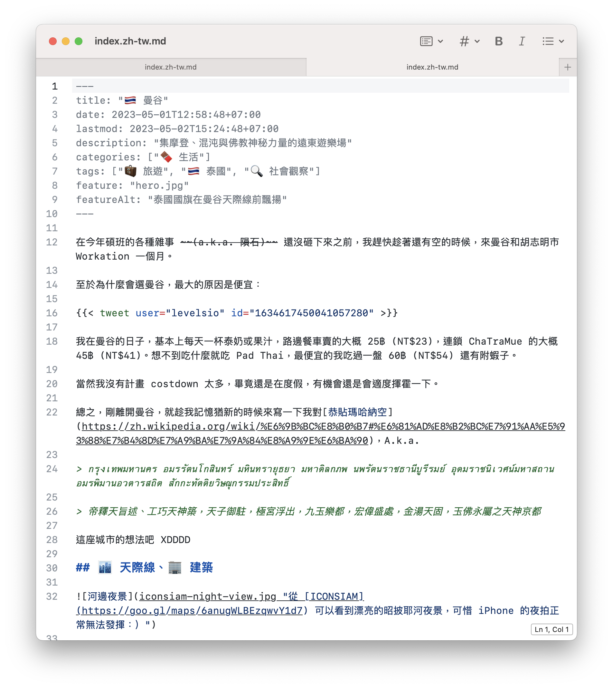

誒誒誒不是[上個月]()才說要在月底前就把報報寫出來嗎，怎麼又被我拖到今天已經 6 號了哈哈哈哈。

不幸中的大幸是，這個月的狀況還不錯，我對[曼谷]()挺滿意的，放假的時間走了很多景點，工作的狀態也算是有在軌道上。

## 🎯 本月目標回顧

[點我]()看看上個月的目標

### ✅ Blog 上架

終於 [盛大](https://www.facebook.com/tomy0000000/posts/pfbid0jLdHuVTYxpNund6aMH6UtmnryzgAwMepUPFHMCG5g9ZXqbB7Asrg1Bu8iWPvcfY7l) [開幕](https://www.instagram.com/p/Cr0X7qaLlxm/) 了啦！！

這就是為什麼這篇文拖到現在才寫，就不會有又被我拖了一個月的感覺 嘻嘻

話說上個月提到 Blog 上架被 Google News 和 Mailchimp 卡住，為什麼後來又修好了呢？其實我什麼都沒修，他也沒壞，搞了老半天他沒有在運作的原因就是：我整個三月都沒有發文，所以他當然不會動：））

雖然首發文章是[曼谷]()的心得，但是點閱率最高的反而是[教 ChatGPT 擲筊]()，真是挺意外的 (?)，說不定身為在 NLP 實驗室~~裝忙~~研究了兩三年的我應該來寫幾篇科普文章。

另外我發現原來大家還是有在滑 Facebook 欸，我上一次發*有意義的*的文應該已經是高中之前的事了，但我每隔一陣子就會看到那篇開幕文又被人按讚，其中不泛一些我已經有點想不起來是在哪裡認識的人 XDDD

### ✅ AppShelf 的前端


    
    

<figcaption class="text-center">(左) AppShelf 的介面 (右) 出門旅行寫 code 當然要留一下到此一遊 (?)</figcaption>

這個算是進度大超前，撒花 *ଘ(੭*ˊᵕˋ)੭* ੈ✩‧₊˚

AppShelf 是我去年從歐洲交換回來的時候想到的小專案，一個用來存放不常用，但需要的時候可能不好找回來 App 的櫃子 XDD

原本的計畫是我先試一下 PicoCSS 有什麼可以用的材料，規劃好有哪些版面要拉，然後下個月再來正式大動工。撇掉一開始把 CSS import 進 Ruby on Rails 那邊卡一陣子，後來果斷放棄用 CDN 不說的話，後面相對就容易許多，然後就一鼓作氣把所有的版面全部都拉完了。

再加上我花了一個小時速成的 Logo，感覺這個 side project 的完成度快要超越我之前搞 5 年的 Tubee 了 (誒不是)。

有興趣的人可以點[這裡](https://appshelf.tomy.tech/lists/644f44d1766d6b02089b521b)看看 AppShelf 的介面，還有去曼谷玩的好用 App 清單。

之後有空再來寫 Ruby on Rails 和 PicoCSS 的心得文好了 😛

### ⚠️ 降低寫作摩擦力

完成度...大概一半一半吧。

我用 Google 簡單 survey 了一下 ~~(好土哦現在誰還在用 Google)~~，發現寫作環境很大程度會被發布的平台綁定，比方說目前看起來不錯的網頁編輯器就是 WordPress, Medium, Substack 這些大平台，到頭來當初選擇堅決自幹的我又被自己拿石頭砸了自己的腳 QQQQQ

有看到一個蠻有意思的選項是 [Ghost](https://ghost.org)，跟 WordPress 功能很像，而且一樣是開源的，但是可能是因為是 JavaScript 寫的，所以看起來比較摩登。雖然同樣可以自架，但是感覺要魔改成當純 CMS 的平台的可行性不太高，暫時放棄。

最後決定，至少先遷離 VS Code，這個編輯器還是留著拿來寫 code 就好了，寫文章實在是有點痛苦。原本是計畫用 Typora，但是我最近看它有點不爽，再加上手邊不知道從哪裡冒出了 [MarkEdit](https://apps.apple.com/app/id1669953820) 這個選項，十分接 macOS 的地氣，用起來很清爽舒服，所以就決定先棲息在這裡了 XDDD

## 🎯 下個月的目標

下個月要開始上 CMU 的遠距先修課了，感覺時間不會太多，可能需要調整一下追蹤進度的方式，才有機會達標。

1. 既然部落格都已經正式上路了，當然就要來認真寫文章了，目前預計 5 月要發的文章：
    - [怎樣叫國際化 Pt.2]()
    - AppShelf 介紹文
    - [🇻🇳 西貢]()
    - MSCS 之前預測文的實驗結果
    - MSCS 申請心得文 ([上篇]()、[下篇]())
    - [The Ethical Traveler 的閱讀心得]()
    - _____開箱文
2. 把 Side Project 的網站整理更新一下，準備年底用來投實習
3. 同樣為了投實習，應該差不多要開始刷題了，5月下半月回台灣 LeetCode 刷個 20 題應該不難 吧 嗎

## 👻 那些我在 Reddit 上看到的酷酷貼文

每月報報每次都不小心寫的好正經哦，不如最近滑 Reddit 看到好多好有趣的文，就來轉貼一些有趣的文緩和一下，順便增加點閱率吧 👍🏻 ~~(等等太隨便了吧~~

<!-- {{/*   */}} -->

<blockquote class="reddit-embed-bq" style="height:240px" data-embed-height="240"><a href="https://www.reddit.com/r/Showerthoughts/comments/10ne3n3/people_who_wear_pyjamas_in_public_are_often/">People who wear pyjamas in public are often accused of giving up on life but maybe, in fact, they're actually living their best lives.</a>  by<a href="https://www.reddit.com/user/iklegemma/">u/iklegemma</a> in<a href="https://www.reddit.com/r/Showerthoughts/">Showerthoughts</a></blockquote>

> 大家常說那些穿著睡衣上街的人都放棄了人生。
> 
> 但說不定，他們才是最享受人生的人呢：）

歡迎大家來信推薦穿上街看起來還是很 swag 的睡衣給我哈哈哈哈
