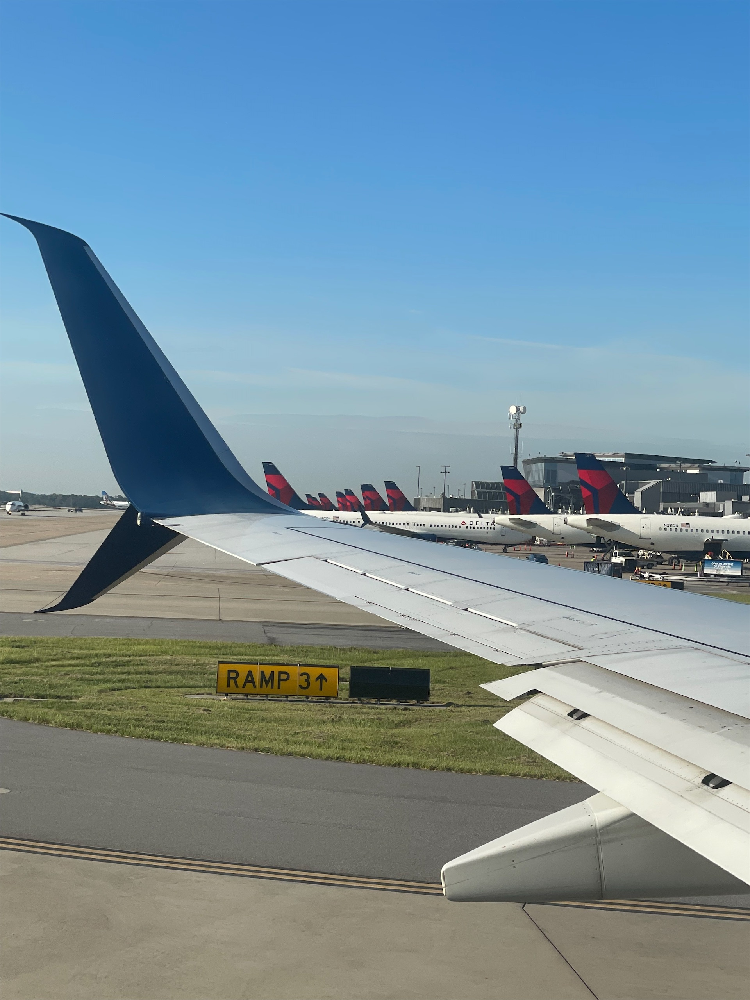
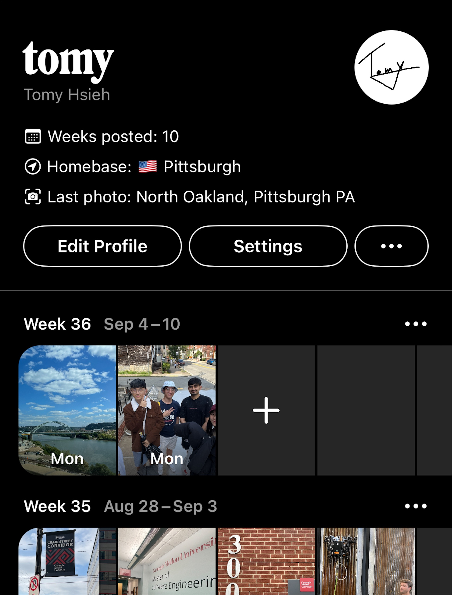

## 👋🏻 Hello Pittsburgh!!

上個月底，我先從台北飛到舊金山，玩了 5 天之後在 7/31 的晚上搭紅眼班機前往匹茲堡。雖然舊金山也是有直飛匹茲堡的航班，但是是由聯合航空執飛的，價錢略貴、沒有含手提或托運行李、而且抵達匹茲堡的時間是清晨，要進市區可能會有點麻煩，所以我們最後決定改搭達美航空的班機，在亞特蘭大轉機。

<figure>
    
    <figcaption class="text-center">亞特蘭大國際機場是<a href="https://en.wikipedia.org/wiki/List_of_busiest_airports_by_passenger_traffic" target="_blank" rel="noopener noreferrer">全世界客運量最大的機場</a>，總共有 7 棟航廈 也是達美航空的樞紐機場，一排看過去真的是壯觀</figcaption>
</figure>

## 🏚️ 安頓新家：首部曲

初來乍到，當然就是先安頓新家。

但其實我在出發前都是處在一個很忙的狀態，連行李都沒好好收，沒時間看舊金山要去哪裡玩，也沒時間注意入住新家的細節。還好在舊金山的時候跟 Liam 聊到很多小細節，才陸續確定我在匹茲堡的第一天能維持基本的生活水準，像是確定公寓會有熱水、有電，在飛來的前一天網購 IKEA 的床，還好剛好在我到的當天下午送到 (不然就要睡地板ㄌ 🥺

**結論：找好旅伴，不只可以跟你分 Airbnb，還可以幫你排雷。** 👍🏻

但意外還是少不了就是了：

- 家裡有電，但是房間和客廳沒有內建電燈：）
- 床架需要各種工具才能組，所以雖然有床墊，但是是直接攤在地上，用大浴巾當臨時床單

最慘的是，我還要在這樣的環境下繼續趕先修課的作業，坐在地上真的是背都快斷ㄌ 😒

還以為去年的法國搬家經驗應該已經幫我排完雷了，果然我還是太菜了 唉

## 🪪 CMU 報到

開心去領學生證~~~~

不然搭公車一趟要 $2.5 美金，會破產 QQ






## 🏠 安頓新家：二部曲

在我室友終於也到匹茲堡之後，終於可以去 IKEA 買工具組組床了，結果組完床架，把床墊放下去才發現：

沒．有．床．板。。。

於是我打電話問 IKEA 他們是不是忘了送，結果他們說床架和床板是要各別買的......

說個笑話：哪國人會買不能放床墊的床架？瑞典籍美國人：））））

當然後面還有一連串的災難，像是：

- 廚房水槽塞住一言不合就塞住
- 薛丁格馬桶沖不下去
- 洗碗機泡泡浴
- <abbr title="美國銀行">BoA</abbr> 的 10 個客服電話一個都打不進去
- 廚房水槽再度塞住，然後我們才發現這水槽下面天殺的廚餘粉碎機居然是裝飾用的？？？？？反正這棟超過 40 年公寓的管線就是擺爛到連咖啡粉都排不下去
- 駕照譯本申請一個月了還沒寄來
- AMEX 信用卡第一個月的帳單都快來了，卡片本人還沒出現
- .........

> When life gives you lemons, make lemonade

**結論：出國討生活就是充滿挑戰，不如就早點習慣把鳥事當成茶餘飯後的笑話吧** ʕ•̫͡•ོʔ

<small>有時候也是看看其他人遇到更鳥的問題，<del>比方說海關把入境資料的名字打錯</del>，才發現自己遇到的鳥事好像不怎麼樣 (? 果然痛苦是比較出來的哈哈哈哈</small>

## 🎉 先修課結束啦

之前 [5 月的報報]()有提到，我從那個月開始修這門 15-513 電腦系統概論，經歷了 3 個月的轟炸之後，這門課終於在一片混亂之中考完實體期末考，劃下了句點。

沒意外的話應該下禮拜會寫一下心得文。~~如果這禮拜作業沒有爆炸的話~~

 一天沒有課業壓力的暑假 我們一坨台灣人去了 Andy Warhol 美術館和卡內基科學中心")

## 🎯 下個月的目標

好啦，經歷暑假的大型車禍，還有開學的連續作業轟炸，接下來應該不會再有其他意外了，那 9 月也差不多要恢復每月目標ㄌ

1. 認識 5 個 (母語不是非英語) 的同學：我發現我目前有點太常跟講中文的人混在一起，甚至比去年在法國還沒有「留學感」，少了一點異國的趣味。也許應該要趁開學的這一陣子，再多認識一些人，對未來也比較有幫助。
2. 寫 2 篇部落格文章：這個部落格扣掉每個月的報報不算的話，看起來還真的是快要荒廢了 QQQQ 其實也不是缺題材，就是我擺爛而已。所以，這個月開始要拉回來了！！！！<small>吧</small>
3. 睡前至少看個 20 分鐘的書：我來匹茲堡的行李裡面其實塞了四、五本中文書，再加上在舊金山買的另一本，這些量應該夠我看到今年底不是問題。但最重要的還是要開．始．看！

其實列下來才發現，似乎我日常生活的缺陷有蠻大的部分可以歸咎於糟糕的時間管理，看樣子比起達成這些目標，如何有效運用時間似乎才是真正的挑戰 🤔

## 🏛 下集預告：開學囉

CMU 其實在 8 月底就開學了，但這篇文已經有點冗長ㄌ，那就下個月見囉！

## 🪺 彩蛋！

感謝每個讀到這裡的人 ❤️

有鑑於這個部落格的收視率越來越低，決定在這裡偷塞一個彩蛋：我最近在玩的一個新的照片社群 App，叫做 [Retro](https://www.retro.app)

<figure>
    
</figure>

這是一個由 Instagram 的兩位元老級人物：Nathan Sharp 和 Ryan Olson 今年離職共同創立開發的 App，主打讓分享照片回歸純粹的美好。你可以在 [TechCrunch](https://techcrunch.com/2023/07/07/retro-is-a-deeply-personal-photo-journaling-app-for-close-friends/) 和 [WIRED](https://www.wired.com/story/retro-app-launch/) 上看到他們的故事和理念。

現有的功能還很陽春：就是一個週記式的相片簿，我會在上面 po 一些最近在匹茲堡生活的照片，大部分都沒有在其他地方發過。如果你有興趣想偷窺我的生活 (?)：

1. [下載 Retro](https://www.retro.app/download) (抱歉啦安卓，目前 iOS 限定)
2. 註冊，只要電話號碼就可以了
3. 在搜尋欄加我好友：tomy
4. **發布你的照片**，來解鎖我的照片，也就是這個 App 最核心的概念：參與這場派對的每個人都要發布照片，大家才會玩的開心，這場派對才會繼續嗨下去：）

現在這個產品還在非常初期的萌芽階段，所以你高機率可以在註冊的時候選到任何你想要帳號 XDDDD

反正不好玩的話，裡面已經有刪除帳號的功能了，也可以隨時退出。

我就來看看我拉下線的功力有多強，期待可以在上面看到大家的照片，嘻嘻

下個月見！
