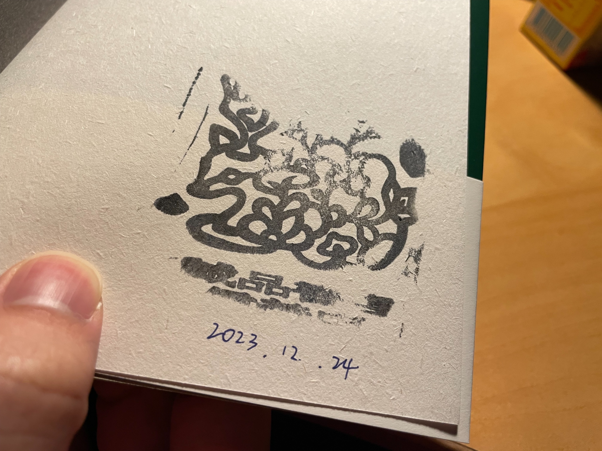

2023 最後一個月有點頹廢。

期末結束一結束真的是啥也不想幹，連出門都有點懶 \_(:3」∠)\_

## ✈️ 返台飛行日誌

學校這個月 8 號就是最後一天上課了，大部分課程會在接下來的一個禮拜舉行期末考。MSE 的話，因為大部分課程內容偏實務，所以都是用期末專題取代期末考，實際上所有的東西都可以線上完成。

至於要不要回來也是掙扎挺久的，有蠻多點要考量，學期初考慮的點大概有幾個：

- 👎🏻 才剛出去沒多久
- 👎🏻 機票有點貴
- 👎🏻 待在美國應該會有蠻多時間可以「認真」做想做的事，或是跟其他人拼車出去玩
- 👍🏻 回來台灣生活費比較便宜
- 👍🏻 可以趁回來轉機的路上再多玩一趟
- 👍🏻 要選舉了，好像該回來投一下

後來身邊的人都陸續要回來了，自己一個人在美國應該是想幹嘛都會有點麻煩，再加上以後如果開始工作了，可能也不會隨時有假可以請，能跟家人相處的時間也不多了，既然現在有這個機會，不如就還是回亞洲陪家人順便避咚吧 ♪~ ᕕ(ᐛ)ᕗ

<table>
  <thead>
    <tr>
      <th>出發地</th>
      <th>目的地</th>
      <th>飛行時間</th>
      <th>航班</th>
      <th>原始價格</th>
      <th>換算台幣</th>
    </tr>
  </thead>
  <tbody>
    <tr>
      <td>🇺🇸 PIT</td>
      <td>🇨🇦 YYZ</td>
      <td>1h7m</td>
      <td>
        
        AC8922
      </td>
      <td rowspan="2" class="align-middle">US$530</td>
      <td rowspan="2" class="align-middle">$16,340</td>
    </tr>
    <tr>
      <td>🇨🇦 YYZ</td>
      <td>🇯🇵 HND</td>
      <td>14h10m</td>
      <td>
        
        AC1
      </td>
    </tr>
    <tr>
      <td colspan="6" class="text-center">🇯🇵 中停東京 1 日</td>
    </tr>
    <tr>
      <td>🇯🇵 HND</td>
      <td>🇲🇾 KUL</td>
      <td>7h50m</td>
      <td>
        
        D7523
      </td>
      <td rowspan="2" class="align-middle">¥27916</td>
      <td rowspan="2" class="align-middle">$6,010</td>
    </tr>
    <tr>
      <td>🇲🇾 KUL</td>
      <td>🇸🇬 SIN</td>
      <td>1h10m</td>
      <td>
        
        AK705
      </td>
    </tr>
    <tr>
      <td colspan="6" class="text-center">🇸🇬 中停新加坡 5 日</td>
    </tr>
    <tr>
      <td>🇸🇬 SIN</td>
      <td>🇲🇾 KUL</td>
      <td>1h15m</td>
      <td>
        
        MH604
      </td>
      <td>SGD 122</td>
      <td>$2,863</td>
    </tr>
    <tr>
      <td colspan="6" class="text-center">🇲🇾 中停吉隆坡 1 日</td>
    </tr>
    <tr>
      <td>🇲🇾 KUL</td>
      <td>🇸🇬 SIN</td>
      <td>1h0m</td>
      <td>
        
        TR453
      </td>
      <td rowspan="2" class="align-middle">MYR 803</td>
      <td rowspan="2" class="align-middle">$5,378</td>
    </tr>
    <tr>
      <td>🇸🇬 SIN</td>
      <td>🇹🇼 TPE</td>
      <td>4h45m</td>
      <td>
        
        TR992
      </td>
    </tr>
  </tbody>
  <tfoot>
    <td></td>
    <td></td>
    <td></td>
    <td></td>
    <td></td>
    <td><b>$30,593</b></td>
  </tfoot>
</table>

看機票變成我過去幾個月最大的休閒娛樂。

以這趟回來來說，買機票考慮的有幾個點：

- 便宜至上
- 想繞道去新加坡玩個幾天
- 我不介意多飛幾趟/飛很久，反正我很好睡 (X

所以這個路線組合大概是這樣拼起來的：

- 先撿一段便宜的機票飛到亞洲，加拿大航空的 PIT → YYZ 載客率似乎不高，所以跟 YYZ → HND 組起來就可以壓低價格
- 往新加坡這一段相對容易，亞洲航空價格一直都很便宜
- 再來是離開新加坡，台北新加坡這段的班次在聖誕節假期前幾乎是班班客滿，雖然亞航也是不差的選擇，但我很想搭看看酷航，如果單買 TR992 這段機票不含行李記得是九千上下
- 於是我把目光轉向新加坡班次最密集的路線——吉隆坡，然後發現多買 TR453 這一段之後價格會直接腰斬
- 最後只要再補一段 KUL → SIN 就行了，這條路線的競爭太激烈，所以就算不是廉價航空的馬航也三千有找

於是就有了上面這段飛行日誌，雖然總飛行時間有點長，但不用自助轉機，中停時間都超過一天，夠我進市區逛一天，去青旅睡一覺再繼續旅程。價格的部分也跟回台北最快的機票 (聯合航空經舊金山) 差不多，沒多花到太多錢。除了離開美國的時間不小心壓太早之外，其餘部分我很滿意 👍🏻

我覺得看機票最好玩的地方就在於，因為機票的價格是由「供需」所決定的，再加上每趟旅行的目的、需求、可以取捨的細節不同，所以目前還不存在 100% 通用每一個場景的機票搜尋引擎，也不可能有任何搜尋引擎推薦出這種看起來很鳥但實際上不差的行程。

如果有興趣的話可以來逛逛我的[飛行日誌](https://my.flightradar24.com/tomy0000000)

## 🕯️ 誠品信義熄燈

回台灣就幾乎沒幹啥了，但少數確定的行程就是平安夜去逛最後一次誠品信義。






對誠品信義最早的印象就是改裝前的音樂館，只要拿著 CD 到走道末端的試聽機刷條碼，就可以在那邊聽一個下午，可能是全台灣少數有這麼先進設備的唱片行。

上高中之後，社團經常會寫小卡片，通常大家會去光南或是墊腳石買，但我私心最愛的還是來誠品文具館的卡片牆逛一個下午，甚至有的時候還會趁人不多的時候直接在下面的星巴克把卡片寫完再回家。

從歐洲回來開始會看書之後，雖然偶爾還是會在博客來上買書，但我更喜歡走進實體書店翻翻店員推薦的書，結帳之後在書本打開的封面蓋上書店的印章，再帶回家細細品嚐。

剛好這一趟回來的路上，逛了新加坡的紀伊國屋，還有吉隆坡的誠品。開始可以體會到一個國家，乃至於族群、文化可以擁有自己的書店，向世界推廣自己的語言與思想，是多麼可貴的事情。






誠品已經是台灣文化不可或缺的一塊璞玉，希望這個時代能繼續把它傳承下去。

## ⌨️ LeetCode

好啦也不是完全沒做任何事。在太多事情要做，不知道哪件事該先做的情況下，我腦子突然跑出了寫 LeetCode 這個選項。

畢竟開了馬上就能寫，遲早都該寫，不如就來寫，就這麼創下了一個月 45 題的紀錄。

甚至寫到後來有點上癮，會看著時間想說：「嗯 才三點，那應該可以再寫個兩題 easy 再去睡」

但還是要說：平安夜聖誕節連續兩天出了 Hard 當每日一題的人不是家裡死人就是孤兒沒人愛 😤

## 🎯 本月目標回顧

Pass!

有鑑於這個月目標來的有點慢，加上 1 月中又要回美國了，決定把這個月的目標時間拉到 1 月一起。

## 👻 這個月的酷酷貼文

Q：GDPR 這麼嚴格，聖誕老人要怎麼統整歐洲小孩們的禮物清單呢？

A：請洽 Santa Claus is coming to town 的歌詞

這篇 [Worldbuilding Stack Exchange](https://worldbuilding.stackexchange.com/questions/114033/how-can-santa-keep-his-lists-when-the-gdpr-is-around) 裡面有更詳細的解析

---

好啦，2023 的結論就等回顧文吧

祝大家聖誕快樂，新年也快樂 (欸不是都已經跨完年了 🙃
