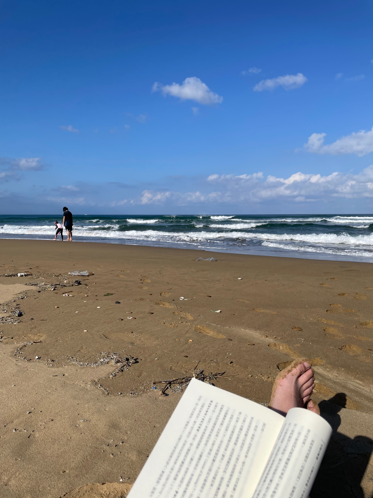


<figcaption>3 月第一天看到這條 Tweet 快被笑死</figcaption>

1 月感覺過的挺充實的，感覺「新起點效應」有起到很大的作用，所以好像很多事情就算遇到一些小挫折，只要深呼吸硬幹過去，問題就會迎刃而解。但是這個紅利好像過完年之後就開始有點難延續了。

## 🍳 學料理

雖然到目前為止只寫了一篇文，但我還是有持續在下廚啦 XDDDDD。

目前的困難應該是我覺得跟著我媽下廚的問題很多，其實問題跟上個月寫的狀況差不多，只是那時候想的解決方案現在還沒有嘗試過。至於沒有嘗試的原因主要是，以前的話我只要找一天跟我媽去全聯採買，然後回家就照著他的指示做就好。但現在變成我要事先找時間研究一道料理，然後決定要買什麼食材，怎麼煮，這個工作量變的大很多，所以相對摩擦力又更大了一些。

煮完忘記拍照也是一個點。現在有很多篇文就是忘了拍照，就想說那等之後有做第二次拍完照再來發文，然後就沒有然後了。所以這個月修正一下目標應該是：一個禮拜下廚一次，一次兩道菜，一道新的，一道之前做過沒寫文章的。

前陣子突然在 GitHub 發現之前 Star 的[程序员在家做饭方法指南](https://github.com/Anduin2017/HowToCook)，感覺會幫上不少大忙，之後實際翻完再來回報一下內容有沒有料。

## 📖 看書

今年的第二本書其實比第一本還要薄，但是實際上看的時間比第一本長了不少，原因好像也跟我的習慣脫不了關係。我目前的閱讀時間大部分都是塞在我出去踏青的時候，比方說搭長途火車，或是去林安泰古厝，或是福隆的海邊。

換句話說，當我沒有那麼常出遠門的時候，看書的時間就會大幅的減少。閱讀現在對我來說感覺沒有那麼吃力了，但是如果要長久的維持這個習慣，我可能要把這個習慣漸漸的跟日常的生活綁定在一起。畢竟以後的生活也不可能像這樣可以想出去玩就出去玩咩。

## ❓ Misc

雖然現在的生活比較沒有被 Deadline 追著跑的感覺，但可能不小心排太多事情要做了，所以還是有一種一直追著很多雜事的感覺，久了有種疲憊感，自從寫完 1 月報報之後就開始放推了。神奇的是當我回去翻我 2 月完成的 Things 項目，又好像跟 1 月差不多，就不知道上個月在瞎忙什麼。

另外值得開心的是，終於訂好 4 月要去 🇹🇭 曼谷 longstay 一個月的機票了。目前還在研究的另外一個目標是，看看能不能順便去一趟 🇻🇳 胡志明市。兩個城市之間的機票不貴，多出來的花費可能會是簽證費和稍微小貴一點點的住宿。受限於目前還不確定有沒有其他人要跟，所以暫時卡著沒有進一步的進度。

## 🎯 下個月的目標

之前有看到一篇文章在討論寫程式一個很重要的技巧，就是除了 Roadmap 之外，還要搭配 Timeline，來確保整個專案的進度可以隨著時間往前推進，不會被一些其實不是很重要的小 bug 拖住。看到這篇文才發現我的確有種，花了很多時間，但是還是沒有重大進展的感覺。剛好 4 月要出國了，就來重新訂一下 3 月的目標：

1. 上架這個 blog：理論上電子報 survey 完應該就沒事了，希望我不會在這件事情上龜毛太久
2. 幫之前寫的記帳程式搭好一個前端：網頁或 App 都好，反正至少要是可以用的產品，這樣我去泰國才能用
3. 解決 AppShelf 天天記憶體爆量的 bug：我已經收了快半年的 email 了，真的是發瘋
