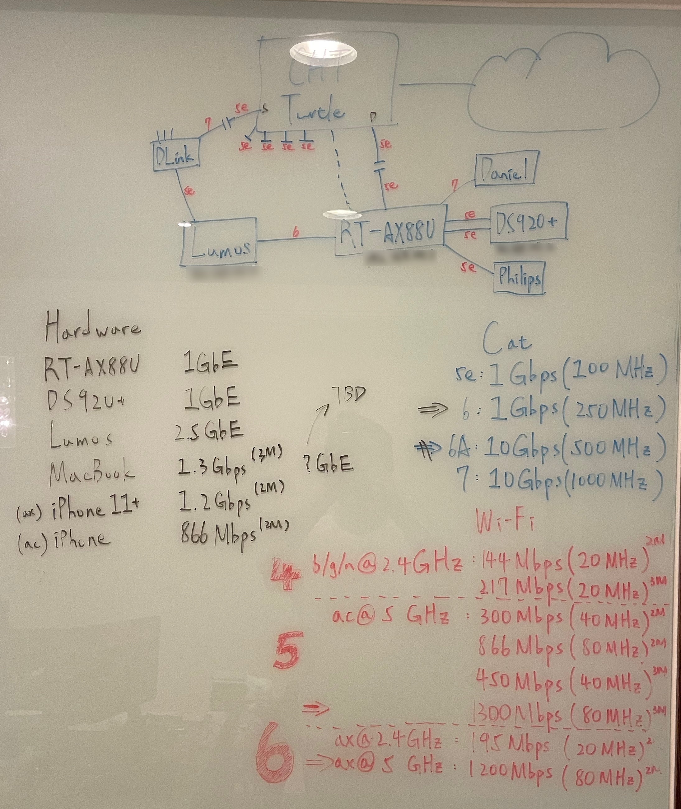
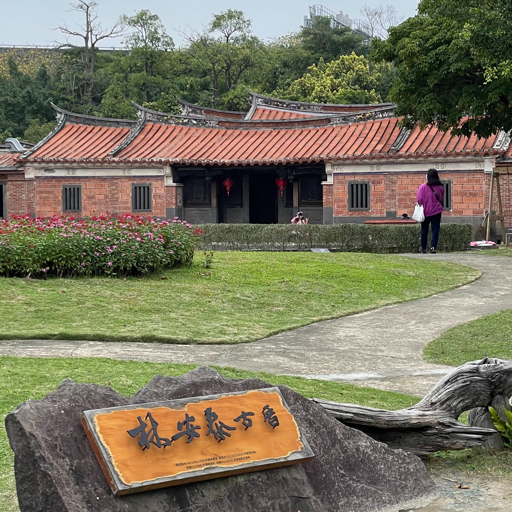

到底為什麼可以拖了半個月才寫出來 xDDDDDD

## 🏗 網路設備搭建

因為之後就要去美國念書了，家裡的一些基礎設施得要在我出去前把大問題都排除，不然之後如果出車禍會變的非常麻煩。

這個月主要的進度是把現有的有線網路重新拉好。原本是想要一路直衝 Cat.7 ，這樣至少 5~10 年不用再管硬體的問題，但後來礙於預算考量，再加上我不在的話大概硬體不會再繼續往上推了，就算了吧。

(反正我媽看起來好像也拉的挺起勁的，我相信時間到了再叫他自己買線重拉應該也沒問題的 吧 嗎

記錄一下這次用的材料和給西給以後的我 reference：

- 網路線：AMP Cat.6 50m 24AWG U/UTP (大約是$1500)
- 水晶頭：LINKOMM Cat.6 兩件式 (下次要買就買穿透式的：）
- 壓線鉗：LINKOMM ($1200，其實好像可以不用到這麼好的 Orz)
- 資訊插座：Panasonic NRF3170W (一顆好像是 $180 上下)

然後剛好中華電信年初寬頻網路費又降價了一次，就去升級到 500M/250M 了，一個月才 $1199，算划啦

## 🍳 學料理

這個月的料理學了[炒飯]()、煎牛排、炒青菜、玉米濃湯。

有點尷尬的是，只有炒飯有記得拍照，然後寫了食譜。其他的料理本來想說之後有再做，拍了照片再寫，但是後面其他要學的東西已經排好日程表了，這樣中間還要插入這些，好像有點困難。

至少慶幸的是，我還是有照計畫在進行，學了一些東西。

另外一點可能要改進的是，我在學這些料理的時候，都還是我媽在旁邊指揮，甚至在某些情況下他會搶回去自己煮。我自己主導的成分有點偏低，這樣似乎沒有辦法達到我一開始預期的目標：以後在美國自己重現這些料理。

所以也許之後會改成，我先稍微去 Google 一下，預習一下，甚至直接把文章寫完，實際下廚完再來看有哪裡跟原本想的不一樣。

這樣或許會學的比較深入一點

## ⌨️ 寫程式

基礎建設搭起來之後，接下來大概就要開始搭服務起來了。為了以後可以遷移/規模化還有在既有的架構上去擴充，趁著過年的時間學了 Ansible, Terraform

另外還有學了 Next.js，突然起了念頭想把這個 blog 和作品集全部整合到一個個人網站裡，但...這個餅似乎畫的有點太大了。

(謎之音：不對欸，你的 blog 都還沒上架就要腰斬了嗎

## ❓ Misc

其他這個月做的小雜事和小嘗試

### 投實習/短期工作

其實我也沒有特別想做這件事，而且坦白說我不覺得哪間公司會想聘一個人進來，可能屁股都還沒坐熱 8 月底就要高歌離席，所以雖然有稍微修了履歷然後投了幾間大公司，但我是不期待會真的有什麼結果。

但也是為了投這一波，所以我才有動力在很短的時間內，把作品集的網站倉促上架。接下來幾個月的工作，就是要再花一點時間把他包裝的更精緻一點，年底拿去投明年暑期的實習。

### 泡湯

自從 3 年前去日本泡湯回來，就開始喜歡上泡湯了。如果扣掉那一趟不算的話，上一次在公共浴場泡湯應該是很小的時候了。

後來也因為疫情，加上生活變得忙很多，還有家人都沒什麼興趣，所以回來之後也一直沒有再去。難得現在算是閒了下來，就去把美國運通有提供優惠的湯屋看了一輪，預約在過完年開工日下午，去三二行館泡湯。

三二行館真的是一個很神奇的地方。

在去之前我沒有認真的研究過，到了才發現，我好像不小心找了一個很不得了的湯屋。與其說是去泡湯，其實感覺比較像是被邀去某個名流貴族的私人招待所，在裡面度過一個悠閒的下午。裡面除了泡湯池，也有靜心的和室、睡眠艙，和一個休息的客廳，可以在裡面吃一些小點心，然後聽音樂看雜誌或報紙。我也在泡湯之餘，在和室看完《原子習慣》的最後一章。

### 林安泰古厝

從歐洲回來的之後，我開始思考，去了那麼多城市，我都是看旅遊網站的介紹去各個觀光客的景點。那如果反過來，我住了 20 幾年的台北，在旅遊網站和旅遊書裡，會推薦大家去哪裡？

不查不知道，[台北可是有排上 Lonely Planet 2022 年年度最佳旅遊城市的第 2 名](https://web.archive.org/web/20220729024146/https://www.lonelyplanet.com/best-in-travel/cities)，於是我買了一本他們的台北旅遊指南，翻一翻外國人是怎麼欣賞這座城市的。

其中不泛一些常見的景點，像是故宮、台北 101、中正紀念堂...等等，大部分都還可以理解，直到我發現了一個我聽都沒聽過的————林安泰古厝

林安泰古厝原本座落在敦化南路旁，因為拓寬的需求，所以被遷到現在的濱江公園，然後後來在舉辦花博的時候獲得一大筆經費建造了現在的庭院造景。所以除了建材是當時原本的古厝拆下來重建，現在看到的大部分的東西全部都是後來才有的。(說實在我有點不能理解，這樣保存下來的意義還剩多少)

很多跨國公司，特別是時尚產業，似乎很喜歡在一些景點舉行發表會或募款活動之類的，我想如果台灣有這樣的風氣的話，說不定這裡會是一個很適合的地點也說不定。

總而言之，對西方人來說，這就是一個中華文化味十足的地方，也難怪會被收錄在旅遊書籍裡。

旅行在很多人的第一個直覺裡經常是「體驗當地的文化和生活」，但林安泰古厝就是一個很好的反例，它是一個文化感和體驗感都十分豐富的景點，如果我有外國的朋友我也會推薦給他。但這很顯然不能跟台北市民的日常文化劃上等號。
