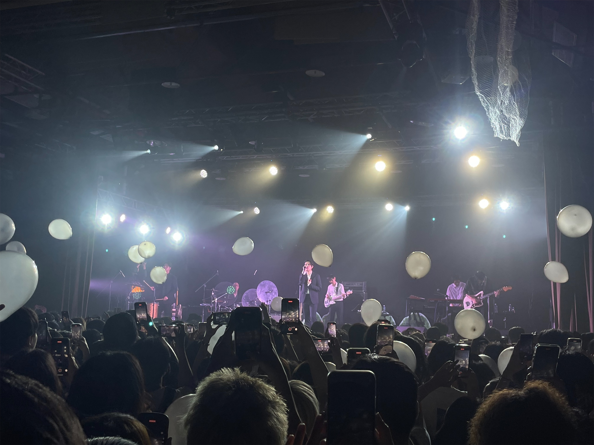
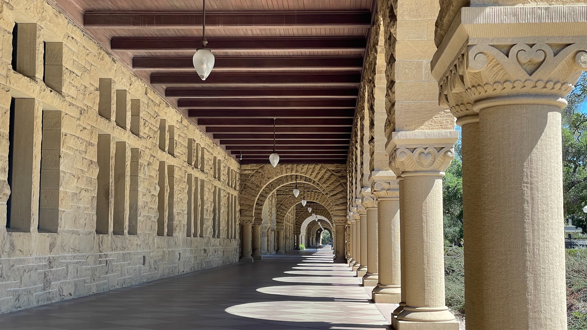

雖然原本就預期這個月的報報應該是會嚴重 delay，但沒想到居然底累了這麼久哈哈哈

但還是不能隨便棄坑 RRRRRRR

這個月就是各種寫作業，跑飯局和各種約，然後就把行李收一收飛美國囉！

## 本月藝文活動

### 🎵 [The Black Skirts: Teen Troubles in Taipei 2023](https://willmusic.kktix.cc/events/ef96526d)

The Black Skirts 是韓國的一個獨立樂團，雖然說是樂團，但其實主要團員只有조휴일一個人，而且曲風也跟 K-POP 非常不同。2019 年，TEAM BABY 這張專輯陪我度過了許多在中興一個人的孤單時光，現場再聽到這張專輯的旋律，一方面覺得，彷彿當時的惆悵都還歷歷在目，但一方面也很開心我即將邁向人生的下一個階段。

### 🎬 名偵探柯南：黑鐵的魚影

繼[上個月《黑鐵的神秘列車》]()，這個月終於上了正式的劇場版！但不知道是不是之前被暴雷的關係，所以開始對劇情產生一些不切實際的幻想，導致實際看了之後又覺得好像挺普的 (?) 總之是中規中矩的一集劇場版，有正常的劇情起伏變化，沒有推進什麼主線劇情，但是餵了不少觀眾糖 (沒綽啦就是柯哀的部分)。聽說今年的票房又創新高，我猜估計就是靠跟我一樣的這票柯哀黨堆出來的 XDDDDDD

只能說青山老賊真的很賊，但戀愛推理番我只服柯南 (▰˘◡˘▰)

## 🥢 各種離別飯局

在 7 月之前，通常我的作息都是睡到 10, 11 點然後隨便吃個早午餐，只有晚餐是正常在吃的。但多虧了這個月的各種約、各種飯局，讓我不得不開始正常的吃三餐 XDDDD 剛才看行事曆數了一下，整個 7 月前前後後居然有 18 約，最後一局還是飛機起飛前一個晚上，我去的時候行李甚至還沒收完 😂😂

我知道有些人可能有想約我，但是我毛太多加上最後沒多少時間所以約不起來，我真的很抱歉 QQQQQQ 之後有回去我一定會好好喬時間ㄉ嗚嗚嗚嗚嗚嗚

話說除了一些常見的面孔，這個月的飯局多了一些......平常比較少見到的人 (?) 一方面有點意外居然還會再聯繫上，但也很開心可以在這麼剛好時間點，看到大家都有了新的方向。

Anyway 希望下次回台灣的時候，大家都大富大貴ㄌ

## 🌉 舊金山

CMU 位在<abbr title="賓夕法尼亞州">Pennsylvania</abbr>的<abbr title="Pittsburgh">匹茲堡</abbr>，台灣沒有直飛的班機，所以我這趟就跟著 Liam 一起先飛到舊金山，玩個 5 天再搭另一班飛機飛到匹茲堡。

下面就隨便放一些在舊金山的照片水掉這篇文吧 ♪~ ᕕ(ᐛ)ᕗ








 






感覺這五天的行程都蠻緊湊的，舊金山市區可能是需要待久一點才能好好逛出他好玩的地方在哪吧。至於矽谷的話...還真的就不用去ㄌ，真的是有夠宅又有夠無聊的地方 (X 去 Apple Park 喝個咖啡就好，其他的可以 pass。

這裡要特別感謝 Liam 的堂哥 James 帶我們去吃了好多好吃的，還把車借我們開了幾天，真的是最罩地陪 👍🏻

## 下集預告：安頓匹茲堡

剛好飛到匹茲堡已經跨到 8 月了，所以安頓新家的心得和趣事就留到 8 月的報報吧！
