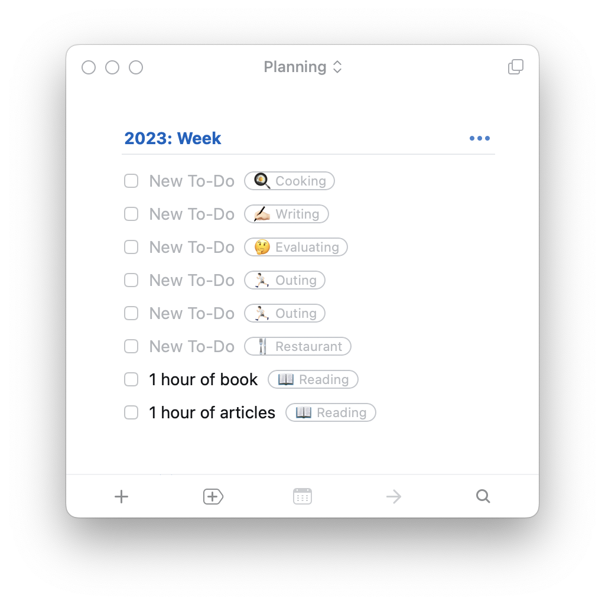

這個月基本上沒太大進展，我覺得可以歸咎於兩大原因

## 🏃🏻 Agile Lifestyle

我在年初的時候訂下了今年的目標，然後把這些目標切成很多小份的 tasks 然後以 2 個星期為單位開始跑 Scrum。

每個週期開始前，我會複製上面的模板，然後決定好這個 Scrum 確切要執行的細節。成效呢，統計面上大約有 60%，實際上我自身感覺要再更低一點 (畢竟每個 task 的份量其實不太一樣)。甚至再退一步說，我光是填入這個模板，幾乎就要花一個下午的時間。

另外當我開始追著這些東西跑的時候，雖然本來就有預期會少一些時間寫 code，但是我沒預料到排擠的效應會這麼重，最終導致我的很多 side projects 全部都開始長灰塵，甚至有些在跑的系統根本就已經下線了。

最後就是，剛開始放假的前一兩個月我當然可以靠熱情來衝這些目標，但久了當然就很容易疲乏，我甚至到後期一點都沒有放假到的感覺。

結論就是：這個小實驗可以說是，徹徹底底的失敗了 QQQQQQQQ

## ❤‍🩹 小手術

3 月的中下旬我去動了一個小手術。原本預期手術的副作用不會太嚴重，但實際上我嚴重低估，基本上除非跟朋友有約飯局，不然我基本上就是待在家，完全不想出門，甚至在家有超過 8 成的時間也是躺著，根本沒有心思動腦，連看書都很容易分心。

## ⚓ 大港開唱

幸好過了 2 個禮拜，症狀總算稍微舒緩一點。雖然還是會有點不舒服，但至少可以讓我去大港跑跑跳跳兩天：）

原本這裡有寫我看了哪些團，但是因為重寫，所以這部分就算了，講重點就好：

- 台灣通勤第一品牌：排場蠻屌的，但為了擠進去排 1 個半小時好像不太划，看重播好像差不多
- 閃靈：不知道聽了三小，但看一看名場面，撒撒冥紙挺好玩的 XDDDDD
- 靈魂沙發：彌補我浪人祭的遺憾，真的是創作和表演都強的團，推推
- 鄭宜農：以前聽還好，現場聽意外發現以前沒聽到的好歌，算是意外收穫
- 9m88 feat. 馬念先：最期待的團，不只唱了巴黎草莓和你朝我的方向走來，還找呱吉和何 A 打跆拳道，真的沒有辜負我的期待
- 李心潔 × 美秀集團：啊怎麼美秀只唱了 3 首
- 滅火器：好像沒有想像中精彩，就當是我期望放太高吧

，原來不是只有我這麼覺得，笑死 XDDDDDDDD")

<iframe src="https://www.facebook.com/plugins/post.php?href=https%3A%2F%2Fwww.facebook.com%2Fdato.poplife%2Fposts%2Fpfbid0318LX2Qd7XQxevwmatRhzDetuobsxQK1aSnRYHuf5tKSG4EaacwPhjXMK8XHxZCanl&show_text=true&width=500" width="500" height="562" style="border:none;overflow:hidden" scrolling="no" frameborder="0" allowfullscreen="true" allow="autoplay; clipboard-write; encrypted-media; picture-in-picture; web-share"></iframe>

## 🎯 本月目標回顧

1. ❌ Blog 上架：原本預計電子報設定好就可以發布了，結果最後被 Google News 和 Mailchimp 卡住，就是怎麼樣都沒辦法正常運作，而且不知道從何修起。
2. ❌ 記帳程式的前端：0。因為財政部的伺服器自從 3 月底開完獎就一直當機，所以我幾乎都把時間拿去新增發票 SDK 的自動重試功能了。
3. ✅ AppShelf 記憶體爆量：修好了，但是還是沒有前端。

## 🎯 下個月的目標

如上個月的報報提到的，我 4 月來 🇹🇭 曼谷 longstay，後來發現曼谷飛 🇻🇳 胡志明市的機票蠻便宜的，所以計畫就改成曼谷和胡志明市各待 20 天左右，然後在母親節的週末回台灣。理論上我現在在曼谷就是一個人，所以沒有人會來煩我，我想出去玩就出去玩，想幹正事就幹正事，而且手術也恢復的差不多了，應該是會有一些不錯的進展，放假感也會比在台灣高一點。

我會在四月結束前離開曼谷，但是我希望我可以在這段期間達成下面這些目標：

1. Blog 上架：電子報不管了，之後再修吧。
2. AppShelf 的前端：我的 Side Projects 很多現在都是沒有前端的狀態，這有很大一部分是因為，我對於現在網頁前端的各種工具有很多的不滿，難以闡述。總之，我前陣子被 YouTube 演算法推薦了 [PicoCSS](https://youtu.be/-n84EMKIXQM) 的介紹影片，讓我眼睛為之一亮，剛好這個 projects 比較小，很適合拿來試試看。
3. 降低我的寫作摩擦力：之前讀原子習慣有說，培養習慣需要降低執行的摩擦力，這確實是我現在的困境。這個 blog 現在還充滿著一堆毛病，導致我經常寫一寫就要去修某個東西，我應該要仔細想辦法抽離這個狀態，至於具體要怎麼達成可能要想一下。

飛往胡志明市之後提前開始寫 4 月的報報，總覺得到下個月的月初再寫好像還是怪怪的。

## 🏳️ 我投降

反正我現在就是覺得，一次培養很多習慣本來就很困難，像上個月報報寫完文章之後中間也沒其他文章。我覺得現在最重要的是先把寫作的習慣維持下來，也是為什麼我前面列出了要降低寫作摩擦力。至於其他的：

- 料理：就算我還在台灣，跟家人一起待在廚房真的就是學不到任何東西，何況現在我人又來泰國了。反正人是餓不死的，我看如果我去美國有心要學，到時候學習的效果也不見得比在台灣差。
- 看書：本來想帶 2 本書來看，結果出門收行李太趕就真的忘了。我想這多少印證了我還沒有真心想培養這個興趣，但好的方面是我有開始建立一個想看的書單，也許回台灣會有機會再重啟這個目標吧。

## 後記

如果你讀這篇文章覺得，用詞看起來有點不耐煩或是隨便，是因為我打了兩次。浪費了在曼谷的一天，真的是還不如出去逛逛。

第一次寫到大概 80% 還沒 commit，Dropbox 開始給我中猴，結果整個 blog 的本地副本整個壞掉，害我要重新 clone 下來重寫，之前還沒整理好的草稿也全都掰了，真的是淒淒慘慘戚戚，氣氣氣氣氣 💢💢💢

這個月沒幹什麼事打這篇就已經夠心酸了，還要我打兩次，真的是殺了我
