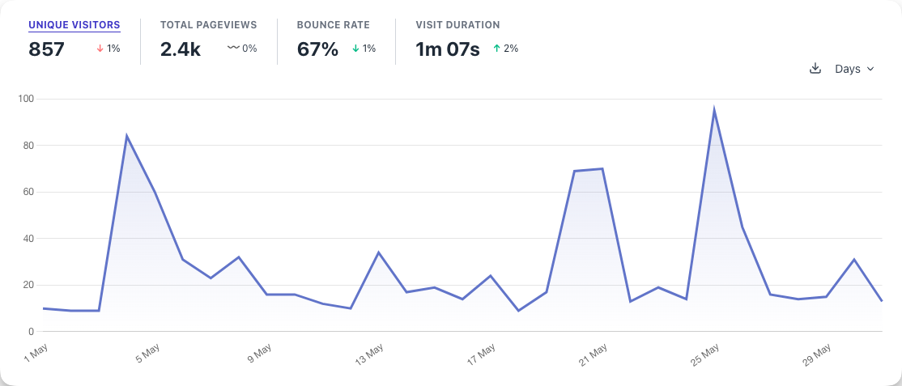
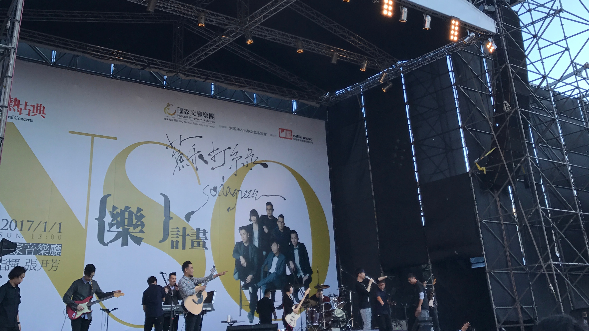

5 月前半個月在[🇻🇳 西貢]()，心得已經出刊了，有興趣的可以去看看，這裡不多贅述。後半個月回台灣之後處理了不少雜事，大部分都是跟之後出國有關的前置手續：

- 留學貸款
- 美國簽證
- 拍全家福
- 國際駕照
- 買機票

這裡大概只所有雜事的一半吧，還有很多還沒研究的東西應該會陸續在 6 月完成，然後 7 月底出發。

## 🎯 本月目標回顧

[點我]()看看上個月的目標

### 🟡 寫文章

原本預計是寫 7 篇，但是礙於某些文章的素材還沒湊齊，加上時間不夠等種種因素，所以只有其中的 4 篇有付諸實現，但實際上還是寫了 5 篇文啦，因為碩士申請心得拆成上下篇了。總之產量還算在預期內啦，上個月本來就是故意設了一個高標，才可以有現在的結果，所以我覺得算是可接受 👌🏻

- [怎樣叫國際化 Pt.2]()
- [🇻🇳 西貢]()
- MSCS 申請心得文 ([上篇]()、[下篇]())
- [The Ethical Traveler 的閱讀心得]()

如果有錯過的話，不妨現在現在點進去看吧 👍🏻

### ❌ Side Project 網站

進度 0，碰都沒碰 🙈

好啦也不至於到碰都沒碰。我有把網站的專案打開來看了一下，結果正要開始處理的時候就覺得，好像有很多 Side Project 的狀態都處在一個半成品的狀態，如果直接上架，我自己也很難用一個產品的角度去推銷這些垃圾。於是就把他擱著想說等之後整理好再上架，然後這件事就被我給忘了 QQ。

### 🟡 LeetCode 刷 20 題

刷了 3 題 XDDDDD

而且本來應該是 0，但還好我後來亂入了我室友他朋友們開的一個 LeetCode 線上刷題會，所以最後有寫了 3 題。久久沒碰這種程式競技的題目，腦子都快生鏽轉不動了，值得慶幸的是還好現在才 5 月就動工，應該還不算太晚，另外一點是每題的解題時間比我想像中的短很多，要刷個破百題應該不是什麼難事，之後再陸續追蹤吧。

## 🎯 下個月的目標

1. 整理我的各種家當：目前我的家當大概是...
   - 書桌上有一座山的雜物
   - 我爸的書桌上有一小塊有一堆我從歐洲回來放到現在的~~垃圾~~雜物
   - 房間裡有很多疊不知道該帶出國，永久封存，還是丟到的衣服
   - 我家的餐桌現在是我的辦公桌 (我知道這看起來很荒謬，但這故事有點長改天再說)
   - 以上 4 項至少先解決個 2 項應該不難 吧
2. LeetCode 30 題：理論上刷題會應該會貢獻個 5，6 題，而且有可能會再開一個，假設一題算 40 分鐘，30 題理論上只會佔據我 20 小時的工時，理想的分佈應該是一週 5 小時挑其中的兩天或三天來達成。
3. 把 AppShelf 收尾，寫一篇文章，上架到 Side Project 網站上

有空的話在部落格寫一個「關於我」的頁面好了，礙於先修課的課業量有點重，這個當作支線任務好了，有空再解。

## 🏛 15-513 電腦系統概論

這個月開始上 CMU 的 [15-513](https://www.cs.cmu.edu/~213/) 先修課了！

目前上起來感覺是課業量非常重的一門課，目前已知會有 8 份紙本<abbr title="Assignment">作業</abbr>還有 8 份<abbr title="Lab">程式作業</abbr>，所以幾乎是每個禮拜兩種作業都會各出一份。而且最令人頭痛的是：程式作業通常從發下來到繳交期限會有 10 天，雖然聽起來很長，但依據目前的經驗，就算第一天就動工，也不見得能在 10 天內想到要怎麼寫。

總之就跟網路上之前的評價差不多：非常紮實

如果修完有什麼特別值得寫下來的收穫再專門寫一篇文章好了 🤔

## ✍🏻 部落格上線 Feedback

這個數字其實有點超出我的預期，本來還有點怕都是自己寫爽的，但好像意外收穫到蠻多觀眾 (?)，後來看後台發現這或許跟我有在 Facebook 發文有關，因為流量有 2/3 是從 Facebook 過來，這點其實挺令我感到意外的。也許如果我想要讓讀者持續成長，得要找時間認真思考一下下一步要怎麼走 🤔

另外值得感動的是，這個部落格居然還激起了 2 個部落格準備開張，真是讓我又驚又喜 😂 但經營部落格本來就不是一件說幹就幹的事，我自己從在 Instagram 上開始寫長文到現在，也是經歷了 2 年多才到現在這個階段。這樣說起來寫一下中間的心得 + 過來人經歷好像也是一個不錯的題材，如果有很多人敲碗的話我再來想想吧哈哈哈

總之非常感謝大家的愛戴，我會繼續找有趣的題材來寫，如果有想到什麼有意思的主題，也歡迎在 Facebook，Instagram 底下留言，或是私下跟我說。

## 💚 蘇打綠回歸演唱會

 蘇打綠日，去兩廳院廣場看他們的回歸演唱會")

我的人生一路走來有許多音樂陪我走過，其中 Coldplay 陪我度過了國中的時光，蘇打綠則是陪我度過了高中的時光，所以這兩個樂團，在我心中一直具有很獨特的意義，而這也是為什麼 2017 年對我來說是很特別的一年。

當年的我是高三生，正準備考大學，邁入人生的另一個階段。

先是 1/1，蘇打綠在兩廳院廣場舉行了休團演唱會，緊接著是 4/12，Coldplay 第一次來台灣舉辦巡迴演唱會，兩次我當然都沒有缺席。但看著心愛的兩個團，一個宣布休團，[一個說這張專輯有可能會是最後一張](https://www.rollingstone.com/music/music-news/coldplay-hint-at-final-album-a-head-full-of-dreams-80245/)，再配上川普當選、英國脫歐、還有學測爆掉，我還真有種世界要跟我一起崩塌的亡國感。

6 年之後的今天，我又來到了邁入人生另一個階段的十字路口。也剛好在這個時間點上，可以看到蘇打綠回歸、[Coldplay 第二次來台灣](https://fb.watch/kTh8NTyout/)，這巧合還真是格外具有紀念意義 💚

## 👻 那些我在 Reddit 上看到的酷酷貼文



> 當你在沙灘上把腳埋進沙子裡，其實等於把地球當成鞋子穿在腳上了呢

下個月見！
