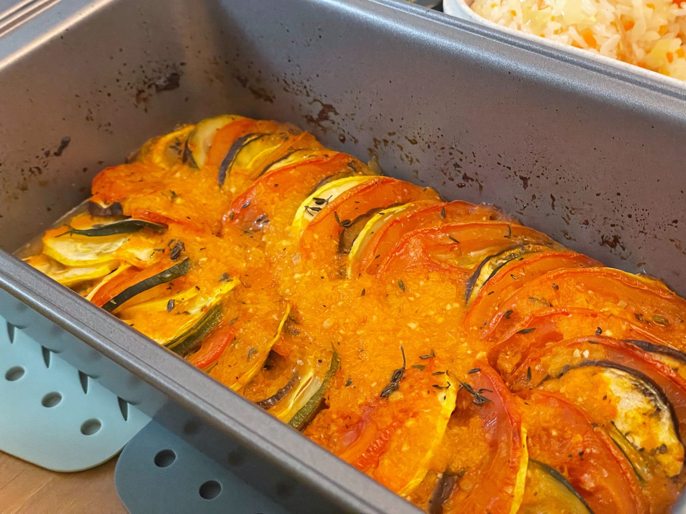
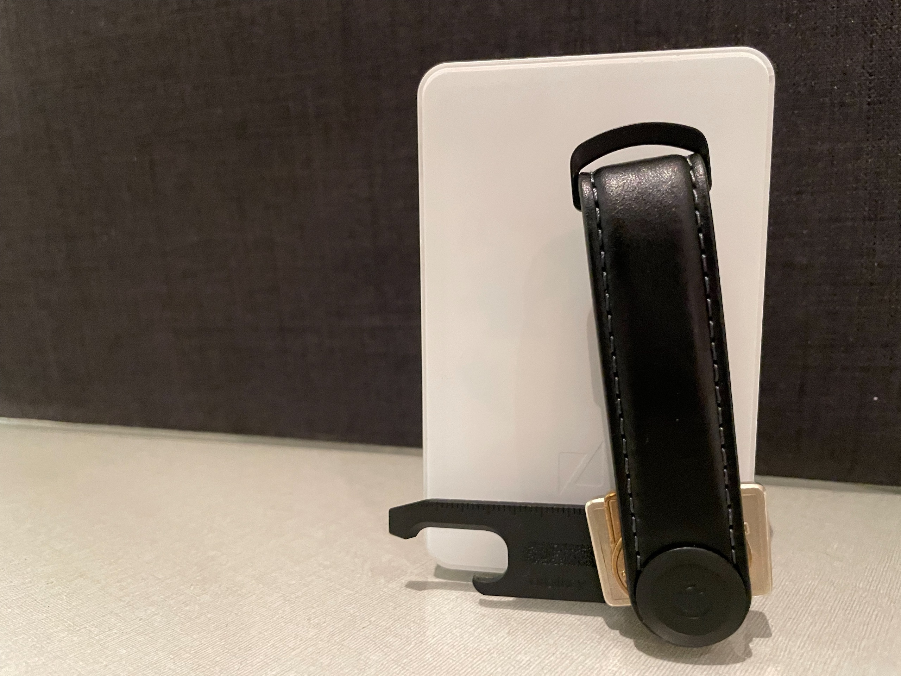
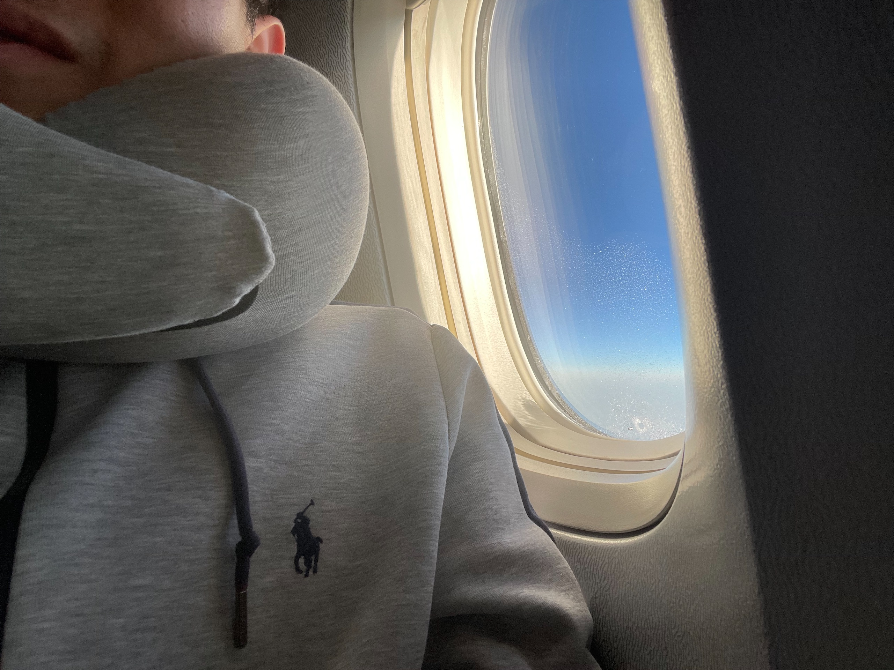

之前發現每月報報正確的寫法，應該是事件發生的當下，有什麼想法就趕快先寫一點東西下來，然後月底的時候就只要整理一下就可以馬上發了。這篇文的前半就是這麼拼出來的，但後半段就直接被期末專題和考試撞到九霄雲外了 QQQQQQQ

如果這篇文看起來很破碎，還請大家多多擔待 😅

## 🎫 The 1975 Still... At Their Very Best

The 1975 應該是我近 5 年最常聽的團之一，在我心目中的排行竄升很快，有望拿下 Coldplay 的地位，但兩個樂團不論是曲風還是 (主唱的) 行事風格都還是十分迥異，一個熱愛地球，主張愛、和平、與環保，另一個會直接跟政府開幹：）

故事是這樣：The 1975 的巡迴原本是在今年 7/25 來台灣，我也早早就買好票了，然後他們[在馬來西亞幹了一票大的](https://ysolife.com/the-1975-good-vibes-festival/)，甚至被當地政府列入黑名單，因此接下來的亞洲巡迴全部都一起取消了。但我在買完台灣場的票之後就有注意到他們今年還會巡迴來匹茲堡，所以票退下來之後我馬上就手刀買票了 XDDD

老實說我覺得這一場的 Setlist 節奏編排的忽快忽慢，有點難跟上，而且收尾也是一個收在一個奇怪的段落，結束的時候我還想說這樣應該是代表等一下要 encore 吧，然後 PA 就若無其事的走上台開始拆舞台，我才意識到哦原來真的沒了，啪 沒了。

但是作為半個前戲劇社舞台組員，我實在很難不忽略這整個舞台的設計

و ✧*｡ 抱歉我好像沒有把他拍的很好看 QQ")

而且不單單只是舞台很精緻，整個演唱會的過程會有很多攝影機跟著 Matty 移動，所以可以在大螢幕上看到他跟場景互動，大幅度的增加整個場景的帶入感。


<figcaption class="text-center">剛好最近他們把之前在紐約 Madison Square Garden 的完整影片上傳了，有興趣的話可以自行移駕</figcaption>

好啦 給過

## 📺 性愛自修室 Sex Education 第四季

比起前 3 季，這一季的節奏緩慢不少，而且比起前幾季有很多很 Drama 的事件在推動故事和角色的發展，這一季花很大的篇幅在收拾每個角色內心的情緒和未來。

雖然對外是到上映前才公布這會是最後一季，但我私心猜測，也許 Netflix 一開始就通知劇組這會是最後一季，所以編劇才會選擇這樣的路線。

娛樂性一定是少了一點，但我覺得忠實呈現每個角色在他們生命中的挑戰是正確的選擇，特別是前面三季都別有心裁的把感情的討論範圍，從情侶之間的親密關係延伸到友情、親情，如果在最後一季的時候沒有在這些細節上繼續著墨似乎就太可惜了。

<blockquote class="reddit-embed-bq" style="height:500px" data-embed-height="740"><a href="https://www.reddit.com/r/NetflixSexEducation/comments/16s0ynp/couldnt_agree_more/">Couldn’t agree more!</a>  by<a href="https://www.reddit.com/user/spimmy13/">u/spimmy13</a> in<a href="https://www.reddit.com/r/NetflixSexEducation/">NetflixSexEducation</a></blockquote>

看網路上的討論，好像滿多人對第四季很不滿意，特別是批評結局的平淡，但我想編劇想呈現的就是如此吧

感情在時間洪流之中，每一刻都難免食之無味，但又怎麼能說是棄之可惜呢

## 🇺🇸 Thanksgiving

在美國的第一個感恩節！

學校是從 11/22 禮拜三開始放，一路放到週末結束，總共 5 天，有點像在台灣放中秋連假的感覺 (?)。原本的計畫是把所有的作業和雜事全部排開，就可以久違的來寫一些很久沒碰的 code 還有提早把這篇報報寫完。

結果突然就跑出了 2 團 Potluck[^1] 局，上面提到的這些就沒有然後了：）

身為料理白癡如我，真的是為要帶什麼頭痛了好一陣子。在某一堂週末瑜伽課回家的路上跟冠儒聊天的時候，他給了一個很棒的建議——法式雜菜煲

> 一開始，我還以為他在凡爾賽。
>
> 但當冠儒開始解釋這道料理有多簡單之後，我的眼睛為之一亮[^2]

於是我最後在 Potluck 的當天下午去超市買了食材去冠儒家，他在旁邊準備隔天火雞 Potluck 的其他料理，我在旁邊瘋狂切菜，做完再一路抱著它搭公車去 Potluck。

在這裡特別感謝冠儒的 idea 跟協助 🫶🏻

[^1]: Potluck 基本上就是 Home Party (~~a.k.a. 轟趴~~)，但是每個人都要帶一道料理，最好是自己在家做的那種。
[^2]: 這段經典台詞的[出處](https://youtu.be/zO0MABOO8AE?t=197)

## 🛍️ Black Friday

中國和台灣比較流行的是雙十一，美國這邊的年終購物節是在黑色星期五，也就是 11 月的最後一個星期五，跟感恩節是同一個週末。

最早期的黑五是只有零售通路會在當天舉行特賣，後來又衍生出 Cyber Monday，電商網購平台會在黑五後的禮拜一促銷。後來界線就漸漸變得模糊了，總之就是為期一整個禮拜的瘋狂血拼節。真的要說最近有什麼特別的話，就是我有觀察到很多店家喜歡讓顧客先訂他們的電子報，然後在黑五之前提前 email 折扣的商品讓有訂閱的人提前下單。

原本來之前很期待可以大爆買一波，但一方面美金最近匯率還是偏高，再加上找實習沒啥進展，實在是沒啥理由跟心情亂花錢，所以後來很多想買的東西還是捏了一下，只買了一些 (不算太貴的) 新奇~~垃圾~~小物。

### 🔑 Orbitkey 鑰匙圈

> 男人出門，只帶口袋放得下的東西

基本套路就是手機、錢包、鑰匙。手機沒啥好說，錢包的話，在美國真的是很少用到現金，比歐洲還少，所以如果我只是出門去買個菜或是吃個晚餐，有時候就會只帶裝信用卡的卡夾。

我原本的鑰匙圈就是大家認知中的鑰匙圈，但這種鑰匙放在口袋裡很容易刮花其他東西。最早應該在高中的時候就有看到 Oritkey 了，可惜台灣家大門的鑰匙不是扁的沒辦法相容，也就一直沒有買。

後來來美國看到公寓的鑰匙全是扁的，馬上就直覺想到他了 XDD

因為鑰匙金屬的部分被外面的皮革遮起來了，所以可以放心收在口袋，不用擔心會刮花手機或是卡夾。

### 💤 Ostrichpillow Go Neck Pillow

我高中就有買一個他們家的 Light Versatile Pillow 在學校用，大家應該都很熟悉 XD

只是那個用久了變得有點鬆垮，就沒那麼有彈性了，剛好 12 月會搭蠻多飛機的，所以這時間買一個新的再適合不過了 👍🏻

## 🎯 本月目標回顧

就如開頭引言所說，這個月被各種隕石襲擊，所以很多目標都掰掰了。

謹此懺悔 🙇🏻

### 🟡 修 Portfolio 和履歷

Portfolio 我覺得算是有更新到能看的程度了，只是履歷啥都沒改。

但也是多虧了這將近一個月沒有看履歷，前陣子面試再回來看，就察覺到很多地方其實有點...矯枉過正，看起來反而怪怪的，應該回台灣準備明年春季下一波的時候會再一起改。

### ❌ 規劃記帳系統的 Roadmap

這原本要在 Thanksgiving 做的。

左來一個 MSE Potluck，右來火雞 Potluck，上面還有黑五夾攻...所以...

啪 沒了

12 月回台灣再看著辦吧

### ❌ 寫 1-2 篇料理文

雜菜煲其實可以寫一篇，也確實寫了。只是做的當天太手忙腳亂，沒拍到什麼照片，感覺這樣發有點太隨便了，最後草稿就先壓著沒發了。

回台灣放假有空再做一次來拍照 (←希望不是空頭支票

## 🎯 下個月的目標

放假了，雖然該做的事不少，但說實在經過一個學期，我現在真的是只想躺平 QQQ

決定來列一些逼迫自己放假的目標

1. 上個月的目標，履歷跟料理文，補完。
2. 吉卜力馬拉松：最近《蒼鷺與少年》要上映了。回頭想想發現吉卜力的動畫，我居然一部都沒看過，真的是沒文化真可怕。
3. 看點書，寫些閱讀心得的文

---

啊對了之前曾經分享過的 Retro 最近終於上架 Android 了，有興趣的人可以來玩玩看ㄌ

[我的 Profile 傳送門](https://retro.app/i/tomy)

關於 Retro 的介紹，可以看看之前的[8 月報報]()

然後如果你有上傳很多照片的話，還可以免費索取屬於你的 2023 實體明信片哦哦哦

---

啥也不是，散會！
