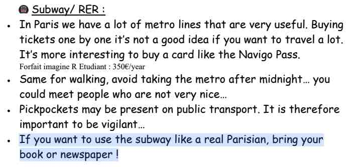

今年的計畫很簡單，因為我已經錄取至少一間美國的 Master's 了，其他學校應該過完年會陸續開獎，細節就之後再寫一篇文章吧。總之確定的就是大概 8 9 月會飛出去唸書。

所以在那之前就是一片空白，基本上跟 Gap ~~year~~ three quarter 差不多。也許之後可能會安排去打工度假、環個島、Workation、實習，但這些東西目前八字都還沒一撇，所以大概是也沒什麼好寫的。

但在這個特別的時間點，應該是很適合好好的回顧一下這幾年的生活，還有接下來要達成的一些目標。

## 🎯 重視短期目標

我自從上了大學之後，設立了蠻多執行時間大於 1 年的大目標，比方說轉學、實習、交換甚至到現在在申請國外的研究所，而且這些大目標的執行都蠻不錯的。不會到說都很完美，但我有發現我的確對於這種目標非常遙遠的目標，蠻有一套方法去處理每一個細節，就是 Divide and conquer 的概念。

但我也發現在前進這些目標的時候，與其說我非常有條理的按照進度執行計畫，其實更像是，我把所有可能需要的東西想好了，然後就一股腦的開始硬幹 ~~，然後天就亮了~~。

這樣的問題點就在於：我會很容易忽略那些，其實可能也同樣重要的其他事情。比方說好好生活、好好吃飯、好好面對下面這些——我一直想培養，但每次 ☄️ 砸下來就會被我丟到一邊的興趣。

那既然現在的日子難得悠哉了起來，應該是沒有理由可以讓我推託不好好重視這些小的短期目標。但必須老實說，目前 2023 已經過了 11 天，雖然我已經稍微擠出了一套以週為執行週期的計畫，可惜目前看起來遵循的不太理想，也許先把老師送的《原子習慣》看完會是一個不錯的主意 (?) ，至少會稍微有頭緒一點吧哈哈哈哈

總之，寫在第一點就是因為，這個大方向會影響到我要怎麼達成我下面列的其他目標。某種程度上來說，也許好好的 follow 一套成果可能不理想計畫，會比亂搞一通然後不小心達成了某種成就更有價值。如果沒有累積，然後 reproduce 成功的經驗，感覺就很容易掉進原地踏步的迴圈裡。希望我會慢慢找到一些撇步，慢慢修正這套計畫到軌道上吧 (?)。

還是會證明我上面的理論是錯的呢，who knows ¯\\\_(ツ)\_/¯

## ✍🏻 寫作

好啦，這應該是目前算是有點在軌道上的目標...吧...嗎 (?)

我從前年開始斷斷續續的寫了一些文章，當時的目標是希望培養一下文學的素養，因為我練習英文寫作練習到一半發現，爛的不是我的英文，而是我的文學素養，退一步來說，我的語文腦可能長期處在一個低度開發的狀態。

雖然現在申請研究所的工作已經差不多告一個段落了，可能短期內不太會再遇到需要大量寫作的工作，但我發現文字確實是輸出想法、體悟，乃至於生活經驗的完美載體，所以我希望持續的寫作，會是我能夠延續的習慣。而且這也是我目前能想到，紀錄我下面其他目標執行狀況最好的方式。

即便我目前對於寫文章的體驗是不錯的，但目前寫了這麼多篇文章，還是有一些問題還沒有解決：

### 寫作時間

我經常想到一個題材，然後就想說：「喔，這個概念應該蠻簡單的，我們就速戰速決好了」。然後寫下去 3 4 個小時就不見了。就我的印象，目前還沒有文章是低於 1 個半小時內完成的。

### 邏輯架構

早期剛開始寫的時候，因為還沒什麼經驗，所以我常出現「想到什麼就寫什麼」的狀況。由此可見我國高中應該是真的沒什麼認真在上國文課：）現在的話，會先大概列好大綱，確定整個脈絡是清晰的再開始寫，但有時候還是會不小心偏題，或是忘記原本想要寫的東西。

### 用字遣詞

跟前面「想到什麼就寫什麼」有點像，我現在寫作的方式有點像是腦中有另一個我，然後我一邊把我想講的東西講給他聽，然後就一邊把逐字稿打下來。但講故事和寫作本質上還是有蠻大的不同，連我自己再重新看自己寫的文章都會覺得冗言贅字有點多，產生某種煩躁感。然後為了修掉這些看起來很奇怪的語句，我的寫作時間又會大幅增加。

總之，之後可能再找時間 survey 這些問題的解決方案吧，最重要的還是先維持這個習慣，然後把 blog 其他比較小細節的 code refine 好然後公開

## 📸 攝影

我對攝影一直算是有興趣的，從大概國中我就有涉獵一些可以擴充 iPhone 攝影的配件、研究不同的玩法。之所以沒有在當時就去買一台相機，然後認真的栽進這個領域，有很大一部分是因為：我很早就發現攝影是一個蠻大的錢坑。其他細節，還有為什麼現在要啟動這個領域，我想留到之後有第一篇心得的時候再一起講也許會更適合一點。

去年年底就已經有開始看相機了，沒意外的話應該等到 [2 月底 Canon CP+](https://www.canonrumors.com/the-canon-eos-r8-will-be-announced-at-cp-in-february/) 落幕，就會購入我人生中第一台單眼相機。

## 📚 閱讀

還記得去年去法國交換的時候，我們在新生歡迎有拿到一份巴黎生存指南，有一條寫著

而在我的觀察裡，也確實是這麼一回事——法國人真的很喜歡在搭乘交通工具的時候閱讀。在火車站的 Relay (類似便利商店的小賣店) 除了賣零食、飲料、報紙，還會賣一些比較薄的書，就是為了讓人可以在到達目的地前看完這本書。

我必須承認我的確不是一個喜歡看書的人。

不喜歡到，我爸為了鼓勵我多看點書，只要是我想看的書，他全部都買單，不用花我自己的零用錢買。

因為我從很久以前就認為，我能在書本上獲得的知識，都能透過別的方式獲得，所以如果要學習某方面的知識，我更 prefer 去網路上搜尋相關的資源，而不是去找相關的書來看。我想這也是為什麼，我的語言腦會長期未開發吧哈哈哈哈哈。



我想我應該不是唯一一個跟閱讀疏遠的人，前陣子剛好看到這支影片，算是印證了我某方面的想法。我覺得我漸漸開始接受「閱讀」這個習慣本身是有價值的，也許我也應該去培養這個習慣，但我也應該要接納，閱讀本來就是緩慢、樸實、感官刺激非常低的過程。

目前我想培養這個習慣的原因大概有這些：

1. 我發現看書在想法上能獲得的啟發，會比起看網路文章、影片、或聽 podcast 來的有深度和廣度，也許這會促使我用更多不同的方式去 ~~使用我的腦袋~~ 理解這個世界
2. 看書似乎是一個很好讓生活慢下來的方式，而這是我現在滿需要做的一件事。看起來可能有點抽象，看完[下個段落](#-結語)可能會比較了解我想表達什麼
3. ~~裝逼~~

但我必須坦白說，這樣的動機和目的應該是遠不足以支撐培養這個興趣。也許我會需要再多花一些時間，去思考我希望透過培養這個習慣來獲得什麼。

## 📝 結語

今年最重要的目標其實應該是：好好生活

還記得前年暑假去 Intel 實習，剛進去的時候免不了要有一輪自我介紹。在某個場合有人就問到：「欸，你平常的興趣是什麼？」然後我就突然開始腦內小劇場

> 寫 code 啊，廢話

> 沒有更好的答案嗎

> uhm...看電影怎麼樣

> 等一下他問我們看什麼怎麼辦，我們連 Netflix 都越來越少在看了欸

是的，可以看到，雖然我現在的興趣真的是寫 code ~~，即便這讓我看起來很像某種 cybrog~~。但在那之前，我確實還是有很多寫 code 以外的興趣和人生，比方說旅遊、追劇、看展覽。而我想最大的轉折點就在，就如同我在[上面](#-重視短期目標)所說的，我太常一口氣把所有的時間都砸在某顆 ☄️ 上，然後 ☄️ 會一顆接著一顆來，導致我用沒有效率的方式在處理每一件事情，然後失去我其他正常日子裡的其他消遣。

總結下來，我覺得有兩件事情需要改變：

1. 重拾 coding 以外的消遣，並且安排專門的時間，所以我就不會在做這些事情的時候被其他狗屁倒灶的事情打斷
2. 增加我在做正事和 coding 時的效率，事半功倍才能把時間拿去做真正重要的事情

而這兩件事呢，第一點又比第二點來的重要，做這些消遣可能沒有急迫性或是立即的效益，但長期而言，這會促使我的腦袋不會因為卡在做某一件事情太久而變得僵化，而也因為消遣的性質，導致我容易去合理化放棄做這些事情的時間。所以最好的作法，就是先畫清楚這些時間我就是不可以拿來做正事，然後相信我的本能會好好的利用可以運用的時間，來把該做的事情做好。
