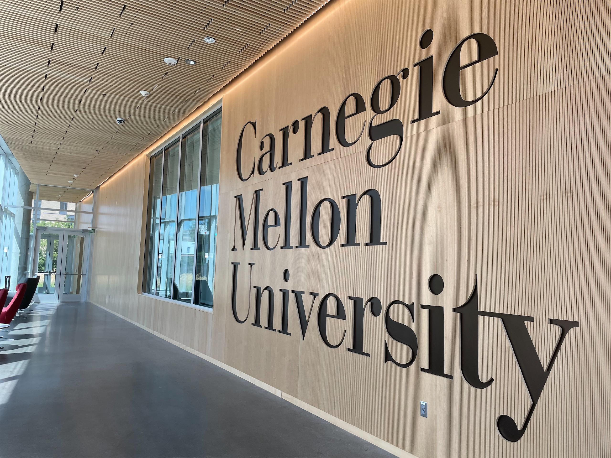
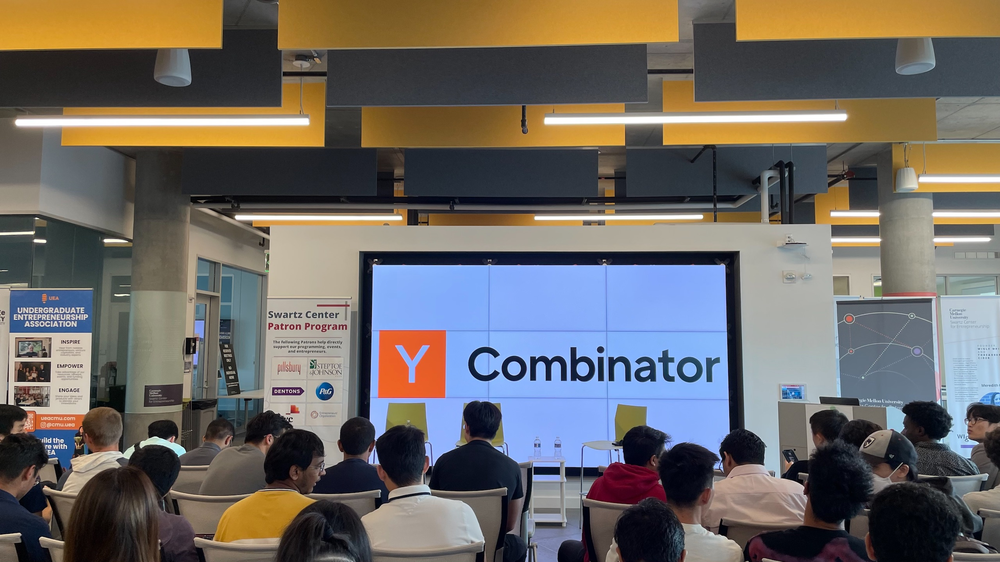
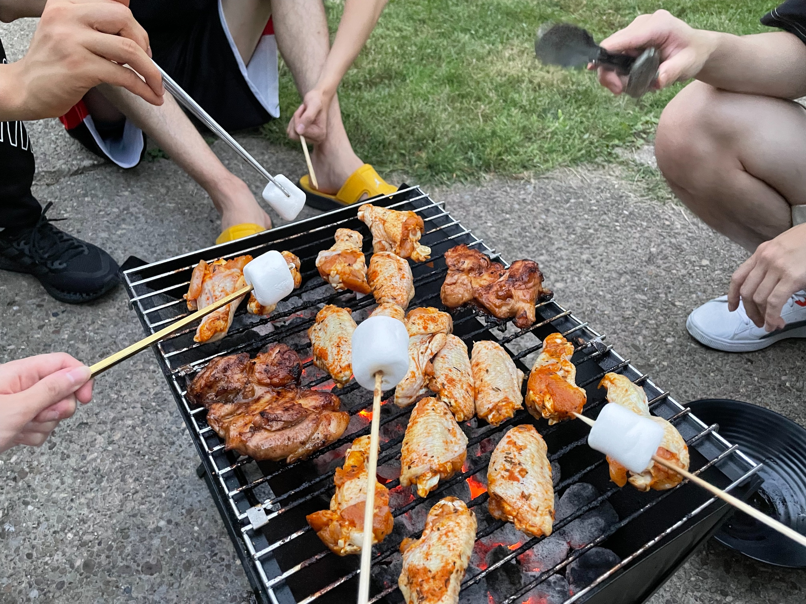

## 🧑🏻‍🏫 開學

在台灣的大學，1 學分 (Credit) 通常就等同每週 1 小時的**課堂**；CMU 的 1 學分 (Unit) 則是相當於每週花費 1 小時的**總時數**，也就是說，有些學分數高的課，即便課堂時間非常少，相對的寫作業和唸書的時間就會多一點。另外我念的 MSE 這個學程有很多 Mini 課，也就是把一個學期再切成兩半，然後課程長度只有半個學期。

而我這個學期上下半的 Mini 各有 4 門課，加上 2 門學期課 (其中一門是旁聽，不算學分)，這樣總共是 10 門課，共 51 學分

上了一個月，我只能說：如果一門課的學分標的很高，通常都沒有在跟你開玩笑的，真的每個禮拜都在被作業追著跑：）

雖然每一門課都有不一樣的時間規劃，但大部分的課程其實開學的時候就已經有很詳細的大綱可以參考了，小至每一份作業的 Deadline，大到什麼時候有考試，有沒有期末 Project，所以時間規劃好的話，理論上還是可以事先提前~~拆彈~~動工。

## 🎪 就業博覽會、招募活動

9 月除了是開學季之外，同時也是找明年暑期實習的熱門時段。CMU 身為理工強校，自然不落人後，在開學第二週就有 2 場，總共 3 天的 <abbr title="就業博覽會">Career Fair</abbr>。

第一天的 Career Fair 是不分職業別，全校性的，沒太多科技公司，第二和第三天是專門開給理工科系相關的企業。所以我的策略就是第一天先去散步，熱身一下看看要回去準備什麼，隔天再來認真的。

雖然說現在找工作都是網路投履歷各憑本事，實際在線下活動找到工作的可能幾乎是屈指可數，但如果不是有這種實體活動的現場，我還真的很難體會到美國的就業市場究竟有多麼競爭，這甚至還只是 CMU 而已。

排隊的人潮裡，不泛各種西裝皮鞋打領帶，甚至有些學程的系辦還有幫每個學生都做專門的名牌可以別在胸前。我只能說穿著短褲配 T 恤和漁夫帽的我真的跟鄉間野人沒兩樣 🤡

隔天我印了大概 30 幾份的履歷，實際上也才塞出去個五六張。話說我雖然有事先準備了一些可以跟工程師和招募人員聊的問題，但結果最後聊一聊我都開始問他們公司的商業模式、或是他們的產品客戶族群之類跟找工作其實一點屁毛關係都沒有的問題 XDDDDD

## 🎯 本月目標回顧

[點我]()看看上個月的目標

### ✅ 認識 5 個 (母語不是非英語) 的同學

其實當時也只是寫給開學第一週的自己，中後期其實差不多就過了適合認識人的時間了。但後來想想覺得，首先 5 個人這個數字好像有點設的太低了 XDDDDD 實際上我應該有達成至少個 3 或 4 倍，再來，似乎認識不是什麼困難的，但是如果要能夠從點頭之交變成真的會常聯繫和交流的朋友，似乎才是真正困難的事情。

也許維繫友情，比一開始把 I 型人格的 me 推出去還要困難呢，是個值得好好思考的問題。

### ❌ 寫 2 篇部落格文章

爆了：）

一方面是我的時間規劃真的一直被作業打亂，另一方面也是 15-513 的文章大綱自己看了不是很滿意，所以有點難產。但坦白說除了寫每個月的報報，讓自己的生活有個出口，可以重新審視一下這個月過的好不好之外，最近還真的是沒什麼動力寫文章 QQQQQQ

### 🟡 睡前至少看個 20 分鐘的書

似乎應該要訂個明確的標準，但我回想一下真的有執行的可能就 4 5 天，好像是有點略低。

## 🕰️ 時間規劃

之前聽到一個想法還蠻酷的，決定寫在這裡，未來可以思考要如何實踐

- CMU 的課程非常精實，如果每一門課都追求完美，你會沒有課業以外的生活
- 課外每天都有很多活動，不管是課業、社團、找工作、還是朋友的聚餐，什麼都想參一腳是不可能的
- 還有很多生活上的瑣事、自己想做的事，運動、看書、煮飯、洗衣服，或是像我現在在寫這篇每月報報

與其覺得每件事都很重要，然後硬擠出時間給每一件事，不如反其道而行——

- 每天需要多少睡眠時間？
- 扣掉上課、煮飯、超市採買、洗衣服這種每個禮拜固定要花的時間

然後就可以開始思考：

- 一份作業 (或複習考試) 該花多少時間？ 如果超時了，想想自己放棄了多少休息的時間，換到了多少學業上的成績？
- 剩下的時間還有多少？在這麼多的時間裡，該做哪些**真正想做的事**？

## 🎯 下個月的目標

1. 實作上面提到的時間規劃，目前暫時想不到什麼指標來衡量結果，但希望我主觀上可以感覺到自己有餘裕花更多時間在做自己想做的事情
2. 把現在床頭邊的那本書看完 (~~書名太恥我就不打了哈哈哈哈~~

## ✨ 其他生活的繁星點點

## 👻 那些我在 Reddit 上看到的酷酷貼文



> 每個整點都有數百萬的人同時被鬧鐘叫醒欸

看到這篇文的 5 分鐘前才剛被鬧鐘叫醒，真的是有夠不爽 🙃

祝大啊中秋節快樂！ ~~(不是欸都過多久了)~~ 下個月見！
