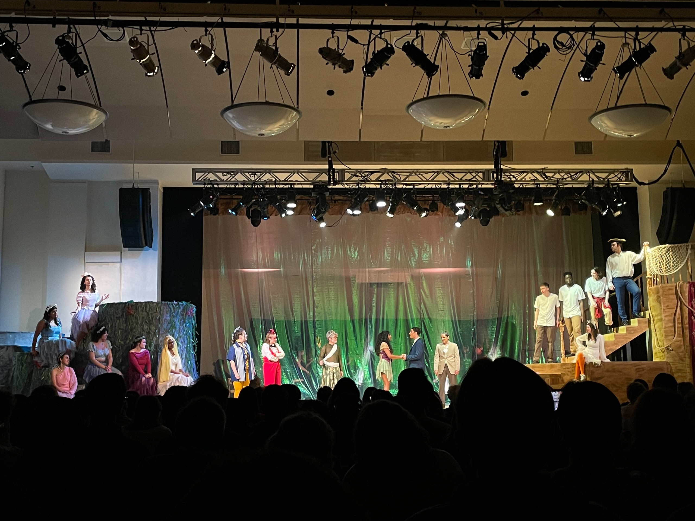

真沒想到寫個部落格也可以寫到有廠商下廣告（？？？？（並沒有

怎麼這個月好像也是不知不覺就過完了 (抓頭)，原本想在舊金山回程的飛機上寫完這個月的報報，結果不知不覺就睡到匹茲堡了 QQQQQ

希望我可以在費城回程的火車上寫完這篇 (握拳

## 🎡 Spring Carnival

")

概念上其實跟台灣大學的校慶/園遊會差不多，只是規模比較大，有各式各樣的活動四散在校園持續四、五天、所以也會放假讓大家各自去參加有興趣的活動。





<figcaption class="text-center">反正就是吃吃免費食物、玩遊樂設施</figcaption>

另外一個值得一提的 CMU 特色是 [Buggy Race](https://www.youtube.com/watch?v=lNYG6x2hWQo)，有點難形容，但大致上是人形賽車 (?)，可惜開賽時間一大早我剛好時差發作爬不起來，只有看賽後轉播 XDDD

## ⁉️ 超級瑪利歐兄弟 驚奇

](https://www.nintendo.tw/topics/article/3TCT7LvW5JmSpBZR4WnNnv2)")

最近稍微閒下來了一點，終於開始有一些閒暇娛樂 XDDD

自從我動物森友會解鎖大部分內容之後，我有好一陣子都沒有再碰我的 Switch 了 (或者說任何遊戲)，直到去年回台灣跨年的時候玩到新的瑪利歐，意外挺上手的，就想說回美國的時候應該要帶一片來有空認真給他玩一遍，結果回來的太倉促，整個就忘記了。原本想說順其自然就算了，等暑假有空再叫我弟幫我買再寄去西岸給我......結果上個月隨口聊完，這張遊戲片就在我匹茲堡的家門口了 ¯\\\_(ツ)_/¯

於是我這個月的 CC 作業幾乎就是在「瘋狂寫 → 卡住 → 玩瑪利歐」的輪迴中度過，意外發現靠打電動清除腦內快取其實是一個蠻不錯的策略。

作為睽違 11 年之後再度推出的經典 2D 瑪利歐續作，這一版的內容可以說是遠超出我的期待，除了難度沒有像以前這麼難[^1]，內容也的確夠多樣、夠「驚奇」，不管是新的迷你任務、徽章系統、大象型態都為這一代的瑪利歐增添了不少樂趣。

另外一個值得提的就是，這次的關卡裡面經常會出現一個橘黃色的喇叭花，雖然對於通關沒什麼太大的幫助，但聽他講一些垃圾話還是挺好笑的，中文版這次也有幫他配音，這也是為什麼我會想要從台灣買遊戲卡寄來美國。

我印象最深刻的一關是，某一種新的怪物會吃掉路上的栗寶寶，然後會路過一朵會說話的喇叭花在旁邊說：「呼！幸好我不是栗寶寶！」然後下一秒吃到驚奇花之後，瑪利歐就變成栗寶寶被那個怪物攻擊吃掉。

我真的是好氣又好笑 😂😂😂

總之，跟大部分遊戲評測差不多，我給這一代的《超級瑪利歐兄弟驚奇》9/10 的高分，推推！

[^1]: 當然也不排除是我的技巧比起小時候又更加成熟了 :P

## 🧑🏻‍🚀 POST/CON 24 之再訪舊金山






說到我念的這個 MSE Program，有一個跟其他碩士學程不同的地方，就是有一個職員：Sasha，專門負責跟校友、業界交流、洽談 Studio Projects 和 Practicum [^2]、還有幫助學生找工作。在一次因緣際會下，她在接洽 Postman 之後，對方決定贊助 5 位同學飛去舊金山參加他們的年度發表會—— [POST/CON](https://www.postman.com/postcon/)。

於是我就這麼~~不小心賽中~~被選為其中一員啦 ｡:.ﾟヽ(*´∀`)ﾉﾟ.:｡

Postman 是由印度人 Abhinav 在實習的時候為了測試所開發的小工具，發布後意外在紅起來，於是 Abhinav 帶著他的爆款產品來矽谷成立新創，至今也超過 10 年了。隨著這次的 v11 的發表，Postman 也順利搭上 AI、資安等各種領域的特快車，搖身一變成為一站式的後端開發平台。

跟去年來舊金山比起來，這一趟就真的完全是來「出差」，從飛機落地到起飛回匹茲堡，每天睜開眼睛就是參加 Conference 和畢業的校友吃飯之類的，中間幾乎沒什麼太多觀光的行程。但還是有很多收穫，雖然腦中大概有一些想法，但我想就留到下個月實習上工，思緒整理好之後再另外寫一篇吧！

[^2]: 可以想像成分組畢業專題，但是題目是由業界公司贊助，透過設計某個產品或系統來滿足他們的需求。

## 🎯 下個月的目標

上個月沒有目標，這個月目標只有一個：

> Making \*Meaningful\* Connections

下個月要去 PyCon US！

從大一第一次參加台灣的 PyCon 以來，我也記不太清楚到底參加過多少類似性質的會了。但說也奇怪，我的個性似乎沒有 E 到會喜歡去認識新朋友，但又不夠 I 到對這種活動完全不感興趣，寧可在家睡覺。

這常常使我成為會場上一種奇怪的生物：一個幽靈在會場飄來飄去，自己逛攤位、自己吃午餐、自己聽演講。然後回家之後，又會在午夜夢迴的時候感嘆自己沒有在現實世界交到志同道合的朋友，不管寫了什麼酷酷的 code 都還是沒人可以炫耀。

嗯。總之就是：孩子交點朋友吧。

## 🦄 世界會成為你想像中的樣子

最後想寫一些最近的感觸

高中快畢業的時候，我發現對考試制度和升學主義有所批評的人總是不少見，同學、學校老師、補習班都有，但有趣的地方在於，批評力度最強的人，卻往往同時是將這些制度發揮到極致的人；比方說分享自己學生時期多痛苦的補習班老師，畢業之後進入補教界，完成這個大業的循環、或是恨極了考試的學生，繼續選了職涯道路上充滿資格、證照考試的科系，然後回到母校跟學弟妹分享這條路有多麼艱辛。

在美國找工作的時候，也有類似的感觸。求職某種程度上來說跟尋找另一半有幾分相似，在履歷上字字珠璣、瘋狂刷題、模擬面試、攀關係都是常見的方式，使用不同方式的同時，也會相對的把自己推向具有相同特質的企業，進而遠離其他不青睞這些特質的公司。

其實跟吸引力法則有幾分相似：

> 每個人對世界都有一種想像
>
> 想像驅使我們去做出選擇
>
> 選擇會將自己推向世界的那一部分
>
> 然後我們所認定的世界就會成為我們想像中的樣子

最終，我們會繼續把故事傳頌下去，去形塑下一個世代對世界的想像，完成這個大業的循環。

如果說每個人都與生俱來一種超能力，或許我的超能力就是一份對世界的無條件信任——我眼中的世界總是欣欣向榮；即便是在最艱困、周遭的人都不得不妥協的時期，我依舊對世界充滿期待，願意相信大環境會獲得改善[^3]，願意相信我周遭的人事物會善待我，就像我也會無條件的善待它們。

建立並維持這份信任並不容易，但這是我作為一名極端樂觀主義者的理想與堅持。

台灣近期剛經歷了死刑存廢的辯論，面對八成民意，我合理猜測最後憲法法庭的裁決應該是會持續維持現狀。雖然說少數人無法融入這個社會（或者說這個社會容不下這些人）有點可惜，但我為台灣社會給予這個議題討論空間感到驕傲。

[^3]: 我在 [2 月報報]()中對於美國就業市場的評估或許就是一個很好的例子

---

希望這個結尾不會太沈重，下個月內容預計會有費城遊記、PyCon US、實習上工，敬請期待！

<small>結果為了要生《超級瑪利歐兄弟 驚奇》的截圖又拖稿了兩天，因為我的最終關卡一直過不了，真的是會氣死：）</small>
