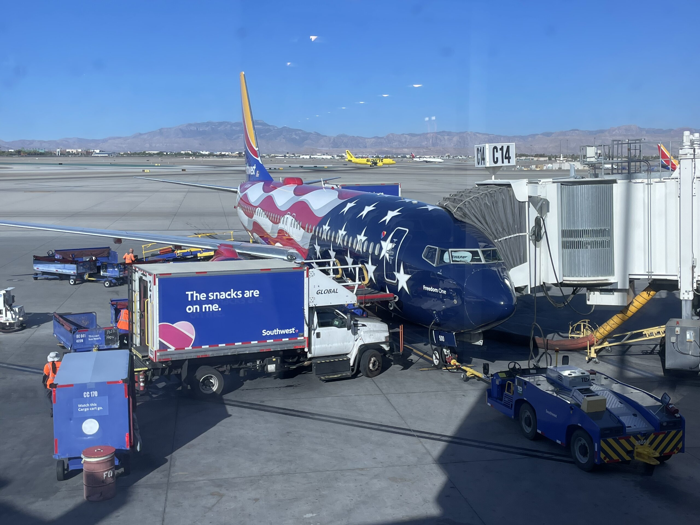

作為人生的最後一個暑假，好像有點平淡，8 月最後就是把在灣區這邊實習的工作告一個段落，然後整理一下就回來匹茲堡了。

## 🫡 再會！WeRide！

我的實習是從 5 月底到 8 月底，不多不少差不多是 12 週，有期中跟期末報告，這樣說起來好像也有點像是在修一門課 (?)。期中之後有跟我的 <abbr title="導師">mentor</abbr> 討論後半段要做什麼，但可能因為我也很上手了，所以其實實習的後半段節奏變的相對緩慢，輕輕鬆鬆就把大部分的事情做完了。

簡單帶過一下我的實習日常：

| Time           | Task                                                                                                                |
| -------------- | ------------------------------------------------------------------------------------------------------------------- |
| 9:00           | 起床 (通常會再偷瞇個 15 分鐘 xD)                                                                                    |
| 9:40           | 進公司，去零食櫃抓一些麵包、倒一杯牛奶當早餐、看看新聞                                                              |
| 10:30          | 回憶一下昨天幹了啥                                                                                                  |
| 10:45          | 跟 mentor 回報進度，決定今天要做啥                                                                                  |
| 11:00          | 想一下今天要做的東西可以怎麼搞                                                                                      |
| 11:50          | 去~~人民公社~~食堂幹飯                                                                                              |
| 12:30          | 去休息室躺懶骨頭玩一兩局 Duolingo 然後 swag 午覺                                                                    |
| 13:00          | 開始幹正事                                                                                                          |
| 15:00          | 好棒！三點了！<br/>去廁所棒個賽滑手機滑個 20 分鐘<br/>然後去零食櫃晃晃，享受一下 snack break                        |
| 15:40          | 再幹點活                                                                                                            |
| 17:00          | 組內每日 stand up meeting<br/>通常沒我的事，我喜歡在這時間滑脆                                                      |
| 17:30          | 出會議室直接左轉食堂幹飯<br/>通常一個禮拜我會給自己 2 天外食的扣打，<br/>我會根據今天晚餐的恐怖程度來決定要不要外食 |
| 17:30 or 18:00 | 完食即下班！或是如果外食的話就是直接下班！                                                                          |

忘記之前在哪裡滑到一篇文，說資深工程師越過雷區的方式就像在逛花園，我感覺我實習的後半段算是有抓到一點精髓 (?)

至於我做了啥，雖然是在自駕車公司，但其實我做的東西跟自駕車一點屁毛關係都沒有。我做的是支援自駕車工程師的工具，是個有點類似 CI/CD Pipeline 的平台，可以想像成為公司客製化的 GitHub Action 或是 Jenkins，然後再加一些更ㄏㄧㄏㄨㄚ的功能，具體細節就不贅述了，有興趣的人可以私下約我聊聊。

期末報告完之後有找了一些工程師聊聊天，[寫了一篇文]()介紹自駕車演算法是怎麼運作的，有興趣的可以去看看。

總的來說，是個有點充實，卻也稍微能從容勝任的一份實習吧。

## 🏞️ 灣區生活

結論是我沒有很喜歡 QQQQ 至於詳細的原因，就放在[另外一篇文]()了。

## 🏛 重回匹茲堡

MSE 的最後一個學期除了修一門選修課之外，整個學期只有一件大事—— Practicum，其實就跟台灣畢業專題的概念差不多，我們的學程是比較實務導向的，所以不需要寫論文，取而代之的就是這個畢業專題，跟普通畢業專題比較不一樣的是，專題是由業界公司贊助的，所以我們實際上更像是在做另外一份實習，只是內容比較貼近我們在 MSE 所學的內容。

那為了讓大家可以選自己有興趣的專題，MSE 在開學的前一個禮拜五舉辦了一場說明會，讓每間公司來簡報他們贊助的專案。

於是我把實習的最後工作日壓在星期三，星期四飛回匹茲堡，然後隔天星期五馬上一頭栽進 Practicum ：）



。看看他最近還戴了可愛帽帽")

我在回來的飛機上發了一篇限時動態：

```shell
life stash push -m san-jose
life stash pop stash^{/pittsburgh}
```

這個比喻有點宅，就不解釋具體意思了。但概念就是，與其說我的人生又結束了一段旅程，其實更像是我在灣區有一個人生，在匹茲堡也有一個人生，而搭上飛機就相當於我的大腦把這段人生的紀錄存檔，永久冰封在某個長期記憶冷凍庫，然後把匹茲堡的記憶解凍，重新載入，像「大夢初醒」的感覺吧。

再度見到 MSE 的同學和許久不見的其他台灣人，與其說我們在互相分享暑假實習做了些什麼，那個聊天的過程其實更像是：

<!-- prettier-ignore -->
> 「欸我跟你縮哦  
> 我昨天做了一場超漫長的夢  
> 我夢到我在西岸工作，超屎的」
>
> 『幹真假，也太怪』
> 
> 「但那邊的亞洲食物比這邊好吃太多了  
> 而且 XXX 也在，他車開的超爛  
> 然後那個 XXX 還 XXX」
>
> 『屁啦，怎麼可能...』

總之，在匹茲堡公寓的床上起床，看到旁邊躺著 IKEA 鯊魚，走進浴室又看到薛丁格馬桶依舊沖不下去就知道，嗯我回來了。

## 🎍 新常態

相對工作的時候就是上班時間就上班，下班時間可以百分之百支配自己的時間，回學校就是上課之外，下課之後還有各種作業和雜事需要處理，更像是在打游擊戰。

最後一個學期的主要任務，大概是：

1. 找工作：先不考慮實習那邊會不會有好消息的話
2. 修兩門課：這學期選了 <abbr title="資料庫">Database</abbr> 跟 <abbr title="分散式系統">Distributed Systems</abbr>，其實都是想認真鑽研的領域，而且也對未來工作很有幫助
3. MSE Practicum：就是上面提到的專題
4. Cloud Computing TA：上學期的選修，修完之後這學期來當助教了

只能說我高估我的工作量了，開學前兩週的工作量真的是有點喘不過氣 QQQQQ

## 🎯 下個月的目標

這個月沒有訂目標 [^1]，最近久違的跟一些朋友線上聊天之後，突然有了一些新的想法。

我之前應該有說過，寫部落格是一個「提供反思、然後重新掌舵生活」的一個好方法。雖然我每個月還是有在定期產出文章，收到的回饋其實也沒有太大的變化，但我自己其實知道，過去的兩三個月其實寫起來更像是在敷衍自己。相較於某一些時期，寫報報能夠重新賦予生活一些方向和意義，來讓我下個月的生活過的更好，最近這樣的感受真的是少了許多。從發文日期應該也多少看的出一些端倪，這篇文居然拖了半個月。

追根究底好像還是一個簡單的理由：太忙了，根本沒必要這麼忙。

|        | 重要   | 不重要    |
| ------ | ------ | --------- |
| 緊急   | 找工作 | TA        |
| 不緊急 | 修課   | Practicum |

<figcaption class="text-center">這張表格放在這裡謹惕自己</figcaption>

結論：下個月很簡單：

- 多出門、去參加活動、去泡在咖啡廳，幹啥都好
- 每天 12 點準時躺到床上看書，看到睡著，然後把那篇寫到一半的書評給寫完
- 準時發報報


希望下個月有多一點東西可以寫！啵掰！

[^1]: Well...其實有，只是那幾篇 What's on my stack 差不多是胎死腹中了
