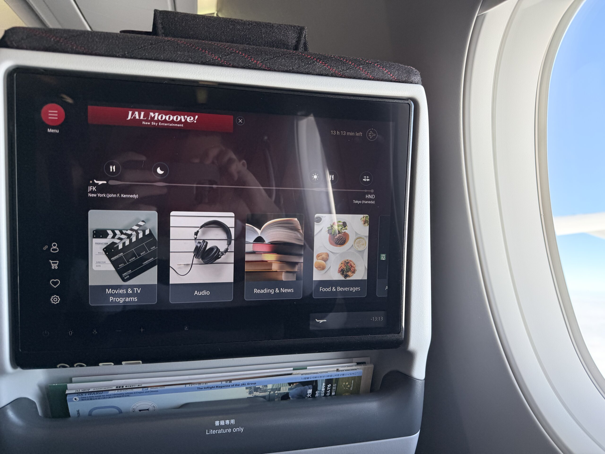

這個月不單單只是 2024 的尾聲，也是我在 CMU 的最後一個月，或者更廣義的來說：我作為學生最後的時光。月中考完期末考幾乎是沒什麼休息就匆匆開始收東西、搬家，所以寫這篇部落格的現在好像反而還比離開的當下還更感傷。

聽起來好像有點難過，但畢竟作業 \>\>\>\>\> 一切的生活總算是結束了，而且畢業本來就值得高興 (或者說慶幸 (X)，所以還是挺開心的。

## 🎓 CMU 掰掰

我想要在此感謝我畢業專題的組員，讓我的最後一個學期的痛苦少了不少，甚至還多了些歡樂，特別是我們的組長 Akilesh，要不是有辦在 Smoking bar 的 Team Building，我大概半路就會放推這個專題了吧

<figure>
    
    <figcaption class="text-center">我們的最後報告是現場 Demo 發 Email 給在場所有的同學及評審教授 這功能甚至是我在最後三天肝出來的 🙃</figcaption>
</figure>

但成果我很滿意，也算是呼應了 CMU 的格言：My heart is in the work. 🫶🏻

<figure>
    
    <figcaption class="text-center">我想我是會懷念漫步在雪中的校園的吧 (僅限懷念)</figcaption>
</figure>

## 🖤💛 匹茲堡掰掰

本著上個月設定的目標，期末完要好好再玩一下匹茲堡。

雖然原本的想像是兩天把搬家的事情全部搞定，然後就有完整的一個禮拜可以玩匹茲堡。但最後還是搞到離開前幾天才算是把東西收到一個樣子，真的是完美體現了帕金森定律 (?)





<figcaption class="text-center">還吃了匹茲堡難得少見的港式餐廳 The Parlor Dim Sum，還有幾乎每天經過但從來沒吃過的 Butterjoint</figcaption>





<figcaption class="text-center">房間一清空之後，瞬間回想起去年剛搬進來，趴在地毯上邊寫 ICS 最後一份 project 邊等床送來的那段時光</figcaption>

## 🗽 紐約

搬家完馬上接著的是 10 天的紐約行！

說起來奇怪，作為許多人來美國玩第一個會想造訪的地方，我至今從來都沒有來過，甚至連轉機都沒有，結果第一次來就一路從聖誕節待到跨年，應該算是體驗值最高的玩法了吧。

紐約有太多好玩的事情，這裡就不多提了，有興趣右轉[這裡]()。

還有看了一齣百老匯的音樂劇：[Sunset Boulevard]() 也有一篇心得文。

## ✈️ A350-1000

簡短交代一下這次的返台計劃：我們學校是 12 月初考完期末考就直接開始放假，一路放到 1 月中開學，去年雖然沒有特別想回台灣放假，但因為大部分的同學都會離開匹茲堡，所以我也選擇早早回台灣放假。今年比較不一樣的是，因為之後畢業就不會再回來了，再加上工作的開始的日期可以自己跟公司談，可以放更長的假，所以就沒有急著馬上回來，想說趁著這個機會多玩一趟再回來。

也因為有這個打算，我早早就開始看不同地方的機票，在某個票價的低點買了去紐約和從紐約回台灣的機票。當時買回台灣的機票是 ANA 的，JFK → 羽田 → 松山，其實是非常舒服的行程，因為飛的時間很漂亮，時差很好調[^1]，而且中間的轉機剛好有 25 個小時的時間夠我進東京市區玩一天再舒服的睡一覺起來搭飛機，回台灣又是在松山，搭文湖線就到家了，不用在桃機人擠人。

但其實這並不是我的首選，我的首選是空巴剛交付給 JAL 的全新 [A350-1000](https://www.jal.co.jp/en/inter/A350-1000/)，因為這批新機的首發就是就是紐約 ↔︎ 東京這條旗艦航線。所以雖然我前面機票已經買好了，但我還是時不時會上 Google Flight 上看這條航線的價格[^2]，只要降到低於我預先設定的價格，我就出手改機票。

欸？結果還真的給我蹲到一個 ~$500 的價格 (大驚


<figcaption>於是就有了這篇意外 (微) 飄出去的脆文 XDDDD 在此發誓，上面的文句句屬實，除了沒交代我是為了搭新飛機改的部分 😂</figcaption>

的")

雖然照片看不太出來，但這塊螢幕有 13 吋，比 iPad Pro 還大，而且可以配對自己的藍牙耳機，拿來看電影超爽。右下角還有一個有點類似 (前) MacBook Pro Touch Bar 的迷你螢幕，在看影片的時候是媒體控制介面，[螢幕關閉的時候會顯示飛行的進度條](jal-a350-screen-dark.jpg)，對像我這種睡一覺起來會不知道剛才睡了多久的人來說超級實用 👍🏻






這班飛機有供兩份餐，我相信大家應該可以看的出來這兩份餐各出自哪一國的空廚，我就不說了：）最大的亮點是飲料有日航限定的葡萄 + 水蜜桃特調果汁，算一算這一趟應該喝了至少 10 杯 😂

結論：日航真的爽，每次日本，每次爽。現在回來反而開始有點擔心以後會不會回不去廉航了 🤔

[^1]: Well 其實時差對我來說從來不是問題 但你知道我的意思
[^2]: 也作為寫資料庫專題的休息時間的消遣

## 🎯 本月目標回顧

- ✅ 早點睡：雖然都還是搞到 1, 2 點才睡，但總比原本的 5 點好一點 (?)
- 🟡 離開匹茲堡前再多探索一下這座城市：勉強算啦，雖然原本是計劃要再多去一些地方，但光搞搬家就夠累了 QQ
- ✅ 認真結算一下來美國至今燒了多少錢：差不多是算完了，之後有機會再分享

## 🎯 下個月的目標

笑死這篇文寫完 1 月都過一半了。

之前報報都是因為忙所以很晚才寫，這個月反而是太多東西好寫，所以不想草草的趕著寫完，覺得這樣挺好的，就沒急著寫了。

也剛好最近回來台灣會待到 2/7，所以這次訂的目標更像是在決定回美國前要完成些什麼事

1. Roadmap 我的 2025：今年應該是會挺 chill 的[^3]，不准再像 2024 一樣亂七八糟 🙅🏻
2. K MVP：Project K 是一個我擱置好幾年的 Side Project，最近比較有空了，有撿回來復盤然後重新開始，不出意外的話應該可以至少在過完年之後完成 <abbr title="Minimum Viable Product 最小可行性產品">MVP</abbr>，然後正式開始使用
3. 扣掉 2024 回顧 + 2025 展望，另外寫 2 篇文章

[^3]: 雖然是客觀現實，但希望這不是 flag 🤞🏻🤞🏻🤞🏻

---

原本以為把紐約拉出去寫，這篇應該篇幅會小很多，怎麼還是莫名其妙的越寫越多：）

總之，亂七八糟的 2024 結束了，真是漫長的一年 (汗)。感謝大家的支持與愛護，2025 報報應該會改版，那就到時候再見啦！
