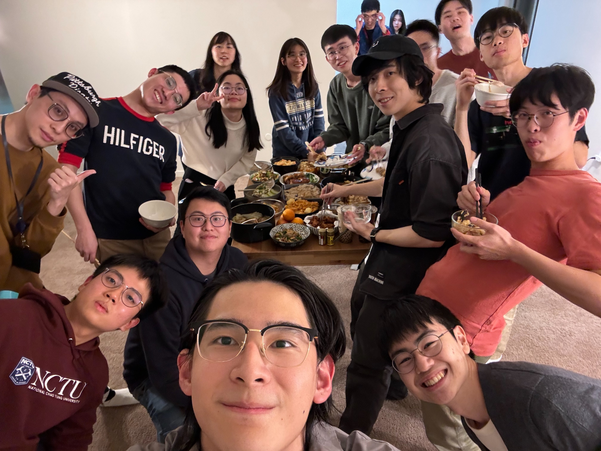
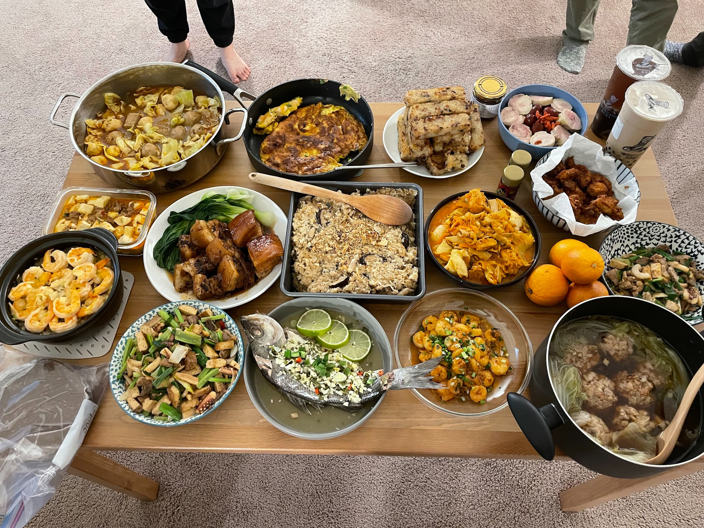

寫這篇文的時候剛好上半個學期結束，準備開始放春假。跟上個學期比起來，這個學期的課業真的是輕了很多，加上這個月上岸了，感覺生活又開始愜意許多，可以重拾生活很多其他想做的事情，~~還有亂買之前發下豪語說上岸就買的垃圾。~~

## 🧧 美式~~要飯~~過年

其實我第一次不在家過年應該是前年在法國的時候，但今年應該算是比較正式的第一次有過年。[^1] 白天在學校 MSE 舉辦了 Luner New Year 的活動，然後晚上我們一大坨台灣人煮了一桌的年夜飯，然後按習俗喝酒打麻將跟玩 Switch。

[^1]: 說「正式」是因為那年的年夜飯是巷口賣的 Pain au Chocolat 配 Picard 的微波菠菜鮭魚義大利麵：）

## 🏂 滑雪

回來的時候雪也融的差不多了，但是學生會今年還是有舉辦 Ski Day 的活動，然後我也不小心就抽中了 嘻嘻



雖然有幾次摔到以為我要轉生了，但感覺我應該再滑個幾次就可以掌握七、八成了 (?) 想必是小時候玩太多 Wii Fit 練就的平衡感吧哈哈哈哈

## 📚✍🏻 Lecture Thursday

這學期的課幾乎都是早上的課，中午吃完飯下午沒事就可以回家躺了 (X)。

說是回家躺，其實還是有想做一些雜事或是正事，但可能也是真的住夠久了，就算家裡有螢幕，做事應該是更事半功倍，實際上還是很容易直接躺回去。

於是就想到了一個新 Idea —— Lecture Thursday



目前體驗還不錯，仿佛生活頓時被賦予了儀式感 ✨

唯一的問題大概就是有的時候禮拜四可能會有其他行程，或是某一天比較有空，然後就會把這個行程改到禮拜五，然後當天才想到 <abbr title="Cloud Computing">CC</abbr> 有 Quiz 要寫[^2] QQQQQ

[^2]: CC 全名 Cloud Computing，雲端運算，是我這學期修的一門課，每個禮拜五都會有線上小考要寫。含複習的話全部做完大約需要 1 ~ 3 小時不等的時間。比較靠背的是因為這門課是全線上，所以小考的的存在感很低，很容易就不小心忘記寫：）

## 🎯 本月目標回顧

### ✅ 完成 2023 回顧 + 2024 展望文

兩篇文都在 Lecture Thursday 完成了，雖然已經盡力多花一點心思在構思內容了，但其實我自己對最後的成果不是非常的滿意。也許這也有點印證了我裡面有提到的一點——寫作應該要及時，讓想法盡快落筆。

Anyway 反正最後還是整理思緒寫出來了，有興趣的話不妨去看看吧：

- [2023 回顧]()
- [2024 展望]()

### ✅ 看完 《絕命毒師》第一季

目前進度大概到第二季快一半。原本想說前面都有點歹戲拖棚，特別是每次看到 Skyler 就很想快轉，我就想看他們搞冰毒，到底誰在乎她的美國媽媽毛病。

但還好結尾很屌，讓我又有動力可以繼續往第二季看下去。

### ✅ Laundry Run

除了我的 Laundry 週期正在漸漸拉長之外，其他似乎沒什麼毛病，而且 25 分鐘的跑步感覺還挺不錯的，是一個強度蠻適中的長度 👍🏻

## 🎯 下個月的目標

- 一週一文：假設繼續延續 Lecture Thursday，理論上這應該不會太難，唯一的變數是下個 Mini 課表又會有些微的變動[^3]，要怎麼調整可能還要再觀察觀察 🤔
- 多拍些照片：最近都到寫報報的時候才發現照片好少好難挑，幫下個月的自己解個任務
- 一週一料理：發現這學期自己下廚的時間少了很多，跟 HW 下廚的時候我也都在瞎忙，廚藝似乎有退步的跡象，再這樣下去真的是不行欸

[^3]: 關於什麼是 Mini 可以參考[之前的報報]()

## ⚓️ 上岸啦

通常我不太喜歡在這麼私人的領域提及我工作相關的事情，但世俗的好消息還是值得著墨一下。

經歷了 8 個多月的找工作奮戰，終於在這個月錄取了 WeRide ——一家中國的自駕車新創。今年 5 月底開始會在 San Jose 實體實習 3 個月一路到暑假結束。

身為一位稱職的資工系學生兼數據控 (X)，分享一下我個人今年找工作所收集的各項數據：

|                                               |                     |
| --------------------------------------------- | ------------------- |
| 第一封實習申請                                | 2023/6/12 (Day 1)   |
| 拿到 Offer                                    | 2024/2/14 (Day 248) |
| 列入考慮申請的職缺數                          | 1117                |
| 實際總申請職缺數                              | 475                 |
| 未錄取                                        | 216                 |
| (還) 未收到回覆                               | 259                 |
| <abbr title="Online Assessment">OA</abbr>[^4] | 26                  |
| HR Phone                                      | 2                   |
| Technical Interview                           | 4                   |
| LeetCode                                      | 268                 |
| Mock Interview                                | 6                   |
| Workday 帳號                                  | 38                  |

客觀來說，各種跡象跟數據都顯示，今年美國軟體工程師的求職狀況還是非常嚴峻，裁員潮還沒有完全退去，能被我撈到一個缺，已經十分難得。

但簽下這份 offer 還是苦苦掙扎了好一陣子，甚至比沒面試時還難以消化。一方面是覺得對這份 offer (或者說公司) 並不是到非常的滿意，另一方面也是自己把目標放在更遙遠的地方。第六感甚至告訴我，即便手上沒有其他牌了，我也不應該屈就有任何一絲妥協的選項。

但這份 offer 終究是簽了，接下來也不太可能會有其他意外。說後悔嗎，也許一半一半，但現在下定論似乎還太早了。

希望事後回頭來看的時候，時間和現實會證明我是錯的，但即使是到現在，我依然相信就業市場會在暑假之前釜底抽薪，解救眾生。

祝還在找工作的人不要氣餒，繼續加油！

[^4]: 通常是在時間限制內完成一定數量的 <abbr title="演算法">Algorithm</abbr> 測驗題目，有的時候也會有數學、統計選擇題、<abbr title="資料庫">SQL</abbr>、<abbr title="系統設計">System Design</abbr>、或是 <abbr title="網頁設計">Frontend</abbr> 實作等等。這裡只計算技術測驗，不包含 Behavioral 或其他怪怪的測驗。
