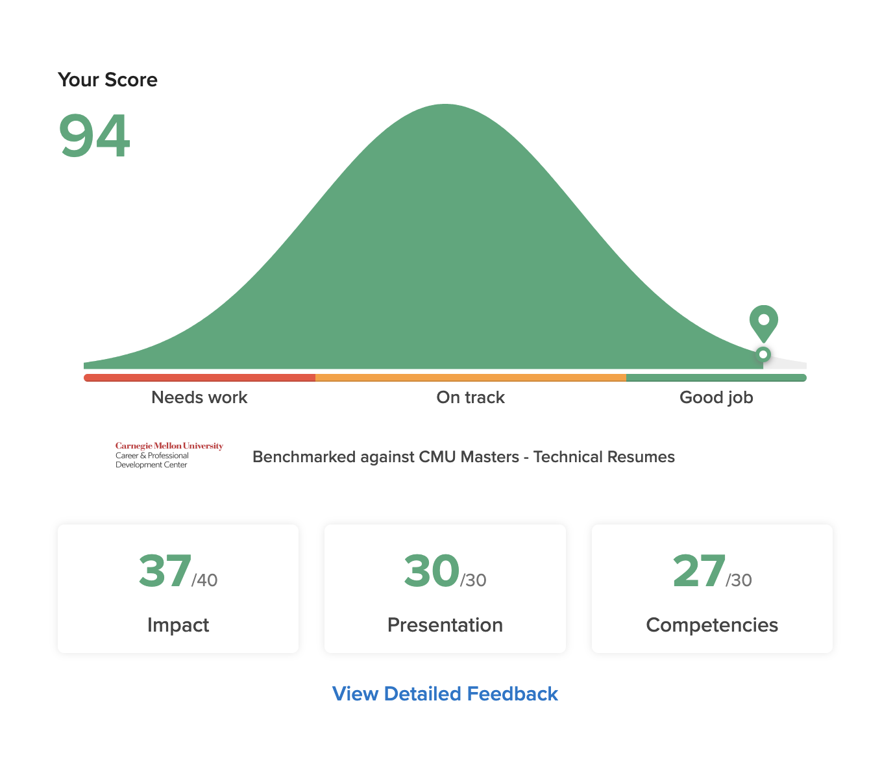

2023 回顧 + 2024 展望之後再補，每月報報不能再遲到ㄌ

## ⌨️ LeetCode

<figure>
    
    <figcaption class="text-center">2024 年 1 月每日挑戰徽章</figcaption>
</figure>

其實不是很重要，只是想~~炫耀~~ ~~自嗨~~ 報告一下我這個月除了有一天來不及沒寫到用了 Time Travel Ticket 之外，每天的 Daily Challenge 我都有寫完！我好棒！

## 📑 Docs - 我的生活指南

不管是寫 code 還是生活，面對各種雜事總是有許多小撇步跟 SOP，不如就把他們寫下來吧！

原本的計畫是把這些生活經驗通通寫成部落格的文章，但後來想想覺得這樣要搜尋和使用的時候感覺不是很好找，所以想說不如另外開一個網站專門來放這些資訊。

所以就，搭啦—— [Tomy's Docs](https://docs.tomy.me)

其實這個東西已經開起來好久了，但為了搜尋的功能要申請 Algolia 的 API key 被卡有點久，終於在寒假幾封 email 來回之後弄好了，現在也漸漸有一些頁面上線。

目前有的頁面，包含了像是[國際匯款的資訊](https://docs.tomy.me/misc/finance/international-wire)，或是寫 code 架環境需要的各種 [Package Manager](https://docs.tomy.me/package-managers/glossary/) 的指令。總之我也不太確定未來會放些什麼，但是如果你有找到用的到的東西，都歡迎把它加進書籤 (?)

## 💿 AutoRip 📀

我一直有在收藏 CD，從我 10 歲買了第一張 CD 之後，我幾乎每個月都會有固定一筆錢是用來買我最近常聽的專輯的 CD......直到去年來美國之後就暫停了。就算台灣還是有很多我想買的 CD，但是聽不到的話似乎也沒什麼意義......

於是這趟回台灣，我把家裡舊的電腦改裝成伺服器，然後寫了一個新的 Project —— [AutoRip](https://github.com/tomy0000000/autorip)。

其實就只一個短短的 script，就是當有 CD 放入伺服器的時候，他會自動把裡面的音樂轉成無損壓縮的 FLAC 格式，然後上傳到我的 Dropbox 資料夾，然後把 CD 退出來。

所以現在不管我人在哪裡，都可以自己在網路上下單買新的 CD，然後在家裡的群組呼叫我爹娘幫我收貨、把 CD 放進 server，然後我就可以在美國把檔案載下來整理進音樂資料庫。全自動，好舒服 (˘▽˘>

## 🗳️ 投完票馬上高歌離席 ♪~ ᕕ(ᐛ)ᕗ

按照慣例有把這次投票的心得[寫起來]()。






因為美國這邊 1/16 就要開學了，所以當天投完票我就直接前往機場飛回來了。

## 🎯 本月 (+上個月) 目標回顧

### ✅ 修履歷

回來總算是把履歷有再重新整理了一次。

內容的部分，有重新順過要怎麼寫，比較容易看得懂，面試的時候也比較可以順著小標去講；版面也做了很多調整，像是用分隔線讓段落之間的界線更清晰、從 A4 轉成 US Letter、還有調整行間距和文字的大小等等。






這次修履歷也有把的一些心得和技巧整理在最近新開的 [docs](https://docs.tomy.me/misc/resume) 網站上，有需要寫履歷的可以再去看看

我的履歷放在[這裡](https://cv.tomy.me)，如果有什麼建議的話也歡迎私下跟我縮，感恩的心 🫶🏻

### 🟡 吉卜力馬拉松

之前寫完說要看吉卜力之後，我馬上就從維基百科上勾了幾部有聽過片名：

- ✅ 天空之城 (1986)
- ✅ 龍貓 (1986)
- ❓ 螢火蟲之墓 (1986)
- ✅ 魔女宅急便 (1989)
- ✅ 神隱少女 (2001)
- ⏳ 貓的報恩 (2002)
- ✅ 霍爾的移動城堡 (2004)
- ⏳ 崖上的波妞 (2008)
- ⏳ 風起 (2013)

9 部看了 5 部，全部都是在 Netflix 上看的，但不知道為什麼《螢火蟲之墓》被下架ㄌ，可能之後要再來研究一下哪裡可以看 QQQQQ

看完終於可以理解為什麼吉卜力的動畫能夠風靡全球，特別是各種奇幻的角色和橋段，總是讓人印象深刻。雖然還沒有看最近這幾年的動畫，但我猜也許中後期的動畫就是少了這種童趣感，所以才會漸漸流失票房和口碑吧。

但撇開吉卜力不說，我真心覺得過去幾年，動畫電影少了很多卓越的作品，真的是挺令人惋惜的。

### ✅ 看書 + 閱讀心得

[《52 赫茲的鯨魚們》]()，在回台灣的飛機上看完了，有興趣的歡迎再移駕去看看我的心得文 🫶🏻

## 🎯 下個月的目標

1. 完成 2023 回顧 + 2024 展望文：雖然去年年末就已經大概有關於邁入新的一年的一些想法，但是前陣子心理狀態有點混亂，在這樣的情緒下寫出來的東西，感覺會把一整年都搞壞。雖然 2024 已經過完 1/12 了，但既然回來之後心態有稍微重整好一點，就還是為今年許些好願吧！
2. 看完 《絕命毒師》第一季：經典美劇，雖然身邊看的沒有很多，但有看的幾乎都大推，最近看了第一集感覺也不錯，值得之後來慢慢追完。
3. 按時每週 Laundry Run：來自[《原子習慣》]()的靈感，把習慣綑綁在一起。反正每個禮拜就是要找時間洗衣服，然後洗的中間這一小時也很難拿來做什麼正經事，再加上我公寓的健身房其實就在洗衣間的上面而已，不如就把洗衣服的時間固定下來，然後等衣服洗的時間就拿來跑步運動吧

## 寫在最後







不知道是不是看到[之前報報轉貼的貼文]()，今年難得有人會幫我辦生日聚餐！好我現在終於知道真實世界不能跳過的廣告是什麼感覺了：）

最近被各種人生的困難與抉擇所困惑，太多猶豫不定、躊躇不前、可惜、不知所措......各種百感交集一瞬間難以言表，總之

- 感恩所有寒假回台灣時把我挖出門的人，請體諒我的 E 型人格最近只會 Emo，I 型人格沒計畫要 social 所以話有點少
- 感恩我爹娘還有我的各種伯叔姨公婆，沒想到都 25 歲了人沒回家過年還可以預支紅包，賠錢貨過這麼奢侈好像有點不應該
- 感恩 MSE 的大家幫我辦生日聚餐，甚至還有卡片跟禮物，真是受寵若驚
- 感恩 MCDS 旅陪我吃 sem 飯、做 Yoga 還有玩雪
- 感恩所有關心我的人，還有願意看我的部落格的你

祝大家 2024 的接下來一切順利，下個月見！
