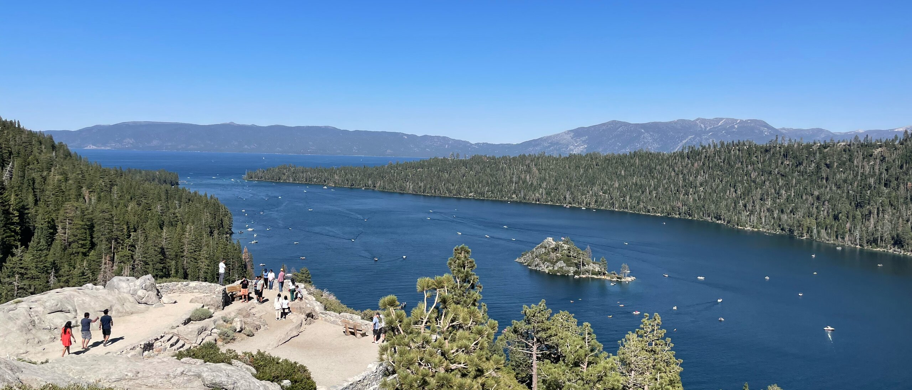
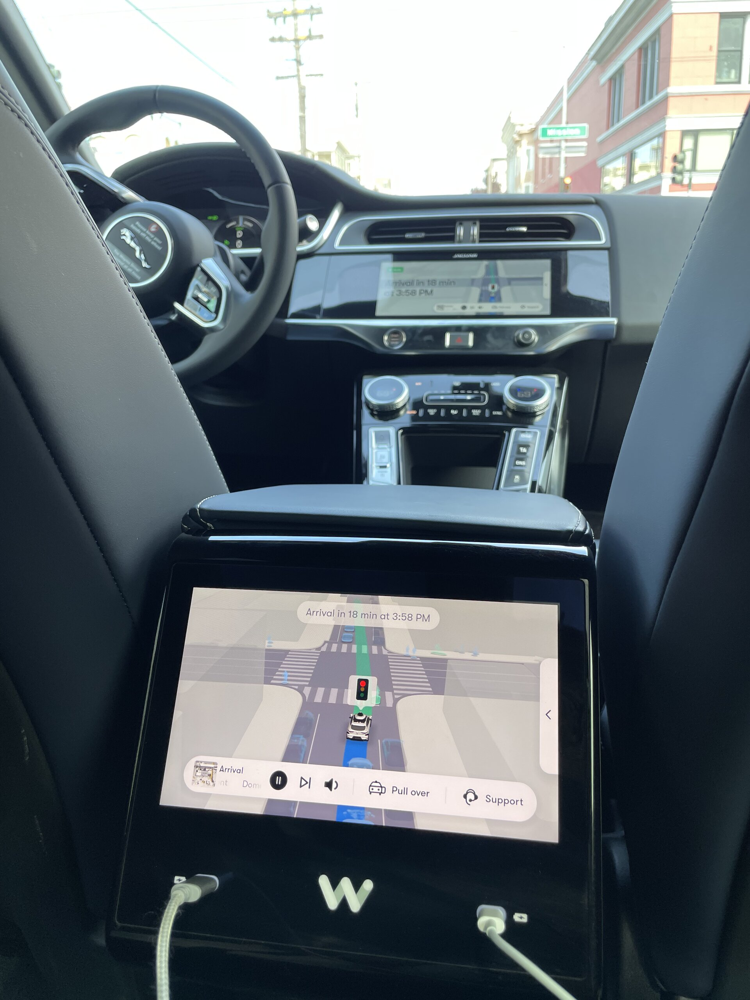
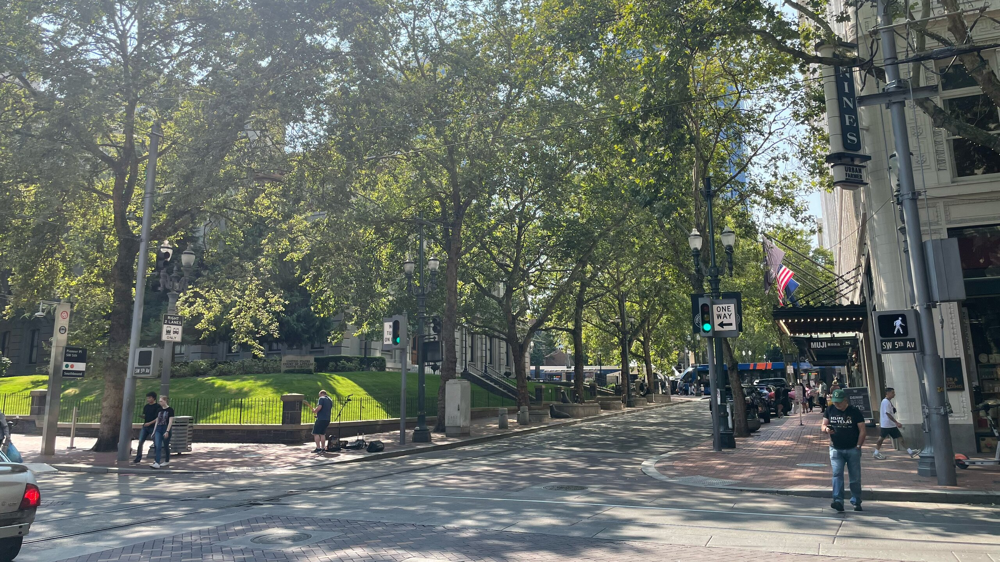
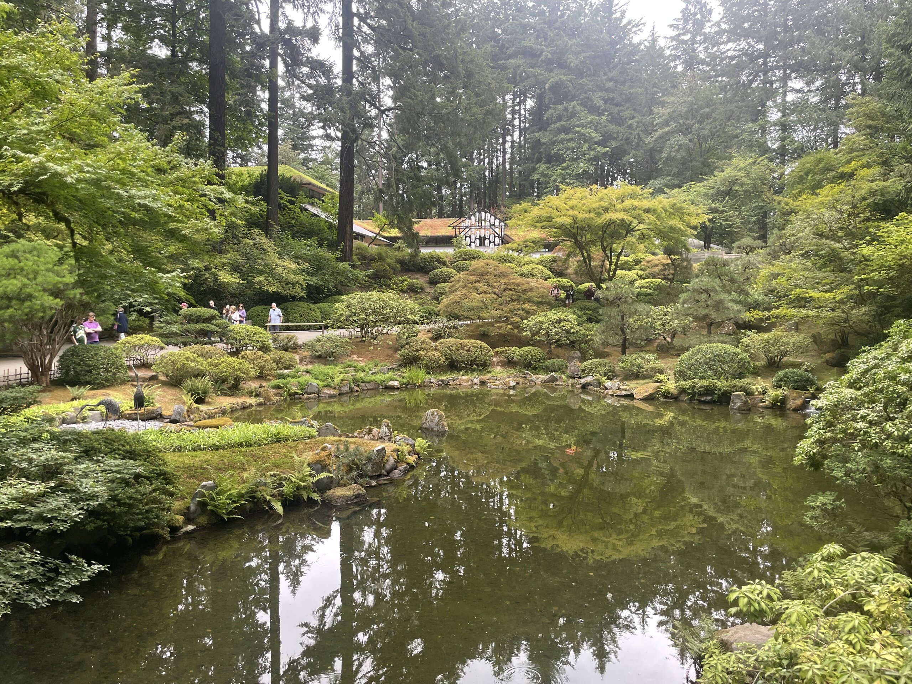
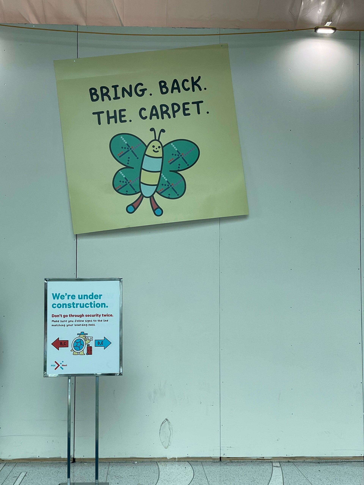
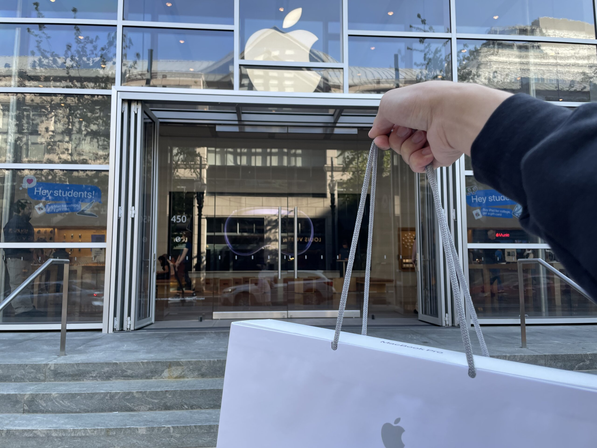

真的是好奇怪餒，為什麼經常月中的時候好閒，每次都想著要不要乾脆提早把報報寫一寫，結果最後總還是拖到月底當死線戰士，然後月底事情一蹦出來就很難專心坐下來寫報報 QQ

發現目標回顧放在結尾好像略顯沈重，這次拉到前面來好了

## 🎯 本月目標回顧

### 🟡《What’s on My Stack》

寫到一半才發現有點多，不得不拆成三部曲，然後首部曲發完就忘的一乾二淨了：）

另外一個更大的問題是：我寫完在校稿的時候才想到，當初訂下這個目標的如意算盤是想要寫英文版，之後可以放在履歷或作品集裡面拿去找工作。現在第一篇寫完再回頭去讀這篇文章的時候才發現文章結構支離破碎，前因後果交代不清，只是硬塞了一堆~~我想炫的~~不重要的東西。

Anyway，歡迎有興趣的人[移駕去看看]()，接下來兩篇目前計畫是

- 二部曲：Mailcow, Plausible Analytics, Remark42
- 三部曲：VPN, Photos, NocoDB

有可能會改，但歡迎敲碗 (?) 或在那篇文下面留言任何問題，我看到隨時會回

<small>p.s. 留言前可以點右下角輸入 Email，這樣我或其他人回覆的時候可以收到通知，當然 email 裡也可以隨時取消訂閱</small>

### ✅《下個十年》

也寫完ㄌ，有興趣可以[去看看]()。

算是我這一陣子在實習零零總總累積，關於未來工作的一些想像，和一些午夜夢迴的狂想。其實主要還是在思考我到底想要什麼，依照過去上大學一路到現在的經驗，有一些長線佈局是有很多好處的，一夕之前要達成了不起的成就不容易，但如果 <abbr title="分而治之">Divide-and-Conquor</abbr>，總是會顯得容易得多。

### ✅ 啟動找工作模式

勉強算是達成 嗎 (?)

更新履歷、設定 LinkedIn 的職缺通知、然後投了零星幾個比較早開的職缺。至於之前想說要找人內推和針對職缺客製化履歷的部分，還在想要怎麼搞，估計接下來實習快結束，開學之後又要來頭痛一波 QQ

## 🎯 下個月的目標

有鑑於接下來又要開始忙起來，除了上面 What’s on My Stack 寫完之外，這個月就先不挖新的坑了。

## 🏞️ Lake Tahoe

國慶日快樂！

美國國慶日是 7/4 禮拜四，雖然公司禮拜五沒有放，但大家都還是用 <abbr title="Paid Time Off 有薪假">PTO</abbr> 請假了，那我當然也請假去度假囉 ᕕ ( ᐛ ) ᕗ

Lake Tahoe 中文稱太浩湖，位於加州東北邊，開車距離我住的 San Jose 大約三到四個小時。其實感覺上跟日月潭差不多，只是面積放大 60 倍，然後天氣好一點、有沙灘、可以玩立槳跟各種水上活動，或是周圍也有一些步道可以走走。

回程經過知名的 Napa Valley 隨便找了一間葡萄酒莊去 Wine Tasting。雖然我是負責當指定駕駛，但在莊園喝葡萄果汁享受好天氣還是挺 chill 的。

## 🚙 Waymo One 初體驗

雖然之前入職的時候，我就有坐過我們公司的自駕車了，但這個月去舊金山玩的時候還是跟風去體驗了一下 Waymo One —— Google 旗下的自駕車公司 Waymo 推出的計程車服務。

<figure>
    
    <figcaption class="text-center">Waymo 的後座面板</figcaption>
</figure>

說實在的，高中搭了整整 3 年的 [530](https://www.student.tw/topic/39149-%E3%80%90%E5%88%86%E4%BA%AB%E3%80%91530%E8%BB%8A%E7%A5%9E/)，我對交通工具的平穩度本來就沒啥太大要求，飛機遇到亂流我也照樣睡的很香。

但坐完這一趟最大的觀察其實不是關於自駕車本身，而是另外一個附加現象：

> 一個人坐自駕車，車上真的就是一個人。

雖然說起來好像有種「聽君一席話，如聽一席話」的感覺，但套用車上的簡介影片可能會更能說明我想表達的概念：「...車上沒有任何監視器，所以歡迎盡情放聲歌唱」[^1]

之前在歐洲交換的時候就曾經有過這麼一個場景，身為 I 人的我，即便當下沒有特別想吃速食，但我還是經常走進麥當勞，因為我可以在自助點餐機自己點餐、取餐、吃完離開——完全不用跟人講話。這也讓我意識到，長久以來我抗搭乘計程車，倒也不是因為怕遇到開車魯莽的司機，我更不喜歡的是一直想找我講話的司機。所以如果自駕計程車在未來大幅普及，價格也相對親民的時候，說不定我不會排斥以自駕計程車作為一種通勤的方式。[^2]

但反面的來說，我也可以想像喜歡跟計程車司機聊天的人坐到這種計程車會有多無聊。之前就有看過一篇報導，說法國的超市雖然 80% 的結帳都已經是自助的了，但是每間店都還是會故意的留下幾條人工結帳的通道，因為超市發現有很多小孩已經長大、搬出家裡的退休老人家很喜歡去超市跟店員聊天，這是他們保持跟社會連結、保持年輕的一種生活方式。

很多新聞在報導這類自駕車的時候都喜歡附帶一句：「計程車司機即將被取代」

在人類被完全禁止開車上路之前，我倒覺得未必。

[^1]: 假設他們說的是真的，似乎就不能排除有些人可能會想在自駕車上_______(下略一萬字)。未看先猜未來的社群媒體可能會有網紅發起 #______OnWaymo 之類的挑戰。
[^2]: 我甚至可以大膽預測 Waymo Premium 或 Waymo Plus 的推出只是時間上的問題罷了

## 🌹 Portland

作為今年暑假唯一的週末小獨旅，月底又請了一天 PTO 連著週末三天兩夜，去了奧勒岡州的首府，玫瑰之城——波特蘭。

不知道是不是因為我來的時間是假日，波特蘭的市區雖然不到冷清，但路上的人相對沒這麼多，有種格外清幽，但不至於落魄的感覺。相對於舊金山灣區去哪沒車都很不方便，波特蘭不僅有完整的輕軌、公車路網、類似 Ubike 的公共自行車系統，市中心路口間距也不大，又充滿許多酷酷的商店，走起路來挺有趣的，所以這一趟來也就沒有另外租車，以美國旅遊來說，算是個非常友善荷包的選擇 👍🏻

<figure>
    
</figure>

波特蘭機場最近正好在施工，但市民們一點都不關心新航廈長什麼樣子，[他們只在乎原本遠近馳名的地毯能不能回來](https://en.wikipedia.org/wiki/Portland_International_Airport_carpet)






左：波特蘭的假日市集有不只一間店有這種專門賣怪怪帽子的店家，確認了一下，萬聖節應該還沒到，所以也許這裡的大家平常就喜歡戴怪怪帽 (?)

右：某個無家可歸街友為了籌錢買大麻來呼，於是在假日市集擺攤讓路人可以抖內 $20 塊來賞他一巴掌，生意好到需要保全出面緩頰。我在旁邊是看的是一臉懵逼（？？？？






兩個波特蘭土生土長的怪咖長大不知道要幹嘛，他們發現波特蘭沒有甜甜圈店，於是就創業開了一間。這樣大家就不用愁凌晨 3 點不睡覺沒有~~美味蟹堡~~巫毒甜甜圈可以吃了！

總而言之，是個怪的很好玩的城市呢 🤪

## 💻 新電腦！[^3]

另外一個選擇波特蘭旅遊的原因就是：奧勒岡州是免稅州，在這裡買新電腦比在加州買省下了整整 US$300 左右的稅。雖然說加上機票、住宿應該是差不多打平，但就當作是免費賺到一趟旅程，還是划算 👌🏻

按照大三的原訂計畫，我原本的這台 2018 年的 MacBook Pro 會一路陪伴我到年底碩士畢業，然後用新工作領到 Sign-on Bonus 作為下一台電腦的資金來源去買到時候更新的 M4。但是近期真的是可以明顯感受到他已經癌末，在各方權衡之後於是決定提前在暑假換新機。

關於這台新 MacBook Pro，應該不會有開箱文，但我有在考慮要不要幫舊 MacBook Pro 寫一篇 「封箱」文。但具體會不會寫，可能得看接下來忙不忙，就不亂開空頭支票了：）

🎀 A special thanks goes to Nikita for helping on placing this order.

[^3]: 是的沒錯，搞這台新電腦就是這個月報報大遲到的主因：）

---

人生最後一個暑假就這樣邁入尾聲了哪~ 怎麼有點感傷 🥲

下個月匹茲堡見囉！
