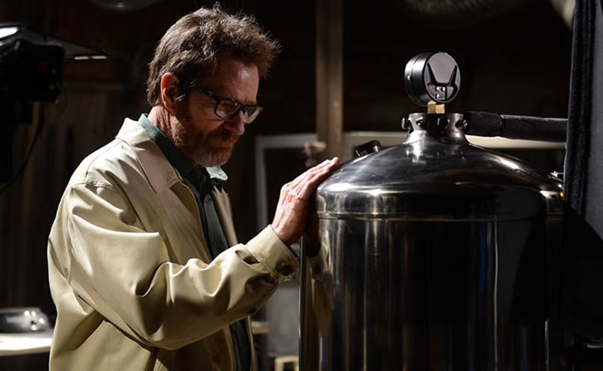
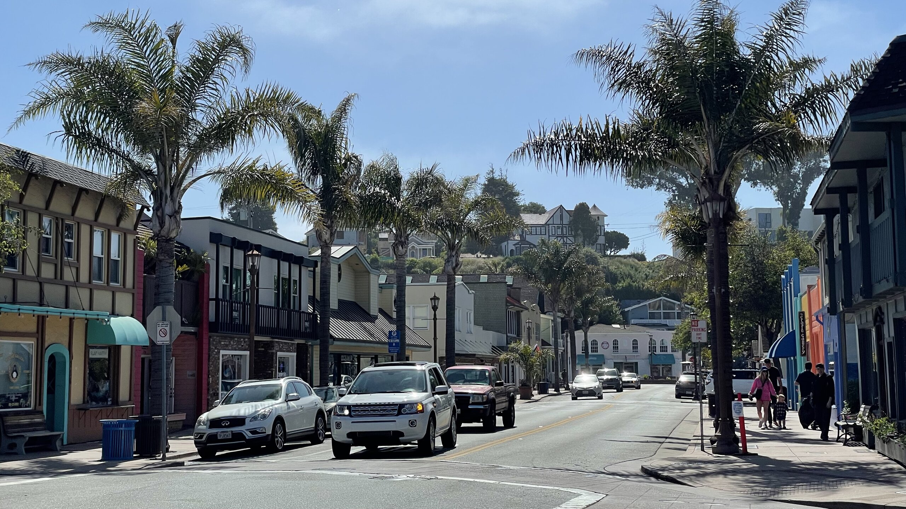

實習第一個月怎麼一下就過了 QQQQQQQ

## 💊 絕命毒師 Breaking Bad

下班回家腦子使不上力，最適合追劇。

於是歷經半年，總算是把這部號稱美國史上最偉大的電視劇看完了。

以下心得巨雷，未看慎入

大場面還是很精彩，最後 Walter 的死法也算是安排的得當，有符合我對這部分的期待。美中不足的可能是，他在第四季結束之後的轉變有點太巨大，前面安排了那麼多事件去慢慢形塑他的心境反而顯得...有點沒必要？

可以感覺有鑑於第四季收視表現不錯，然後第五季的期待被拉太高，編劇不得不安排一個大場面來作為大結局，但這個新的大反派在前四季從來沒有出現過，甚至在第五季的出場次數不多，跟 Walter 的交手也不夠多，導致這個突如其來的新反派反而顯的有點「不夠格」，私心覺得，如果是 Gus 來當這個最終的反派，和 Walter 正面交手，或許會更有張力。

製毒的出發點是為了在 Walter 離開之後讓他的家人在財務上沒有後顧之憂，然後到中後期才漸漸轉變成滿足他在這個過程所獲得的快感，就算說他最後也體認到這個微妙的變化，再怎麼說他所做的一切都還是為他的家人，不管是塞錢給 Flynn，還是回來把所有潛在的危險消除；然而在他回來後，Skyler 最終似乎還是沒有接受他，也沒有機會跟 Flynn 當面道別，和 Jesse 的夥伴關係也是在不明不白之中結束。

《絕命毒師》對我來說最悲劇的點，準確來說應該是 Walter White 的一切都是他的一廂情願，而他的一生也沒被任何人認同，甚至理解。

## 🫨 放假就是要出去玩ㄚ ᕕ ( ᐛ ) ᕗ

平常上班看了一個禮拜的螢幕，放假當然是要出去走走。

這個月在灣區跟也在這邊 Intern 的朋們去了好多地方：





<figcaption class="text-center">
  Los Gatos 有一條熱鬧的大街、好天氣、好喝的咖啡、好吃的冰淇淋、然後去公園裡坐<a href="https://maps.app.goo.gl/mmVrB8tTsc4Akoqi6" target="_blank" rel="noopener noreferrer">小火車</a>繞一圈
   
  Santa Cruz + Capitola 跟上面差不多，但把小火車換成可以衝浪的沙灘，再附贈一個<a href="https://maps.app.goo.gl/n4pbfG7k5Cp3cLys6" target="_blank" rel="noopener noreferrer">超大遊樂園</a>
</figcaption>





<figcaption class="text-center">
  Monterey Bay + Carmel By the Sea 大名鼎鼎 (?) 的 macOS 12
   
  也跟上面也差不多，但把沙灘換成水族館
</figcaption>





<figcaption class="text-center">Alcatraz Island + San Francisco：登上惡魔島參觀島上的監獄</figcaption>

 可以 360° 環視整個舊金山市區")

## 🧭 生活重心

總結我前面提到我這個月的生活，我的日子差不多就是：

- 週間
  - 上班
  - 下班回家
    - 追劇
    - 在網路上亂逛
    - 做些沒意義的事
- 禮拜六
  - 出去玩一天
  - 回家累到直接躺平
- 禮拜天
  - 睡到中午
  - 去咖啡廳隨便吃個早午餐
  - 坐在電腦前面覺得有好多重要的事要做，不知道該先做啥
  - 把那個好像有點重要的事情做個一半 (← 我現在在這)
  - 乾，晚餐要吃什麼
  - 回家洗衣服，回回訊息
  - 更多沒意義的事

然後日復一日...

這應該不是我第一次抱怨日子過的太快，但上班的日子真的是太快了，快到甚至有點恐怖，恐怖在於——時間消逝的令人難以意識，像在開一台煞車失靈的車，然後隱形的 G8 小精靈還會不斷的把油門踩的更深，唯一的解決方法只有把方向盤握的更緊，然後祈禱不要出車禍。

我以前很難想像人為什麼人會有中年危機，因為要我相信一個人會要到 50 歲的時候才發現自己一事無成，不知道人生的方向，甚至不知道自己喜歡或不喜歡什麼，唯一合理的解釋只能是這人腦子從來沒上線過。但有了最近的體悟，不知不覺的畢業，不知不覺的找到工作，然後不知不覺的過完一生，似乎也不全然是一件奇怪的事。

於是我就開始好奇：跟以前的實習有什麼不同，是什麼產生了這樣的差別？

目前歸納的答案是...缺乏新鮮感

之前在 Intel 的日子說長不長，但我還是在短短一個暑假的時間認識了不少人，也是我第一次開始建立和思考 "Career" [^2] 這個概念，工作之餘，下班時間跟實驗室的咪挺也一直有新的東西在推展，所以會明顯感受到那段時光特別充實。倒也不是說現在在 WeRide 就沒有，而是能經歷的我似乎差不多都經歷過了，所以如果在工作上沒辦法獲得成就感或新鮮感，那就只能期待下班或假日能安排點點別的事來滿足了吧。

[^2]: 通常中文翻做「職涯」，但私心覺得這個中文詞沒辦法體現英文 "Career" 中更深遠的寓意

## 🎯 本月目標回顧

大概 75% 完成 (?)

### 🟡 兩篇額外的文章

《[關於創業]()》寫完了，整理了一下為什麼我覺得人人都應該 (或至少考慮) 創業的一點想法。另外一篇是想寫我對未來正職工作還有職涯的想像，但是當初這個大方向又沒有好好的把範圍縮小，結果越寫想法越多，導致這篇文至今仍然是一坨漿糊，難以成形。

但這對於我今年下半年蠻重要的，所以下個月的目標還是會有這一條。

### ✅ 留言板

開張大吉！

當時在考慮留言板的時候，我主要關注的有幾個重點：

- 希望使用者可以在不用登入 (或是匿名) 的情況下留言
  - 以我自己來說，需要登入這件事會讓我想留言的意願降低很多
- 如果是第三方平台，那不可以拿我的留言去做別的事 (這就是為什麼我不想用 [Disqus](https://www.google.com/search?q=site%3Ahttps%3A%2F%2Fnews.ycombinator.com%2F+Disqus))

經過[層層的篩選](https://github.com/tomy0000000/blog/issues/19)，最後選定了 [Remark42](https://remark42.com/) 這個留言板系統。除了符合我上面提到的需求，這套系統還有蠻多其他優點：

- 是用 Golang 寫的，消耗的系統資源很少，流量不高的時候大概只佔用 20MB 左右的記憶體
- 底層資料庫使用的是 [bbolt](https://github.com/etcd-io/bbolt)，是一種類似於 SQLite 但更高效的檔案格式，備份復原也很簡單
- 安裝很簡單，Docker Compose + 一個 `.env` 設定檔就搞定了
- 支援很多其他的登入方式，總比沒有好
- 支援深色模式，也會在部落格切換模式的時候跟著一起切換 [^1]

我在設定的時候，原本想支援 Google + Facebook + Apple 三家的登入，應該可以涵蓋 95% 這個部落格受眾的使用習慣，但是 Facbook 把開發者條款改了，需要有商業認證才能申請接入他們的平台，然後 Apple 的登入則是 Remark 自己有一些小 bug 導致最後串不起來。所以即便我一開始不想支援 GitHub ~~這麼宅的~~登入，作為替代方案最後還是把他加上去了。

[^1]: 有人有發現這個部落格會自動偵測裝置的深色模式嗎 (?)

## 🎯 下個月的目標

1. 《What's on My Stack》：Dcard 網紅流行發 What's in My Room 文開箱自己的精緻套房，那理工宅男呢？當然就是寫一篇 What's on My Stack 開箱自己架的一堆工具和網站囉~
2. 上面提到的[另一篇文章](#-兩篇額外的文章)：趁著寫這篇報報的時候，稍微重新定位了一下這篇文章到底適合哪些內容，哪些可以拿掉。希望重新出發可以更好的把思緒整理一下。
3. 啟動找工作模式：雖然嘴上說好久了，但總是遲遲沒有動作，一方面是下班回家只想躺平，另一方面也是希望上面這篇可以先完成。(應該不會兩個最後都掰掰吧 QQQQ)

## 👻 那些我在 Reddit 上看到的酷酷貼文



> 人類無意識的把人生的困難度調的高到難以扶養小孩
>
> 從而降低了人口爆炸的風險

似乎挺有道理的 (?)，但如果這是真的，那這或許會是人類文明自工業革命以來最大的困境 🤔

---

寫完才想到忘記寫《腦筋急轉彎 2》的心得了，可是這篇文好像有點太長了，那就算了吧哈哈哈哈哈哈

留言板在最下面，歡迎大家來許願、敲碗、或銳評 (X

下一集沒意外應該會有更多遊記 (?)，那就 下個月見！
