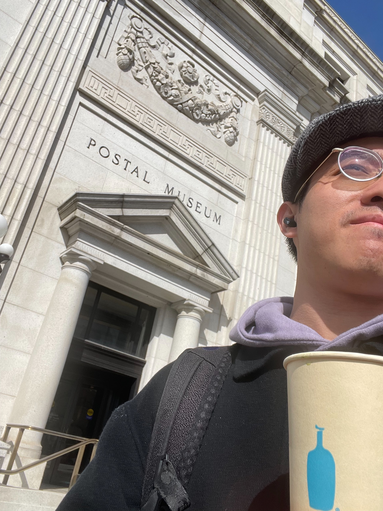
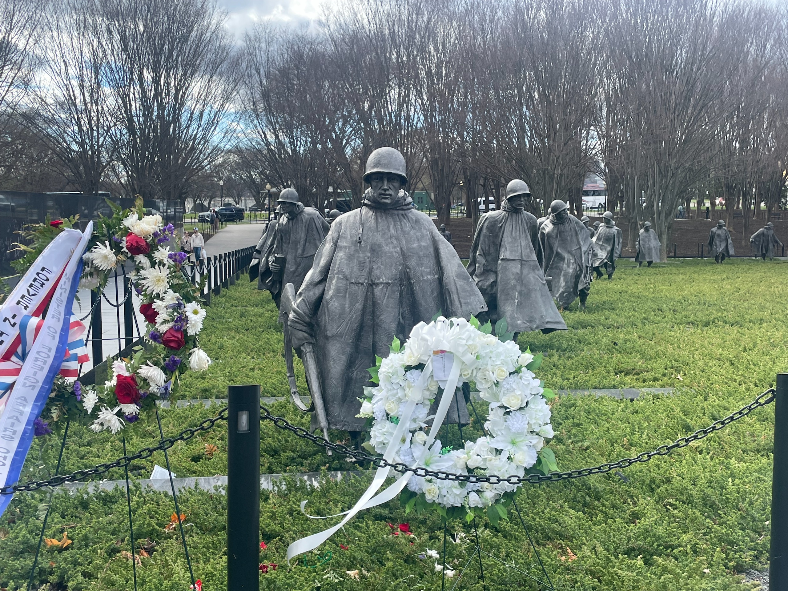
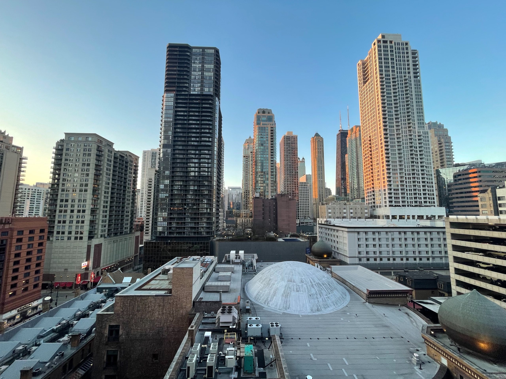
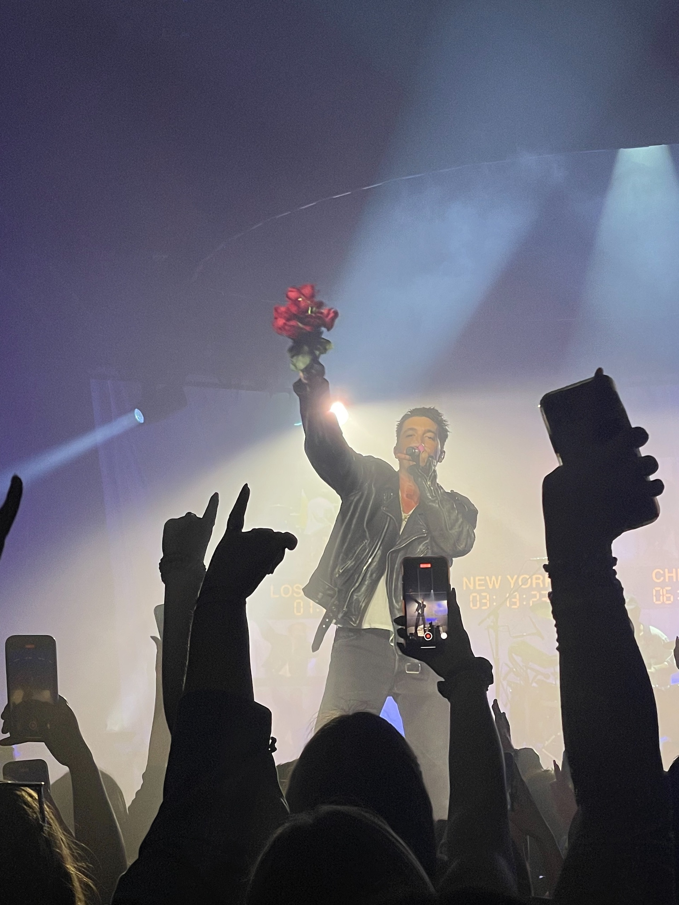
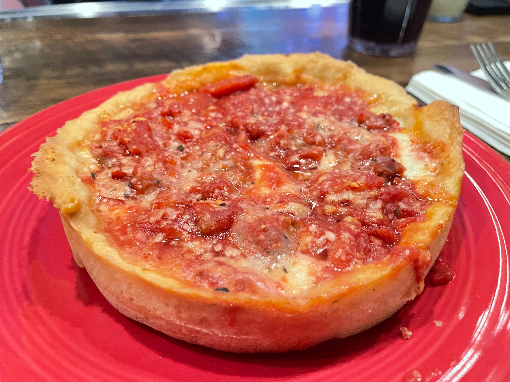

這個月除了春假去了華盛頓之外，月底又去了一趟芝加哥，結果 4 月初一回來就開始瘋狂還債，所以這篇文就又遲到了幾天 QQQ

但寫部落格是我現在生活的 tripwire，所以不能輕易妥協 😬[^1]

[^1]: 最近修的一堂課在教談判，談判學裡有兩道防線叫做 BATNA 跟 tripwire。BATNA 可以簡單想像成是底線，tripwire 則是底線的前哨，如果你發現自己被迫退守到 tripwire，就代表你可能要開始做最壞的打算，並且需要重新評估你的底線是否仍舊有效。

## 🇺🇸 Washington D.C.

照去年秋假的傳統，今年春假我們這群 MCDS + MSE 眷屬幫 (?) 一樣有安排出去玩，這次去的美國的首府——華盛頓 a.k.a. 哥倫比亞特區，簡稱 D.C.

這學期大家的課業都比較繁忙一點，幾乎是到出發前一兩個禮拜才開始訂行程，原本的計畫是飛過去，然後坐火車回來，但飛機還沒起飛，價格就先起飛了，於是最後決定直接租兩台車開過去。從匹茲堡開過去大概是 400 公里，4 小時左右。3 年多沒開車的我也在美國首度上路開了一段，希望沒有丟台灣人的臉 (?)

<figure>
    
    <figcaption class="text-center">散步冰咖啡漫步 D.C.</figcaption>
</figure>

這一趟原本最主要的目的是賞櫻花，可是我們的春假有點...太早了，到 D.C. 的時候只開了零星幾棵，沒有原本預期的大片河岸櫻花 QQQQ

沒有支線還是可以解一些主線任務啦，而 D.C. 的主線就是一拖拉庫的博物館、異國美食、還有首都公園裡的各種紀念堂、紀念館和雕像。

簡單來說，如果你不小心對美利堅歷史產生了某些重要的影響，那合眾國政府給你的款待就是可以從下面幾個選項中選一個你喜歡的禮物：

|      | 說明                                   | 誰選了這個                   |
| -------- | -------------------------------------- | ---------------------------- |
| 紀念碑   | 一座塔，附贈頂樓觀景台                 | 華盛頓                       |
| 紀念堂   | 通常是一座建築物，裡面講述你的豐功偉業 | 傑佛遜、林肯                 |
| 紀念園區 | 跟上面的功能差不多，只是是露天的       | 小羅斯福、金恩博士、愛因斯坦 |

有的還會多送一個雕像，尺寸跟本人的豐功偉業 (大致) 成正比。





<figcaption class="text-center">左：華盛頓紀念碑 右：林肯雕像，雖然是坐著的，但如果他站得起來，應該可以跟橫濱港的鋼彈打一架。</figcaption>

如果你不是政客，或是絕頂聰明，要能夠出現在這座公園裡面還有一個 (其實也沒有很) 簡單方式：

曾經參與下列戰爭，你可以享有：

- 韓戰：名字被刻在一面牆上
- 越戰：名字被寫在一本大冊子
- 二戰：跟另外 99 個人共享一顆牆上的金星

嗯果然生命的價值還是不完全平等的。

怎麼好像不小心寫了很多奇怪的東西？？？？？總之，如果你對美國歷史有興趣的話，相信 D.C. 會非常適合你。其他關於 D.C. 的實用小撇步都寫在這份[旅遊指南](https://docs.tomy.me/travel/cities/washington-dc)了，之後有機會造訪的話歡迎參考。

## 🇺🇸 Chicago

大概在出發前往 D.C. 的前幾天，趁著難得的假期，我開始翻今年暑假去實習的時候西岸有什麼演唱會可以去。結果西岸的沒找到，倒是意外發現 LANY 要來芝加哥巡迴，也剛好：

- 距離不會太遠，飛機單程大約 1 小時就會抵達
- 這學期的課都在星期一到三，如果三晚上就出發，星期天回來，最長可以去 5 天 4 夜
- 3 月底的那個禮拜剛好 <abbr title="Cloud Computing">CC</abbr> 沒有 Project 要做 [^2]

我簡單估了一下，大概 $300 鎂可以解決，似乎是挺不錯的，於是一個晚上就把行程全訂了 😛 [^3]

<figure>
    
    <figcaption class="text-center">關於芝加哥，LANY 的主唱 Paul 是這麼說的：</figcaption>
</figure>

> It's Everything you liked about New York
>
> Minus everything you don't liked about New York

具體來說就是：

- ✅ 各式高樓大廈與繁華的大都會
- ✅ 豐富、多元的文化
- ❌ 髒亂的街道和地鐵
- ❌ 暴躁的市民





<figcaption class="text-center">真的是乾淨到一度會懷疑這裡是不是美國：）</figcaption>

真的要說有什麼缺點，大概就是什麼都超貴，物價本身就很貴了，芝加哥的州稅加上城市稅高達 10.25% 真的是會有點吃不消。還記得我到的第一個晚上，去吃了芝加哥最知名的[深盤披薩](https://zh.wikipedia.org/wiki/%E8%8A%9D%E5%8A%A0%E5%93%A5%E6%8A%AB%E8%96%A9)。

我回旅館在電梯裡看著發票深深的嘆了一口氣，旁邊的德國人馬上舉起手上的啤酒說：「這也超貴」。

所以接下來幾天的行程，幾乎也都是去看些不用錢的景點，公園散個步，或是逛街之類的，反正我相信這不會是我最後一次來芝加哥，那些 fancy 的行程就留給以後發大財的我吧 (希望有這一天啦)

身為一個都市小孩，生活在這種大城市還是比較悠然自得一些，如果想體驗稍微美式一點的大都會，相信芝加哥會非常適合你。跟華盛頓一樣，芝加哥也有寫了一份[旅遊指南](https://docs.tomy.me/travel/cities/chicago)，有興趣的話歡迎自行移駕

[^2]: CC 全名 Cloud Computing，雲端運算，是我這學期修的一門課，通常一份作業 (Project) 會耗時兩週的工時
[^3]: 至於事後被這些美國垃圾 fees 擺了一道就是[另外一個故事](https://www.threads.net/@tomy0000000/post/C4CLIUNLgHH)了

### 🌈 彩蛋

芝加哥之旅的最後一個彩蛋，是跟失散多年沒見面的國小、國中同學相遇、一起去吃早午餐。聊著在學校的種種往事，還有各自如何走到現在這一步，就好像親自演出了一場蒙太奇電影。

生命中會有許多來來去去的過客，有時會心繫著某些關係，同時讓另一些悄悄逝去，但緣分有時也會以意想不到的方式再回來，我想這也是我喜歡旅遊的很大原因之一——不經意的相遇，總是超出期待。

而我也會期待下一次的再相遇。

## 🎯 本月目標回顧

這個月花了很多時間在旅遊，出去玩前要先~~拆炸彈~~把作業寫完，回來又要還債，所以行程變得相對不穩定許多，目標執行起來也難了一點，可見我之前對 Mini-4 的時間安排還是太樂觀了 🤔

原本以為只有星期一到三有課，四五六日有整天可以運用會做很多事，結果事實證明：

1. 星期四五大部分最後變成用來補足一三失去的睡眠
2. 時間太多反而因為排列組合的選項太多，最後難以安排
3. 一看到大塊時間就想塞一堆事做，但實務上還是有極限，勸未來的我還是放棄這種不可取的妄想比較實際：）

### 🟡 一週一文

寫了一篇——[也許我永遠不會退休]()，然後就被 Mini-4 新學期的課表打亂了。

Lecture Day 還在，只是不像之前一樣是固定在禮拜四，而是我每個週末事先把下禮拜的行程排好才會有。這個月有嘗試想寫英文的 Blog，只是寫起來對現在的我來說還是太費時，所以這篇文目前只完成了 80% 左右 QQQQ

### 🟡 多拍些照片

原本上個月訂這個目標的時候，其實想解決的是，我會因為平常生活的乏味，而失去拍照紀錄生活的動力。即便這個月確實是拍了不少照片，但多的是來自出去玩拍的照片，好像沒有很好的解決原本的問題 🤔

之前跟 HW 在吃飯的時候就有聊到，大家好像都會「因為有一台好相機/手機」，而突然對拍照產生興趣。相對的，當手機的畫質開始下降，自然就會失去許多拍照的動力。我在芝加哥就有好幾次想拍夜景，但手機拿起來之後怎麼調都調不出想要的效果，最後乾脆快門不按就把手機收回口袋了。

我以前認為，之所以會覺得手機的畫質變差，是因為新的機型出來，產生了比較心態，自然就會相對的覺得自己的手機畫質變差。但最近的新想法是：手機本來就會有自然損耗，鏡頭用久了就是會磨損、會入塵，即便沒有比較的對象，使用了三五年拍出來的照片本來就會有點霧霧的，或是有光暈。

好啦，說這麼多就是想換手機而已，扯這麼多 ¯\\_(ツ)\_/¯

### 🟡 一週一料理

同樣爆了。

我現在有幾套固定的快速料理選項，所以當我現在有其他迫在眉睫的代辦事項，就會更 prefer 隨便煮煮隨便吃，而不去嘗試更多其他新的料理。

我在料理似乎總是缺乏動力，又缺乏想法。加上對吃又不怎麼講究，情勢可以說是雪上加霜，真是有點不知道該怎麼繼續進展，唉

## 🎯 下個月的目標

最近有種心有餘而力不足的感覺......也許是不重要的雜事 (比方說學校的各種作業) 變多了，也可能是重要的事差不多吿一個段落之後，大腦和身體就自然的鬆懈下來了吧。

再下個月會有蠻多重要的事，這個月的目標就是——沒有目標，去耍廢。

啥也不是，散會！
