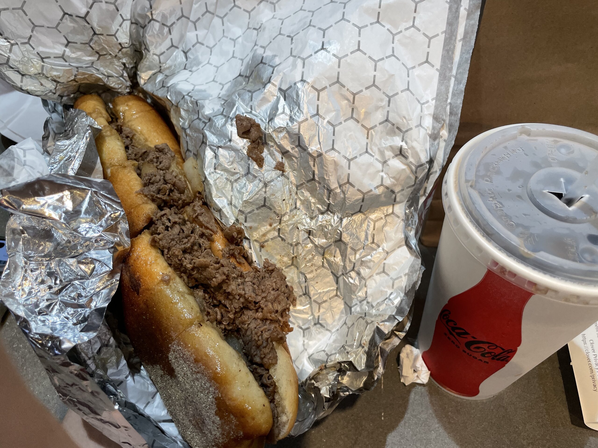
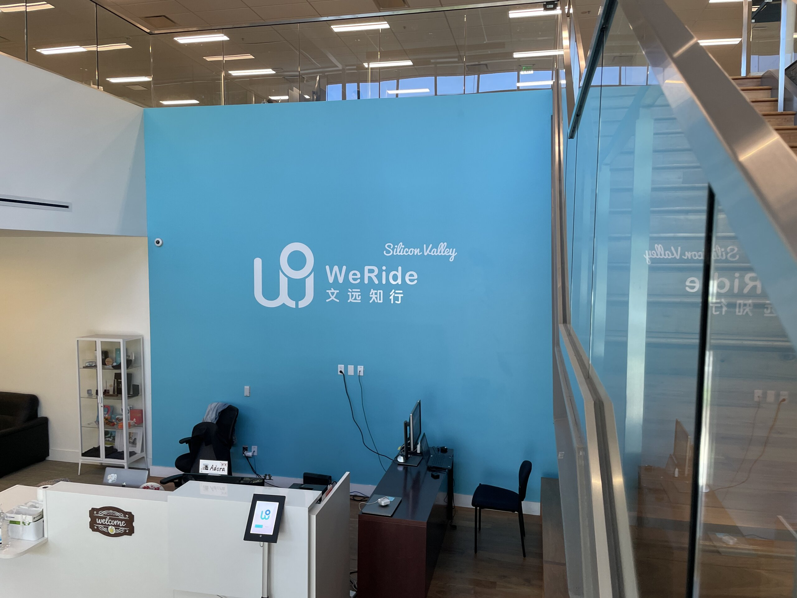

這個月前半段算是躺的挺平的，但還好寫這篇文的當下算是有找回一點生活的動力 😗

## 🇺🇸 Philly

此 Philly 非彼菲力 (x)

靠近學期尾聲的時候，我們幾個 MSE 的同學突然想在大家離開匹茲堡之前找個地方一起去玩。但是日期有點太靠近了，所以不管要飛哪裡都不會太便宜，所以僅存的選項大概就是開車或是坐火車到的了的地方。於是篩一篩之後，發現 Philly 是少數大部分人沒去過，但又稍微不那麼無聊的城市。

Philadelphia 簡稱 Philly，中文俗稱費城，但我更喜歡把他比喻為美國台中，主要有兩個原因。如果把台灣投影在美國的東北走廊 (Northeast Corridor)，費城就會落在 (差不多) 台中的位置：

Mw>)")

另外一個原因：費城的也是美國著名的慶記 & 毒品之都，[YouTube](https://www.youtube.com/results?search_query=philadelphia+street) 上有很多街頭訪問的影片。但那是比較靠北邊市郊的區域，跟我們去市中心和觀光景點的樣子差很多。所以其實也沒什麼好擔心的。

我在逛 Philly 的美術館的時候看到一個托特包，上面寫著：

> 費城觀光行程：
>
> - [ ] 吃東西
> - [ ] 逛美術館
> - [ ] 吃更多東西

嗯，跟我們實際的行程差不多。更確切的來說，跟我去每一個美國城市的行程都差不多。但我想某種程度上來說，也許每個國家的每個城市也許都會有類似的問題吧，所以好像也沒什麼好抱怨的。還是可以來介紹一些 Philly 獨有的東西。

### 🧀🥩 Cheesesteak

是一個名字有很多 e 還有很多 s 的食物 (←這什麼廢到笑的介紹

### 🔔 Liberty Bell

上次去了美國首府，但其實美國建國的《獨立宣言》和《美國憲法》都是在費城簽署的，具體來說是在費城的舊州議會廳，也就是現在的美國獨立紀念館，但是進去要排超久的隊和超貴的門票，所以我們只去了對面的自由鐘紀念館。



反正就是一個鐘，以前會敲他來召集議員開會，二戰之後，各大美國民權運動中，經常會把以它作為一種精神象徵，也形塑出一種自由平等的意象，於是就被保存到現在了。

## 🐍 PyCon US 2024 🇺🇸

回匹茲堡休假一個禮拜之後，緊接的是 PyCon US 2024。PyCon 是 Python 程式語言的年度聚會，很多國家也都有舉辦，我之前也有參加過台灣和德國的。各國家的 PyCon 都是由一群使用者自發舉辦，美國的則是由 <abbr title="Python Software Foundation">PSF</abbr> 舉辦，大部分最先進的功能和 module 幾乎都會在美國發布。詳細的心得就放在另一篇[心得文]()啦

## 🚙 我們騎！

上禮拜飛來 San Jose，然後這禮拜二正式入職開始我的實習了！公司是一家做自駕車的中國新創，叫做 WeRide，[地里](https://www.1point3acres.com/)俗稱我們騎[^1]。

但其實我對自駕車一竅不通，我做的是比較偏 Infra / DevOps 相關的。會不會有心得文，就看我 8 月底離職的時候忙不忙吧，一切隨緣 ¯\\\_(ツ)\_/¯

[^1]: 懂嗎？WeRide 我們騎.......

## 🎯 本月目標回顧 / 👔 社交反思

上個月只訂了一個目標：Making *Meaningful* Connections，算是有點打了一個模糊仗，因為什麼算 Meaningful 其實很難區別，即便這個月都已經過完了，要我說什麼叫做 meaningful 似乎也有點說不上來。

但我在 PyCon 其中一天午餐有一段對話我覺得挺有意思的，值得記錄一下。他的名字叫 Fabio，幾年前從義大利舉家搬到美國德州工作，我問他覺得美國跟義大利最不一樣的地方是什麼？也許是因為他是來自熱情洋溢的地中海[^2]，他說他覺得在美國的 connection 都很表面 (shallow)；大家可以輕鬆的搭上幾句話，聊的像多年沒見的好友，但卻不容易深交，雙方交換聯絡方式，有空會出來喝一杯或 hangout 的狀況並不常見。大家見面的時候會有一套 SOP，一些聊天的話題，來快速認識一個人，然後聊不來就趕快找個空檔換下一個人。如果以感情世界的概念來套用，或許可以稱作「速食友情」？

但我又想到之前無意間滑到的一篇貼文：

> 小時候，
>
> 我們會在某個公園遇到一輩子最好的玩伴，
>
> 然後再也不見

所以我又何嘗不是忘了我曾經有這樣的能力而已？

再回到這個月的目標，我有成功建立 *meaningful* connection 嗎？我不知道。

但或許人與人之間的關係本就該順其自然的過就好，大家都是出來玩的，認真就輸了。

[^2]: 希望這個刻板印象不會太歧視 (x

## 🎯 下個月的目標

1. **寫兩篇額外的文章**：有兩篇的主題已經想好很久了，但是遲遲沒有時間寫，現在下班無聊應該可以來好好整理一下想法。
2. **幫這個 Blog 加留言板**：這個也是想很久了，在一開始構想這個 Blog 的時候，應該是上線第一天就要有。只是我有一堆莫名其妙的堅持，導致明明三分鐘就可以搞定的東西拖了超過一年還沒出現。希望我可以趕快把他弄上來，~~這樣現在在讀這篇廢文的你們就可以在下面無的放屎~~

---

好咧！下個月見！
