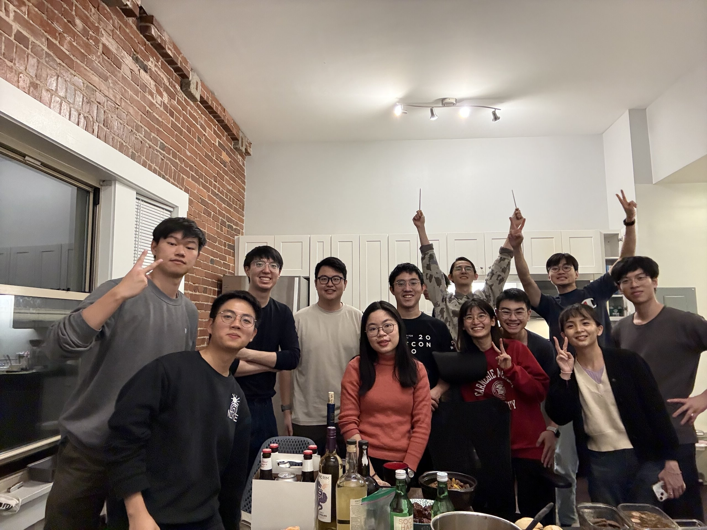

這個月又大遲到ㄌ QQQQ

為什麼會大遲到，下面再說哈哈哈哈

## 🦃 感恩節

美國感恩節的經典三件套：

- 出去玩
- 感恩節當天吃大餐感恩我們所擁有的一切
- 然後在隔天的黑色星期五去血拼來滿足還沒擁有的部分 ¯\\\_(ツ)\_/¯ [^2]

出去玩的部分就是一行人租車開了一個小時，去參觀知名的[落水山莊](https://zh.wikipedia.org/zh-tw/%E8%90%BD%E6%B0%B4%E5%B1%B1%E8%8E%8A)。

即便我對建築是有點興趣，但整個逛完覺得好像...就跟網路上的照片差不多...?

事後回想的時候甚至覺得，這棟建築的存在本身就是處處衝突。

建築師的觀點是他們沒有改變河道，是一棟與自然共存的建物。（但你有沒有不考慮蓋在河邊就好：））））？）而且我怎麼想都覺得是——一個當代的匹茲堡富豪把城市工業化到嚴重污染，不見天日，然後再跑去森林裡蓋一棟度假山莊享受一般人沒有的新鮮空氣，這棟富豪每年放假來住個幾天的房子，可能還比在他底下的工人每天住的房子還大上許多，舒服不少。更不用提要不是這些有錢人出資保存這棟建築、還有支付申請和研究所需的經費，不然一棟別墅為什麼會沒事被收錄進世界遺產。最後，從當代的觀點這棟建築的代表性、重要性、和特色似乎難以合理化它高昂的維護成本......

但有個名堂可以跟大家一起出來玩還是很開心~

總之如果剛好造訪匹茲堡，有車，可以順路開去看看。但如果要專程拜訪，我是覺得大可不必。

血拼的話，匹茲堡周遭的 outlet 去年都逛過了，所以我們同一行人租了車去了比較遠的 Grove City Outlet。今年本來是計劃想買個太陽眼鏡或是耳機，但是今年換了電腦又換了手機，手頭的美金已經快見底了，再加上這些東西完全是急迫性 0 的東西，所以全部都暫緩了。只買了一些本來就該買但拖了很久沒買的衣服。

[^2]: [r/Showerthoughts on Reddit](https://www.reddit.com/r/Showerthoughts/comments/1gzlmrh/here_in_the_usa_a_national_day_of_giving_thanks/)

## 🔚 結束找工作

我在 9 月開學過後沒多久就有收到暑假在 WeRide 實習的 Return Offer 了，但[我不喜歡灣區]()，也不覺得這是我接下來會想要久待的地方，所以還是有繼續在投一些東岸的職缺，LeetCode 還是照樣有在寫每日一題。

但可能是力道相對減弱了不少，所以也沒什太大的進展就是了。直到這個月才收到了第一份比較正式的面試：

<blockquote class="text-post-media" data-text-post-permalink="https://www.threads.net/@tomy0000000/post/DCQribOOAZr" data-text-post-version="0" id="ig-tp-DCQribOOAZr" style=" background:#FFF; border-width: 1px; border-style: solid; border-color: #00000026; border-radius: 16px; max-width:540px; margin: 1px; min-width:270px; padding:0; width:99.375%; width:-webkit-calc(100% - 2px); width:calc(100% - 2px);"> <a href="https://www.threads.net/@tomy0000000/post/DCQribOOAZr" style=" background:#FFFFFF; line-height:0; padding:0 0; text-align:center; text-decoration:none; width:100%; font-family: -apple-system, BlinkMacSystemFont, sans-serif;" target="_blank"> 

 <svg aria-label="Threads" height="32px" role="img" viewBox="0 0 192 192" width="32px" xmlns="http://www.w3.org/2000/svg"> <path d="M141.537 88.9883C140.71 88.5919 139.87 88.2104 139.019 87.8451C137.537 60.5382 122.616 44.905 97.5619 44.745C97.4484 44.7443 97.3355 44.7443 97.222 44.7443C82.2364 44.7443 69.7731 51.1409 62.102 62.7807L75.881 72.2328C81.6116 63.5383 90.6052 61.6848 97.2286 61.6848C97.3051 61.6848 97.3819 61.6848 97.4576 61.6855C105.707 61.7381 111.932 64.1366 115.961 68.814C118.893 72.2193 120.854 76.925 121.825 82.8638C114.511 81.6207 106.601 81.2385 98.145 81.7233C74.3247 83.0954 59.0111 96.9879 60.0396 116.292C60.5615 126.084 65.4397 134.508 73.775 140.011C80.8224 144.663 89.899 146.938 99.3323 146.423C111.79 145.74 121.563 140.987 128.381 132.296C133.559 125.696 136.834 117.143 138.28 106.366C144.217 109.949 148.617 114.664 151.047 120.332C155.179 129.967 155.42 145.8 142.501 158.708C131.182 170.016 117.576 174.908 97.0135 175.059C74.2042 174.89 56.9538 167.575 45.7381 153.317C35.2355 139.966 29.8077 120.682 29.6052 96C29.8077 71.3178 35.2355 52.0336 45.7381 38.6827C56.9538 24.4249 74.2039 17.11 97.0132 16.9405C119.988 17.1113 137.539 24.4614 149.184 38.788C154.894 45.8136 159.199 54.6488 162.037 64.9503L178.184 60.6422C174.744 47.9622 169.331 37.0357 161.965 27.974C147.036 9.60668 125.202 0.195148 97.0695 0H96.9569C68.8816 0.19447 47.2921 9.6418 32.7883 28.0793C19.8819 44.4864 13.2244 67.3157 13.0007 95.9325L13 96L13.0007 96.0675C13.2244 124.684 19.8819 147.514 32.7883 163.921C47.2921 182.358 68.8816 191.806 96.9569 192H97.0695C122.03 191.827 139.624 185.292 154.118 170.811C173.081 151.866 172.51 128.119 166.26 113.541C161.776 103.087 153.227 94.5962 141.537 88.9883ZM98.4405 129.507C88.0005 130.095 77.1544 125.409 76.6196 115.372C76.2232 107.93 81.9158 99.626 99.0812 98.6368C101.047 98.5234 102.976 98.468 104.871 98.468C111.106 98.468 116.939 99.0737 122.242 100.233C120.264 124.935 108.662 128.946 98.4405 129.507Z" /></svg>

 View on Threads

</a></blockquote>

嗯。於是我的找工作之旅就在學校的 Meditation room 裡吃完一桶冰淇淋度過了。

面試簽了 NDA 就不太好寫，剩下的能寫的應該也是挺無聊的，如果有興趣的話私下來約我聊吧。

雖然原本的計劃是大哭一場，但真的去了好像也沒有想像中難過，倒是有一種...豁然開朗的感覺（？）現在回想覺得差別應該是，我先預設了這會是今年找工作的盡頭[^1]，所以不管有沒有上，反正就是結束了，就像考完試結果好與壞是一回事，但考的好的跟考不好的，考完試一定都是先去玩個盡興。

感覺有點像我的生活在面試前是一個「被卡著」的狀態，理性的部分像是因為還不確定明年會搬去哪，所以沒辦法訂明年回美國的機票、找房子。不理性的部分就是會覺得自己應該把時間拿來做重要的事，所以不想煮飯餐餐外食、沒空折洗完的襪子所以隨便散在房間地上、或是把該記的帳繼續囤積在信箱收件夾裡，然後實際上只是把時間拿去滑更多的 Threads 和看無聊的 YouTube 影片。

總之就是，一切的結束了，我的心態現在已經調整好要 move on 到下一個階段了，也就是說我可以 100% 專注在

- 寫 Database 的作業
- 做 Practicum
- 過好生活
- ~~滑更多的 Threads~~

最重要的是，下個月就要畢業離開匹茲堡了，但是關於怎麼搬家一點頭緒都沒有（頭痛撞牆

[^1]: 其實這個預設也沒什麼根據，而且統計上來說，我的第六感從沒準過，所以接下來會怎樣也很難說。

## 🎯 本月目標回顧

### ⚠️ 找一天週末騎 PBSC 去動物園玩一天

上個月說排好了一天要來做這件事，結果那天早上起床，我看著手機寫著匹茲堡室外體感零下 6 度，再看看窗外的暴雪，再看看我溫暖的被窩，決定躺回去 😂😂

快轉到 12/1，我坐在星巴克寫這篇報報的時候發現這個月也跳太多票了，決定馬上出發，吃完晚餐去看動物園晚上的燈節。

 只是人少了很多，所以可以輕鬆拍到完整沒有被擋住的燈 👍🏻")

好啦所以，動物園去了，腳踏車沒騎到，就算勉強達成一半好了 xD

### ❌ 多寫一篇文章

寫給回台灣的我：加油！你一定行 (X)

### ❌ 認真結算一下來美國至今燒了多少錢

下個月的我：你一定行

## 🎯 下個月的目標

1. 早點睡：這學期的課表太過放縱，每天都睡 5 點到 12 點，有點失控
2. 離開匹茲堡前再多探索一下這座城市
3. 認真結算一下來美國至今燒了多少錢

## 🎬 下集預告

這個月的報報好像有點無聊，光寫作業找工作就佔據我這個月的好大一部分，要不是後面有感恩節，還真是不知道這篇還能寫啥 QQQQQQQ

但下個月就要畢業了！

畢業搬家完會去紐約過聖誕節和跨年，沒意外應該會有一篇紐約遊記。

跨完年會從紐約直接回台灣，從 1/3 一路待到 2/7 過完年！我應該之後會陸續抓 (?) 人出來吃飯，等不及的也可以私訊我ㄌ🫶🏻
