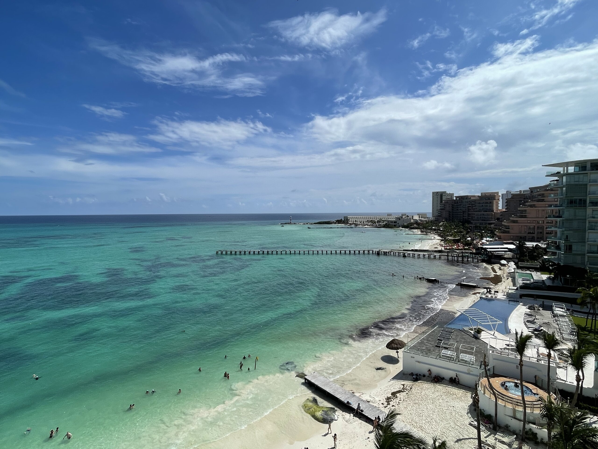

## 🎃 萬聖節

🎃 萬聖節快樂！

上個月訂了一個「體驗一下美國萬聖節」的目標，一方面是去年沒參加很想體驗，另一方面主要還是想把自己從平常繁忙的工作中抽離。寫下來的時候大概就有點預料到八成會捨本逐末，實際上又更複雜一點 （？

其實我對於萬聖節的裝扮還挺有想法的，最大的問題應該是，大部分的想法都需要投入一點時間去準備，不是那種去 Spirit Halloween 就可以買到的現成的裝扮。[^1] 但我什麼不缺，就最缺時間，特別是放了一個 Fall Break 回來之後，各種工作全部都一起來，根本沒時間搞這些。

於是我在萬聖節前一個禮拜的的某一天，趕作業死線之餘，把 idea 清單打開來、找到最簡單的選項——三角錐帽、打開 Amazon 下訂，然後把下半身的裝扮留到萬聖節前幾天再說，結果真的到萬聖節的時候，這個問題還是沒有解決 🙃

")

今年去的是學校的 GSA —— 學校的研究生學生會舉辦的萬聖節晚會。到去之前都還是有點猶豫，~~原因~~理由很多：

- 作業寫不完
- 專題有點寫不完
- ...很多亂七八糟但不能不做的雜事還沒做 (像是寫這篇文)
- 有個同學剛好沒買到票，票剛好可以捐給他
- 第六感告訴我這活動體驗值應該不高，硬要去好像有點為「參加而參加」

後來想了想還是還是去了。想說這學期都很少能遇到 MSE 的同學，這可能是近期少數有機會見到所有人的機會，就當作是去跟大家敘敘舊順便更新一下近況。

實際上去了也不出我所料，就是...還真的是沒有很好玩...。見到大家還是很開心，只是確實就跟我預期的差不多，就是大家來喝杯酒、聊個天，沒有太多萬聖節主題的活動，而且整個活動的會場還是籠罩著一種課業、找工作、生存的高壓。[^2]

這樣說起來，來看到大家沒有過的太好似乎反而有安慰到我一點 (?)

果然在大學裡當研究生 (特別是一堆國際生混在一起的研究生) 本來就不會有太多生活體驗。要體驗的話，還是離開之後去哪會更有機會吧。

[^1]: 沒有要臭，真的：）
[^2]: 也是有可能只是我自己在亂想

## 🇲🇽 Cancún

Cancún (坎昆) 位於[墨西哥猶加敦半島的東北邊](https://maps.app.goo.gl/5X9iygMxyRrVjzFY8)，是美洲著名的渡假勝地，以功能上來說，跟亞洲的幾個熱帶度假小島，像是峇里島、普吉島、宿霧差不多，反正就是一個沙灘、風光明媚、行程耍廢居多的觀光地。

我們這趟五天四夜，因為人太大一票了，所以每個人行程都有點不一樣，我的行程大概是：

- 搭船去了附近的 [<abbr title="女人島">Isla Mujeres</abbr>](https://maps.app.goo.gl/YbuYxPDDmNffmvyD7) 浮潛看[海底遺跡](https://maps.app.goo.gl/nAh7VLvMGcAzDztW8)
- 去一個叫 [Xplor](https://maps.app.goo.gl/sJkmxqbtW7DKCWQYA) 的主題樂園，票價不高但體驗值挺高的，私心覺得不會輸給環球影城或迪士尼樂園
- 剩下的時間在我們住的全包式度假村[^3]裡當一坨會呼吸的肉

這裡也是瑪雅文明的發源地，世界七大奇景之一的[瑪雅金字塔](https://maps.app.goo.gl/w229stnd23kBLQmc7)距離觀光熱區大概單程 3 個小時的車程。但是這一趟行程已經太多了，就留到以後有錢再來住更高級度假村的時候再說吧！

[^3]: 就是包三餐、包酒水、包住、包活動什麼都不用額外付費的度假村

## 📱 iPhone 16 Pro

發現我在大家印象裡好像是個會每年新 iPhone 發表就會換手機的人，特此澄清：我的上一支是 iPhone 12 Pro。

去年暑假剛來美國的時候就開始感覺舊手機快不行了，當時在舊金山附近玩的時候瘋狂發燙、耗電量超大，不到半天就快沒電，於是就發下豪語：如果當年發表的 iPhone 15 改 Type-C 接口，就換手機。

事後 iPhone 15 發表還真的換上了 Type-C，結果是我食言了，沒換 XDDDDDD

第一個原因是，事後證明暑假的時候手機會中邪只是因為當時中華電信的 SIM 卡連不到美國的網路訊號，天線瘋狂運轉就會耗電又發燙，在那之後它~~可能時差調好了~~活的挺好的，沒太多其他毛病。第二個原因是，美金太貴了，去年 9 月剛好站上 32 塊的新高，在還有房租跟學費的前提下，真的是奇摩子有點不太好，又吃不消 [^4]。

於是又拖到了今年，看完發表會的心得老樣子——沒啥心得。平心而論，我覺得蘋果每年還是投入了非常多的心力在開發很多神奇的新功能，但看著我手上的手機也活的好好的，好像又很難去合理化花 3 萬多換一支手機的必要性。最終我又決定把另外一個條件與換手機掛勾：[Apple Card](https://www.apple.com/apple-card/) 如果辦下來的話，就換。雖然說美國市面上有更多更好用的信用卡，但拿到一張刻上蘋果和高盛 Logo 的實體鈦金屬卡還是挺能充值信仰的。

於是辦下來之後，第一筆就拿去刷了這支新 iPhone 16 Pro。

既然都換了，就還是來速評一下 iPhone 12 Pro 以來的新功能：

- Action Button：用來取代原本的靜音開關，設定頁面的動畫非常有質感，但在我認真思考放什麼功能最實用之後，還是把它設回了靜音開關。也許之後認真想一下 Shortcut 能搭配什麼功能會有更有意思的設定，但那也是改天的事了。
- 新螢幕
  - 大小：這塊新的螢幕比原本的大了 0.2″，具體來說就是邊界變的更窄了，但主觀上很難察覺，我自己意識到這個變化是因為我躺在床上握手機的手勢經常會在邊緣造成誤觸，所以這個改動對我來說還真是挺傷腦筋的。
  - 更新率：這塊螢幕的更新率是 ProMotion 的 120Hz，拿來滑脆上的廢文特別舒服、絲滑，就是棒 👍🏻
  - Always-On：就是螢幕即使在待機狀態也不會完全關閉。這功能做在手錶上比較好理解，手機的話，除了分散工作時的注意力，我想不出來這個實際的用途會是什麼。大概等到我哪天看不順眼就會去把這功能關掉了吧 ¯\\\_(ツ)\_/¯
- 動態島：當年被嘴到不行的功能，但我私心非常喜歡。一方面這功能堪稱是人機互動工程中教科書等級的最佳示範[^5]。而且再怎麼說，點它的時候還會跟著呼吸放大縮小一下，有時還會觸發 Haptic 震動，簡直就像手機頭頂上有一塊虛擬果凍，沒事無聊的時候去戳個幾下心情都好了 ☺️
- 相機：多了好多我看不懂的功能，害的我開始思考畢業禮物買相機還合適嗎
- Apple Intelligence：進化版的 Siri，觸發的時候螢幕邊緣會變彩色的，這動畫實際上看起來比看發表會影片還要炫砲，但用起來還是跟之前差不多鳥。本來以為可以完全取代 ChatGPT，但每次我問什麼他都只會幫我 Google，我到底要你幹嘛 🙃
- 車禍偵測、衛星通訊：理論上現在有，但希望用不到：）

奇怪怎麼莫名其妙寫這麼多

Anyway 總結就是：手機發展到現在這個階段，本來就已經很難再有劃時代的新功能推出，但作為一個每天都會大量使用的日常物件，各方面的升級加總起來還是挺有感的，甚至說這些小細節的修飾提升了部分的生活品質也不為過。

[^4]: 結果今年還是差不多，顯然這個因素根本不值得考慮：）
[^5]: 這句話的前提是一個工程師笑話：It's feature not a bug。就是當有人跑來找工程師說有什麼東西壞了的時候，工程師經常會說這沒壞，這其實是一個功能：）而在這個案例，蘋果在沒辦法隱藏鏡頭和感測器的前提下，確實開發出了一個妥善運用這個黑色區塊的功能。

## 🎯 本月目標回顧

- ✅ 體驗一下熱鬧的美國萬聖節：如上，有點捨本逐末，但算是有吧...
- ❌ 把現在在看的書看完：除了去 Cancún 的時候在泳池邊看了 1/3，回來忙之後就沒什麼進度了 QQQQ
- ❌ 找一天週末騎 PBSC 去動物園玩一天：同上，太忙了沒空 QQQQQQQ

## 🎯 下個月的目標

1. 找一天週末騎 PBSC 去動物園玩一天：為了展現我的決心，我已經訂好日期了 (X
2. 多寫一篇文章：現在在 Backlog 裡寫一半的文章有點太多了，挑一篇把它好好寫完
3. 認真結算一下來美國至今燒了多少錢：預計應該是非常恐怖，但潘朵拉的盒子還是要開 (?

## 👻 那些我在 Reddit 上看到的酷酷貼文



> 當你抬頭看向天上的星星時，說不定正在跟那顆星球上某個也在仰望星空的外星人四目相視呢！

Well 技術上來說可能是幾百萬年前的外星人，但總之 (咳咳)

下個月應該會經歷許多在未來回頭看，可能是我人生中蠻重要的時刻，各方面都是。

🪐📡 要相信宇宙電波的力量 ⚡️✨

下個月見！
