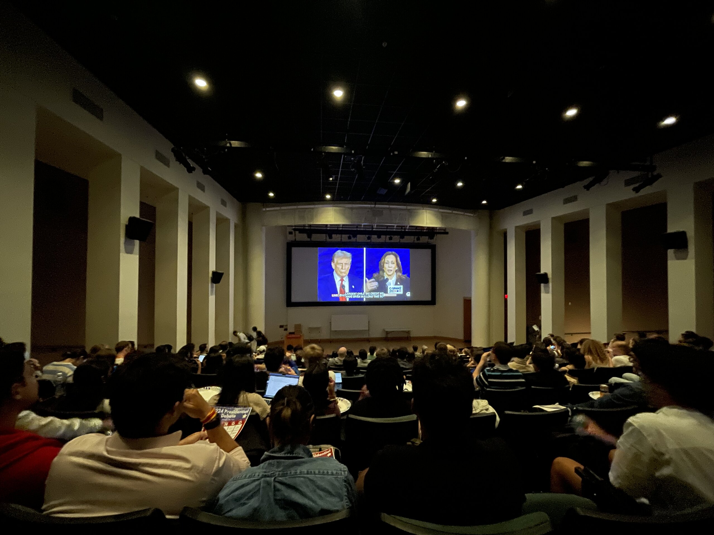
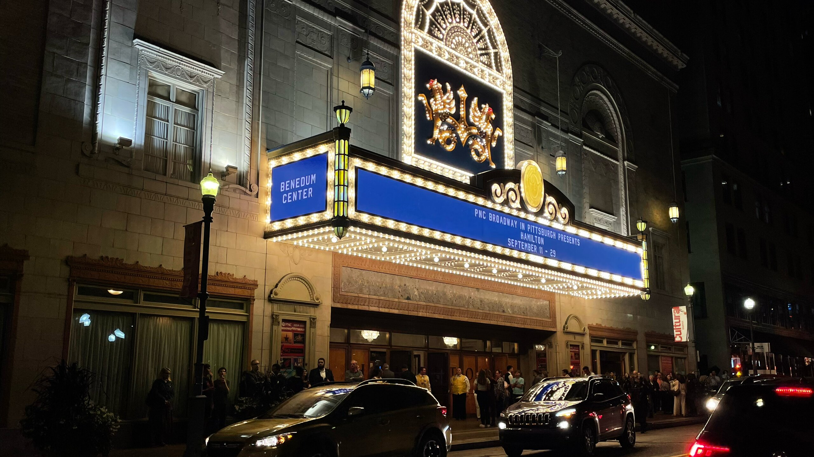

上個月到月中才寫報報，本來還有點擔心這個月能寫的東西似乎不多，沒想到居然還是擠出了這麼多東西 XD

8 月回來重新體會到身為 CMU 的學生是一件多忙的事之後，只好拼命幫自己安排休閒娛樂 (X)。畢竟休息的時間如果沒有空下來，就會被其他課業和工作佔住 ¯\\\_(ツ)\_/¯

## 🗣️ 總統辯論會

美國總統選舉即將在今年 11 月登場，因此 9 月舉辦了一場電視辯論會，於是 CMU 的學生會訂了一堆披薩，在 McConomy Auditorium 轉播這場辯論會，讓大家一起來共襄盛舉~~目睹民主這場鬧劇~~。

在這邊幫沒看什麼新聞的人快速前情提要一下：

- 川普 7 月在賓州的戶外造勢遭到狙擊，本人沒有什麼大礙。[^1] 但他的競爭對手拜登，雖然不在場，卻在一週後應聲倒下[^2]，宣布退選。
- 現任總統賀錦麗隨即接替拜登參選，雖然不是所有民主黨的大佬都支持，但仍然為選舉注入了不少活水
- 川普跟賀錦麗其實從來沒有見過面，私底下也沒有，這場辯論會是兩位候選人首次見面，也是首次正面同台交鋒

你可能會想像這是一個無聊的場合，但其實完全相反 XDDD

首先，有披薩，這應該不用解釋。

再來，學生會在大家入場的時候發了這個：



而且每當川普又口出狂言的時候，大家就會笑個不停，特別是其中一段他講了一長串的故事，然後主持人接話的時候，一派正經的補充說明 fact-check 過這個故事不是真的，全場笑到不行 😂

與其說是來看辯論會，其實更像在看 Stand-up Comedy (?) 不知道投票當天會不會有開票直播大會，有點期待哈哈哈哈

[^1]: Fun fact: 事件發生的地點在 Butler，距離我學校 CMU 只要不到一個小時的車程
[^2]: 他 (物理上) 沒倒下，特此澄清

## 🎻 CMU Philharmonic





<figcaption class="text-center">這次的公演舉辦在將士紀念館，適逢 911 紀念日，廣場的路燈掛滿了狗牌，每一面都代表了在 911 當天喪生的人</figcaption>

CMU 音樂學院的開學公演！

有表演一些貝多芬的經典曲目，還有一些是由本地的作曲家新譜出來的曲子，說實在我也不是很懂，但秉持著一貫的經驗，如果閉目養神的時候眉毛不自覺的抖了一下，那大概就是哪裡怪怪的 (X

其實演奏的曲目並沒有真的很重要，但在一個悠閒的晚上，享用一頓豐盛的晚餐，聽一些音樂，吹著晚風散步回家，總是值得享受。

## 🕺🏿 Hamilton: An American Musical



《漢密爾頓》應該是近代音樂劇最賣座的音樂劇，一推出就廣受好評，可以說是叫好又叫座，隔年也不負眾望橫掃東尼獎。故事講述的是美國開國國父 Alexander Hamilton 從出生貧困的家庭、默默無聞、一路到走到最後成為美國開國元勳的故事。音樂則是由饒舌搭配少許電子音樂的元素，有別於傳統管弦樂的配置，是音樂劇相對少見的設定。

這次來匹茲堡巡迴的卡司主要是國際巡迴的成員，少部分是百老匯原班人馬。但反正我這種門外漢也分不出來，但感覺應該...不會差太多 (?)，再加上我的座位在二樓，這個距離完全只能靠聽講話的內容來分辨現在講話的是哪一個角色，根本也看不清楚角色的容貌和表情。

不知道是不是事前看太多影評把這部吹的太高 [^3]，實際看的時候似乎沒有想像中的那麼震撼。後來回想的時候覺得有可能是我本來就對饒舌比較沒興趣。同時聽饒舌歌詞來追蹤劇情、還要反芻品味歌詞的一些細節、視線又要跟著台上的其他角色走動，久了感官真的是會有點疲乏。或許回家看了電影或之後有機會再看一次的時候，才會細細品味出這部作品的有趣之處吧！

最終真正讓我留下印象深刻的反而是旋轉地板搭配舞台道具和演員走位的使用，所呈現出的畫面感，有種類似冰上芭蕾或是[子彈時間](https://zh.wikipedia.org/wiki/%E5%AD%90%E5%BC%B9%E6%97%B6%E9%97%B4)的特效，有別於靠聲光特效的呈現，這樣的效果感覺更純粹，也更巧妙。

漢密爾頓的電影可以在 [Disney+](https://www.disneyplus.com/movies/hamilton/3uPmBHWlO6HJ) 上觀看，據說明年也有可能會巡迴到台灣，有興趣的人不妨可以追蹤一下。

[^3]: 超粒方怎麼又是你

## 🎯 本月目標回顧

### ✅ 多出門

上面的各種活動應該算是有達成這些目標了吧：）

### 🟡 看書 + 書評

發現自從回來忙到不知道該做什麼事的時候，直覺養成了一種不知道現在可以幹嘛就趕快去睡覺，能多睡就多睡的習慣。再加上最近調整到晚上 8、9 點吃完晚飯，就直接去洗澡，看點書然後睡覺，把正事留到隔天早上 4、5 點起來再做，感覺還挺不錯的，這個時間沒有什麼人會來吵我，可以專心做想做的事情。

看書是有了，但書評還是沒寫，可見我的工作量還需要再下修一點，留到下個月吧！

### ❌ 準時發報報

好啦又遲了，我決定把這個鍋甩給把期限設在 9/29 的 Database Project 1

原本的計畫是週末要寫這份 Project + 報報 + 有空再處理一下 TA 的工作，最後光 Porject 就給我搞到晚上 10 點，原本上面調好的作息也不見了，真是氣死：）

---

最後想來寫一下最近的一些感觸......

## 🧑🏻‍🦯 我的人生劇本似乎注定孤獨

在我闡述這個概念之前：這麼寫並不是想表達我的生命中缺少一個女朋友。[^4]

一直找不太到準確描述這種感覺的方式，直到之前看了[博恩跟龍龍的聊天](https://youtu.be/5OIbNr0TGv8)發現一個挺好的比喻：想像每個人的人生都是一齣戲，那身為這齣戲的主角，你自然就會有一個劇本，雖然說這齣戲要怎麼演很大程度還是取決於自己，但總還是會隨著時間推展，慢慢摸出老天爺為你的劇本安排了些什麼橋段。

龍龍拿到的設定是悲劇故事的主角，而我的角色，姑且就說是獨行者吧。[^5]

這個理論應該在國中的時候就已經有一個初步的猜想，接著在高中的時候得到驗證——我的人生劇本是孤獨的。簡單來說：在每個有分離和進入新環境的階段，不管是分班、升高中、升大學、甚至到後來轉學、交換、留學，總是沒有人跟我一起前往新環境，我往往都是獨自選擇踏上一條路的。我當然依舊會在不同階段交到不同的朋友，大部分也都還是會偶爾聯絡，聊聊最近的生活和困惑，但我心裡很明白對他們來說這就是一個故事，散會之後，下一幕的劇本，總得是我親自執導。

最近在快要畢業的這個時間點，這個熟悉的感覺又慢慢在午夜夢迴的時候，悄悄跑出來作祟。

我原本覺得，來美國唸書、畢業、找工作，會是一個相對單一、直覺、高度重疊的過程，但逐漸開始體會到，不是每條路都適合每個人，有些路我走不了，有些路我不想走，有些路能走，但會走的坎坷、劈荊斬棘。退一萬步來講，當我們每個人都用了不同方式來到這個地方，那我們自然就注定會用各自不同的方式前往下一站，沒有人能夠複製其他人的成功。

只能說雖然羅馬只有一個，但我想我們也只能約在那邊見面了

寫給自己，也寫給正在讀這篇文章、面臨十字路口的每個你：

> I am the one thing in life I can control
>
> -- <cite>Hamilton, 2015</cite>

[^4]: Well actually, 我缺，只是不是現在，也不是我這裡想討論的主題：）
[^5]: 我原本想到的名字是「獨行俠」，但總覺得扮演這個角色應該會很帥，所以如果我不這麼覺得那似乎配不上這個名字

## 🎯 下個月的目標

1. 把現在在看的書看完
2. 找一天週末騎 PBSC 去動物園玩一天
3. 體驗一下熱鬧的美國萬聖節

加油！快畢業了！
