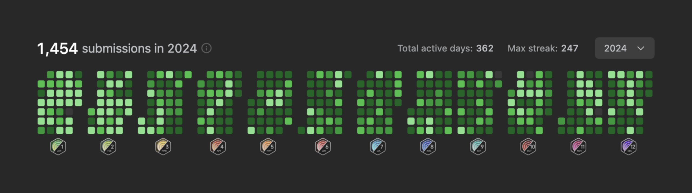

## ⏩️ 快速回顧

如果你錯過了去年的某些報報，簡單前情提要我 2024 年的一些重大事件：

- 1 ~ 5 月：CMU MSE 第二個學期
  - 3 月春假去了[華盛頓特區]()，月底去[芝加哥]()獨旅、聽 LANY 的演唱會
- 5 ~ 8 月：在[灣區]()的 WeRide 實習
  - 5 月去[費城]()玩，還參加了[美國的 PyCon]()
  - 7 月去了 [Lake Tahoe]()，為了換新 MacBook Pro 順便飛去 [Portland]() 獨旅一個週末
- 8 ~ 12 月：CMU MSE 最後一個學期
  - 10 月秋假去墨西哥 [Cancún]() 避寒、換了新的 [iPhone 16 Pro]()
  - 12 月從 [CMU 畢業]()、去[紐約]()獨旅過聖誕節 + 跨年、回台灣過年

其他去年寫過的文章：

- 對於職涯的一些反思
  - [也許我永遠不會退休]()
  - [關於創業]()
  - [下個十年]()
- 在自駕車新創實習三個月，就能學會[如何在自家後院打造一台自駕車]()！？
- 神預測今年學測題目的 [52 赫茲的鯨魚們]() (X)

## 👍🏻 2024 順利的部分

先來講講今年哪些事情挺順利的：

### 💼 找到實習

我是在 2 月的時候拿到實習的 offer，詳細的一些數據可以去看看 [2 月的報報]()。回頭來看，2024 年初的北美求職市場的確還是很嚴峻，我私心覺得能順利拿到這份 offer 跟 WeRide 本身的招聘方式有很大的關係，大家應該很難想像一間中國公司招工程師的難度可以這麼「卷」。

首先，他們只收會講中文的人，光這一點就先把範圍限縮了很大一部分。履歷投完，校名還得稍微能看才收的到 OA，而且內容又是 120 分鐘解 3 題 LeetCode Hard 的 OA。寫完分數太低當然是直接出局，分數高還得看你多早寫完，太晚的話可能面試排不到就招滿了。後面 3 輪技術面試也都差不多是 Medium 難度，即便這中間幾乎是 0 失誤，我後面還是再加面了一輪才順利拿到這份實習的 offer。所以也就不難想像北美的中國、台灣、港澳、新加坡人、或是其他可能稍微會講一些中文的 ABC，又要刷題能刷到這麼瘋癲的人能有多少。

我會講中文這件事應該不需要解釋，至於為什麼刷題會刷到這麼癲，這功勞就得歸給我身邊這坨會約在禮拜六早上 9 點起來刷題的~~損~~朋友們了：）

雖然在現實生活中已經說了很多次，但在這裡還是要再說一次：

> 我不是奮力爬上岸的，是被身邊的人「卷」上岸的

至於這歸根究底是不是一件好事，就有待時間的驗證了。

### 🗺️ 旅遊多多

在美國的第二年，又解鎖了不少新城市，東岸的大城市差不多都走一輪了，甚至還去了墨西哥，[單年度 20 趟飛行](https://my.flightradar24.com/tomy0000000)也是刷新了之前的紀錄。通常阻止我出去玩的是錢包的深度，但在 CMU 似乎有主客易位的現象——因為平時很難擠出時間，所以變成一有假就在想著出去玩。理論上 2025 會回歸原本的「資本本位主義」的旅遊模式，但潛在的問題可能反而是美國快沒什麼沒去過的地方好去，但就...回去再說吧...

## 🤦🏻 沒那麼順利的另一半

這一部分似乎就多了一些 QQQQ

### 📈 預算超支

按照原本的計劃，理論上 8 月會是我最後一次從台灣換美金然後匯款到美國，這一筆錢會包含最後一學期的學費、生活費、回台灣的旅費、還有支應我在領到第一份工作薪水前的各項花費。結果即便黑五和去紐約都沒買什麼東西，最後還是因為換手機、改機票、還有處理搬家等等各種花式的雜支導致預算破表，即便是寫這篇文的現在，我都還在看美元什麼時候可以跌一點下來讓我買一些去付我的信用卡帳單：）））

### 🥀 失去對生活的熱忱

去年 11 月的報報有就[寫過]()我的心態被求職綁架，但當時沒有提到的是，這個狀態其實長達 4 個月，從 8 月一路延續到 11 月底，撇掉中間出去玩的時候還可以稍微散散心，其他大部分時間我都在 emo。

我在歐洲交換結束回台灣畢業時，有一個感觸是——有時候達成某些非凡的成就，並不完全是因為一個人的能力有多頂尖，更有可能只是他先達成了一個階段性的小成就，受到肯定，藉此獲得了足夠的勇氣去挑戰更困難的難題。而更多的人則是因為少了這些初步的成就，變得更容易被世俗眼光綁架，進而固步自封、處處碰壁。

這差不多就是我後半年整體的感受——因為在求職上沒有顯著的進展，所以就算是做其他事情，不管是修課、寫作業還是做 Practicum Project 都「力有餘而心不足」，說起來其實挺可惜的，因為我是真心很喜歡最後一學期選修的 Database，可惜當時沒有心力去鑽研每一個值得深究的細節。

承著上面這樣的狀態，自然也就更難去處理日常生活的其他面向。

雖然這樣形容有點怪怪的，但寫部落格對我來說，有著類似於酒精和大麻放大情緒的魔性。[^1]當我度過了精彩的一個月，寫這個月的報報就是回顧開心的一個月；過了庸庸碌碌的一個月，就是再重新回放一次這個月有多淒慘。而當生活出現了一連串的不如意，最終就會失去追求生活的熱忱。

[^1]: 這樣寫絕對不是因為我有呼過，都是聽說的 XD

## 💬 結論

有點不太確定該如何總結我的 2024，有點想說這片牆有多綠我的生活就有多糟，但似乎又有點言過其實。在寫這篇文今天，[我的 LeetCode](https://leetcode.com/u/tomy0000000/) 每日挑戰已經累積到 403 天了。一開始是找完實習工作的時候覺得反正再過不久就要找正職工作，不想重新培養手感，所以就養成了每天點進去寫的習慣。但我想在我發完這篇文的同時，也差不多是時候停止這場鬧劇了。[^2]

看著去年寫的展望文，似乎沒達成多少，不知道該怎麼跟自己交代，只好來抱怨一下今年過的有多糟，卻也是把最痛苦的部分寫完才發現，去年值得開心的部分其實也不少，只是我的潛意識悄悄放大了很多不愉快的經驗罷了，並不代表他們不存在過。

總之，2025 值不值得期待......現在不好說，但值得慶幸的是 2024 跟著大部分令我不開心的事一起結束了，今年要怎麼挽救，就等 2025 展望文再說吧。

[^2]: 給正在北美求職的人，特別說明：也許刷很多 LeetCode 對於我在 OA 或面試有部分的幫助，但絕對不全然是我拿到 offer 的全部。精通 Blind 75 或 NeetCode 就可以達到一樣的功效。我不想鼓勵任何人每天寫每日，特別是如果如果你本身就對求職感到焦慮。
