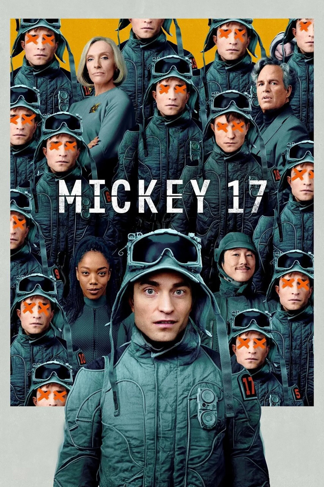
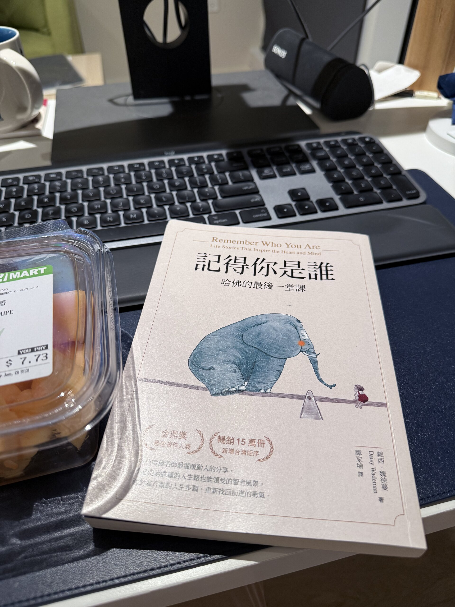

這個月好像沒有太多戶外的行程，但是個充滿藝文的春天！

## 🐏 Hitsujibungaku US West Coast Tour 2025

羊文学！






記得本來 2023 年的時候就有看到他們要來台灣巡演，而且是他們的第一場海外獨立演出，可惜那時候剛好卡到要來美國的行程，所以去不了。結果沒想到反而是來美國看到了哈哈哈哈。

這次的演出場地是舊金山市區 Union Square 附近的一個小劇場—— August Hall。有點舊舊破破的，音響甚至會破音，簡直跟政附的演藝廳有得比，舞台沒有布幕，燈光也只有四顆電腦燈。主唱塩塚上台時靦腆的用破破的英文向大家問好，一邊好奇美國人都是怎麼認識自己的，然後一開口唱歌卻又台風穩健，散發著自信的魅力，這種反差居然有種高中友校熱音社成發學妹的即視感，真的是青春到不行。

## 🍿 Mickey 17

<figure>
    
</figure>

是之前執導奧斯卡最佳影片《寄生上流》的韓國大導演奉俊昊的新作，趁著 AMC 電影院週二半價來看一下，雖然之前在匹茲堡就有看過電影，但還是覺得美國電影院的食物真的是......有夠美國 XDDDD 超級大份、超級油膩、超級爽，不能太常吃，會短命。電影的話，好像就普普，沒有《寄生上流》好看，但有及格，如果很閒的話可以去看看，7.5/10。

## 📖 《記得你是誰》

<figure>
    
</figure>

在 2023 年來美國前買的書，不知不覺拖到了這個月才看完。看序章的時候覺得應該是一本相當有展望性的書，應該是一本適合在人生展開新篇章時閱讀的書。可惜每一篇都是不同教授的人生故事，沒有一個貫串全書的中心思想，讀起來更像是散文，再加上大部分的教誨說起來好聽，卻缺乏可以具體力行的方式。

整體而言，10 分裡面 6 分。如果你的人生正在一個迷惘的狀態，可以翻翻某些有興趣的篇章，但不用太認真，輕鬆翻就好。

## 🌼 本月花花

這個月比較少去超市，只買了兩束花：






## ✨ 其他 Highlight

- 這個月花了點時間重新整理了我的 Zsh 環境，然後寫了篇[心得文]()。有一點點技術的成分，著重比較多在概念上的部分，不是一般的教學文。整理 Terminal 環境真的是每次都可以學到一些奇怪的新知識，但也有很多還是看不懂的東西。如果最近有遇到問題也可以留言或私訊我交流 XDDDDDD
- 這個月開始長租了一台 Tesla Model 3，關於這台車的故事可以看看[這篇文]()

## 🎯 本月目標回顧

### 🟡 準時上床 + 準時起床

達成率大約......70% (?) 其實目標是要固定作息，然後希望可以藉此增加做事的效率，但似乎成效有限 QQQQ

### ✅ 統整一下這個月玩 Zsh 各種工具的心得，寫篇文

如上

### 🟡 把現在床上的書看完

就是上面的《記得你是誰》，技術上來說我是在 5/1 凌晨 3 點看完的 (完蛋馬上透露第一個目標沒達成哈哈哈哈哈

## 🎯 下個月的目標

最近覺得很想寫多花一點時間在寫 code，但實際上 side project 好像都沒什麼進度，來推一下

1. 每天 12 點準時上床、看 30 分鐘的書，然後睡覺
2. 每週拍 10 張照片
3. 遷移至少一個帳戶到自己的記帳系統上

---

下個月要回匹茲堡參加 CMU 的畢業典禮，再順便帶我爹娘玩美國，如果沒意外的話，會稍微整理一下 CMU 的心得文！
