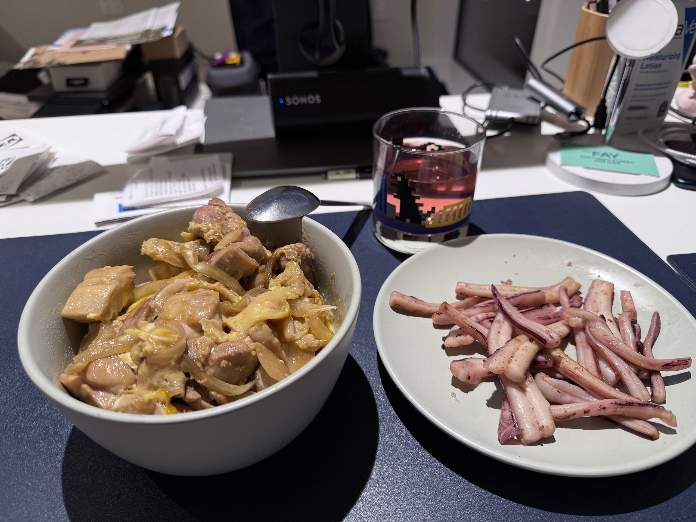

回美國的時候 2 月也差不多過完一半了，加上一回來忙著處理新家的各種事情沒啥時間出去玩，或是做些有趣的事，搞的現在這篇文好像沒什麼東西可以寫 (Hmmm...)

那就簡單把手機照片翻一翻寫一篇看圖說故事好了 XDDDDD

## 💻 封箱我的舊 MacBook Pro

回台灣做的最後一件事就是正式封存我的舊 MacBook Pro，這一台 MacBook Pro 對我來說有很多很重要的意義，所以在封存的同時，我也寫了一篇[文章]()來紀念他，有興趣可以去看看。

## 💼 正式野放社會

今年回來 Return 回去年實習的 WeRide 做全職了，一樣是在 Infrastructure 組，做一些公司內部的系統，今年加入的是一個全新的專案，具體做什麼可能不太適合在這裡寫 (其實是懶得寫 (?))，但有興趣的可以私下我聊聊。做起來的話，感覺是挑戰更多了一點，但反正都是之前稍微碰過的東西，所以上手也沒有太大的困難。

慶幸的是公司的附的午餐和晚餐略比去年進步一點，還是值得特別嘉許一下 😂

## 🧑🏻‍🍳 煮飯

雖然平日上班公司已經供三餐了，假日還是得自己打理三餐，所以多多少少還是要下個廚。

之後應該會在我的 [Docs](https://docs.tomy.me/recipe) 更新一下自己的食譜，歡迎大家留言推薦有什麼可以煮的菜色！

## 🎯 本月目標回顧

### ✅ Music Pipeline

[大致完成](https://docs.tomy.me/pipeline-music-album)了，目前是有一條主線，可以讓一首歌從被發現，到最後被加入我的音樂資料庫裡，流程大概是這樣：

- 發現一首歌
- 找到這首歌的專輯
- 從專輯中抽幾首歌加入播放清單 A
- 如果這張專輯大致上都不錯，就把整張專輯加入播放清單 B
- 每個月從播放清單 B 中挑幾張喜歡的專輯買
- 用之前介紹過的 [AutoRip]() 把專輯轉錄檔案，加入我的音樂資料庫

可能還有很多細節需要等到真的完全用起來才會發現，但有總比沒有好，希望這套流程可以有效解決近幾年鬧歌荒的問題。

### 🟡 Photo Pipeline

概念上的部分差不多想清楚了，但我想留到之後在另外寫一篇文討論我的想法。

技術上的部分，沒啥太大進展。我原本一直的做法都是拍完照之後會盡可能的保留原檔，但在跟幾個有拍照的朋友聊聊之後，我有點被說服其實做這件事其實沒有太大的意義，而且考量到原本其實很整齊的照片資料庫之所以後來會變的一團亂，就是因為硬碟空間不足，所以才會東放一點西放一點，最後要找照片變的極其困難，放棄存原檔也許會是比較合理的存儲方式。

之前以為開始領薪水可以買很多新玩具，但相機又再次被卡住了，所以雖然這個專案好像有了一些階段性的成果，但可能也差不多又要在這裡暫停了 QQQQQ

### ✅ 給自己買束花

忘記在哪裡看到的一種說法是，新鮮的花朵具有調節生活空間氣息的能力，在這樣的環境，不管是放鬆還是做正事，都會讓人更有活力。所以今年想開始嘗試每週買菜的時候，也順便買束花回家，讓家裡多一點朝氣！

如果有人有養花的經驗，歡迎分享一下你的心得！

---

下個月見！
