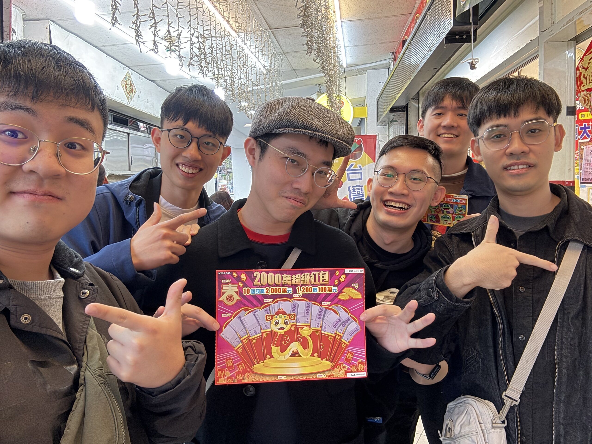

雖然是 1 月的報報，但這篇文其實也包含了 2 月的上半個月，總之差不多是涵蓋今年回台灣的種種生活記事。

大部分有趣的東西、有趣的想法都寫在[《回台隨筆 2025》]()了。這裡就隨便放些照片唄。

## 😋 吃的

總之都是一些在台灣覺得很理所當然，但在美國整理照片的時候會覺得：后里蟹看起來也太好吃了吧的食物們。

因為我現在吃不到所以不想一一交代這些是啥，嘻嘻













## 🎟️ 刮刮樂路跑

酒精路跑我可能玩不了，大概第一站還沒結束就會倒了 (?) 但刮刮樂總行了吧

去年在美國沒辦法參加第一屆，今年難得這組合完成度挺高的，就在宜蘭玩了刮刮樂路跑 XDDDD

廢話不多說直接先上成績單：

| #   |                 | 支出   | 收入   | 累積收益 |
| --- | --------------- | ------ | ------ | -------- |
| 1   | 金愛台灣        | NT$200 | NT$0   | -NT$200  |
| 2   | 恭喜發財        | NT$0   | NT$200 | NT$0     |
| 3   | 金蛇報喜        | NT$200 | NT$0   | -NT$200  |
| 4   | 年貨大街        | NT$200 | NT$0   | -NT$400  |
| 5   | 鈔票一把抓      | NT$300 | NT$0   | -NT$700  |
| 6   | 無敵 30 倍      | NT$300 | NT$300 | -NT$700  |
| 7   | 2000 萬超級紅包 | NT$400 | NT$400 | -NT$700  |
| 8   | 2000 萬超級紅包 | NT$400 | NT$400 | -NT$700  |

🐸 勒怎麼好像虧的有點多，不嘻嘻

眼尖的你可能會發現，欸奇怪第二張怎麼沒有支出呢？那是因為培修第一張只用 200 塊就不小心刮出 5000 塊大獎了，所以第二張全部給他請 😂😂😂

另外一個小彩蛋是，我們在進入第 6 站前有些人口渴了，於是就去買了得正，不喝還好，喝一喝後面就得正了？？？？？？[^1]

不知道明年還能不能回台灣過年嗚嗚嗚，但如果有的話希望還有下一屆 xDDD

[^1]: 其實當時剛好是三個業績差的一起去喝，其中有兩個人負負得正了，至於誰還是負的，我就不忍說了 🙈

## ☎️ 酷酷的東西！！！

跟怪怪的組合 (?) 去台北當代藝術館玩可以遙控的家電 (??????)



這是 [No Language](https://www.mocataipei.org.tw/tw/ExhibitionAndEvent/Info/No*Language) 展覽的一部分，會持續展出到 5/4 (或是遙控家電被玩壞為止 (X))。

其他藝文活動還有：

- 去了忠泰美術館 (一樣在[《回台隨筆 2025》]())
- 找了一個平日早上去看《星際效應》的重映，4DX 包場，真香
- 把[《從前從前，有間古書店》]()重新再翻了一遍

## 📚 書店

這次回來去了兩間獨立書店





<figcaption class="text-center"></figcaption>

## 🎯 本月目標回顧

- ✅ Roadmap 我的 2025：詳情請見 [2024 回顧]() & [2025 展望]()
- 🟡 K MVP：最基本的功能差不多完成了，作為工程師我對這個成果很滿意，但作為使用者，我又開始跟 (也是我) 的 PM 抱怨這樣根本稱不上是 MVP，距離我現階段最低的需求還有一段距離，我只能說我太難了。[^2]
- ✅ 另外寫 2 篇文章

[^2]: 透過這個案例或許就可以理解為什麼我的人格有時候這麼分裂，還經常自言自語。新的一年還請大家多多擔待 (我是不會感到抱歉的 (??????

## 🎯 下個月的目標

1. Music Pipeline: 音樂產業持續的在變化，但我的歌路開發似乎還沒適應這個快速變化的市場和領域，也差不多有些時間來想想可以怎麼重新跟上腳步了。
2. Photo Pipeline: 整體而言是一個複雜的問題，在今年的展望文裡面有寫了，作為初步構想，先嘗試思考以下的問題
   - 攝影的意義是什麼？在社交媒體出現之前，大家按下快門的動機是什麼？(歡迎有想法的人在下面留言)
   - 如何保存？如何備份？
3. 給自己買束花吧！
