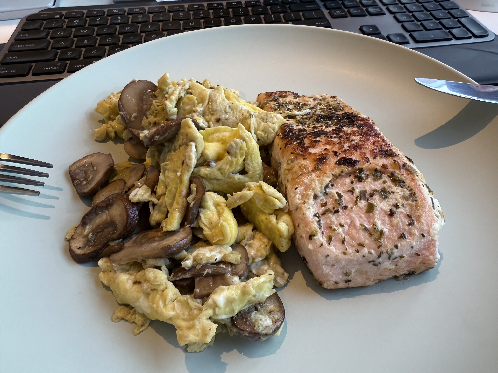
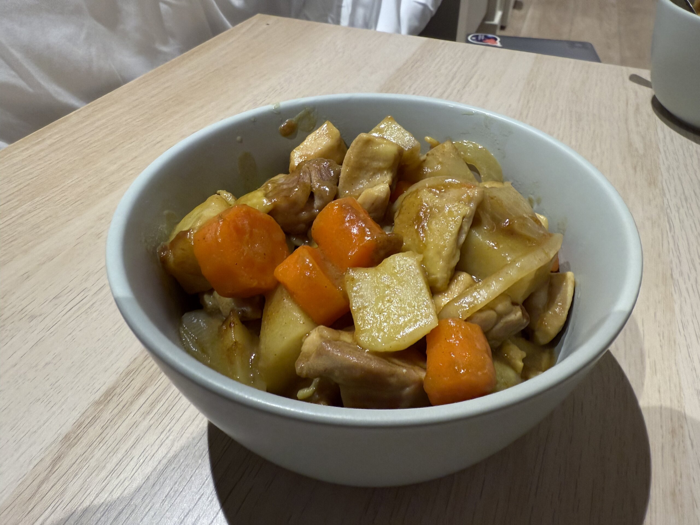
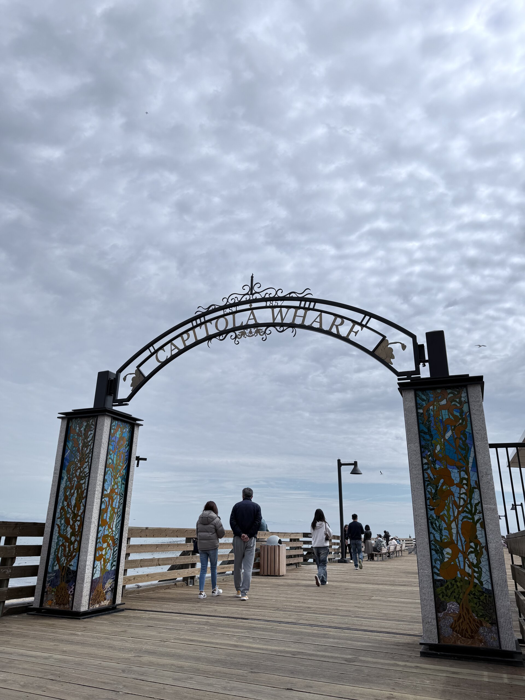
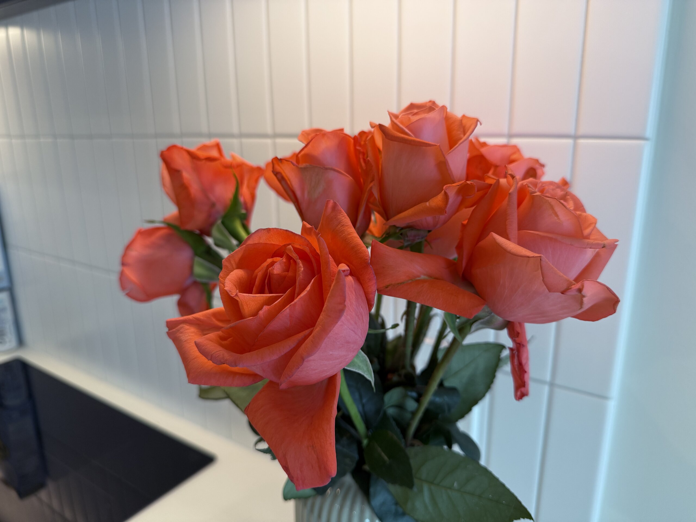
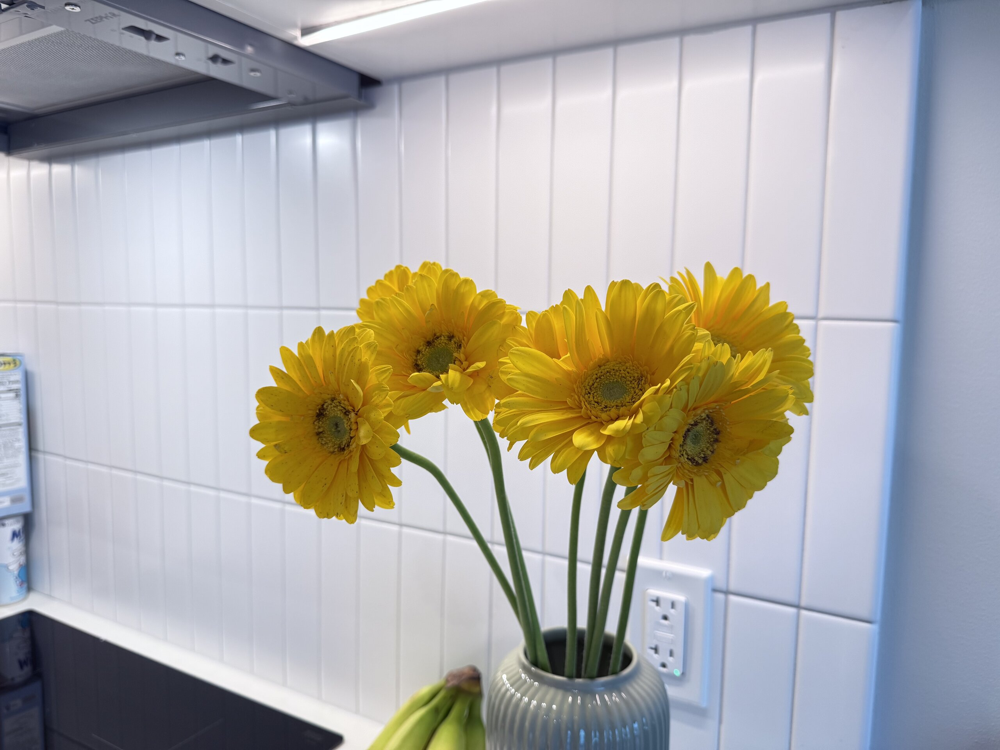
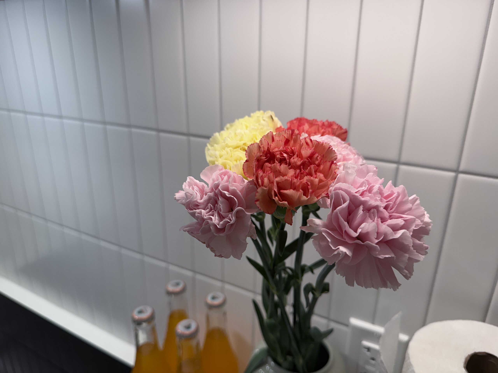

前幾天看到日曆發現又快月底了，然後就發現，欸奇怪怎麼想不起來上個月訂了什麼目標，結果一看才發現上個月寫報報的時候寫看圖說故事寫得太開心了，壓根就把訂目標這回事全忘了 😂 難怪這個月過的好像挺愜意的 (?)

## 🍽️ 外面好吃的

美國難得有好吃的蛋包飯，太好吃了，值得放上來誇一下

")

## 🧑🏻‍🍳 家裡煮的

雖然現在公司都有供三餐，所以我平日幾乎不怎麼需要自己打理三餐，但假日如果餐餐外食，在灣區還是有點太奢侈，於是又開始煮飯了。

")

## 🏞️ 放假出去玩 ⁽⁽ଘ( ˙꒳˙ )ଓ⁾⁾






<figure>
    
    <figcaption class="text-center">和 Yuki 醬還有 Yuki 醬的前室友去 Capitola 玩，上次來這個海灘沒有走到碼頭這邊，這裡也挺漂亮的！</figcaption>
</figure>






## 🌼 本月花花

這個月也買了不少花花！

## ✨ 本月 Highlight

- [第一次美國報稅]()：本來想說應該一個晚上就可以搞定了，殊不知弄完的時候都已經凌晨兩點
- 第一份薪水買給自己的禮物：[Bang & Olufsen Beoplay H100]()
- 抽中 H-1B：一般美國留學生畢業之後的學生簽證只能在美國工作 3 年，如果想要持續在美國待下去一般就是要抽正式的 H-1B 工作簽證。這幾年的中籤率都不高，我原本也是不期不待，但還是很幸運的抽到了，偷偷報個喜。

## 🎯 下個月的目標

1. 準時上床 + 準時起床
2. 統整一下這個月玩 Zsh 各種工具的心得，寫篇文
3. 把現在床上的書看完
