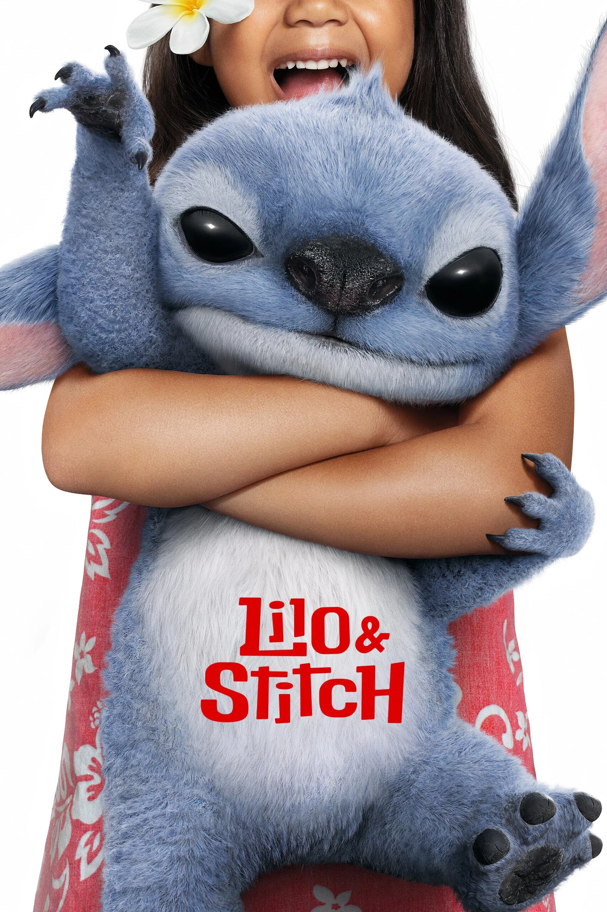

發現寫部落格有一個有趣現象：這個月沒什麼大事，會因為沒有題材，所以不好寫。但反過來，太多行程，太多東西可以寫，也會很頭疼。另一方面，太多事要做的時候，要抽出時間和心情來寫，其實也不是一件容易的事。

唉，算了，還是當我理由伯好了 🤡

先講目標！

## 🎯 本月目標回顧

### ❌ 每天 12 點準時上床、看 30 分鐘的書，然後睡覺

大失敗。

月初飛長途飛機到西岸、每天行程都搞到超晚才旅館，外加搞第三個目標，直接把時差拉好拉滿。

### ✅ 每週拍 10 張照片

多虧出去玩，這個目標好像有跟沒有一樣 XDDDDD

雖然以前發過了，但如果有人有在玩 Retro 的話 → [@tomy](https://retro.app/@tomy)

### ✅ 遷移至少一個帳戶到自己的記帳系統上

當初以為這個大概一個禮拜就可以做完，結果真的遷的時候才發現困難重重，臨時改了好多 code，但做起來還是挺有成就感的，已經開始期待這個東西跑起來的樣子了 (拍胸)

希望做完之後會有動力寫一篇文介紹這鬼東西。

## 🎯 下個月的目標

其實比起寫部落格，最近好像比較想寫程式，那改成想想這個月要寫什麼好了 (?)

1. Blog 更新：之前電子報是由 Mailchimp 提供的，但是他們最近通知說要把免費版拿掉了，得把這功能重新搞起來。這個月收不到信的現在這邊說聲抱歉 QQQ 另一方面，部落格的照片有點多了，全部存在 GitHub 不是長遠之計，也順便遷移走吧！
2. 把記帳系統的第一版介面完成：延續上個月的目標，資料有了，現在需要一個介面可以看。
3. 開始追一部劇

## 👾 星際寶貝：史迪奇

<figure>
    
</figure>

我喜歡毛毛的！

仔細回想小時候看過的動畫片，第一個直覺會想到的好像都是皮克斯的。再往下的話，不是皮克斯第一個會想到的，好像就是《星際寶貝》了吧。去年一看到真人版電影要上映的時候馬上就把片的上映日期記下來了，甚至還在進電影院前重新訂了 Disney+ 就為了再看一次動畫版

(而且 Disney+ 上面還有完整的台灣配音 + 中文字幕，懂的人就知道 XDDD)

  
微劇透心得

  這次的真人版，跟大部分影評說的差不多，難得沒有翻車。但劇本還是有小改一點，莉蘿的角色比起動畫來說相對不那麼憂鬱，整部片的氣氛變的相對沒那麼沈重；動畫版的強霸和獨眼霹靂比較好笑討喜一點，但在真人版裡面可能是為了減少剛圖艦長的戲份，所以不得不把強霸改成反派。

總而言之，是一部看起來輕鬆、又有些懷舊的好片，大推！

## 🇺🇸 帶爹娘玩美國 + CMU 畢業典禮 🎓

這個月中是 CMU 的畢業典禮！我就讀的 MSE 是去年 12 月就畢業了，但是學校一年只有一場畢業典禮，是舉行在下學期結束的時候，所以我們這些 12 月畢業的學生會等到 5 月再回來一起舉行畢業典禮。

所以當然也就趁著這個機會，帶我爸媽玩一下舊金山和紐約！

行程其實差不多就是我之前去過，覺得還算有體驗值的景點，就不特別寫了，有興趣的人可以私下跟我要。

礙於 CMU 的心得文難產，所以這邊就先放個照片就好






十年之後，我不確定我還會不會記得—— Non-Functional Requirements ≠ Quality Attributes、Career Fair 裡每條急著上岸的沙丁魚，Data 進去 Kafka 就出不來的 Pipeline，還有那顆差點刻不出的 B-Tree。

但我想我會記得，拿到學生證在 Walk into the sky 拍照的豔陽高照、Schenley Park 的晨霧、Power Yoga 教室外的那場大雪、還有Mercurio's 的橄欖披薩。

謝謝成就這段旅程的每一個小夥伴——讓這段歲月值得回味。
