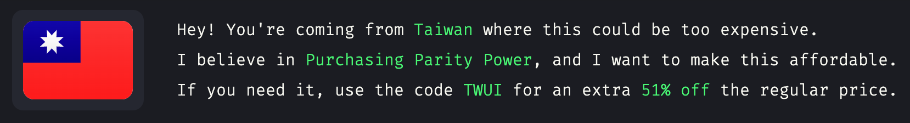

So I've been wanting to get the [Dracula UI](https://draculatheme.com/ui) for a while. Since I was building up my personal blog now, and I really doesn't want to just follow the default that comes with the theme, so I decided to get the palette from it, and see if I can make it work on my blog.

Just when I'm about to hit the buying button, this lovely banner bumps into my eyes:

I honestly don't recall seeing that before, because 51% off is a huge price gap that should have made me buy it without a doubt when I first saw it. Nevertheless, before I make my way to checkout, I thought this is a good chance to try out the VPN subscription that I’ve been paying for a while. Although switching countries is just a click away, it’s still a bit of a hassle, so after playing around with some neighboring countries, I dive deep into the code to see if there’s anything I can facilitate. First I found an API endpoint at [https://ppp.dracula.workers.dev](https://ppp.dracula.workers.dev), which is an API that responds the discount based on the client’s IP address. Good enough, but can be better.

## 🪄 Automate

Then I suddenly realize, that the API is the single source of truth of the discount, since the merchant dealing the payment does not verify the code when the user is applying the code, and the code is just a country code suffix with the fixed string of `UI`, so I can just brute force the code with the [ISO 3166-1 code](https://en.wikipedia.org/wiki/ISO_3166-1).

Here is the results:

List of discount in different countries

| Country                                                 | ISO 3166-1 | Discount |
| ------------------------------------------------------- | ---------- | -------- |
| 🇮🇩 Indonesia                                            | ID         | 69%      |
| 🇺🇬 Uganda                                               | UG         | 69%      |
| 🇦🇫 Afghanistan                                          | AF         | 68%      |
| 🇩🇿 Algeria                                              | DZ         | 68%      |
| 🇦🇿 Azerbaijan                                           | AZ         | 68%      |
| 🇱🇾 Libya                                                | LY         | 68%      |
| 🇸🇸 South Sudan                                          | SS         | 68%      |
| 🇸🇷 Suriname                                             | SR         | 68%      |
| 🇦🇴 Angola                                               | AO         | 67%      |
| 🇧🇾 Belarus                                              | BY         | 67%      |
| 🇪🇬 Egypt                                                | EG         | 67%      |
| 🇮🇶 Iraq                                                 | IQ         | 67%      |
| 🇰🇬 Kyrgyzstan                                           | KG         | 67%      |
| 🇲🇲 Myanmar                                              | MM         | 67%      |
| 🇵🇰 Pakistan                                             | PK         | 67%      |
| 🇱🇰 Sri Lanka                                            | LK         | 67%      |
| 🇹🇿 Tanzania, United Republic of                         | TZ         | 66%      |
| 🇻🇳 Viet Nam                                             | VN         | 66%      |
| 🇰🇭 Cambodia                                             | KH         | 65%      |
| 🇬🇲 Gambia                                               | GM         | 65%      |
| 🇲🇬 Madagascar                                           | MG         | 65%      |
| 🇲🇷 Mauritania                                           | MR         | 65%      |
| 🇳🇮 Nicaragua                                            | NI         | 65%      |
| 🇦🇷 Argentina                                            | AR         | 64%      |
| 🇰🇿 Kazakhstan                                           | KZ         | 64%      |
| 🇲🇾 Malaysia                                             | MY         | 64%      |
| 🇲🇳 Mongolia                                             | MN         | 64%      |
| 🇸🇨 Seychelles                                           | SC         | 64%      |
| 🇹🇯 Tajikistan                                           | TJ         | 64%      |
| 🇹🇷 Türkiye                                              | TR         | 64%      |
| 🇺🇦 Ukraine                                              | UA         | 64%      |
| 🇺🇿 Uzbekistan                                           | UZ         | 64%      |
| 🇧🇹 Bhutan                                               | BT         | 63%      |
| 🇩🇴 Dominican Republic                                   | DO         | 63%      |
| 🇸🇿 Eswatini                                             | SZ         | 63%      |
| 🇪🇹 Ethiopia                                             | ET         | 63%      |
| 🇬🇪 Georgia                                              | GE         | 63%      |
| 🇬🇭 Ghana                                                | GH         | 63%      |
| 🇮🇳 India                                                | IN         | 63%      |
| 🇱🇦 Lao People's Democratic Republic                     | LA         | 63%      |
| 🇲🇼 Malawi                                               | MW         | 63%      |
| 🇲🇿 Mozambique                                           | MZ         | 63%      |
| 🇳🇵 Nepal                                                | NP         | 63%      |
| 🇳🇬 Nigeria                                              | NG         | 63%      |
| 🇷🇼 Rwanda                                               | RW         | 63%      |
| 🇸🇱 Sierra Leone                                         | SL         | 63%      |
| 🇸🇩 Sudan                                                | SD         | 63%      |
| 🇹🇳 Tunisia                                              | TN         | 63%      |
| 🇿🇼 Zimbabwe                                             | ZW         | 63%      |
| 🇧🇫 Burkina Faso                                         | BF         | 62%      |
| 🇹🇩 Chad                                                 | TD         | 62%      |
| 🇴🇲 Oman                                                 | OM         | 62%      |
| 🇵🇾 Paraguay                                             | PY         | 62%      |
| 🇷🇺 Russian Federation                                   | RU         | 62%      |
| 🇿🇲 Zambia                                               | ZM         | 62%      |
| 🇧🇯 Benin                                                | BJ         | 61%      |
| 🇬🇳 Guinea                                               | GN         | 61%      |
| 🇱🇸 Lesotho                                              | LS         | 61%      |
| 🇵🇭 Philippines                                          | PH         | 61%      |
| 🇸🇦 Saudi Arabia                                         | SA         | 61%      |
| 🇦🇲 Armenia                                              | AM         | 60%      |
| 🇧🇩 Bangladesh                                           | BD         | 60%      |
| 🇲🇱 Mali                                                 | ML         | 60%      |
| 🇲🇦 Morocco                                              | MA         | 60%      |
| 🇲🇰 North Macedonia                                      | MK         | 60%      |
| 🇹🇬 Togo                                                 | TG         | 60%      |
| 🇧🇳 Brunei Darussalam                                    | BN         | 59%      |
| 🇨🇲 Cameroon                                             | CM         | 59%      |
| 🇨🇬 Congo                                                | CG         | 59%      |
| 🇨🇮 Côte d'Ivoire                                        | CI         | 59%      |
| 🇳🇪 Niger                                                | NE         | 59%      |
| 🇹🇭 Thailand                                             | TH         | 59%      |
| 🇧🇬 Bulgaria                                             | BG         | 58%      |
| 🇲🇺 Mauritius                                            | MU         | 58%      |
| 🇸🇳 Senegal                                              | SN         | 58%      |
| 🇦🇱 Albania                                              | AL         | 57%      |
| 🇧🇦 Bosnia and Herzegovina                               | BA         | 57%      |
| 🇰🇼 Kuwait                                               | KW         | 57%      |
| 🇿🇦 South Africa                                         | ZA         | 57%      |
| 🇹🇲 Turkmenistan                                         | TM         | 57%      |
| 🇧🇼 Botswana                                             | BW         | 56%      |
| 🇧🇮 Burundi                                              | BI         | 56%      |
| 🇨🇴 Colombia                                             | CO         | 56%      |
| 🇷🇸 Serbia                                               | RS         | 56%      |
| 🇬🇦 Gabon                                                | GA         | 55%      |
| 🇵🇪 Peru                                                 | PE         | 55%      |
| 🇬🇶 Equatorial Guinea                                    | GQ         | 54%      |
| 🇬🇼 Guinea-Bissau                                        | GW         | 54%      |
| 🇯🇴 Jordan                                               | JO         | 54%      |
| 🇲🇩 Moldova, Republic of                                 | MD         | 54%      |
| 🇹🇱 Timor-Leste                                          | TL         | 54%      |
| 🇧🇷 Brazil                                               | BR         | 53%      |
| 🇭🇺 Hungary                                              | HU         | 53%      |
| 🇲🇽 Mexico                                               | MX         | 53%      |
| 🇲🇪 Montenegro                                           | ME         | 53%      |
| 🇳🇦 Namibia                                              | NA         | 53%      |
| 🇵🇱 Poland                                               | PL         | 53%      |
| 🇸🇻 El Salvador                                          | SV         | 52%      |
| 🇮🇷 Iran (Islamic Republic of)                           | IR         | 52%      |
| 🇷🇴 Romania                                              | RO         | 52%      |
| 🇹🇼 Taiwan, Province of China                            | TW         | 51%      |
| 🇹🇹 Trinidad and Tobago                                  | TT         | 51%      |
| 🇧🇴 Bolivia (Plurinational State of)                     | BO         | 50%      |
| 🇨🇻 Cabo Verde                                           | CV         | 50%      |
| 🇭🇳 Honduras                                             | HN         | 50%      |
| 🇰🇪 Kenya                                                | KE         | 50%      |
| 🇧🇭 Bahrain                                              | BH         | 49%      |
| 🇬🇾 Guyana                                               | GY         | 49%      |
| 🇪🇨 Ecuador                                              | EC         | 48%      |
| 🇭🇹 Haiti                                                | HT         | 48%      |
| 🇶🇦 Qatar                                                | QA         | 48%      |
| 🇨🇳 China                                                | CN         | 46%      |
| 🇰🇲 Comoros                                              | KM         | 46%      |
| 🇯🇲 Jamaica                                              | JM         | 46%      |
| 🇩🇯 Djibouti                                             | DJ         | 45%      |
| 🇬🇹 Guatemala                                            | GT         | 45%      |
| 🇧🇿 Belize                                               | BZ         | 44%      |
| 🇨🇱 Chile                                                | CL         | 44%      |
| 🇨🇩 Congo, Democratic Republic of the                    | CD         | 44%      |
| 🇭🇷 Croatia                                              | HR         | 43%      |
| 🇱🇹 Lithuania                                            | LT         | 43%      |
| 🇸🇰 Slovakia                                             | SK         | 42%      |
| 🇺🇾 Uruguay                                              | UY         | 41%      |
| 🇫🇯 Fiji                                                 | FJ         | 40%      |
| 🇰🇳 Saint Kitts and Nevis                                | KN         | 40%      |
| 🇵🇦 Panama                                               | PA         | 39%      |
| 🇦🇪 United Arab Emirates                                 | AE         | 39%      |
| 🇨🇿 Czechia                                              | CZ         | 38%      |
| 🇦🇬 Antigua and Barbuda                                  | AG         | 37%      |
| 🇨🇫 Central African Republic                             | CF         | 37%      |
| 🇱🇻 Latvia                                               | LV         | 37%      |
| 🇱🇧 Lebanon                                              | LB         | 37%      |
| 🇻🇨 Saint Vincent and the Grenadines                     | VC         | 37%      |
| 🇦🇼 Aruba                                                | AW         | 36%      |
| 🇵🇬 Papua New Guinea                                     | PG         | 36%      |
| 🇸🇬 Singapore                                            | SG         | 36%      |
| 🇨🇷 Costa Rica                                           | CR         | 34%      |
| 🇲🇻 Maldives                                             | MV         | 33%      |
| 🇸🇹 Sao Tome and Principe                                | ST         | 33%      |
| 🇬🇩 Grenada                                              | GD         | 32%      |
| 🇩🇲 Dominica                                             | DM         | 30%      |
| 🇲🇴 Macao                                                | MO         | 30%      |
| 🇪🇪 Estonia                                              | EE         | 29%      |
| 🇲🇹 Malta                                                | MT         | 29%      |
| 🇬🇷 Greece                                               | GR         | 28%      |
| 🇨🇾 Cyprus                                               | CY         | 27%      |
| 🇳🇷 Nauru                                                | NR         | 27%      |
| 🇸🇮 Slovenia                                             | SI         | 27%      |
| 🇪🇷 Eritrea                                              | ER         | 26%      |
| 🇱🇨 Saint Lucia                                          | LC         | 26%      |
| 🇵🇹 Portugal                                             | PT         | 25%      |
| 🇰🇷 Korea, Republic of                                   | KR         | 24%      |
| 🇹🇴 Tonga                                                | TO         | 24%      |
| 🇭🇰 Hong Kong                                            | HK         | 23%      |
| 🇵🇷 Puerto Rico                                          | PR         | 21%      |
| 🇼🇸 Samoa                                                | WS         | 21%      |
| 🇪🇸 Spain                                                | ES         | 21%      |
| 🇰🇮 Kiribati                                             | KI         | 18%      |
| 🇸🇲 San Marino                                           | SM         | 17%      |
| 🇮🇹 Italy                                                | IT         | 12%      |
| 🇦🇽 Åland Islands                                        | AX         | 0%       |
| 🇦🇸 American Samoa                                       | AS         | 0%       |
| 🇦🇩 Andorra                                              | AD         | 0%       |
| 🇦🇮 Anguilla                                             | AI         | 0%       |
| 🇦🇶 Antarctica                                           | AQ         | 0%       |
| 🇦🇺 Australia                                            | AU         | 0%       |
| 🇦🇹 Austria                                              | AT         | 0%       |
| 🇧🇸 Bahamas                                              | BS         | 0%       |
| 🇧🇧 Barbados                                             | BB         | 0%       |
| 🇧🇪 Belgium                                              | BE         | 0%       |
| 🇧🇲 Bermuda                                              | BM         | 0%       |
| Bonaire, Sint Eustatius and Saba                        | BQ         | 0%       |
| 🇧🇻 Bouvet Island                                        | BV         | 0%       |
| 🇮🇴 British Indian Ocean Territory                       | IO         | 0%       |
| 🇨🇦 Canada                                               | CA         | 0%       |
| 🇰🇾 Cayman Islands                                       | KY         | 0%       |
| 🇨🇽 Christmas Island                                     | CX         | 0%       |
| 🇨🇨 Cocos (Keeling) Islands                              | CC         | 0%       |
| 🇨🇰 Cook Islands                                         | CK         | 0%       |
| 🇨🇺 Cuba                                                 | CU         | 0%       |
| 🇨🇼 Curaçao                                              | CW         | 0%       |
| 🇩🇰 Denmark                                              | DK         | 0%       |
| 🇫🇰 Falkland Islands (Malvinas)                          | FK         | 0%       |
| 🇫🇴 Faroe Islands                                        | FO         | 0%       |
| 🇫🇮 Finland                                              | FI         | 0%       |
| 🇫🇷 France                                               | FR         | 0%       |
| 🇬🇫 French Guiana                                        | GF         | 0%       |
| 🇵🇫 French Polynesia                                     | PF         | 0%       |
| 🇹🇫 French Southern Territories                          | TF         | 0%       |
| 🇩🇪 Germany                                              | DE         | 0%       |
| 🇬🇮 Gibraltar                                            | GI         | 0%       |
| 🇬🇱 Greenland                                            | GL         | 0%       |
| 🇬🇵 Guadeloupe                                           | GP         | 0%       |
| 🇬🇺 Guam                                                 | GU         | 0%       |
| 🇬🇬 Guernsey                                             | GG         | 0%       |
| 🇭🇲 Heard Island and McDonald Islands                    | HM         | 0%       |
| Holy See                                                | VA         | 0%       |
| 🇮🇸 Iceland                                              | IS         | 0%       |
| 🇮🇪 Ireland                                              | IE         | 0%       |
| 🇮🇲 Isle of Man                                          | IM         | 0%       |
| 🇮🇱 Israel                                               | IL         | 0%       |
| 🇯🇵 Japan                                                | JP         | 0%       |
| 🇯🇪 Jersey                                               | JE         | 0%       |
| 🇰🇵 Korea (Democratic People's Republic of)              | KP         | 0%       |
| 🇱🇷 Liberia                                              | LR         | 0%       |
| 🇱🇮 Liechtenstein                                        | LI         | 0%       |
| 🇱🇺 Luxembourg                                           | LU         | 0%       |
| 🇲🇭 Marshall Islands                                     | MH         | 0%       |
| 🇲🇶 Martinique                                           | MQ         | 0%       |
| 🇾🇹 Mayotte                                              | YT         | 0%       |
| 🇫🇲 Micronesia (Federated States of)                     | FM         | 0%       |
| 🇲🇨 Monaco                                               | MC         | 0%       |
| 🇲🇸 Montserrat                                           | MS         | 0%       |
| 🇳🇱 Netherlands                                          | NL         | 0%       |
| 🇳🇨 New Caledonia                                        | NC         | 0%       |
| 🇳🇿 New Zealand                                          | NZ         | 0%       |
| 🇳🇺 Niue                                                 | NU         | 0%       |
| 🇳🇫 Norfolk Island                                       | NF         | 0%       |
| 🇲🇵 Northern Mariana Islands                             | MP         | 0%       |
| 🇳🇴 Norway                                               | NO         | 0%       |
| 🇵🇼 Palau                                                | PW         | 0%       |
| 🇵🇸 Palestine, State of                                  | PS         | 0%       |
| 🇵🇳 Pitcairn                                             | PN         | 0%       |
| 🇷🇪 Réunion                                              | RE         | 0%       |
| 🇧🇱 Saint Barthélemy                                     | BL         | 0%       |
| 🇸🇭 Saint Helena, Ascension and Tristan da Cunha         | SH         | 0%       |
| 🇲🇫 Saint Martin (French part)                           | MF         | 0%       |
| 🇵🇲 Saint Pierre and Miquelon                            | PM         | 0%       |
| 🇸🇽 Sint Maarten (Dutch part)                            | SX         | 0%       |
| 🇸🇧 Solomon Islands                                      | SB         | 0%       |
| 🇸🇴 Somalia                                              | SO         | 0%       |
| 🇬🇸 South Georgia and the South Sandwich Islands         | GS         | 0%       |
| 🇸🇯 Svalbard and Jan Mayen                               | SJ         | 0%       |
| 🇸🇪 Sweden                                               | SE         | 0%       |
| 🇨🇭 Switzerland                                          | CH         | 0%       |
| 🇸🇾 Syrian Arab Republic                                 | SY         | 0%       |
| 🇹🇰 Tokelau                                              | TK         | 0%       |
| 🇹🇨 Turks and Caicos Islands                             | TC         | 0%       |
| 🇹🇻 Tuvalu                                               | TV         | 0%       |
| 🇬🇧 United Kingdom of Great Britain and Northern Ireland | GB         | 0%       |
| 🇺🇲 United States Minor Outlying Islands                 | UM         | 0%       |
| 🇺🇸 United States of America                             | US         | 0%       |
| 🇻🇺 Vanuatu                                              | VU         | 0%       |
| 🇻🇪 Venezuela (Bolivarian Republic of)                   | VE         | 0%       |
| 🇻🇬 Virgin Islands (British)                             | VG         | 0%       |
| 🇻🇮 Virgin Islands (U.S.)                                | VI         | 0%       |
| 🇼🇫 Wallis and Futuna                                    | WF         | 0%       |
| 🇪🇭 Western Sahara                                       | EH         | 0%       |
| 🇾🇪 Yemen                                                | YE         | 0%       |

The results are rather interesting. If you compare the results with the [List of countries by GDP (PPP) per Capita](https://en.wikipedia.org/wiki/List_of_countries_by_GDP_(PPP)_per_capita), you can see there are some mismatches:

- 🇸🇬 Singapore ranked with the 4th most purchasing power, but still has a 36% of discount
- Same goes with 🇭🇰 Hong Kong, ranked around 11th ~ 12th with a 23% of discount
- Many African has a high percentage of discount (e.g. 🇺🇬 Uganda has 69%), but some barely have any (🇱🇷 Liberia, 🇸🇴 Somalia). Although some might be due to the sanctions, that's just my guess.

## Conclusion

After some Googling, I've also discovered that [Gumroad itself had built-in support for location deals](https://help.gumroad.com/article/315-dynamic-discounts-with-parity-deals), with some customizable options. Therefore, judging from the results, the author of Dracula UI not only grants the discount based on the purchasing power, but the disproportionate discount for some countries also shows that he is probably also granting the discount to reach more users that the theme is not yet popular in.

Nevertheless, this is a good chance and opportunity for me to dig into more about the purchasing power of different countries. Moreover, this mechanism is also a good way to bring equality to the world as an individual, and I would like to see more people doing this.
