## 📋 Problems

| Category   | Problem                 | Final Score | Success Solved | Write Up |
| ---------- | ----------------------- | ----------- | -------------- | -------- |
| 🐧 Misc    | 💤 Piquero              | 100         | 347            | ✅       |
| 🐧 Misc    | 🐥 Karuego              | 100         | 245            | ✅       |
| 🐧 Misc    | 🌱 Soy                  | 139         | 172            | ✅       |
| 🐧 Misc    | 👑 Saburo               | 359         | 108            | ✅       |
| 🐧 Misc    | 👿 Shichirou            | 450         | 65             |          |
| 🐧 Misc    | 🧸 Clara                | 500         | 2              |          |
| ♻️ Reverse | 🍍 TsaiBro              | 100         | 281            |          |
| ♻️ Reverse | 🎹 Fallen Beat          | 144         | 171            | ✅       |
| ♻️ Reverse | 🧠 Stand up!Brain       | 455         | 62             |          |
| ♻️ Reverse | 🍹 Long Island Iced Tea | 498         | 15             |          |
| ♻️ Reverse | 🌹 La vie en rose       | 499         | 12             |          |
| ♻️ Reverse | 🐉 Uroboros             | 500         | 9              |          |
| 💥 Pwn     | 👻 BOF                  | 100         | 189            |          |
| 💥 Pwn     | 📃 Nonsense             | 474         | 47             |          |
| 💥 Pwn     | 🔫 Portal gun           | 491         | 28             |          |
| 💥 Pwn     | 🏫 Morty school         | 498         | 14             |          |
| 💥 Pwn     | 🔮 Death crystal        | 499         | 10             |          |
| 💥 Pwn     | 📦 Meeseeks box         | 500         | 8              |          |
| 🙊 Crypto  | 🦕 Brontosaurus         | 100         | 380            | ✅       |
| 🙊 Crypto  | 🦖 T-Rex                | 100         | 381            | ✅       |
| 🙊 Crypto  | 🐙 Octopus              | 372         | 103            |          |
| 🙊 Crypto  | 🐡 Blowfish             | 480         | 42             |          |
| 🙊 Crypto  | 🐪 Camel                | 497         | 18             |          |
| 🙊 Crypto  | 🐢 Turtle               | 498         | 14             |          |
| 🌐 Web     | 🐿️ Squirrel             | 100         | 220            |          |
| 🌐 Web     | 🦈 Shark                | 100         | 261            | ✅       |
| 🌐 Web     | 🐘 Elephant             | 168         | 165            | ✅       |
| 🌐 Web     | 🐍 Snake                | 272         | 137            |          |
| 🌐 Web     | 🦉 Owl                  | 492         | 27             |          |
| 🌐 Web     | 🦏 Rhino                | 494         | 24             |          |

## 🐧 Misc

### 💤 Piquero


It seems quite obvious to me, this is indeed braille.

So the only thing you need to do is open up wikipedia,

lookup from the table and translate it into flag.

There are still some technique worth mentioned.

For instance, each capital letters, digits, punctuation marks have a special pre-block for indication,

and can be hard to lookup from regular table.

The solution, one way is to guess from other content, another way, for example:

if you're trying to lookup `⠸` (dots on 4, 5, 6)

go to https://en.wikipedia.org/wiki/Braille_pattern_dots-456.

Wikipedia will list all possible decode in different language/system.

Flag：`AIS3{I_feel_sleepy_Good_Night!!!}`

### 🐥 Karuego


This is a png image given by the problem.

First thing to do is decode the compressed zip file within the image with `binwalk`,

```bash
binwalk -e Karuego_0d9f4a9262326e0150272debfd4418aaa600ffe4.png
```

and then retrieve the password of the zip file with `zsteg`.

```bash
$ zsteg Karuego_0d9f4a9262326e0150272debfd4418aaa600ffe4.png
[?] 1201353 bytes of extra data after image end (IEND), offset = 0x1f6d30
extradata:0         .. file: Zip archive data, at least v1.0 to extract
    00000000: 50 4b 03 04 0a 00 00 00  00 00 40 8a bd 50 00 00  |PK........@..P..|
    00000010: 00 00 00 00 00 00 00 00  00 00 06 00 1c 00 66 69  |..............fi|
    00000020: 6c 65 73 2f 55 54 09 00  03 47 d3 d0 5e ed d3 d0  |les/UT...G..^...|
    00000030: 5e 75 78 0b 00 01 04 f5  01 00 00 04 14 00 00 00  |^ux.............|
    00000040: 50 4b 03 04 14 00 09 00  08 00 6f 21 07 49 ac 2c  |PK........o!.I.,|
    00000050: 71 1f 7c b9 01 00 d6 b9  01 00 35 00 1c 00 66 69  |q.|.......5...fi|
    00000060: 6c 65 73 2f 33 61 36 36  66 61 35 38 38 37 62 63  |les/3a66fa5887bc|
    00000070: 62 37 34 30 34 33 38 66  31 66 62 34 39 66 37 38  |b740438f1fb49f78|
    00000080: 35 36 39 63 62 35 36 65  39 32 33 33 5f 68 71 2e  |569cb56e9233_hq.|
    00000090: 6a 70 67 55 54 09 00 03  71 44 a6 57 48 d3 d0 5e  |jpgUT...qD.WH..^|
    000000a0: 75 78 0b 00 01 04 f5 01  00 00 04 14 00 00 00 1d  |ux..............|
    000000b0: cd 40 aa 87 37 8a 57 93  85 a9 4c b3 cf fd 58 2d  |.@..7.W...L...X-|
    000000c0: 38 10 a2 2a dc 61 3e 8a  67 bf 4c c1 e1 cb d0 d0  |8..*.a>.g.L.....|
    000000d0: 32 65 97 d0 b5 ef f0 a5  2a 04 a6 00 af b2 63 e9  |2e......*.....c.|
    000000e0: 19 c2 6a 7b de 79 a3 a2  3f 0a b3 e8 74 67 35 ec  |..j{.y..?...tg5.|
    000000f0: 1b 8b 90 c9 76 30 ad ab  18 7a e9 9a ed f7 8e 7c  |....v0...z.....||
b1,rgb,lsb,xy       .. text: "The key is : lafire"
b1,bgr,lsb,xy       .. <wbStego size=865108, data=";M\xCD!,\xC5\xA0:\x807"..., even=false, enc="wbStego 2.x/3.x", controlbyte="\x80">
b3,r,lsb,xy         .. file: gfxboot compiled html help file
b3,bgr,msb,xy       .. file: Applesoft BASIC program data, first line number 2
b4,r,lsb,xy         .. file: PDP-11 UNIX/RT ldp
b4,g,lsb,xy         .. file: a.out VAX demand paged (first page unmapped) pure executable not stripped
b4,b,lsb,xy         .. file: Targa image data - Map 16 x 4096 x 16 +16 +4353 ""
b4,rgb,lsb,xy       .. file: Targa image data - Map (256-4112) 4096 x 65536 x 1 +4097 +257 - right ""
b4,bgr,lsb,xy       .. file: PDP-11 UNIX/RT ldp
```

In this case, the password is `lafire`,

decompress the zip file, there will be an image which contains the flag.

If you're wondering how to find out all these, simply put, Googling.

To be more specific, Google keyword `CTF Image`.

Be careful of letter `l` and digit `1`, it took me some time to distinguish those....

Flag：`AIS3{Ar3_y0u_r34l1y_r34dy_t0_sumnn0n_4_D3m0n?}`

### 🌱 Soy


QR Code fixing, nothing special.

It is, however, going to be helpful, if you have some prior knowledge to QR Code.

Take this empty QR Code as example:

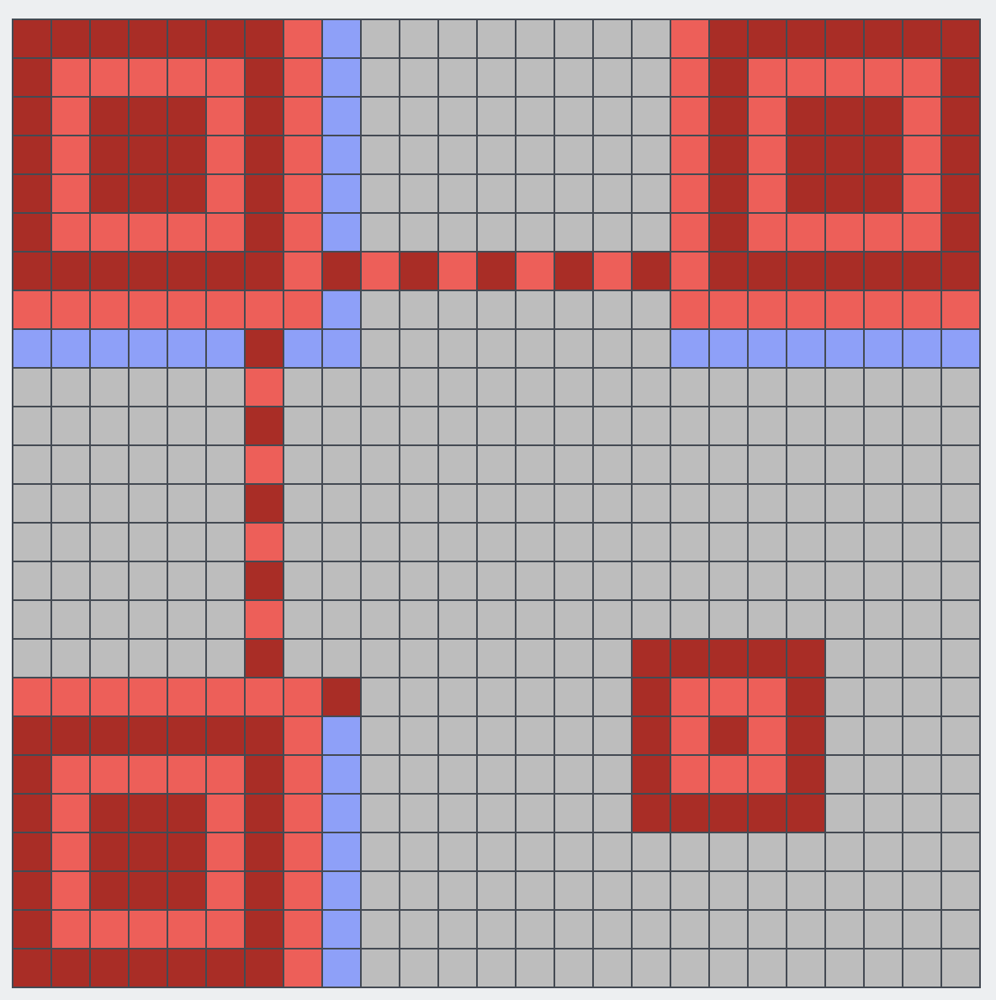

Red section is for positioning, blue section is [Format Info](https://en.wikipedia.org/wiki/QR_code#Encoding).

I fix the QR Code with [QRazyBox](https://merricx.github.io/qrazybox/), clicking the blue section will list all possible format.

Compare from the QR Code given, Error Correction Level: `L`，Mask Pattern: `0` is the only possible solution

The rest is just filling the blocks, once you have fill enough blocks, you'll be able to decode the flag


Flag：`AIS3{H0w_c4n_y0u_f1nd_me?!?!?!!}`

### 👑 Saburo


I didn't really get the idea of this problem at first.

The only thing I discovered is you can get a slightly higher delay in milliseconds with `AIS3{` as input.

I kind of know how to acquire the flag, but doesn't seems legit to me, so I leave the puzzle for later.

Until the second night of the contest, I found that many contestent were complaining that the results were unstable.

I then realize, brute force is probably the only solution.

So I draft a Python script to iterate all ASCII Pritable letters, and do a while true loop until the presence of `}`.

Something look like this:

```python
s = socket.socket(socket.AF_INET, socket.SOCK_STREAM)
s.connect(("60.250.197.227", 11001))
s.send(b"\n");
s.send(input(s.recv(1024).strip().decode()).encode())
print(s.recv(1024).strip().decode())
```

However it doesn't work as I expected it to like it is in terminal, the delay stays low.

My second thought is to convert the script into a shell script, but I just can't, I failed.

Out of the desperation, this is what I came up with:

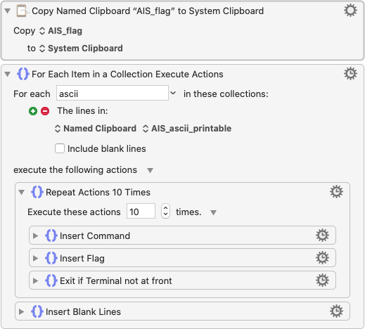

If you don't have a clue, this is called QuickMacro.

It's basically just automatically executing a pre-record keyboard/mouse event.

I'm using Keyboard Maestro on Mac, but I believe any QuickMacro on any platform has the ability to achieve something similar.

It'll work like this:



During this iteration, the corrrect letter is `i`, which is kind of hard to find the difference.

According to author, each letter tops up 5ms of noise.

So at the final stage of decoding, you have to run 10 times for each letter, calculate mean value to really find out the correct letter....

or really, just, use your


You are my Ene.... energy?

If you're lack of imagination (like me)

just.... try it harder than.

The final letter has about 400ms of delay.

Flag：`AIS3{A1r1ght_U_4r3_my_3n3nnies}`

## ♻️ Reverse

### 🎹 Fallen Beat


Decompress the zip archive, fire up jar executable, you'll soon realize this is a custom music game.

To acquire the flag, you'll have to outbeat a full combo.

For those who really are trying:

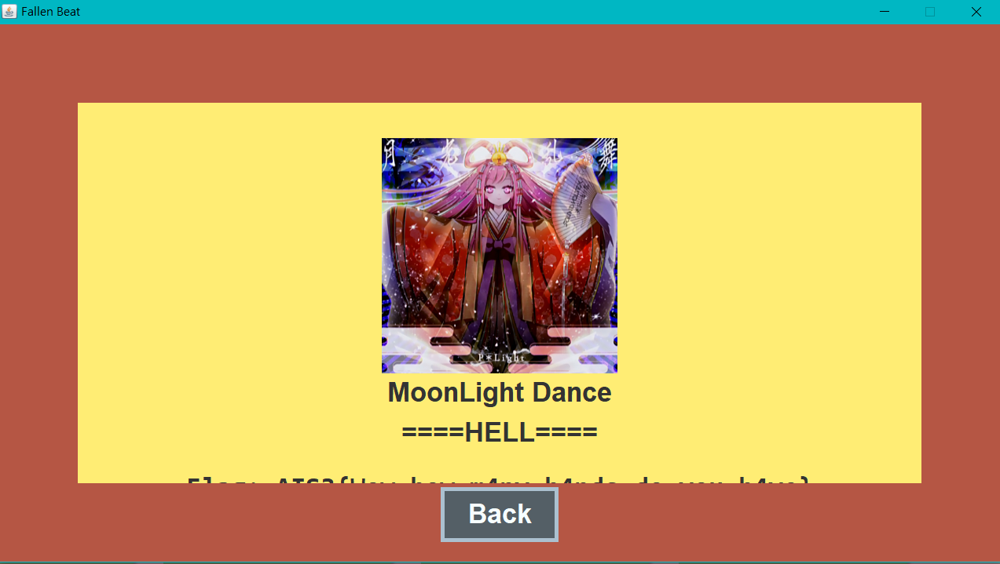

Don't even think about it.

First thing first, decompile jar executable.

There are dozen ways to achieve that,

my entry-level-approach will be....

online decompile, which doesn't suck, to be honest.

The directory contains many java source code file,

global search for keyword `flag`,

you'll find a method `setValue` within `Visual/PanelEnding.java` contain somthing like

```java
if (t == mc) {
    for (int i = 0; i < cache.size(); ++i) {
        final byte[] flag = this.flag;
        final int n = i % this.flag.length;
        flag[n] ^= (byte)(Object)cache.get(i);
    }
    final String fff = new String(this.flag);
    this.text[0].setText(String.format("Flag: %s", fff));
}
```

You can see that flag is not stored with plain text, it's generated by one of the class attributes `flag`

and xor with a `cache` that got pass in. Therefore, we'll need to trace what is the `cache` that got passed in.

Do a second global search with `SetValue`, the result indicate that `SetValue` is only called in `Control/GameControl.java`.

Take some time, you realize the `cache` is the class attribute within class,

so searching `this.cache` in this file can find out that `this.cache` is decalared inside the constructor

```java
// ...
final FileReader fr = new FileReader(fumenPath);
final BufferedReader br = new BufferedReader(fr);
// ...
this.cache = new ArrayList<Integer>();
// ...
while (br.ready()) {
    final String s = br.readLine();
    if (s.charAt(0) != '*') {
        // ...
        this.cache.add(a);
        // ...
    }
}
```

Another problem here is that `fumenPath` is also a parameter that got pass in during the initialze of the class instance.

So, we'll do a thrid global search with keyword `GameControl`.

Luckily, `GameControl` is only initalized once inside`Control/Frame.java`.

Finally, we found out that `fumenPath` is `songs/gekkou/hell.txt`.

Repacking eveything above into [`Exploit.java`](https://github.com/tomy0000000/AIS3-2020-PreExam/blob/main/Solving%20Source%20Code/%F0%9F%8E%B9%20Fallen%20Beat/Exploit.java),

and move `songs/gekkou/hell.txt` to the same directory, then execute the java source code, you'll be able to retrieve the flag.

Be careful that the `br` object that was used to read `cache`, reads an additional line before reading `cache`

```java
this.bpm = Integer.parseInt(br.readLine());
```

so you'll add this into `Expolit.java`, to prevent decoding error.

Flag：`AIS3{Wow_how_m4ny_h4nds_do_you_h4ve}`

## 🙊 Crypto

### 🦕 Brontosaurus


It's abvious that the final keyword `KcufsJ` is a _reverse_ spelling of `JsfucK`

(well actually, you can findout that with Google, too)

It's a custom JavaScript, you can found a decompiler with Google easily.

Fill in the code, which wouldn't work, is beacuse you have to _reverse_ it first.

Flag：`AIS3{Br0n7Os4uru5_ch3at_3asi1Y}`

### 🦖 T-Rex


The keyword of this problem is `nihilist`,

which defined a person that who had a philosophical view that all knowledge and values are baseless,

which in fact, does not help solving this problem, at all.

But nihilist cipher did.

If you're wondering how do I came up with an additonal keyword, cipher, the keyword is `nihilist CTF` or `nihilist encoding`.

Nihilist cipher are composed of two components, a polybius square and a encrypted text.

You can decode the text by matching the corresponding block in the square mattrix.

There are a lot of online tools, but I don't find any being helpful,

so I made my own version with Python, take a look at [`T-Rex.py`](https://github.com/tomy0000000/AIS3-2020-PreExam/blob/main/Solving%20Source%20Code/%F0%9F%A6%96%20T-Rex/T-Rex.py) if you're interested.

Flag：

```
AIS3{TYR4NN0S4URU5_R3X_GIV3_Y0U_SOMETHING_RANDOM_5TD6XQIVN3H7EUF8ODET4T3H907HUC69L6LTSH4KN3EURN49BIOUY6HBFCVJRZP0O83FWM0Z59IISJ5A2VFQG1QJ0LECYLA0A1UYIHTIIT1IWH0JX4T3ZJ1KSBRM9GED63CJVBQHQORVEJZELUJW5UG78B9PP1SIRM1IF500H52USDPIVRK7VGZULBO3RRE1OLNGNALX}
```

## 🌐 Web

### 🦈 Shark


First look at the main page

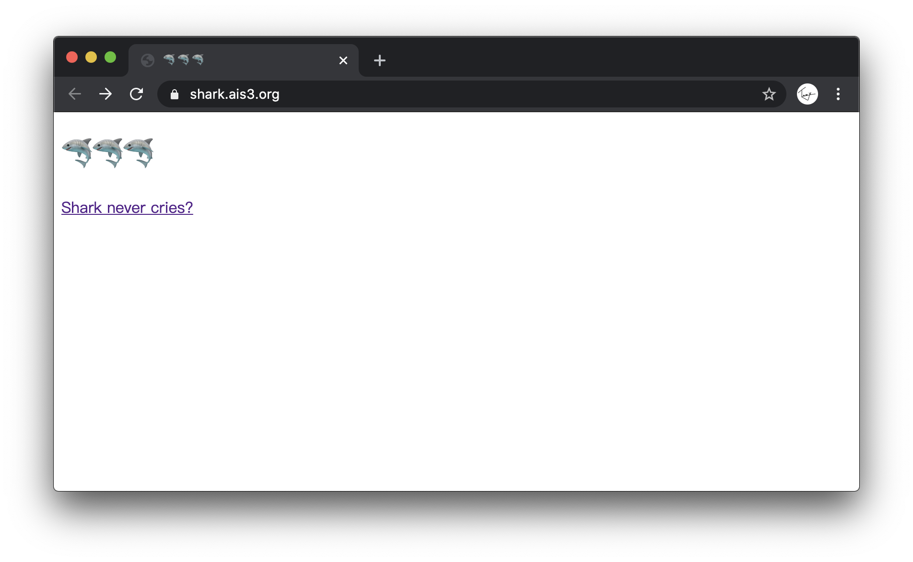

Source code doesn't reveal anything interesting, try clicking the link

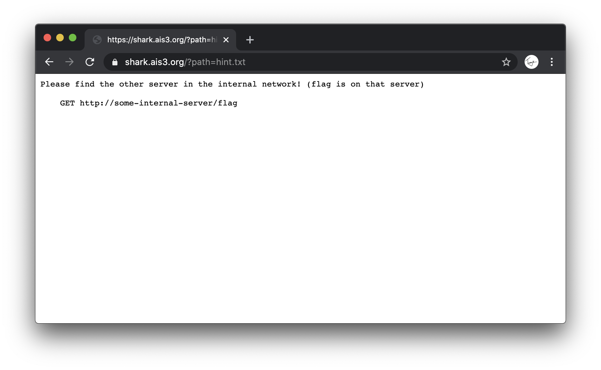

The hint says that the flag is not located on the server that we're visiting, but a server located in the same local network.

By obeserving the URL, you can assume that the `path` parameter can be used to view some file on the server.

I managed to know that unix system tends to store local network informations in `/proc/net/fib_trie`.

Therefore, our first attempt:

https://shark.ais3.org/?path=/proc/net/fib_trie

The access is forbidden, try somethign else:

https://shark.ais3.org/?path=index.php

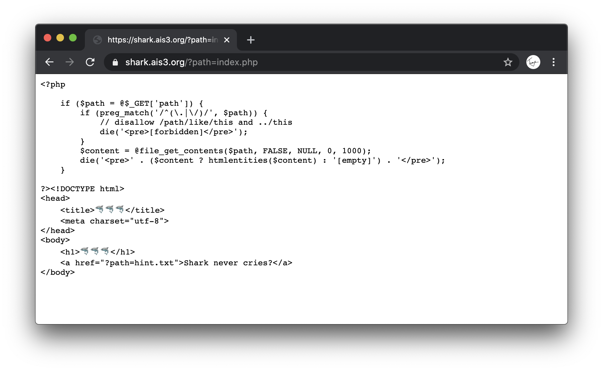

Well, that worked.

You can see that the php source code blocks any access that make use of absolute path and any relative path starts with `..`.

This is where [php://](https://www.php.net/manual/en/wrappers.php.php) came in.

`php://` is a pseudo protocal, which is used to proces data stream

For instance, the exmaple given in php documentation:

```php
readfile("php://filter/resource=http://www.example.com");
```

loads the content of http://www.example.com.

So we changed the original URL from

https://shark.ais3.org/?path=/proc/net/fib_trie

into

https://shark.ais3.org/?path=php://filter/resource=/proc/net/fib_trie

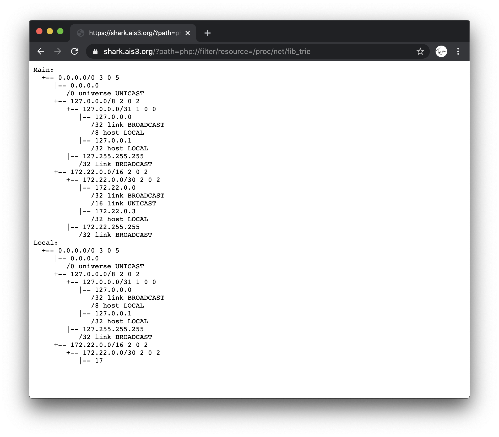

TA-DA!!!

All we need to do now is to analyze the content.

There are many tutorial on Google,

but an obvious way is by guessing that

`0.0.0.0` is for unicast,

`127.0.0.0` is for something realted to localhost.

The only possible answer are those begin with 172.

Combine with the hint given previously,

try this

https://shark.ais3.org/?path=php://filter/resource=http://172.22.0.1/flag

doesn't work.

Try again

https://shark.ais3.org/?path=php://filter/resource=http://172.22.0.2/flag

BINGO🎉

Flag：`AIS3{5h4rk5_d0n'7_5w1m_b4ckw4rd5}`

### 🐘 Elephant


Let's see the landing page

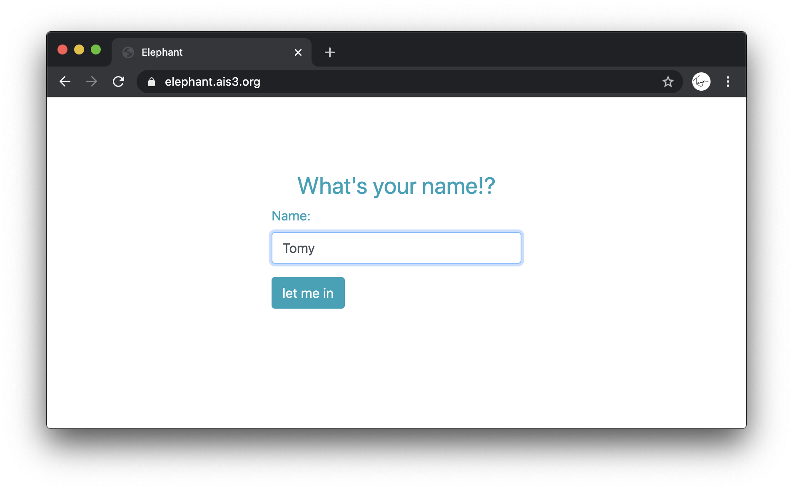

not a clue, try a random name

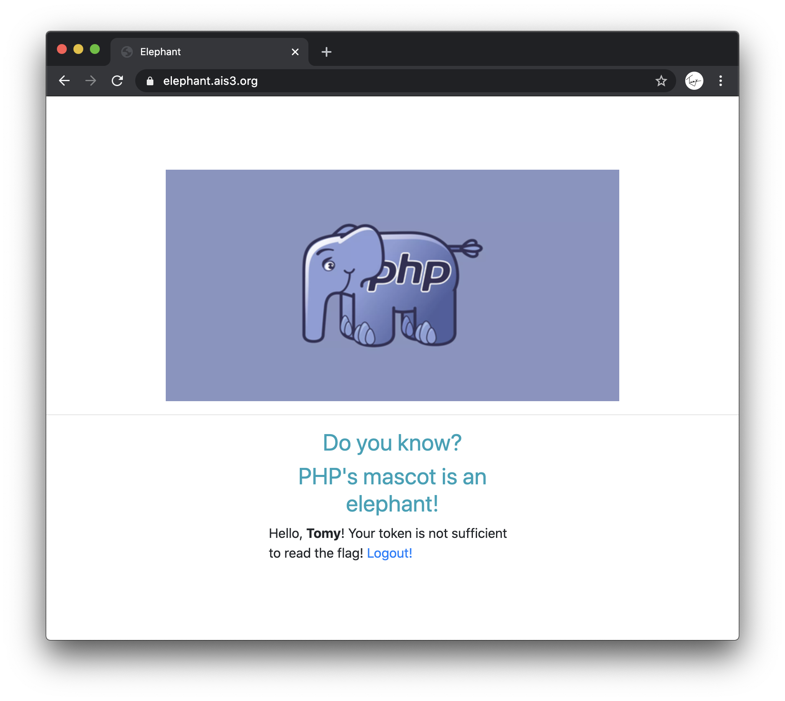

from the keyword `token`, I assume, the previosu page is login interface,

output the flag according to the name given.

Normally, there will be a cookie after login, let's see.

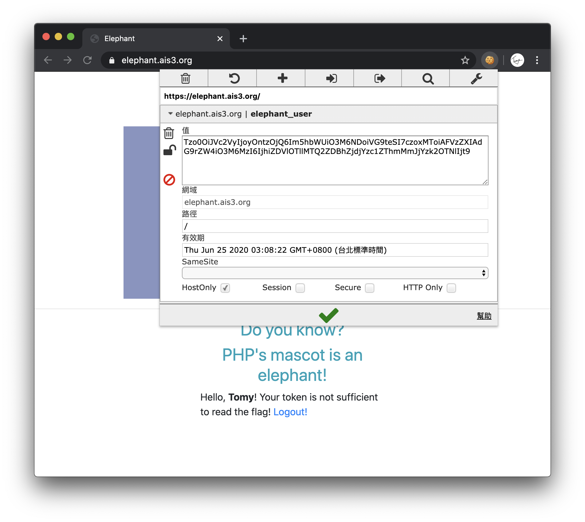

PHP cookies are normally base64 encoded, decode them first.

```
O:4:"User":2:{s:4:"name";s:4:"Tomy";s:11:"?User?token";s:32:"8bd5e99e146d0af7cc75e8f2bcc9693e";}
```

Next, according to a hint from this cheatsheet: [w181496 / Web-CTF-Cheatsheet](https://github.com/w181496/Web-CTF-Cheatsheet#php---serialize--unserialize),

and the knowledge of any PHP string == boolean true.

By modifying the cookie into

```
O:4:"User":2:{s:4:"name";s:4:"Tomy";s:11:"?User?token";b:1;}
```

then base64 encode, fill back into the browser.

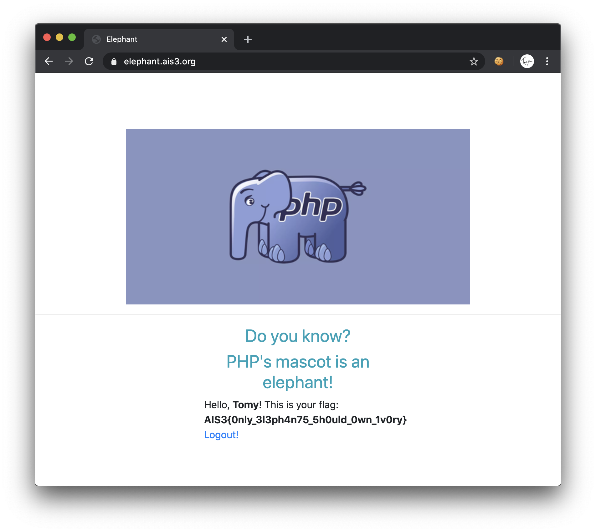

Flag：`AIS3{0nly_3l3ph4n75_5h0uld_0wn_1v0ry}`
