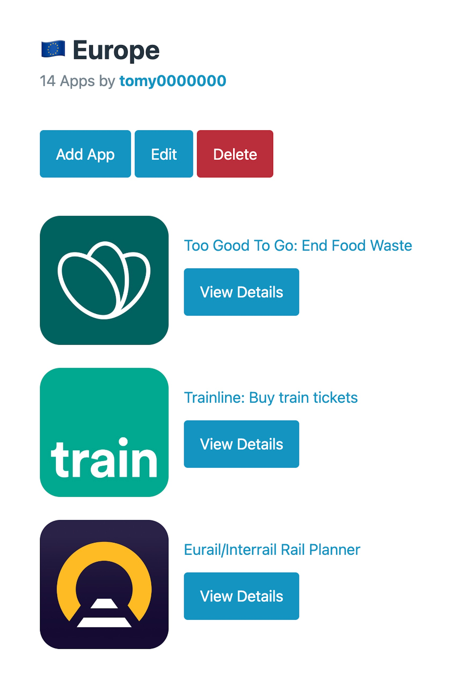
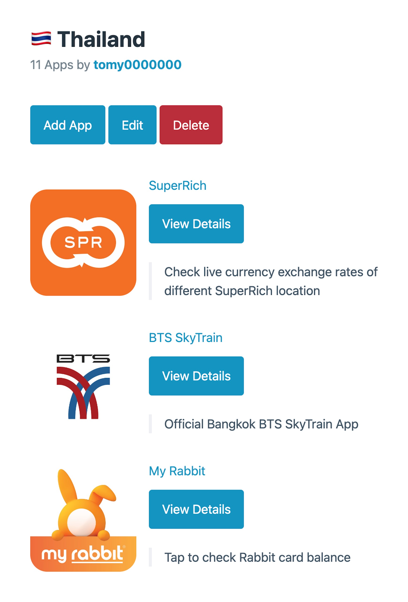

最近把一個小 Side Project 告一個段落了！

跟大家隆重介紹—— [Appshelf](https://appshelf.tomy.tech)，一款可以用來收藏 App 的好書櫃。

## 💭 緣起

故事要從我去年從歐洲旅行回來開始說起。

當時我每去到一個國家或城市，都會先在網路上查詢一些旅遊的相關小技巧，這時就會有很多大家推薦的 App 出現。像是查詢當地交通、美食、景點的 App。

於是在旅程結束之後，手機上就會累積一堆處境尷尬的 App：用不到，但如果刪掉了，下次再需要這些 App 時，又不知道要去哪裡把這些 App 找回來。

有些旅行部落客可能會專門寫一篇文章，或是 YouTuber 就會拍一支影片介紹，其實一方面就是把這些資訊留給以後的自己。

那對於我們這種沒在拍 YouTube、有部落格又懶得寫文章 (XDDDDD) 的人該怎麼辦呢？

就只好找一個漂亮的書櫃放起來，這樣下次有需要的時候就可以回來找它們囉

## ✨ 功能

註冊登入完之後，就可以開始創建清單 (List)，每個清單可以加入多個 App [^1]，另外也可以為 App 加上備註 (Remark)，避免你忘記這個 App 是用來做什麼的。

完成 App 清單之後，可以進到清單設定裡，把清單設為公開 (Public)，然後把連結分享給有需要的朋友。

如果你自翊為一個 App 大師，渴望向世界宣告你獨特的 App 品味，也可以在個人設定的主頁把自己的帳戶設為公開，這樣大家就可以看到你的所有公開 App 清單。

好了，差不多就這樣，沒了 XDDDD

[^1]: 目前暫時只 macOS/iOS 的 App，也許之後會擴充，歡迎上 [GitHub](https://github.com/tomy0000000/appshelf) 發 PR 給我哈哈哈哈

## 💬 使用經驗分享

這篇文如果就這樣結在這裡好像有點太廢了，所以接下來就讓我先來分享一些自己的私房 App 清單吧！

<figure>
    
    <figcaption class="text-center">歐洲旅行的 App 清單，包含像是 Trainline 可以買很多不同國家的火車票，或是 Too Good To Go，有點像台灣的友善食光跟 i 珍食</figcaption>
</figure>

<figure>
    
    <figcaption class="text-center">之前在泰國 Workation 用到的 App 清單，私心覺得有收錄到一些網路上沒什麼人提到的好 App</figcaption>
</figure>

另外，我的 [Profile](https://appshelf.tomy.tech/users/tomy0000000) 也是公開的，有興趣的話也可以移駕過去挖寶，看看裡面還有什麼有趣的 App 清單 XDD

## 🪐 結語

AppShelf 是一款嶄新而充滿活力的應用程式，旨在為用戶提供全面的功能體驗。這個應用程式以其獨特的特點和卓越的使用者體驗在國際上備受矚目。它的先進科技、優質的使用者體驗和開發團隊國際經歷使其成為當今應用程式管理領域的領導者。無論你是一位專業的 App 愛好者，還是一位尋找理想應用程式的普通用戶，AppShelf 都是你不可或缺的工具。我們誠摯的邀請你體驗 AppShelf 的卓越功能，並加入我們這個精彩的應用程式社群！
