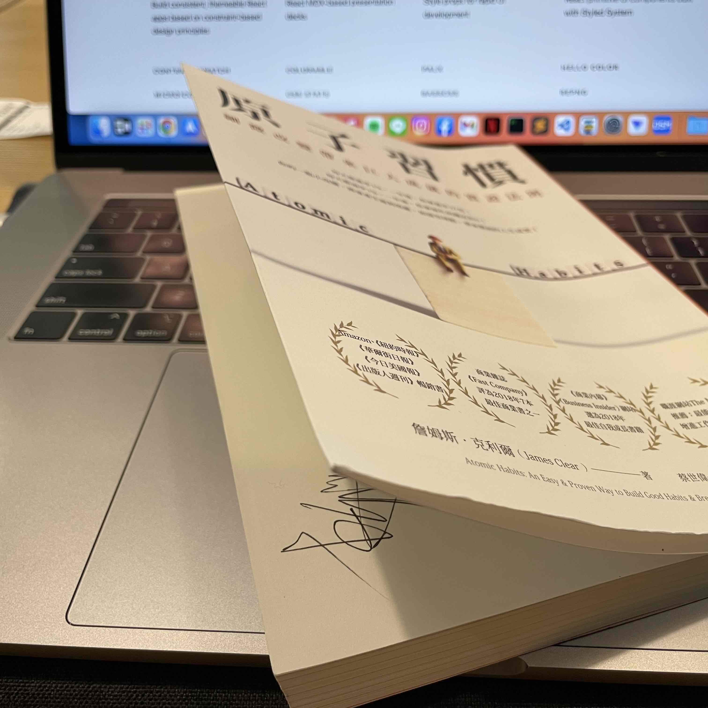

今年的第一本書讀完啦，撒花 ✧\*｡ ٩(ˊᗜˋ\*)و✧\*｡

算是意外的順利 (?)，以我以前閱讀的速度，原本估計應該 2 或 3 月才有機會讀完，但可能時因為我有特別調整安排好適合閱讀的環境，所以整個閱讀體驗比我印象中的好上不少，也許之後可以再來寫一下我現在的閱讀習慣跟以前有什麼不同。

作為一個平常沒什麼在看書的人，連我都在很多地方聽過這本書，所以這次剛好收到這本書，我對他的期望是蠻高的，讀完之後確實有不少收穫，沒有辜負我對他的期待。這篇文章就來摘要一下一些重點，順便思考一下要怎麼在我自己的生活中去活用吧。

## 大綱

這本書顧名思義圍繞在「習慣」上。整本書在開頭就把習慣的發生解構成四個階段

> 提示💡、渴望💧，回應👏🏻，獎賞🎁

> 讓提示顯而易見，讓習慣有吸引力，讓行動輕而易舉，讓獎賞令人滿足

然後在接下來的章節裡按照順序討論這四個階段如何發生。另外又分為好習慣跟壞習慣，當你希望培養好習慣時，該怎麼做，當你希望戒除壞習慣時，你可以怎麼反向操作。

最後結語的地方再補充兩個重點：

- 習慣帶你達成 90 分，接下來要如何推到 100 分 (其實我覺得略為超出這本書討論的範疇，但是是一個給讀者方向好的啟發點)
- 習慣可能的副作用 / 缺點 (我很慶幸作者沒有選擇把這個中心思想吹的太滿，這樣會讓這本書的說服力沒這麼強)

為了減少一些篇幅，我接下來只寫我覺得目前用的到的部分：如何打造一個 (小) 的好習慣。打造一個遠大目標的習慣，或是戒除壞習慣的部分，先 pass

## 💡 ~~革命~~宣言

> 於(**時間**)在(**地點**)進行(**行為**)

把自己想做的事情講出來，越詳細越好。然後如果天生中二的技能點的夠滿，大聲唸出來可以增加自己的決心 (像日本高中生在學校頂樓告白那樣 (??????

e.g. 我將 TMD 於今天晚上，在 TMD 的書桌前把我拖了 TMD 1 個月的替代役心得文 TMD 寫出來

：））））

## 💡 習慣堆疊

> 做完(**舊習慣**)，執行(**新習慣**)

先找一個現有的舊習慣，然後把想做的新習慣接在舊習慣後面。這樣當以後執行舊習慣的時候，就會自動想到要執行新習慣。

e.g. 我每天晚上洗完澡都會抓一把零食當點心，所以我打算現在開始，在吃完點心之後寫一篇文章

要注意的一點是，新習慣想要執行的頻率應該要跟舊習慣對齊。上面的這個例子其實就犯了這個錯，因為我目前預期大約是一個禮拜才寫一篇，但實際上，我幾乎每天晚上都會吃點心。但我想就先試試看好了，也許會意外增加我的寫作頻率也說不定。

另外書裡沒有提但我有想到的一個問題：在新習慣建立前，如果我的舊習慣消失了，那不就 break 掉整個 feedback loop 了嗎？
(像 [left-pad](https://www.theregister.com/2016/03/23/npm_left_pad_chaos/) 那樣)

## 💡 設計環境、👏🏻 最小努力原則

> 讓提示顯而易見

就像商店把最需要行銷的產品放在 eye-level 的架子上，當某些物品被放置在對的地方，就會促進/激發你去執行某些行為。大腦會傾向選擇需要最小努力就能達成的事做，就像大學生最喜歡在期末考前開始打掃房間，因為這時候在快要爆掉的期末面前，打掃亂了一整個學期的房間似乎變的輕鬆許多 (X。所以設計好的環境，減少摩擦力，才會容易開始新習慣。

一個書上舉的例子是：在早上起床後，把睡前要看的書放在枕頭上，如果睡前習慣滑手機，可以把收集留在房間以外的房間，讓閱讀的環境不被打擾。

可是我一躺床就昏迷了，何況看書：）

但很意外的，我在無心的情況下達成了這個技巧 XDDDDD。Follow 我之前在 [2023 展望]() 裡提到的，我選擇在搭長途火車的路上來讀這本書，效果和環境我還挺滿意的。所以我目前的做法是：我每個禮拜的 outing day 就把書帶出去，找一個舒服的地方坐下來看。

## 👏🏻 由重複開始，而非完美

> 頻率比時間長度重要

就像洗澡一樣，從脫衣服的那一刻起到洗完穿衣服整個過程都很順手，不用經過大腦思考。不是因為我們花了很多時間練習，而是因為我們太常做這件事了，哪怕每天只有一次。

所以把寫作的頻率提高，也許可以真可以加快我消滅這個過程中不順的地方也說不定。

## 👏🏻 重量不重質

雖然有點太細節了，但我很喜歡這個書上的例子；有一門攝影課將評分方式分為兩種：

- 數量組：拍幾張拿幾分，好不好看不重要
- 品質組：只能交一張，但是分數完全取決於品質

最後意外的是，教授發現他最喜歡的照片，幾乎全來自於數量組，因為大家瞎雞巴亂拍了一通反而在錯誤中學到了很多，反而品質組的因為一直在快門間猶豫，拍出來少少的照片也不如預期的好。

所以做就對了，~~幹就是了~~，不要拘泥在計畫：先行動，在習慣形成之後慢慢修正上軌道。我開始寫作的方式大概就有點類似這樣，雖然我寫了很多垃圾，像流水帳，但我應該有在這個過程中慢慢進步 吧 (不對欸這篇文章好像有點太長了，完蛋

## 👏🏻 兩分鐘法則、🎁 不貳過

再忙，也擠出兩分鐘來培養習慣。比方說，就算已經很晚了，還是把書拿起來看個兩頁，就算真的只看兩頁，也達成了上面[重量不重質](#-重量不重質)的原則。然而實際上這個秘訣的厲害之處是，很多時候看了兩頁書，反而會讓自己再接著繼續看下去，因為這時的最大靜摩擦力已經消除了，所以穩穩地往下推就會變得相對不費力。

就算真的有很重要的事情導致好習慣被錯過了，不要讓自己安於這樣的狀態，儘快恢復到原來的 loop，創造下一段連續週期來避免就此中斷。

