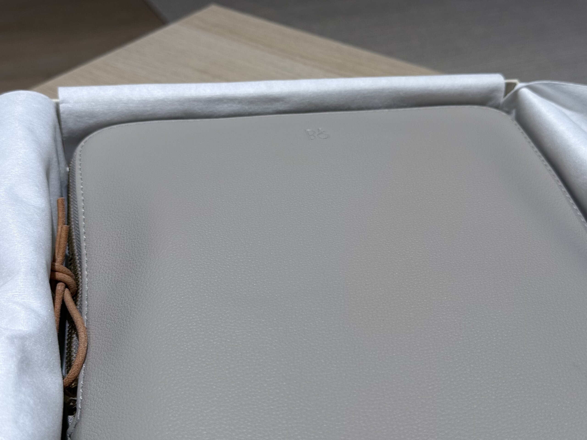
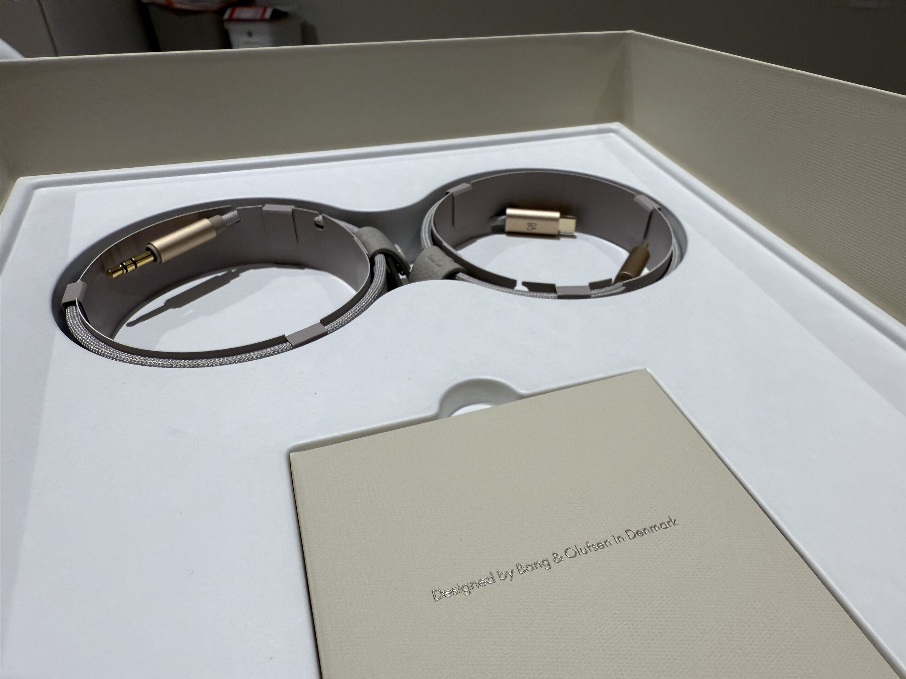

我一般會有兩副耳機，一副是耳塞式耳機，在外出的時候使用，另一副是頭戴式的耳機，則是在我要專心做事、長時間聽音樂的時候使用。我的上一副頭戴式耳機是 Beats Solo3 Wireless，是當年在 Apple Back to School 促銷的時候買上一台 MacBook Book Pro 送的，但他的壽命就沒有電腦來的長了。也剛好在他退役後的好一段時間裡，我也鮮少有需要長時間戴耳機的需求，所以雖然偶爾還是會逛逛看看，但依舊遲遲沒有下手。

## 🌈 想像

當時我心目中「完美」的耳機，作為每天生產力的重要推手，必須具備以下特點：

- 耳墊要包覆整個耳朵：我目前用過的耳機大部分頂多是有一個不差的軟墊壓在軟骨上，久了還是會不舒服
- 支援無損音質 (Lossless)，有線無線都行：雖然我還不至於聽到普通音質就感到不舒服，但我覺得我值得
- 支援 <abbr title="Active Noise Cancelling 主動降噪">ANC</abbr>：理由同上
- 長得順眼

當時我做的第一件事是：上美國 Amazon 搜尋 "Over-ear Headphone" 然後篩選價格在 $300 以上的選項，很意外的發現，除了 AirPods Max，基本上沒有其他耳機有黑色以外的顏色。說實在，黑色也不是問題，但大部分造型都不俐落、操作不直覺，甚至還有本體是塑膠殼的，感覺就像去吃精緻的法式料理，然後端上來居然是用軍營裡的鐵盤盛裝，而且邊角還有點髒髒的。

## 💬 選項

快跳到去年的時候，各大耳機廠商總算是嗅到了些商機，願意開始在高端耳機市場做一些更大膽的嘗試，我也重新開始物色新選項：

| Brand             | Model                  | Price (USD)          |
|------------------|-------------------------|-----------------------|
| Bang & Olufsen    | Beoplay H100             | $1549                  |
| Bang & Olufsen    | Beoplay H95             | $999                  |
| Bang & Olufsen    | Beoplay HX              | $599                  |
| Apple             | AirPods Max             | $549                  |
| Dyson             | OnTrac                  | $499                  |
| Sonos             | Ace                     | $449    |
| Sony              | WH-1000XM5               | $399                  |
| Sennheiser        | MOMENTUM 4 Wireless      | $379    |
| Beats             | Studio Pro              | $349    |

我原本的首選一直都是 AirPods Max，因為蘋果全家桶，自然踩雷機率一定是最低的。原本的計畫是等第二代出了之後就可以無腦下單，但後來改版就是從 Lightning 改成 Type-C 然後加幾個顏色，市場也確實挺買單的，但我可不想。

去年在紐約 SoHo 逛街的時候就無意路過了 Bang & Olufsen 的旗艦店，原本只是想聽聽 H95 和 HX，但人都來了，就想說順便體驗一下 H100。簡單的結論是 H95 和 H100 之間是存在感覺的到的差距的。至於值不值得 $500 的差距，就是另外一回事了。

但這正是 Bang & Olufsen 想要達成的目的：耳機來到這個價位，本來就是一種奢侈消費，不應該以電子產品來審視他，而是以精品的角度來品味。[^1]

[^1]: 有興趣的人可以看看 Bang & Olufsen CEO Kristian Teär 在 [Financial Times](https://archive.ph/PvZsD) 的專訪

## 🥡 開箱











## 🔚 結語

9.9/10

這支耳機在很多方面都達到，甚至遠超越我原本對他的期待，我想了很久有什麼可以挑剔的地方，但還真沒什麼好挑剔的。即便 Apple 剛好在這個月底[^2]透過推送韌體更新的方式讓 AirPods Max 也支援了無損音質，我本應該感到些許惋惜，但實際上卻是一絲一毫都沒有。

具體功能我就不一一介紹了，有興趣的可以自己去看看網路上的開箱，但如果你有興趣，接下來會遇到我的話，歡迎來找我試聽。

唯一一個我覺得值得一提的是，這是一支模組化的耳機，所以在未來也可以不斷替換耗材和重要部件，來延續壽命甚至升級。

H100 的 100 象徵 Bang & Olufsen 滿 100 週年的登峰造極之作，也是我用第一份薪水買給自己的第一份紀念禮物，我會期待接下來跟著他一起面對無數挑戰的日子。

[^2]: 就是這麼剛好，甚至是這篇文截稿前幾天。
