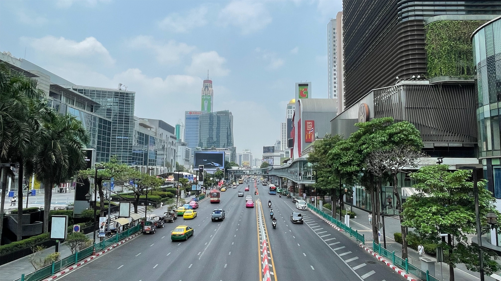
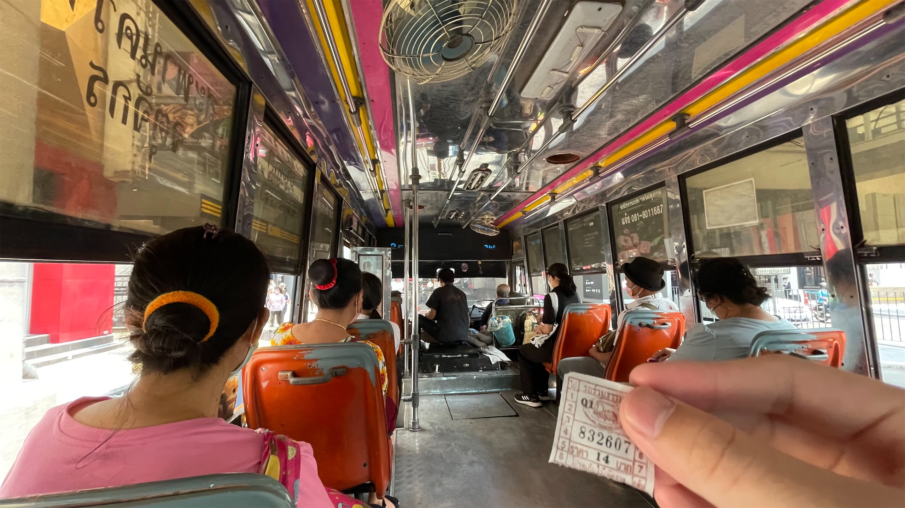
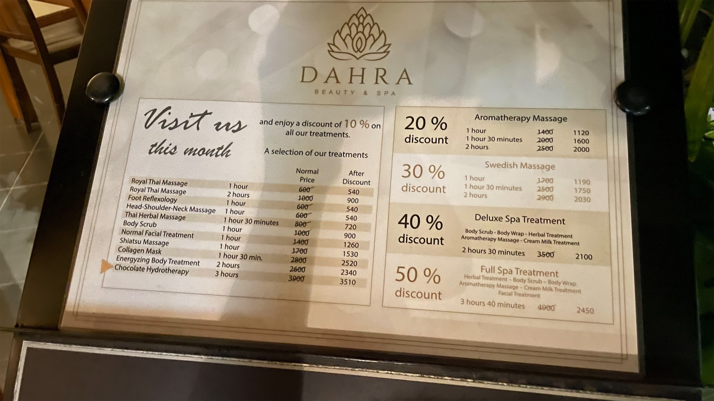
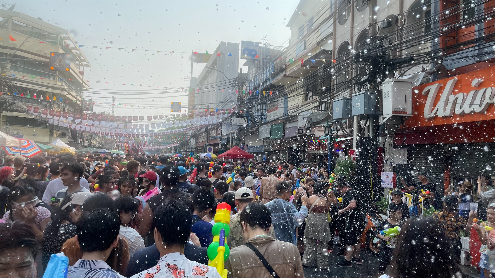

在今年碩班的各種雜事 ~~(a.k.a. 隕石)~~ 還沒砸下來之前，我趕快趁著還有空的時候，來曼谷和胡志明市 Workation 一個月。

至於為什麼會選曼谷，最大的原因是便宜：



我在曼谷的日子，基本上每天一杯泰奶或果汁，路邊餐車賣的大概 25฿ (NT$23)，連鎖 ChaTraMue 的大概 45฿ (NT$41)。想不到吃什麼就吃 Pad Thai，最便宜的我吃過一盤 60฿ (NT$54) 還有附蝦子。

當然我沒有計畫 costdown 太多，畢竟還是在度假，有機會還是會適度揮霍一下。

總之，剛離開曼谷，就趁我記憶猶新的時候來寫一下我對[恭貼瑪哈納空](https://zh.wikipedia.org/wiki/%E6%9B%BC%E8%B0%B7#%E6%81%AD%E8%B2%BC%E7%91%AA%E5%93%88%E7%B4%8D%E7%A9%BA%E7%9A%84%E8%A9%9E%E6%BA%90)，A.k.a.

> กรุงเทพมหานคร อมรรัตนโกสินทร์ มหินทรายุธยา มหาดิลกภพ นพรัตนราชธานีบูรีรมย์ อุดมราชนิเวศน์มหาสถาน อมรพิมานอวตารสถิต สักกะทัตติยวิษณุกรรมประสิทธิ์

> 帝釋天旨述、工巧天神築，天子御駐，極宮浮出，九玉樂都，宏偉盛處，金湯天固，玉佛永屬之天神京都

這座城市的想法吧 XDDDD

## 🏙️ 天際線、🏢 建築

 可以看到漂亮的昭披耶河夜景，可惜 iPhone 的夜拍正常無法發揮：）")

高樓林立、遼闊的天際線是我對曼谷的第一印象。

特別是搭 ARL 從機場進市區，還有隔天搭 BTS 到 Siam 的百貨區，這一段路上的風景給人感覺曼谷是一座現代的大都會，大樓的高度很高，但不至於密集到有壓迫感，建築設計上也各有巧思，不單單只是工整的形狀，所以整體的景觀是舒服的，我個人認為比台北好看很多。

另外一個特色是 BTS 空鐵站普遍建在 3 樓，2 樓會留給行人空橋，然後直接接入旁邊的大樓或是百貨，所以雖然市中心的交通普遍還是偏亂，但是對大部分的民眾和觀光客來說，他們不需要在一樓跟車子搏鬥。

另一個好處就是，很適合在上面看曼谷市區的風景。

不同於其他國家的百貨把精品、化妝品等較高價的商品設在 1 樓，因為大部分的顧客都是從 2 樓的空橋進入，所以這邊反而 2 樓配置更高價的商品，而 1 樓則是會有其他的用途，比方說超市或美食街。比較奇怪的是雖然百貨有很多樓層，但 4、5 樓以上的空間使用效率普遍不佳，看起來多半很荒涼，不確定是不是還沒完全從疫情恢復的原因。

## 🚦 交通

泰國的交通[十分多元](https://bkk.com.tw/bangkok-traffic-collection/)，甚至是到了有點令人眼花瞭亂的地步。在這邊我幫大家整理一個快速指南：

- 短程：搭公車 or 走路
  - 先用 Google Maps 查路線
  - 然後用 [ViaBus](https://apps.apple.com/app/id1074208600) 看公車到哪
  - 分新車和舊車：新車有冷氣，搭起來跟其他已開發國家的公車差不多；舊車是開窗的，但是搭起來別有一番風味
  - 在曼谷的路上散步，我覺得不算危險，畢竟當你可以享受這座城市的時候，為什麼要困在交通工具裡滑手機呢 [^1]
- 中程：捷運 or 嘟嘟車
  - 捷運優先，沒有到的話叫嘟嘟車
  - 喊價用力喊就會知道到底底價在哪裡 (我曾經 120฿ 殺到 80฿)
  - 或是用 [MuvMi](https://apps.apple.com/app/id1410088538) 叫車
- 長程：計程車，上車要講「by meter」，不時看一下手機地圖讓司機知道你不是吃素的，人懶的話就用 Grab

總而言之，交通雖然複雜，但是選項多元、觀光客友善，我自己是沒有花太多時間就熟悉各種交通工具，而且英文都是通的。

## 🫱🏻‍🫲🏽 觀光友善

作為 Alpha 級的世界級城市，泰國和曼谷的觀光業十分發達，各項措施都對觀光客非常友善，外國遊客的背景也很多樣化。所以跟上面交通最後提到的一樣，英文不只在大部分交通工具都通，基本上觀光客有機會出現的地方都通。

這樣形容聽起來有點抽象，所以就來舉個例子：菜單。菜單基本上一定會有英文，而且翻譯會落在一個難易度適中的區間。就是他不會翻譯的太淺到你不知道那道菜到底是什麼，但又不會翻譯到太精準以致於你看不懂。

但就算你不會英文也沒關係，因為每一個品項都有圖片，就算是啞巴，用指指點點的一樣可以點餐。

另外一個神奇的特色是，在某些觀光客導向的店，比方說按摩會館、咖啡廳，菜單根本就是全英文的，反而沒有泰文。又或者是在 Phrom Phong, Thaniya 路這種日本人密度高的區域，也許你可以把日文拿出來烙個兩句。

也因為全世界的觀光客都會出沒在曼谷，這裡的飲食選擇非常多元，吃不慣泰式料理，日式韓式台式基本上都不難找，體驗其他異國料理也是不錯的選擇。

剛好上禮拜才寫到[國際化]()，如果從這個角度來說的話，曼谷應該是各方面都大勝台北，如果你有能力日本自由行，那你就能曼谷自由行。

## 🪙 兩種價格、兩種世界

接下來要來講一些比較沈重的部分。

在我待了差不多三天之後，我發現了一個現象。如果我某一餐吃的很在地，那價格會落在 100฿ 上下，但如果是上館子吃，價格就會直接上升到 300฿ 左右。

 type: 'bar', data: { labels: ['< 100฿', '100฿ ~ 200฿', '> 200฿'], datasets: [{ label: '晚餐單價', data: [8, 3, 10], tension: 0.2 }] } 
<figcaption>統計了一下我晚餐單價的分佈</figcaption>

這中間的斷層，還有即便在最熱鬧的 Siam 商業區路邊也可以看到街友乞討，是一個很明顯的跡象：觀光客所在的曼谷，跟在地人所在的曼谷，是兩個不同的世界。甚至在網路上也有人分享，某一些餐廳會根據你是外國人還是本地人來給你不同的價格目錄。

這篇 [Quora](https://www.quora.com/Why-is-everything-in-Thailand-so-cheap) 裡面有幾個泰國本地人來回答「為什麼泰國的物價這麼低」，很多答案還蠻有意思的，建議大家有空可以點進去看看。簡單來說有三個近因：

- 貧富差距
- 產業未升級
- 觀光業過度興盛 (Overtourism)

腦筋轉得快的人可能會發現，這不很明顯就是政府沒在運作嗎？Uhm... 這樣說沒錯，但政府其實也沒什麼機會好好運作，因為[泰國一天到晚都在政變](https://zh.wikipedia.org/wiki/%E6%B3%B0%E5%9C%8B%E6%94%BF%E8%AE%8A)，但這就有點扯遠了。

總之，作為一個來這邊~~拉一坨屎就走~~的觀光客，我覺得我們都應該意識到，對我們來說，疫情是有一兩年不能出國玩，對另一些人來說，疫情是生活會越來越艱困。可以享受這麼便宜品質又不差的觀光體驗，很大程度上必須感謝有很多泰國人正活在水深火熱之中。

## 🇹🇭 總結

認真想了一下發現：如果你現在有一筆預算可以去墾丁玩，那改成來泰國玩潑水節，一樣可以玩到水，又不會多花太多錢，我可以保證，比墾丁好玩太多了。同理，如果你想去日本或韓國，但是機票太貴、住宿太貴下不了手，我一律推薦改來曼谷，一樣有唐吉軻德，~~一樣有泡泡浴~~。


    
    


總之就跟醉後大丈夫 2 裡面演的差不多 嗎 (?)，曼谷是個適合一群臭男生在大學畢業的時候一起來瘋的旅遊城市 😂，但即便不是這樣的設定，我相信也可以在曼谷玩的很愉快。

推薦給大家 👍🏻

[^1]: 去年交換的時候法國人教我的
