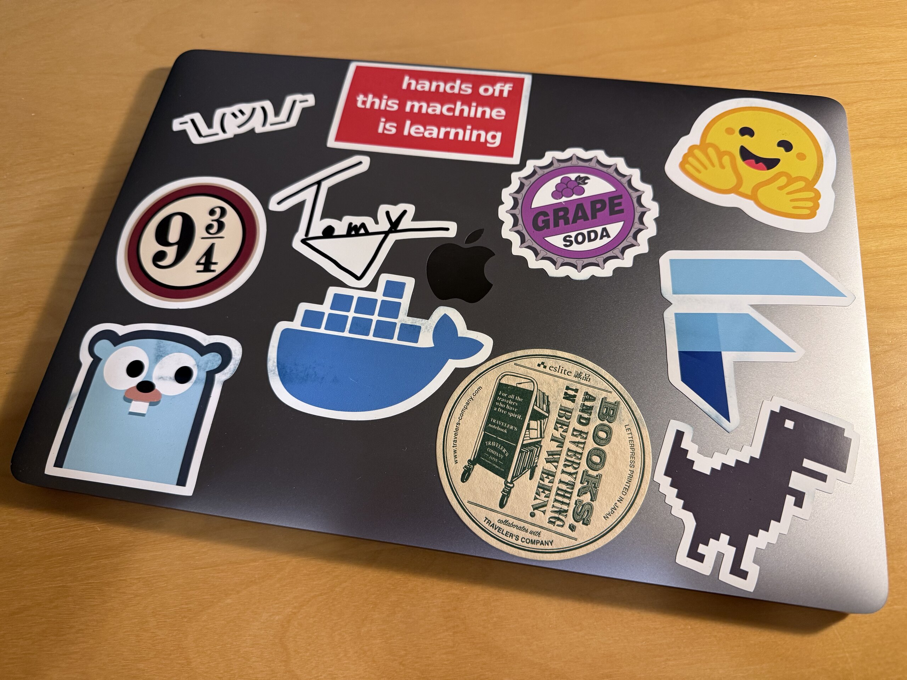
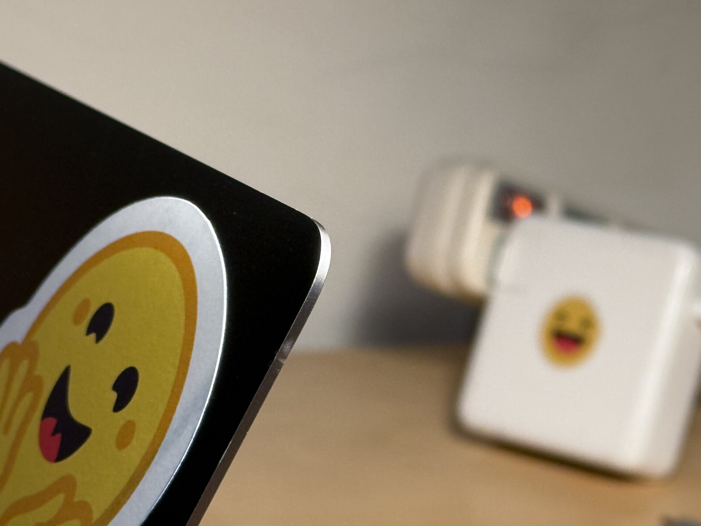
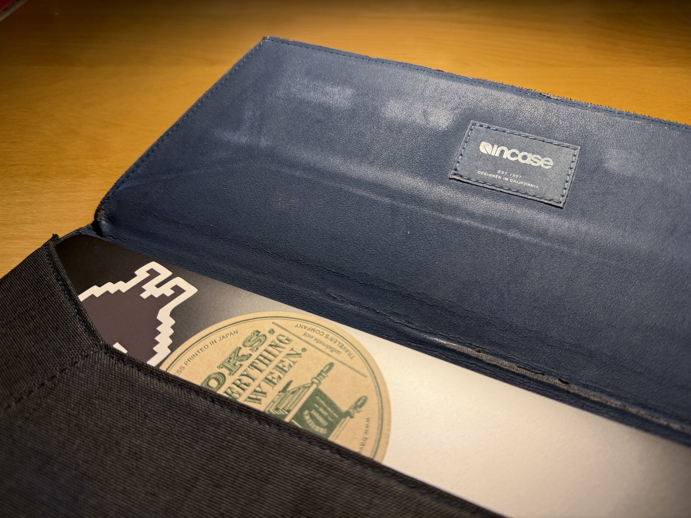
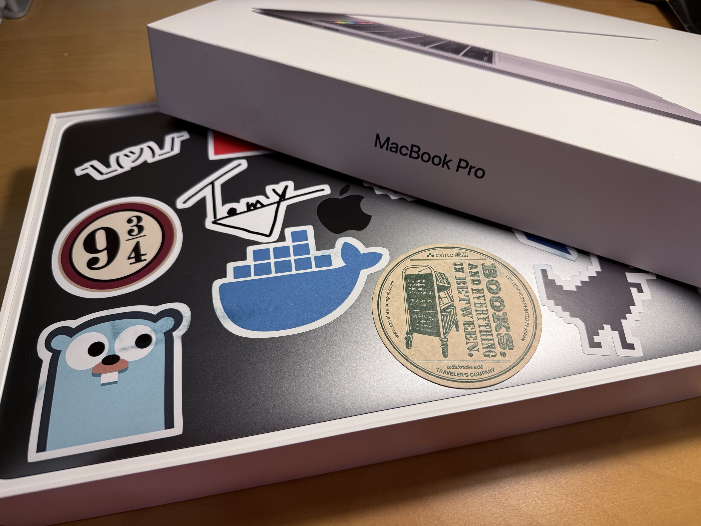

如[之前報報]()寫的，我在去年暑假的時候換了一台新的 MacBook Pro。通常按照常理，理論上我只需要從 Time Machine 的備份恢復到新的機器上就好，但因為這次是從 Intel CPU 轉移到 Apple Silicon 的架構，我預期處理各種不適應問題可能會比直接重灌還花更多的時間，於是我採取了後者。與此同時，我也趁著這個機會跟很多久沒用的資料、App 斷捨離，加上在 CMU 的最後一個學期課業沒有絲毫的減緩，這些種種加起來都導致整個遷移的過程變得相當冗長，這篇文就這麼拖到了現在。

那總之就來細數這台 MacBook Pro 的往事吧！

## 👀 外觀

在筆電上貼貼紙通常有兩派，一派是一直往上貼，新的蓋住舊的，最後版面會變的比較雜亂，另一派則是會不定時把舊貼紙撕下來換新的。但 MacBook 因為是鋁合金的機身，貼紙黏貼超過一定時間，底下接觸不到空氣的金屬氧化速度會和沒有貼起來的地方不一樣，所以即便貼紙本身沒有殘膠，也會留下一塊色差。因此，我的策略就是，一台只會貼一次，然後上面的貼紙就再也不會撕下來。

當時貼的貼紙也多半反映了當下的 Tech Stack 和喜好：

- `¯\_(ツ)_/¯`：我最常用的顏文字，目前沒有適合的 Emoji 能取代這個機掰又無奈的臉，相信常看 Blog 的人應該很熟悉，嘻嘻
- [9 ¾ 月台](https://zh.wikipedia.org/zh-tw/%E4%B9%9D%E5%8F%88%E5%9B%9B%E5%88%86%E4%B9%8B%E4%B8%89%E6%9C%88%E5%8F%B0)：出自哈利波特，倫敦國王十字車站搭乘霍格華茲特快車的隱藏月台
- [Gopher](https://go.dev/blog/gopher)：Go 程式語言的吉祥物。當時還沒學的程式語言，現在工作天天寫
- Hands off this machine is learning：別碰！這台機器正在學習！因為這台 Mac 確實用來訓練了不少模型 XDDDD
- 我的經典 Logo：歷久不衰 (?!?!?!)
- [Docker](https://www.docker.com/company/newsroom/media-resources/)：容器化工具，貼上去的時候還沒用過，現在也是工作天天用
- 葡萄汽水瓶蓋：出自《天外奇蹟》(Up)，[For performing above and beyond the Call of Duty](https://youtu.be/ePa0x-bh6Do?si=5EN4N3e2RMQJIx7P)
- 誠品 × Traveler's Company 聯名貼紙：活版立體印刷，摸上去既有和紙的舒適，又有立體的紋路，最適合我這種假文青 (?)
- [HuggingFace](https://huggingface.co/)：<abbr title="Natural Language Processing 自然語言處理">NLP</abbr> 界的第一把交椅 Library，是我在中興實驗室和畢業專題不可或缺的重要基石
- [Flutter](https://flutter.dev/)：當時具有無限潛力的跨平台前端框架，玩了幾次，後來就沒啥碰了
- Chrome 小恐龍：網路斷線時的好朋友，可 i ❤️

## 🛡️ 保護套

關於跟這台筆電搭配的保護套，有一個小故事可以講。

身為一個經常帶 MacBook 去咖啡廳~~裝逼~~辦公的人，上廁所免不了需要把筆電一起帶進去，這時候筆電如果有一個保護套會方便許多。於是我就帶我媽去 101 的 Apple Store 展示當時 Apple 官方最高貴的[皮革保護套](https://web.archive.org/web/20180830061616/https://www.apple.com/shop/product/MRQU2ZM/A/leather-sleeve-for-15-inch-macbook-pro-midnight-blue)。

那個絲滑的質感，再加上筆電放進去時，四個橡膠腳墊分毫不差的滑入留好的孔洞，真的是只有「舒爽」兩個字能形容。

可惜皮革要價不斐，NT$6000，太貴了。

彼時，我再拿出隔壁副廠 [Incase 的這個保護套](https://www.incase.com/collections/macbook-pro-15-inch-2016-2019/products/envelope-sleeve-in-woolenex-for-15-macbook-pro)[^1]，雖然是聚酯纖維，但質感還是相當好，簡單俐落的信封造型，而且筆電滑到底時開口的隱藏磁鐵會自動吸上，還可以方便夾些文件，雖然還是不便宜，但是只要前者的 1/3 左右，我媽二話不說就答應了。

我想我確實是有些生意頭腦的吧 (自信甩髮 (???

[^1]: 我也挺意外現在居然還有在賣

## 📜 歷史

一台要價台幣十萬的電腦，當然服役的年份也得對得起這個價格。但中間當然也不是沒有波折。這台電腦總共經歷過 2 次大修：

- 2018 年 8 月啟用
- 2020 年 2 月 (18 個月)：電池效應，上機殼 (鍵盤) 有些微膨脹，官方報價 US$498
- 2021 年 3 月 (30 個月)：螢幕有些微色斑，如果沒記錯應該是防眩光塗層脫落，所以螢幕是整塊換了，再加上電池容量也有減損，但這一代的電池必須要整個上機殼一起更換，所以上機殼也換了，官方報價 US$1097

當時購入的時候花了差不多一萬塊加購 AppleCare，所以這將近快五萬塊的維修費全部 Apple 買單，真的是名符其實的阿婆保佑，應該是我買過 Apple C/P 值最高的產品，沒有之一。

2022 年時我幫這台電腦設定的大限是碩士畢業，其實差不多就是撰寫這篇文的現在，2025。但自從 2023 年底升上 macOS Sonoma 之後，就變得越來越不穩定，最惱人的問題之一是，他如果待機過久，系統小睡會直接睡到斷片，畫面還在，但是沒有反應，必須強制重開機。最後忍無可忍，就決定提前半年換新機了，剛好工作整整 6 年。

## 👑 傳奇

或許不是所有人都能同意，但我認為這可能是 Apple 至今推出過，最接近完美的一代 MacBook Pro。

首先，重量和體積都壓縮到了非常有感的輕薄，換到 2024 年版的時候，那重量讓我一度懷疑店員是不是拿成 2004 年版的。而為了達到這個輕薄的程度，這一台所搭載的第二代蝴蝶腳鍵盤雖然還是稱不上完美，卻也足以滿足我外出沒有外接鍵盤時的需求。

I/O 的部分則是簡約到只留下 4 個 USB-C / Thunderbolt，頂多再加一個耳機孔。在家我可以一條線接 Hub 滿足外接螢幕、硬碟、充電；出門就是一個孔充電，一個孔接螢幕或配件。我可以自由支配 4 個孔各自的用途。

最後當然還是要提一下 Touch Bar，雖然大部分時候裝飾的成分居多，不可否認的是這依舊是一項交互體驗的十足創新。據我自己的經驗，Touch Bar 適合的操作有三種：

1. 提供鍵盤、滑鼠、觸控板難以取代的觸控回饋體驗：比方説要快速翻閱 1000 張照片，找到需要的某一張，滑鼠、鍵盤只能用點的，觸控板雖然可以快速捲動，但沒辦法把捲動的速度跟縮圖產生連結。
2. 作為「有點複雜，但又不會過於複雜操作」的快捷鍵：太簡單的操作，使用者可能會傾向使用鍵盤快捷鍵，太複雜的操作，適合用滑鼠慢慢確認每一步，中間的這個空間，就是適合放在 Touch Bar 進行的操作，一個我常用的例子是在 Excel/Numbers 裡輸入函數或快速完成表格。
3. 裝逼：比方説[這樣](macbook-pro-touch-bar-pac-man.jpg)，或是[這樣](macbook-pro-touch-bar-nyan-cat.jpg)

上面的這些設計，現在大部分都不存在了，對大部分專業使用者來說：

- 重量本來就不是一個很重要的考量，不然就去買 MacBook Air 就好了
- 拿一個 USB-C 去換成 HDMI + SD 讀卡槽，包包就是少帶兩條轉接線
- 附有功能鍵的剪刀腳鍵盤，可是經過了長時間的考驗，他不可動搖的地位，依舊是遠超出了 Apple 的預期

即便 Apple 在 Mac 上這幾年多了些妥協，但也是在這些經典的設計回歸時，我才意識到這個品牌曾經為筆電的未來，描繪出多麼激進且前衛的願景。

## 🔚 結語

趁著年初回台灣，總算是把剩下的檔案遷移完了。系統也重新恢復成了出廠時最早支援的版本，做最後一次的外觀清理，然後放回當時買來的盒子。

謹此紀念，見證我生命中最輝煌歲月的一台電腦，陪我讀完大學、走遍歐洲、前往美國、攻讀研究所——這是我的 MacBook Pro 2018。
