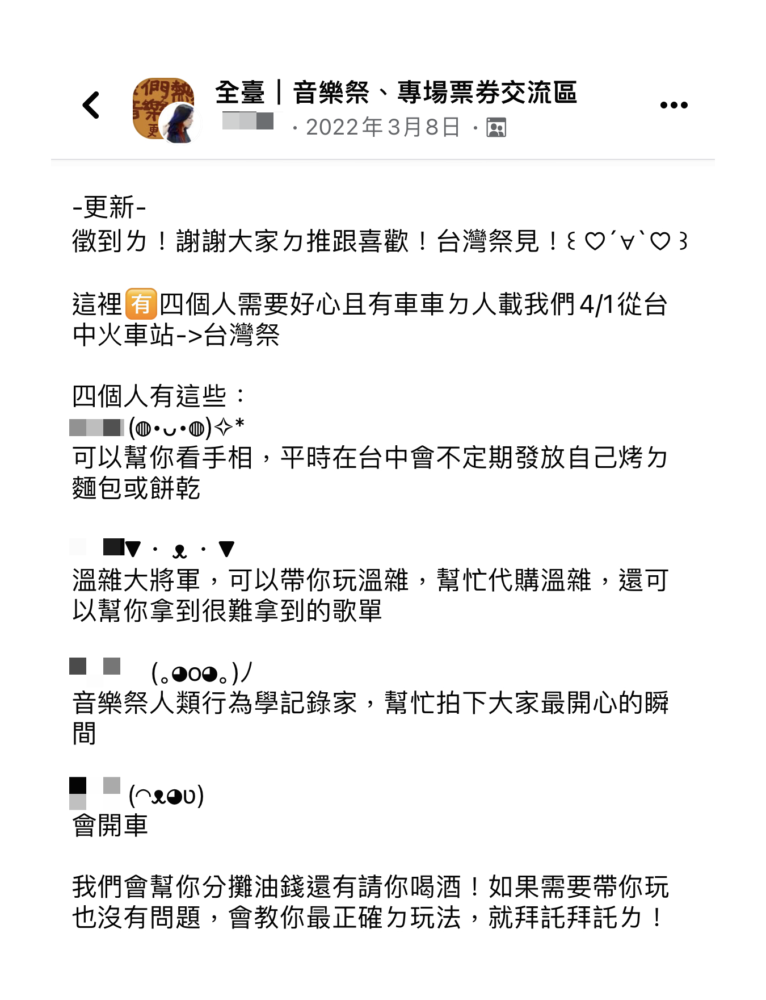
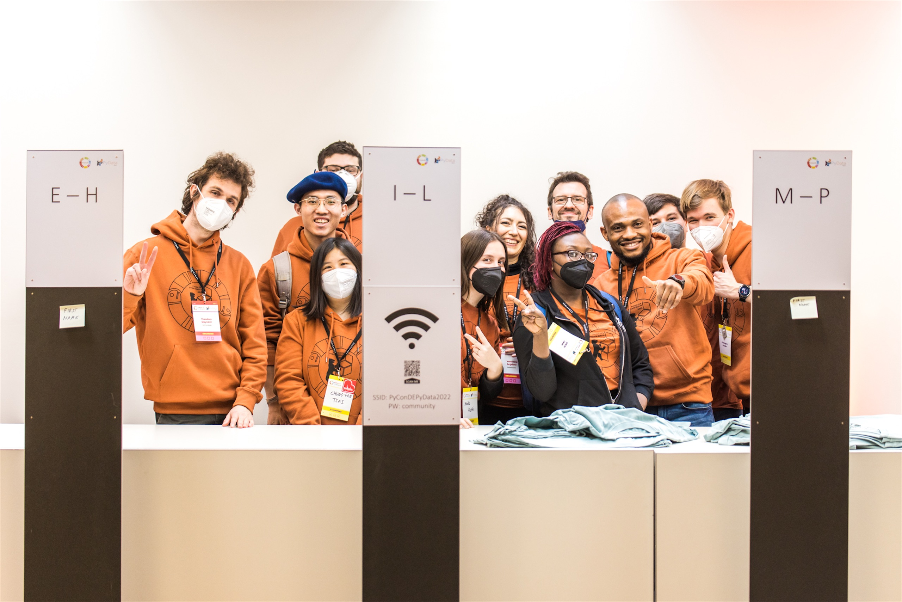
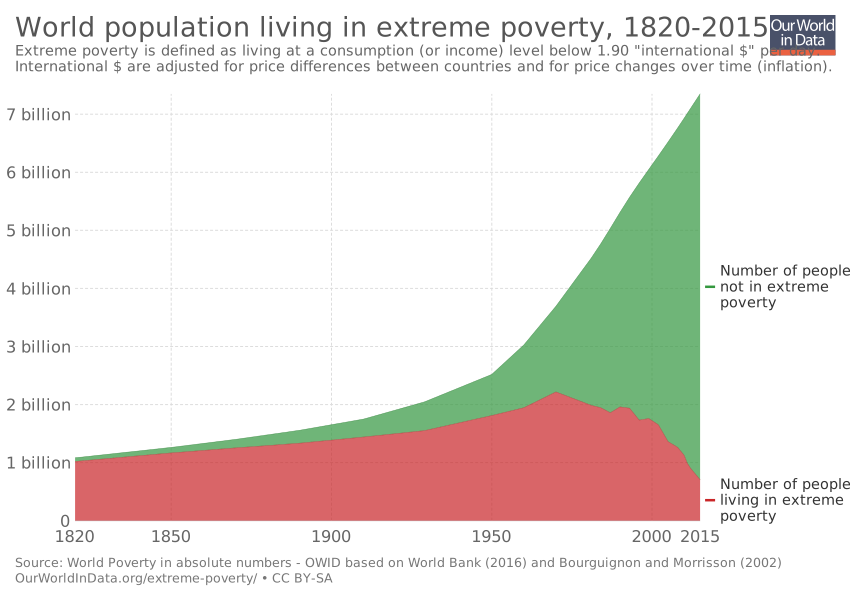

這本書的原名叫做 [The Ethical Traveler](https://www.smithstreetbooks.com/catalogue/the-ethical-traveller/)，其實照字面上翻譯的話應該叫做道德旅遊，但感覺念起來就是有點拗口，再加上讀完之後，我覺得他所提到的內容其實概念上其實更接近「永續」，於是才有了現在的標題。

內容相當簡明扼要，就是列出 100 條你可以遵循的守則，在旅遊的同時為當地帶來友善的改變。下面就列出幾個我覺得滿有意思，或是值得大家關注的一些議題吧。

P.s. 推薦大家可以搭配這首歌來閱讀


<figcaption class="text-center">HONNE - smile more smile more smile more 😃😆😝</figcaption>

## 💚 減少碳排

身為 21 世紀的人類，這應該不難理解。雖然大家在日常的生活中也許都有一些環保小撇步，但在旅遊的時候，可能就比較容易忽略這個問題，這邊有幾個例子可以給大家參考：

- 19. 長距離移動的時候，以火車取代飛機
- 23. 短距離的時候，多使用大眾運輸
- 24. 食用當地的食物，減少食物的碳足跡 a.k.a. Foodprint (哎呦很會雙關 XD

在台灣，國內旅遊的交通選項不多，畢竟除了離島之外已經沒有國內線航班了。但如果是在歐美，比方說從巴黎去柏林旅遊，選擇搭乘火車還是飛機，就會呈現一個五五波的分佈，因為考量票價和時間的花費，飛機其實是一個蠻有競爭力的選項。但其實飛行是一個非常高耗油的交通方式，打個比方，如果我們今天要從台北到高雄：

- 搭高鐵從台北到左營的碳足跡大約是 [10.88 公斤的 CO₂](https://www.thsrc.com.tw/ArticleContent/5a1f4c72-b564-4706-bcdd-efbda93c3d93)
- 搭飛機從松山機場到小港機場的碳足跡大約是 [121 公斤的 CO₂](https://co2.myclimate.org/en/portfolios?calculation_id=5834085)[^1]

對，大概是 11 倍左右 🙃，這也是為什麼[法國政府決定在接下來的幾年逐步禁止國內線航班](https://www.forbes.com/sites/carltonreid/2022/12/03/frances-plan-to-ban-short-haul-domestic-flights-wins-approval-from-european-commission/?sh=505c0efb2385)，因為法國的高鐵已經遍佈全國。

那如果非得要飛行怎麼辦呢？你可以使用 [Google Flight](https://www.google.com/travel/flights) 尋找碳排較低的航空公司飛行，並且「<abbr title="Carbon Offset">碳抵換</abbr>」掉你在這趟飛行中所產生的碳排。簡單來說就是根據你的飛行距離計算你的碳排，然後捐錢給相關的非政府組織，讓他們用這些錢去森林裡種樹，把你跟地球借的乾淨空氣還回去 XD。通常大一點的航空公司會在訂票的過程提供這個加價項目，如果沒有的話可以試試一個瑞士非政府組織的網站：[myclimate](https://co2.myclimate.org/en/flight_calculators/new)

同樣的概念也可以套用在食物上。食物好吃的鐵則就是新鮮，但就算可以從挪威空運鮭魚來台灣，也不知道會經歷了多少天的旅程，而且除了飛行會有碳排，海鮮還會需要全程低溫冷凍，最後我們在餐桌上吃到的食物，可能有超過一半的價錢是在付運費，然後好吃的程度是在當地吃的不到一半 QQ

所以，想吃好吃的鮭魚，就還是親自去挪威吃吧：）

[^1]: 其實現在並沒有這樣的航線，這個數字是用距離 × 每公里油耗計算出來的

## ✨ 增加體驗

旅行的目的地可能會無聊，但旅途的故事不會 🤠

- 31. 共乘認識新朋友
- 43. 認識當地人
- 70. 嘗試和體驗中醫或另類療法
- 93. 待久一點

分享一個我之前發現的音樂祭玩法：去 FB 的相關社團裡找共乘，然後就會不小心認識一些可以一起聽音樂、喝酒的酷酷朋友，甚至還可以交換一些沒聽過的團。

<figure>
    
    <figcaption class="text-center">最好是找那種人多，然後看起來ㄎㄧㄤㄎㄧㄤ的團 去音樂祭跟這種人玩準沒錯 XDDDD</figcaption>
</figure>

如果要深入一個地區旅遊，體驗所謂的在地文化，最好的作法，就是認識當地人。這也是為什麼選擇在在學的期間出去交換是很棒的機會，因為你馬上會有一整個班的在地同學可以認識。如果只是短期的出國，住在有附交誼廳的青年旅館也是一個認識新朋友的方法。我在泰國的時候就遇到一個中國人，他就每天晚上的時候待在交誼廳裡找人聊天，短短幾天就認識了不下二、三十個外國人。

那如果你天生沒有點社交牛逼的技能，這時候試試交友軟體也許會是個不錯的選擇。把地區設定在要去的地方，然後開始~~瘋狂右~~滑，就算你們最後沒有真的見面，也許也會從對方身上問到很多私房餐廳，或是了解當地的各種文化、思維。

待久一點，剛好就是我這一次去[曼谷]()和[西貢]()的設定，經過這次的體驗，我可以證實這這麼做確實可以有更多時間去充分體驗這兩個城市，並且進一步去關心這個國家，我想從我之前寫心得文的深度應該也可以證明這一點。

體外話，泰國大選剛落幕，但是新總理要等到差不多 7 月才會出來。這一屆的大選相對前幾屆特別受外媒關注，有可能會翻轉泰國長年的政治僵局，並在未來的 10 年對泰國產生至關重要的改變，如果你之前沒有關注過，現在是一個很適合~~下注下一任泰國總理是誰~~找相關的新聞看的時機。

## 💰 省錢

- 2. 去剛受災的地區旅遊
- 4. 淡季旅遊

這雖然聽起來很像地獄梗，但意義上來說，你就是在用行動去支持當地的經濟，所以其實沒有什麼不對。選擇剛遭遇災難的地區旅遊，不但不用人擠人，而且通常在這個時機點造訪，因為流失了大量的觀光客，所以通常會意外拿到一些不錯的機票、旅宿折扣，甚至是房型升等。淡季旅遊也是同樣的意思，也許大家清一色都選擇在夏天去澎湖玩水，在冬天去北海道玩雪，但如果這些你都體驗過了，何不試著反向操作看看，也許在享受折扣的同時，會意外發現這個地區不一樣的風貌也說不定。

## 😖 打擊貧窮

如果你是一個常看新聞的人，你可能很難不產生一種：「人類真是一個糟糕物種」的念頭。好消息是：雖然人類在過去的 20 年桶了不少簍子，但我們成功做到了一件事——減少極端貧窮。

> 過去，世界上絕大多數人口生活在極端貧困的條件下。生活在絕對貧困中的全球人口比例從 1800 年的 80% 以上下降到 2015 年的 20% 以下。 根據聯合國的估計，2015 年大約有7.34億人或10%仍處於極端貧困中。
>
> -- <cite>[維基百科](https://zh.wikipedia.org/wiki/%E8%B5%A4%E8%B2%A7)</cite>

但極端貧窮距離台灣坦白說有點遙遠，但我在看相關資料的時候看到一個數據：台灣目前有 53.5% 的人口，平均日薪根本不到 US$40，更糟糕的是這個數字在 2000 年的時候是 50%。[^2]

扯遠了，總之你在旅遊時的選擇，是有機會改善的勞動環境甚至是受薪狀況的，可以從下面的例子做起：

- 63. 認識並了解當地的黑暗面
- 47. 支持遊民，參與街友導遊團、購買大誌雜誌
- 70. 給小費前多想一陣子。給太少不尊重，但給太多可能會破壞當地的收入秩序[^3]，10% 通常是一張不錯的安全牌。
- 75. 其實你並沒有那麼需要殺價，也許你是多付了一點錢，但這些錢或是會多支撐一個家庭一個禮拜的伙食費也說不定
- 76. 如果你真的想幫助路邊要錢的小孩，請把錢捐給當地慈善團體

[^2]: 資料來源：[Our World in Data](https://ourworldindata.org/grapher/poverty-share-of-population-living-on-less-than-40-a-day)
[^3]: 書上給了一個我難以想像的例子：在古巴，最聰明的人會選擇去開計程車而不是當醫生，因為開計程車獲得的小費比當醫生的收入來的高太多了。

## 💩 Bonus

突然發現好像收在一個很嚴肅的地方，那再補充一條好了：44. 路邊解放 💩

路邊解放聽起來很像某種落後的行為，但是根據 [Leave No Trace](https://lnt.org) 的說法，只要符合下面的條件，其實路邊解放是非常友善環境的哦哦哦

- 遠離水源地 200 公尺，或是 70 大步
- 如果你要上的是 2 號，就在地上挖一個 1.5 個手掌深的洞，然後使用環保可分解的衛生紙，一同埋進洞裡就行了 👍🏻

## 🗺️ 結論


    
    

<figcaption class="text-center">這本書是我在曼谷的時候在一間叫做 <a href="https://goo.gl/maps/FPJ2DiNeHDTwmuSZA">HARDCOVER</a> 的書店買的</figcaption>

我當時有上網查這本書在 Amazon 只要賣 US$16.95 (折合台幣 $520)，但是在那間書店要 ฿950 (折合台幣 $840)，但後來想想覺得，能在旅行途中翻到一本感興趣的書也是有緣，就別計較這麼多了吧。

也許這篇文看下來，很容易產生覺得資訊量過大的感覺，但只要從一個簡單的概念去思考就好：

> 這個地方在被我造訪之後，是變得更好，還是更糟了？

當心有餘力的時候，審視自己在旅行中所做的各項決定，因為他們是有可能對一個地方帶來改變的。

這本書雖然是全英文的，但是文字量不多，插圖也蠻好看的，所以就算當圖畫書翻一翻也還不錯，剛好適逢疫情解封旅遊潮大爆發之際，推薦給大家。
