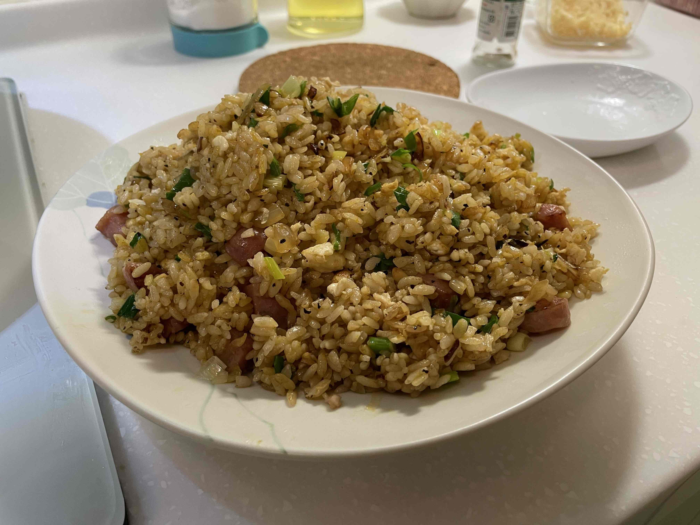

---
# https://gohugo.io/content-management/front-matter/
# https://jpanther.github.io/congo/docs/front-matter/
title: "🥡 炒飯"
date: 2023-01-24T20:53:40+08:00
lastmod: 2023-01-24T20:53:40+08:00
description: "說起料理，第一話當然就是要從炒飯開始啦"
images: ["fried-rice.jpg"]
videos: ["https://youtu.be/IzlW-sZzVD8?t=1034"]
keywords: ["炒飯"]
series: ["🍳 料理"]
feature: "golden-fried-rice.png"
featureAlt: "中華一番的黃金炒飯"
coverCaption: "說起料理，第一話當然就是要從[炒飯](https://youtu.be/IzlW-sZzVD8?t=1034)開始啦"
---

## 材料

- 米飯 1 杯
- 香腸 4 條 (或其他替代的肉類配料，e.g. 培根、火腿、牛肉...etc.)
- 蛋 3 顆
- 蔥 1 條
- 蒜末
- 鹽巴
- 黑胡椒
- 醬油

## 備料

1. 開始前 1 小時先把米飯放下去煮，煮好後要稍微留在電鍋裡保溫一陣子，讓水分再稍微悶一下
2. 蔥切成薄片，香腸切成約半公分的小塊

## 烹調

### 熱飯

1. 打蛋，蛋白打到碗裡面，蛋黃打到電鍋的飯裡面
2. 用飯勺把蛋黃和飯拌勻
3. 開中火，沙拉油在鍋子中間倒約 3 圈
4. 鍋子熱後，把飯倒進去炒勻。這個步驟的重點是要把飯再稍微炒熟，順便把結塊的部分炒散，還有把蛋黃再伴的更均勻
5. 炒個三、五分鐘後，再把飯倒回電鍋裡

### 炒料

1. 開中火，沙拉油在鍋子中間倒約 3 圈，等油熱後放入蒜末炒香
2. 蒜末炒香後，放入香腸
3. 香腸炒至約七、八分熟後，就可以把飯倒進來炒了
4. 炒勻後，撒入鹽巴、黑胡椒
5. 醬油到約一勺到鍋鏟上，沿著鍋緣往下倒
6. 再炒個三、五分鐘，差不多炒勻後就可以關火了
7. 起鍋前灑入蔥花，用餘溫翻炒一下，就可以起鍋了

