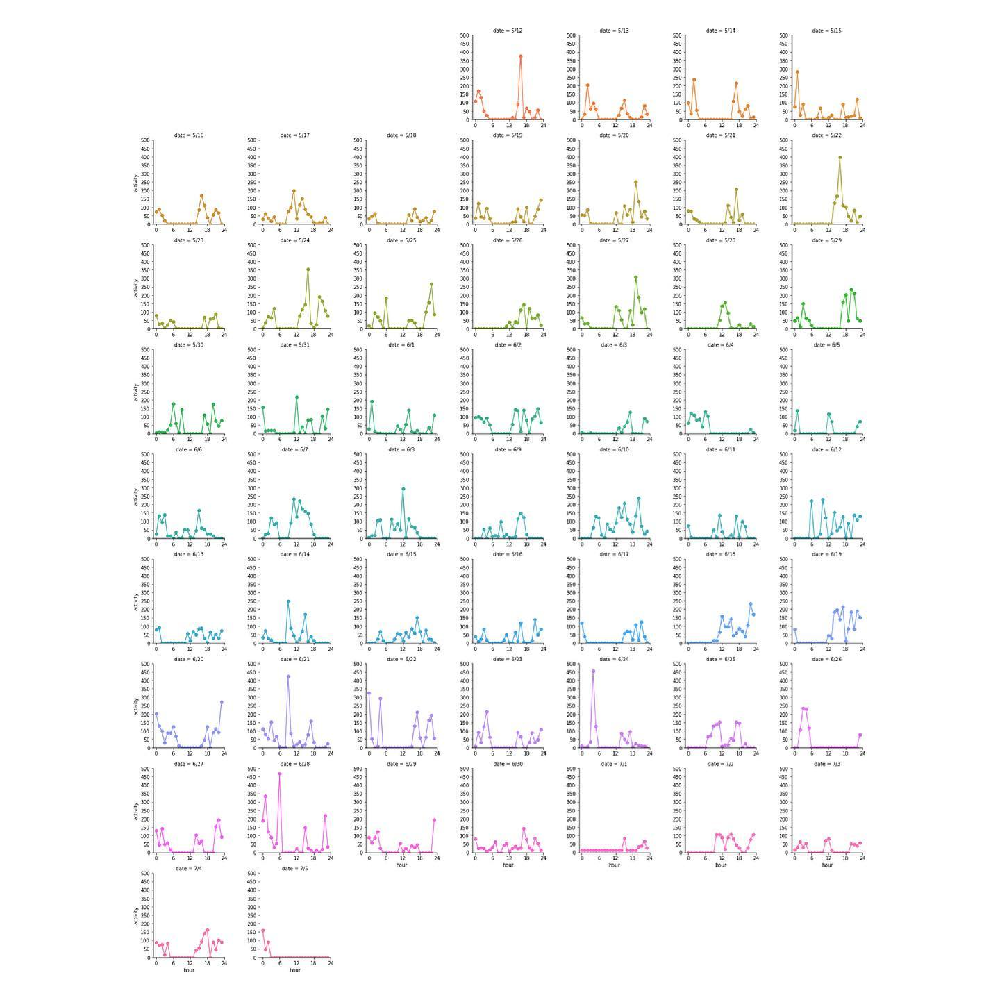
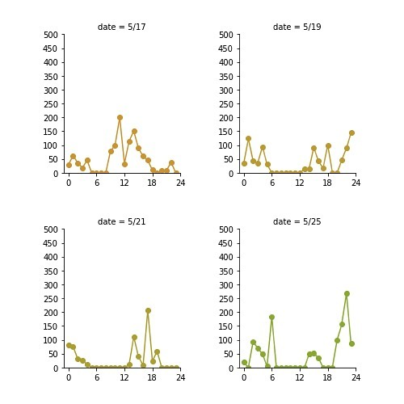
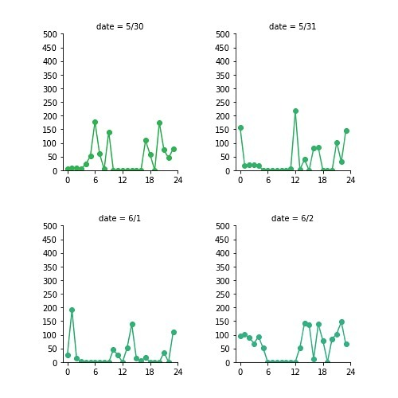
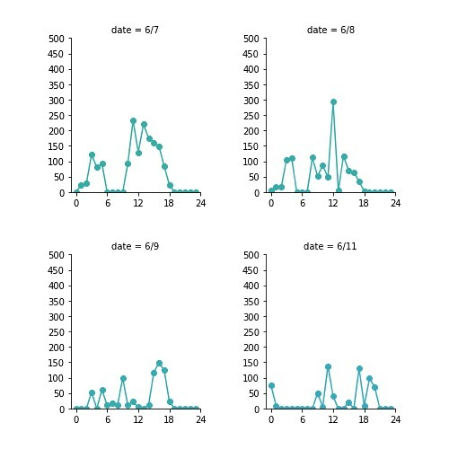
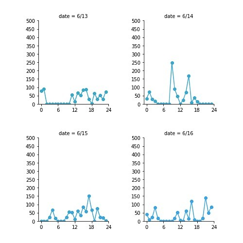
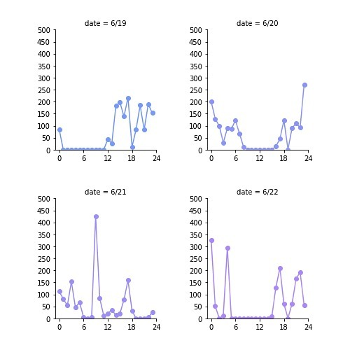

之前 5 月多的時候本來想說，啊專題快爆了，每週一文就停更了唄。結果這一停不得了，一不小心 2 個月就過去了呢。令我蠻意外的倒是，有好多人來敲碗為什麼不寫了，真是令我受寵若驚 o(≧v≦)o

作為回歸的第一篇，就先來回顧一下這兩個月的居家辦公吧xDDDD

在差不多三級警戒差不多剛滿一個月的實驗室例行 meeting ，快結束的時候老師補了一句，建議大家好好檢查一下這一個月以來，事情是變多了，還是變少了。我自從 5/12 回到台北開始，就幾乎沒出門了。再加上只要是醒著的時間，我要嘛不是在刷手機就是在用電腦。啊於是我就突發奇想，如果把 Chrome 的瀏覽紀錄輸出，畫成圖表，應該可以很好的呈現我的生活作息和趨勢。

第一排中間開始是 5/12 (三)，後面就是照行事曆下去排，我這兩個月的生活作息大致上有三種檔次：

## 第一檔

基本上就是標準的晚睡晚起，其實就只是延續我平常在台中做專題的作息，大致上就是修 code 修到凌晨 3~5 點，把模型放下去 train，然後睡到下午 1~3 點起床看結果。這個階段的副作用可能包含不小心在吃完晚餐後斷片在沙發上 (5/21)，這個階段結束時，我的作息大約晚台灣時區 6~7 小時。

## 第二檔

大致上是從 5/29 起算，我稱之為 Eureka 階段。這個階段有兩個重要的時間點，一個是實驗室 5/31 輪到我報 paper，另一個是 6/4 專題初賽 deadline，總而言之就是一個密集衝刺的，事情爆幹多的禮拜，所以作息在無意間變成有點像沒 feel 的時候先硬幹一下，真的發現沒搞頭就去睡一下，通常睡去第一次深層睡眠週期回來的時候，腦袋會突然閃過一個靈光，然後就可以起來衝刺一下進度。6/4 專題搞定之後，估計學期結束之前應該是不會再恢復實體上課了，所以我當天臨時當天往返台中，把重要的給西全部扛回台北，包含兩個電腦的螢幕和 switch，畢竟做專題可以效率 50%，但耍廢效率當然就是要 150% (x，這個階段大致上結束在 6/5 ~ 6/6 ，這時候的時差有調整回來，雖然是用 +24 的方式。

## 第三檔

經歷了幾天正常吃的到早餐的台灣作息之後，就進入了第三檔——兩段式。這個作息的靈感來源自一檔的副作用，基本上就是吃完晚餐就直接開睡，睡到差不多凌晨 2、3 點，起來洗個澡吃個宵夜、幹點活，然後天亮再補睡個 4 小時，起來再吃個早午餐。可能也因為剛好這段時期沒什麼重要的事情，所以可以說是我近期最喜歡的一種生活模式，過起來其實蠻舒服的，唯一的缺點就是實驗室禮拜四晚上固定的會議會打亂這個節奏。

## 輪迴

接下來期末前一個禮拜整理了一下前陣子很久沒做的雜事，作息回到一檔，然後在期末考週為了做 AIoT 期末報告不小心開了二檔，還不小心第二次跨越國際換日線，最近又大概回到一檔。

## 結論

明天實習就要第一天上工了，就期待我能調整到一個正常一點的作息吧 (￣▽￣)，或是三檔好像也不錯 (?)

其實認真想想，現在的我可能已經離悠哉生活越來越遠了，接下來大概也只會有忙、很忙、跟爆幹忙這三種狀態吧。也許早點習慣這樣的新常態，像習慣疫情那樣，從縫隙中擠出時間來做自己覺得重要的事情，才是上策吧。

如果有人有興趣想看看自己的 Chrome 瀏覽紀錄會畫出什麼，我把程式都放在 GitHub 了，還請大啊賞個 🌟

我回來ㄌ，如果我太久沒發文還請大家來催稿 (˶‾᷄ ⁻̫ ‾᷅˵)
