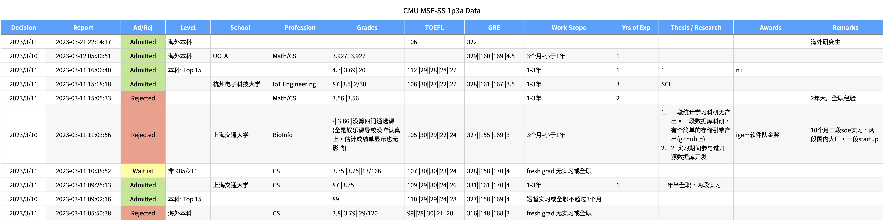
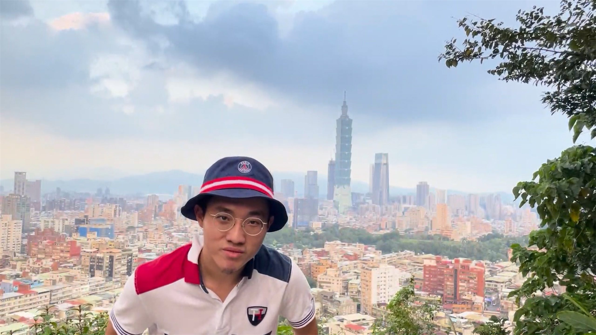

這篇是 CS 碩士申請的下集，還沒看過[上集]()的話可以先去看看那篇再回來。

二話不說先開獎！！

## 🔥 申請結果

總共投了 18 個學程，其中：

- 🌟 代表夢幻區：以我的實力要上會有困難，但做人不能沒有夢想
- 🎯 代表重點區：分數差不多的落點，申請資料可能會推一把，也可能把自己送下去
- 🛡 代表保底區：就是用來確保我不會~~下水餃~~全滅，然後明年再見用的：）

<small>小撇步：點擊學校可以看到全名，點擊學程縮寫可以查看學程主頁 P.S. 如果點了沒反應可以試試看長按</small>

|     | 學校                                                                                                  | 學程                                                                                                                                      | 送出日期   | 開獎日期   | 結果         |
| --- | ----------------------------------------------------------------------------------------------------- | ----------------------------------------------------------------------------------------------------------------------------------------- | ---------- | ---------- | ------------ |
| 🌟  | <abbr title="Carnegie Mellon University 卡內基美隆大學">CMU</abbr>                                    | [MCDS](https://mcds.cs.cmu.edu/)                                                                                                          | 2022-11-29 | 2023-03-02 | 🥲 Rejection |
| 🌟  | <abbr title="Carnegie Mellon University 卡內基美隆大學">CMU</abbr>                                    | [MSCS](https://csd.cmu.edu/academics/masters/ms-in-computer-science)                                                                      | 2022-11-29 | 2023-02-24 | 🥲 Rejection |
| 🌟  | <abbr title="Carnegie Mellon University 卡內基美隆大學">CMU</abbr>                                    | [MSE-SS](https://mse.s3d.cmu.edu/applicants/mse-ap/index.html)                                                                            | 2022-12-11 | 2023-03-10 | 🎉 Admission |
| 🌟  | <abbr title="Stanford University 史丹佛大學">Stanford</abbr>                                          | [MCS](https://cs.stanford.edu/admissions/masters/general-information)                                                                     | 2022-12-07 | 2023-03-17 | 🥲 Rejection |
| 🌟  | <abbr title="University of Illinois Urbana-Champaign 伊利諾大學厄巴納-香檳分校">UIUC</abbr>           | [MCS](https://cs.illinois.edu/academics/graduate/professional-mcs/campus-master-computer-science)                                         | 2023-01-14 | 2023-03-17 | 🥲 Rejection |
| 🌟  | <abbr title="University of Southern California 南加州大學">USC</abbr>                                 | [MSCS](https://viterbigradadmission.usc.edu/programs/masters/msprograms/computer-science/ms-computer-science/)                            | 2022-12-09 |            |              |
| 🌟  | <abbr title="University of Southern California 南加州大學">USC</abbr>                                 | [MSCS-AI](https://viterbigradadmission.usc.edu/programs/masters/msprograms/computer-science/ms-computer-science-artificial-intelligence/) | 2022-12-10 |            |              |
| 🌟  | <abbr title="University of California, Irvine 加州大學爾灣分校">UC Irvine</abbr>                      | [MSWE](https://mswe.ics.uci.edu/)                                                                                                         | 2022-12-10 | 2023-04-26 | 🥲 Rejection |
| 🌟  | <abbr title="University of California, Santa Barbara 加州聖巴巴拉分校">UC Santa Barbara</abbr>        | [MSCS](https://www.cs.ucsb.edu/education/graduate/masters-degree)                                                                         | 2022-12-15 | 2023-05-03 | 🥲 Rejection |
| 🌟  | <abbr title="Rice University 萊斯大學">Rice</abbr>                                                    | [MCS](https://csweb.rice.edu/academics/graduate-programs/professional-masters-programs)                                                   | 2023-01-14 | 2023-03-09 | 🥲 Rejection |
| 🎯  | <abbr title="University of Virginia 維吉尼亞大學">UVA</abbr>                                          | [MCS](https://engineering.virginia.edu/departments/computer-science/cs-graduate-program)                                                  | 2023-01-14 | 2023-03-14 | 🥲 Rejection |
| 🎯  | <abbr title="Texas A&M University 德州農工大學">TAMU</abbr>                                           | [MCS](https://engineering.tamu.edu/cse/academics/degrees/graduate/mcs.html)                                                               | 2023-01-14 | 2023-05-17 | 🥲 Rejection |
| 🎯  | <abbr title="University of California, Davis 加州大學戴維斯分校">UC Davis</abbr>                      | [MSCS](https://cs.ucdavis.edu/graduate/our-programs/ms-degree)                                                                            | 2022-12-30 |            |              |
| 🎯  | <abbr title="New York University Tandon School of Engineering 紐約大學坦登工程學院">NYU Tandon</abbr> | [MSCS](https://engineering.nyu.edu/academics/programs/computer-science-ms)                                                                | 2022-11-30 | 2023-01-26 | 🥲 Rejection |
| 🛡   | <abbr title="Arizona State University 亞利桑那州立大學">ASU</abbr>                                    | [MCS](https://degrees.apps.asu.edu/masters-phd/major/ASU00/ESCOMSCMCS/computer-science-mcs)                                               | 2022-11-30 | 2022-12-21 | 🎉 Admission |
| 🛡   | <abbr title="Arizona State University 亞利桑那州立大學">ASU</abbr>                                    | [MSSE](https://degrees.apps.asu.edu/masters-phd/major/ASU00/TSSERMS/software-engineering-ms)                                              | 2022-11-30 | 2022-12-21 | 🎉 Admission |
| 🛡   | <abbr title="Arizona State University 亞利桑那州立大學">ASU</abbr>                                    | [MSIT](https://degrees.apps.asu.edu/masters-phd/major/ASU00/TSIFTMS/information-technology-ms)                                            | 2022-11-30 | 2023-02-23 | 🎉 Admission |
| 🛡   | <abbr title="North Carolina State University 北卡羅來納州立大學">NCSU</abbr>                          | [MCS](https://www.csc.ncsu.edu/academics/graduate/degrees/mcs.php)                                                                        | 2022-12-14 | 2023-02-03 | 🎉 Admission |

<small>謎之音：這個上榜數據如果轉換成 lol 的分數，5/10/0 估計是要被隊友嘴 NMSL </small>

可以看到我的安全網做的還不錯 (大誤)，甚至還沒退伍、跨年就已經被 ASU 撈起來了。但網子之上其他的幾乎都是慘不忍睹 QQQQQQ

## 🏛️ CMU MSE-SS 是什麼樣的學程

### 學校：CMU

CMU 全名 Carnegie Mellon University，中文稱卡內基美隆大學，最知名的就是電腦科學學院，全世界的前 6 個 .edu 網域名稱有其中一個就是 cmu.edu，就可以知道 CMU 的電腦科學學院的歷史有多悠久。

雖然我也不是吃排名那一掛的，但為了接下來要講的東西，還是在這邊整理一下 2022 的全球排名：

|           | 綜合排名                                                                                        | CS 排名                                                                                                                                                              |
| --------- | ----------------------------------------------------------------------------------------------- | -------------------------------------------------------------------------------------------------------------------------------------------------------------------- |
| QS        | [52](https://www.topuniversities.com/universities/carnegie-mellon-university)                   | [3](https://www.topuniversities.com/university-rankings/university-subject-rankings/2022/computer-science-information-systems?search=Carnegie%20Mellon%20University) |
| THE       | [28](https://www.timeshighereducation.com/world-university-rankings/carnegie-mellon-university) | [6](https://www.timeshighereducation.com/world-university-rankings/2022/subject-ranking/computer-science#!/length/-1/name/Carnegie)                                  |
| USNews    | [22](https://www.usnews.com/best-colleges/carnegie-mellon-university-3242)                      | [4](https://www.usnews.com/best-graduate-schools/top-science-schools/computer-science-rankings?name=Carnegie%20Mellon%20University)                                  |
| CSRanking | -                                                                                               | [1](https://csrankings.org/#/index?all&world)                                                                                                                        |

不知道大家有沒有過一種經驗，就是你訂了某個餐廳或是飯店，然後到去了的時候才發現，這地方的裝潢、服務過度奢華，高級到腦袋開始打結，懷疑自己是不是真的配得上這種檔次。

這就是我收到錄取信那個禮拜一直在想的事情 😶

### 學院：SCS

一般而言，一間大學 (University) 會有許多學院 (College 或是 School)，而學院底下又會下設許多的科系 (Department)。在大多數的學校，CS 是一個學系 (Department), 但在 CMU，CS 是一整個學院—— School of Computer Science (SCS)，而這個學院底下又再細分不同領域的研究機構，負責開設分類更細緻的學程。

如果有興趣的話，可以在[這裡](https://www.cs.cmu.edu/academics/masters/programs-comparison)看到所有 CMU SCS 開設的碩士學程[^1]。

[^1]: 這個網頁只有列出電腦科學學院的學程。隔壁的工學院、理學院、甚至管理學院也會開設跟資訊相關的學程，所以就知道 CMU 的 CS 產業鏈有多龐大 (X。

### 學程：MSE-SS

我錄取的 <abbr title="Master of Software Engineering - Scalable Systems">MSE-SS</abbr> 跟 <abbr title="Master of Software Engineering - Embedded Systems">MSE-ES</abbr> 還有 <abbr title="Master of Software Engineering">MSE</abbr> (通常稱 MSE-Pro) 都隸屬於 <abbr title="Software and Societal Systems">S3D</abbr> 底下，主要的研究領域就是軟體工程。這個學程招生的取向主要面向已經有一定程度的程式設計師，然後在經過這個學程之後，能更加熟識大型系統的開發還有建構定義產品的思維。

幾個必修課像是：

- 商業與行銷策略 (Business & Marketing Strategy)
- 設計模式 (Design Patterns)
- 軟體架構 (Software Architecture)
- 品質管控 (Quality Management)
- 這裡只放一些一般人比較看得懂的課程，如果有興趣可以看看[必修課程清單](https://mse.isri.cmu.edu/applicants/mse-ap/plan.html)和[所有 S3D 開設的課程](https://mse.isri.cmu.edu/applicants/course-offerings.html)

另外 SS 跟 ES 的學生會有強制的暑期實習，Pro 的則是做暑期專題，課程上除了 ES 會把一些系統課改成修硬體課，其他 80% 都是一樣的。

簡單來說，讀完大學的資工系學生應該要可以寫出**能動的程式**，但能動的程式不代表他是一個好的程式，對使用者來說好不好用，對後續其他工程師來說有沒有辦法維護、更新，這些都是在科技公司開發產品很重要的指標。所以但這個學程要教的是怎麼寫出**有架構、能存活到下個 10 年的程式**，其實意義上比台灣所稱的「資訊工程」還要更「工程」。

但這個學程最大的缺點就是，課綱非常死板，整個學程念下來幾乎全部都是必修課，只有後面 2~3 門課是可以自己選修的。

哦，還有爆幹貴的學費，真的是毀天滅地的貴。

### 總而言之

當時會考慮投這個學程的原因：

- 不看 GRE
- GPA 比重低
- 看重實作能力 (多年經營的 GitHub 總算有點毛用ㄌ嗚嗚嗚嗚
- 申請時要提供 Video Essay
- 申請完要做 Codility 的程式測驗
- 在 SCS 公開揭露的招生資料裡，這個學程的申請人數相對少，所以錄取率也稍微高一點

所以這個學程挑選錄取學生的方式，可以說是很大程度的削減了我的劣勢 (GPA, GRE)，同時又增加了很多有利於我的條件 (程式測驗、實作能力、Video Essay)。

某種程度上來說，如果把 CMU 的 SCS 學院比喻為台大，那 MSE-SS 這個學程可能就是森林系吧，錄取 CMU SCS 學程的最低門檻：）

但申請人少這個特徵是一個雙面刃，雖然代表這個學程相對容易上榜，卻也在暗示申請人這個學程有一些其他的問題是會勸退大部分申請人的，也就是前一個段落提到的學程缺點：死板課綱。這也是為什麼大部分條件比較好的人會傾向去申請 MSCS 或是 MCDS 這種課綱相對彈性的學程，讓他們可以在前幾個學期去探索不同的領域，或是跨修他們有興趣的課。

但這些資訊都是我在申請之前就知道的，而軟體工程也是我本來設定的方向，所以這樣的設計反而意外的是幫我移除了潛在的競爭者。

## 💸 花費

既然上面都說毀天滅地貴的學費了，當然要攤出來講一下：

<!-- prettier-ignore -->

type: 'line',
data: {
    labels: ["23' Q3", "23' Q4", "24' Q1", "24' Q2", "24' Q3", "24' Q4", "25' Q1", "25' Q2", "25' Q3", "25' Q4", "26' Q1", "26' Q2", "26' Q3", "26' Q4"],
    datasets: [
        { label: '支出', data: [35210, 44210, 81420, 90420, 126630, 135630, 145630, 154630, 163630, 172630, 182630, 191630, 200630, 209630], backgroundColor: 'rgba(255, 99, 132, 0.5)', borderColor: 'rgb(255, 99, 132)' },
        { label: '收入', data: [0, 0, 0, 10000, 30000, 30000, 60000, 90000, 120000, 150000, 180000, 210000, 240000, 270000], backgroundColor: 'rgba(75, 192, 192, 0.5)', borderColor: 'rgb(75, 192, 192)' }
    ],
    lineAtIndex: 2
},
options: { scales: {
    x: { ticks: { minRotation: 45 } },
    y: {
        ticks: {
            // Include a dollar sign in the ticks
            callback: function(value, index, ticks) {
                return '$' + value.toLocaleString('zh-TW');
            }
        }
    }
}}


- 投入成本：台幣約 400 ～ 430 萬，含學費、生活費等所有支出
- 預期收益：畢業後年薪換算台幣約 350 ~ 400 萬
- 明年大約 5 月會去實習，就會開始有一些些收入，最後一個學期 (如果有) 助教費或甚至書卷獎也會不無小補
- 金流週轉：主要重點在前 12 個月，我只要確保這段時間內不要讓存款餘額見底，撐過去後期就不會有太多其他的問題
- 貸款：教育部和台北市有[青年留學貸款](https://tss-pittsburgh.github.io/docs/finance/loan/)，碩士有 100 萬，台北市的條件比教育部給的略好一點點，_條件式_ 10 年無息

太多細節看不懂沒關係，只要知道損益平衡點，也就是完全回收投入成本的時間點 (上面兩線相交的位置)，預計是在畢業後第 2 年，以留學來說算是非常好的投資報酬。[^2]

[^2]: 我也是到把這張圖畫出來才意識到，如果念的是文史、藝術、音樂這種畢業後收入沒有很大保障的科系，也許真的會需要超過十年才能損益平衡

## 💭 檢討

申請季結束當然要來回頭檢視一下，具體申請相關的檢討應該會放在指南裡，這理我就講準備期的問題就好，其實就是三圍啦 QQQQQ

### GPA

在校成績的部分，到我在寫這篇文章的現在，對於要怎麼評論還是有點拿不定主意。上一篇有提到，我在轉學到中興的時候就已經預期未來會有留學的計畫，也知道 GPA 會是申請時一個重要的指標，所以一方面我會看著我最後的成績單說這個成績真的是爛到不能看，但另一方面又會覺得，我已經在唸書的當下盡了最大的努力，我甚至不覺得如果再重念一次我的作法會有多大的改變。

但我有觀察到很多有刷成績需求的同學有一些作法：

- 考完期中期末考跑去跟助教和教授要分數，~~要到像親媽死了一樣~~ [^3]
- 為了拉高總算平均，去修一些明明自己不會修的課
  - 中興有一門通識課叫《性別與親密關係》，只要你的期末報告觀點跟老師相同，分數從 95 開始往上打
  - 畢業門檻裡明明沒有軍訓課，啊怎麼會有女生在修

相較之下，我去修一門有興趣的 《英國電視喜劇》，然後那個學期的成績就[下去](https://www.dcard.tw/f/nchu/p/239443963)了：）

成績的部分，我想一半是我真滴爛，但另一半就...姑且說是我沒有這麼希望拿到這麼高的分數好了。

[^3]: 有些教授會傾向在改考卷的時候，用比較嚴格的標準批改開放性問題的答案，然後鼓勵學生在考卷發回去之後主動來跟他討論、爭取分數。這個做法好或不好也許有討論的空間，但我一直到現在都還是很討厭做這件事

### TOEFL / GRE

去年歐洲交換，學生簽證的有效期其實有到 9 月，但我實際上 5 月就回來了。當時提早回來，其實很大一部分就是為了要可以提早開始準備考 TOEFL 跟 GRE。

結果實際上的狀況是，我雖然 6 月就開始動工念書，但還是考了好幾遍，一路考到 11 月才終於覺得，再考下去大概只是浪費錢，不如就此打住吧。

但考試念書好像也就是...那樣，我好像對於我的爛成績難辭其咎，但又跟上面邏輯一樣：再重考一次我也不知道我應該要有什麼改變，會有機會讓我的分數突飛猛進多少。但如果真要說這部分要有什麼改進的話，也許我應該早點意識到我不是一個適合補習的人，就不用為了補 GRE 多花將近兩萬塊，這些錢都不知道可以多投幾間學校了。還好值得慶幸的是我 TOEFL 就沒補了，不然又是一個坑 (🚬

### 代辦

<small>其實這不是檢討，但我不知道該把這段塞在哪裡哈哈哈哈哈</small>

反正我就是覺得，出國生活本來就是一件困難事了，如果連申請學校這種小事都要花錢丟給別人，那還不如在台灣原地躺平就好了。我不敢說我從來沒有猶豫過，但我很慶幸我最後沒有找代辦申請。一方面是代辦真的很．花．錢，另一方面是我現在可以對外宣稱我是完全靠自己申請上 CMU 的 (← 不是這人到底多自戀 XD

好啦也許不應該把話說的這麼死，也是有可能代辦有什麼料，是會幫我申請上 Stanford 也難說，那就當作我不希望用這種方式進 Stanford 吧

## 🛫 結語

我在放榜後的隔幾天上[一畝三分地](https://offer.1point3acres.com/program/cmu-mse-scalable-systems-1029)爬了其他人的資料，確定我 (應該是) 這個學程上榜分數最低的。

但認真要說我在這一連串的自不量力之中，做對了什麼的話，那就是——策略。

我在考完轉學考的同時就已經下定決心，再也不要進入準備大型考試的輪迴之中，而在我在校成績爆掉的同時，就代表我正式被台灣的研究所封殺了。所以在這個條件下，出國反而是我讀研究所唯一的出路。

但這也不代表我申請國外的研究所可以馬虎。我在前期選學校的過程，投入了非常大量的時間在爬每間學校的特色，還有每個學程的屬性。我清楚知道我的成績不怎麼樣，所以應該放大我擅長寫程式、搞 Side Project，還有實習、研究經歷的強項。

所以即便最後上 MSE-SS 雖然看起來很像賽到的，但我的確是花了最多的時間在投這個學程上。比方說：這個學程的動機信是有規定格式的，所以 18 個學程裡有 17 個是用同一版動機信，但 MSE-SS 用的，是我完全獨立重新寫過 + 請人潤稿的。

所以與其說 MSE 是我心目中完美的學程，不如說是我盡了最大的努力呈現完美狀態的同時，**MSE 用完美的篩選條件的找到了我**

雖然前面寫了一堆~~屁話~~好像是在幫自己的爛成績開脫，順便炫耀自己的狗屎運，但其實我更想傳達的訊息是：

> 人本來就有許多的不完美，但這不代表必須有所妥協
>
> 就像我成績不怎麼樣，但還是憑藉著一己之力申請上了美國 CS 名校

我很慶幸我用自己的方式，去到我想去的地方 😌

這概念其實有點像之前去大港開唱跟顯詠喇賽，我們得出的結論：

> 大港就是充滿一堆怪人，但把一堆怪人放在一起，就沒有人是怪的

所以如果你覺得你很怪，請你繼續怪下去，找到自己擅長的領域，選擇有利於自己的戰場，然後向世界證明你怪的很成功：）

## 🎀 鳴謝

- 經常陪我在 DC 上掛到半夜的顯詠、彥翔
  - btw 彥翔最近退伍在找工作，歡迎有內推想賺 referral 的可以私我轉給他
- 幫我寫推薦信的
  - 實驗室教授 YC
  - 教授 Huan
  - 實習的主管 WS
- 中興低 GPA 自救會成員
  - Cecilie
  - Liam
  - Lenka
- 在我作息不正常、壓力山大的時候把我抓出去吃飯唱歌的大家
  - 太長就不列了請不要情勒我哈哈哈哈哈
- Video Essay 攝影師：我爹
- Video Essay 舉題詞機的攝助：我娘
