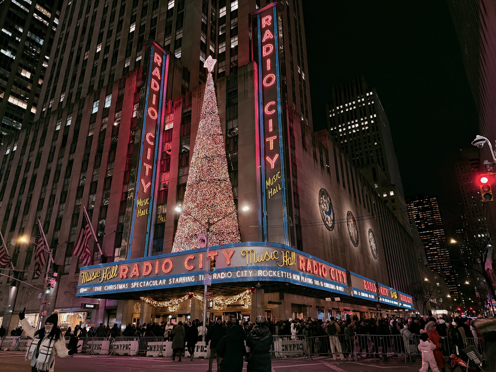
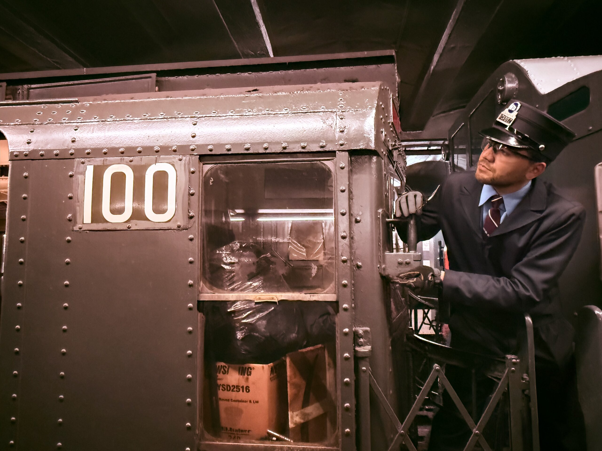
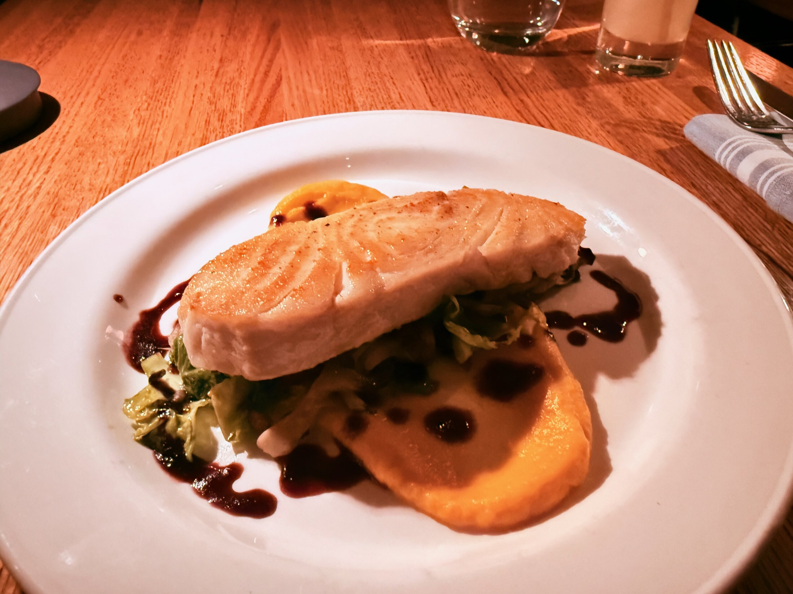
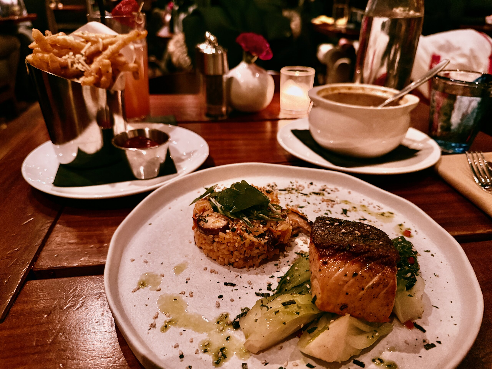
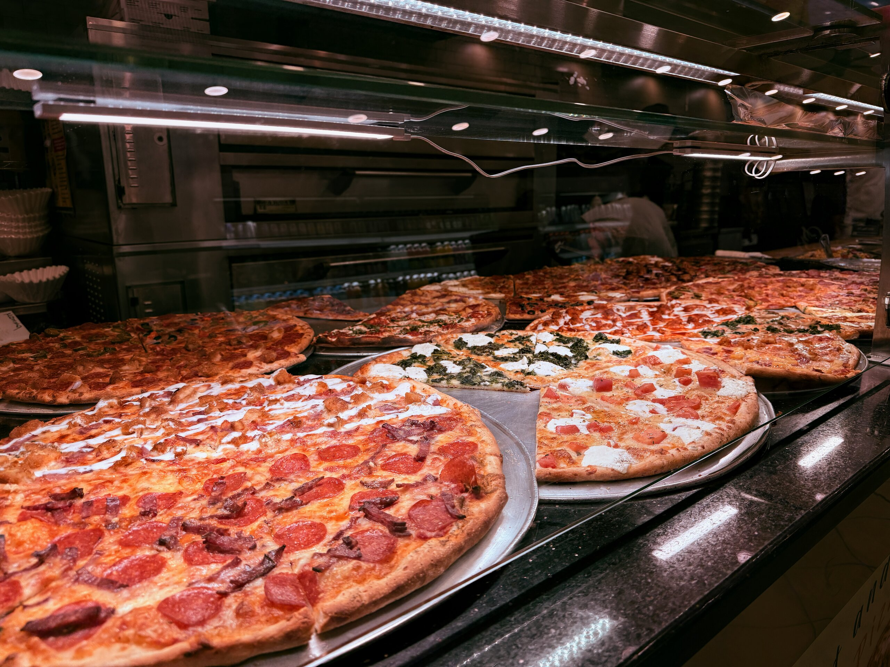
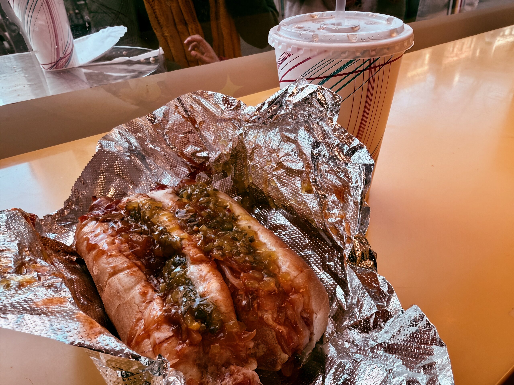
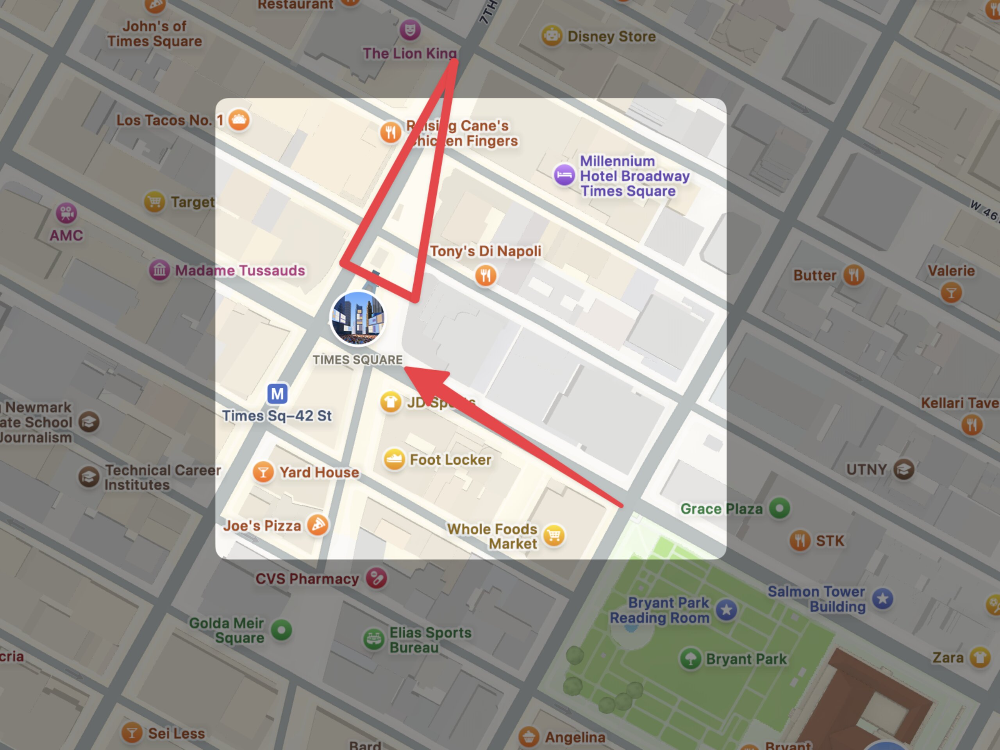

啊！紐約！

作為許多美國觀光客必訪的第一站，我反而拖到來美國一年多了才造訪紐約。一半是剛好台灣到匹茲堡順路 (或者更準確的來說：便宜) 的班機幾乎都是在西岸轉機，不會經過，另一方面也是我對這座城市抱著高度的期待，想騰出一段很長的時間來慢慢探索，所以也就一直拖到了畢業才真的有一大段空閒的假期可以安排這趟紐約行。

也剛好，這會是我第一次在台灣以外的地方過聖誕節和跨年，紐約大概也是美國 (甚至加上歐洲) 最適合過節的地方了吧。那就一起來看看紐約的聖誕節吧！

在開始之前，先來首[主題曲](https://www.youtube.com/watch?v=le1QF3uoQNg)吧！

## 🎄 聖誕樹 + 市集

就算不是市集，各種商店、大樓裡也有各式各樣的聖誕樹，而且都沒在讓的，每棵都又大又漂亮，幾乎可以舉辦聖誕樹的選美比賽 (X)





<figcaption class="text-center">忘記在哪裡看到某個紐約的傳說： 如果能在聖誕節看到 Bryant Park 的噴水池結冰，明年就能幸運一整年 (?)</figcaption>

聖誕市集的標準行程就是溜冰，累了就去市集買熱可可/熱紅酒，配吉拿棒或是甜到不行的糕點，最後再去繞一圈商店街，其實跟在台灣的夜市蠻像的，只是節慶的氣氛值高了不少 XDDDDD

 ᕗ 今年就在旁邊當 chill guy 就好 XDDD")






<figcaption class="text-center">由左至右： 世貿中心車站廣場的雪~人胖胖 洛克斐勒中心前，應該是紐約最大棵的聖誕樹 紐約公共圖書館的鎮館獅王也戴上了聖誕花圈</figcaption>

## 🚂 Holiday Nostalgia Rides

 R-1/9 的懷舊列車。")

從 1930 年代開始，所有紐約地鐵的列車型號都會直接使用採購合約的流水號，R-1 就是這個規則上路後第一批採購的列車之一，在 1940 年退役後就一直保存到現在，每年在聖誕節開出來帶大家穿越時空。





<figcaption class="text-center">左：連車廂內部的廣告、和設施都還保留在當年的狀態，吊扇都能正常運作 右：有些人還會特別精心打扮來搭乘</figcaption>

路線就是一般的地鐵路線，只要刷 OMNY 卡[^1]就可以直接在月台搭乘。

[^1]: 類似台灣的悠遊卡或一卡通

## 🕯️ 平安夜 + 聖誕夜晚餐

通常我對吃是沒什麼講究，而且自從來美國吃過無數又貴又難吃的餐廳之後，還曾發下豪語：「美國沒什麼好吃的食物。」

但經過這兩天，我有義務在這篇文章登報道歉：美國不是沒有好吃的食物，只是你得願意拿出很多的錢錢。

突然發現像紐約這樣的大城市，有來自世界各地的民族，飲食文化本來就很多元，在這裡上餐廳吃飯簡直就像環遊世界。

## 🍕 披薩 × 熱狗 🌭

餐廳吃完了，當然也是有廉價食物：美國最經典的垃圾系列

## 🌇 *Sunset Boulevard*

來紐約當然要來百老匯看戲！

這次看的是 *Sunset Boulevard*，心得有點長就另外開一篇寫了，有興趣的人可以[去看看]()。

## 🪩 跨年

紐約行的最後一個行程：去時報廣場跨年！

去時報廣場跨年對大部分人來說可能是一個蠻糟的注意，在我跟身邊的人分享要去紐約跨年的時候，不用我主動提及，就會被大家警告：千萬不要去時報廣場跨年，因為一大早就要排隊卡位進去，在裡面站一整天無聊沒事做，只為了看一顆球緩緩降下來，俗稱 [Balldrop](https://www.youtube.com/watch?v=-P-JBOxF6Qo)。

但後來想了想，人生能跨的年也就幾次，真的有體力能用力去體驗的更是沒幾次，在這些為數不多的機會裡，我會希望能至少去體驗一次時報廣場的跨年。但有鑑於我這一趟只有一個人，沒有人可以幫我互相 cover，所以最後決定走一個佛系的路線，時間差不多再過去，能靠多近就多近，累了想回家隨時閃人，沒看到就算了，最差還是可以回旅館看直播。

我在晚上 6 點多抵達時報廣場附近，因為警方陸續把附近的街道都封鎖了，所以連要靠近都很困難。我最後找到一個柵欄外可以看得到 Balldrop 而且還沒有人聚集的地方卡著，而且人行道邊有一個柱子，所以我可以輕鬆的坐在那根柱子上。

6 點到 9 點我跟兩個有點ㄎㄧㄤㄎㄧㄤ帶著披薩的黑人閨蜜、還有幾個南美洲大嬸輪流和駐守在柵欄內的警察杯杯聊天，聽他分享他前幾年跨年來站崗的故事，滑一下 Threads 看台灣的跨年 (特別是南寮漁港的煙火)，再聽個 podcast 殺時間，到這邊都還挺舒服的。

9 點到 11 點應該是整個晚上最痛苦的部分，因為下了一場大暴雨，而且是會閃電打雷的午後雷陣雨，我一度有點想放棄回旅館了，但往後看已經看不到人群的盡頭了，進退兩難之下似乎也只能繼續待到午夜跨年了。但也是下了這一場大雨，場外多了很多苦中作樂的節目，比方說每次打雷就會有人大喊：「Jesus, have mercy」然後旁邊被從睡夢中叫醒的人會問我剛才那一聲是煙火還是打雷，到後面看黑人閨蜜組表演把吃了一半，被雨水泡爛的披薩對折塞進背包。





<figcaption class="text-center">左：球還在上面的樣子 右：球下來之後的樣子</figcaption>

最後一個小時雨停了所以沒那麼痛苦，可惜倒數完之後也沒什麼煙火，彩帶是只有觀賞區裡面才會撒，所以一條街外的這裡相對就沒什麼大場面好看。

")

## 💬 結論

雖然[之前有寫過了]()但這裡再重複一次：我在暑假從灣區回匹茲堡時就差不多認知到：我就是都市長大的小孩，即使現在長大了也還是想繼續待在大城市裡。我享受搭地鐵通勤時帶著耳機觀察人群、不經意的在路上發現沒吃過的餐廳、週末去博物館、購物中心閒逛，又或是帶上一本書去咖啡廳泡上一整天。生活充滿不確定性是我的靈感來源，也是我繼續維持這個假掰部落格的方式：）

所以即便紐約充滿各種荒誕不經，但我想也正是這些奇人異事，豐富了這座城市的不同樣貌，也只有這樣的文化大熔爐，才賦予了美國夢實現的機會。

我想紐約就是我所追尋的那個理想城市，我也會心心念念再回來的那一天。

🗽
