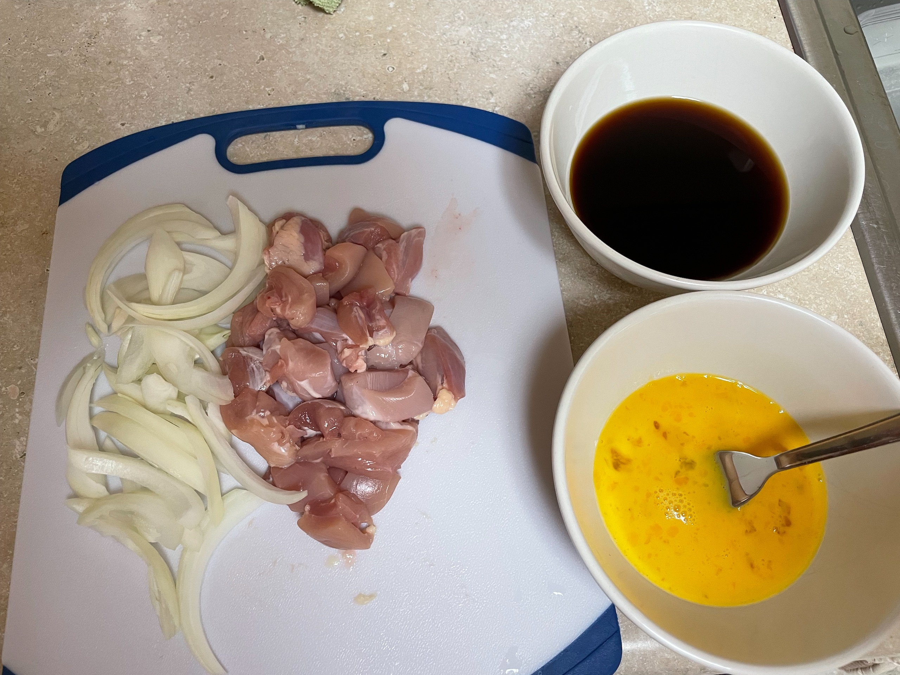
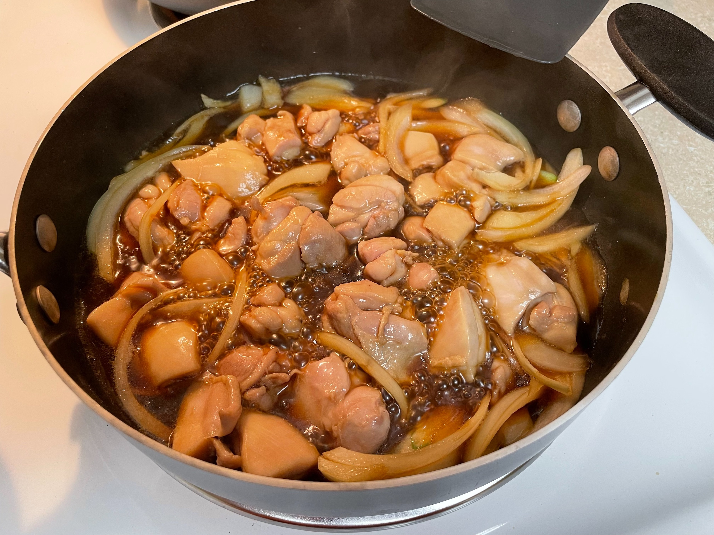
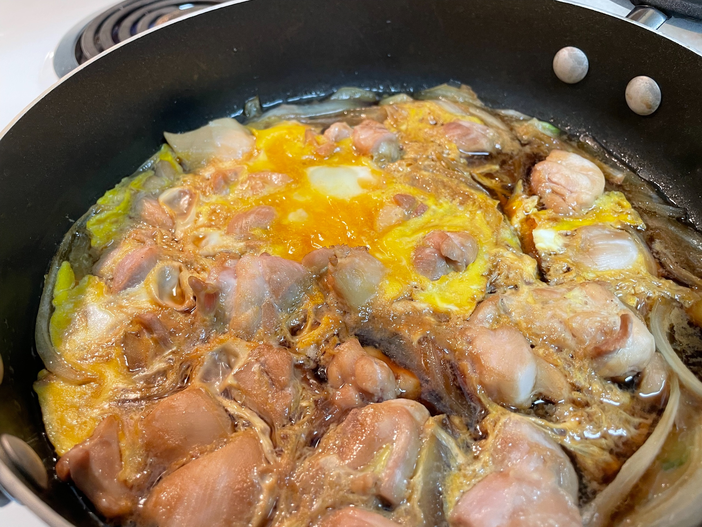

## 食材

*以下份量約為 2 人份*

- 白飯兩碗
- 洋蔥半顆
- 無骨雞腿肉 400g
- 雞蛋 4 顆
- 味醂 or 白酒 50ml
- 砂糖 1/2 大匙
- 醬油 50ml
- 柴魚高湯 or 水 100 ml
- 裝飾用山芹菜隨喜

## 備料

- 洋蔥切絲
- 雞肉切成塊狀
- 雞蛋打成蛋液
- 味醂 + 砂糖 + 醬油 + 柴魚高湯在碗中拌勻成湯汁

## 料理

1. 將湯汁倒入平底鍋加熱
2. 湯汁開始冒泡後，加入洋蔥和雞肉
3. 以中火煮 4 分鐘，並不時翻炒雞肉和洋蔥

4. 雞肉熟了之後從中間往外畫圈倒入蛋液，將鍋蓋蓋上，燜煮約 1 分鐘
5. 開蓋，在蛋液呈現半熟狀後起鍋
6. 用鍋鏟將蛋連同洋蔥和雞肉整片舖在飯上

