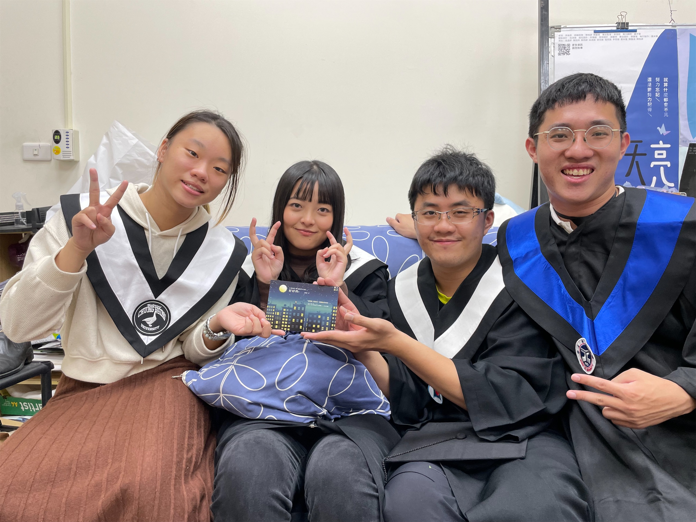
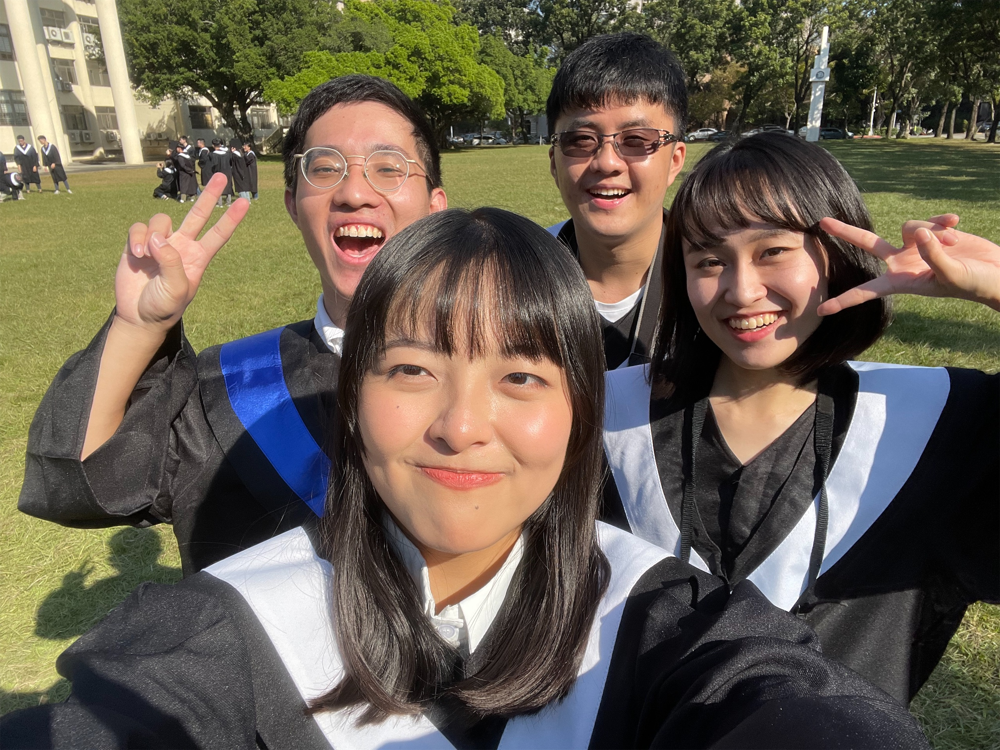
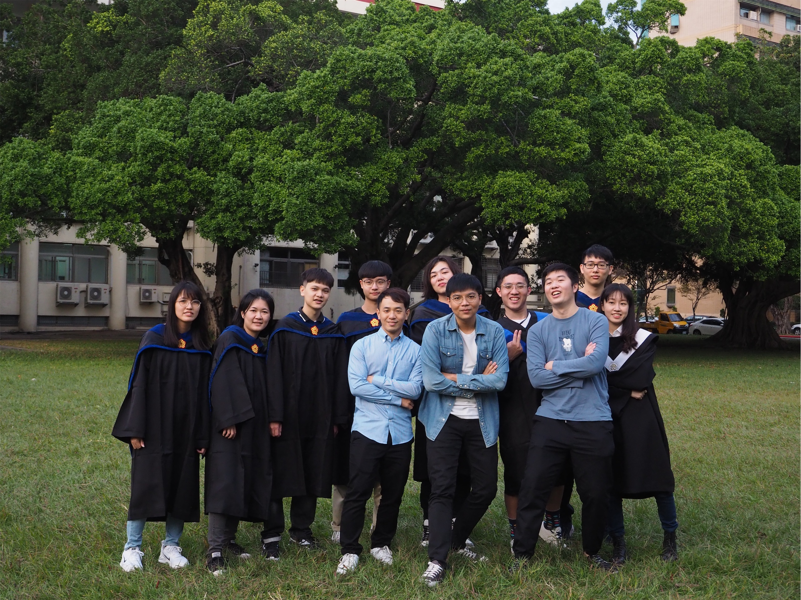
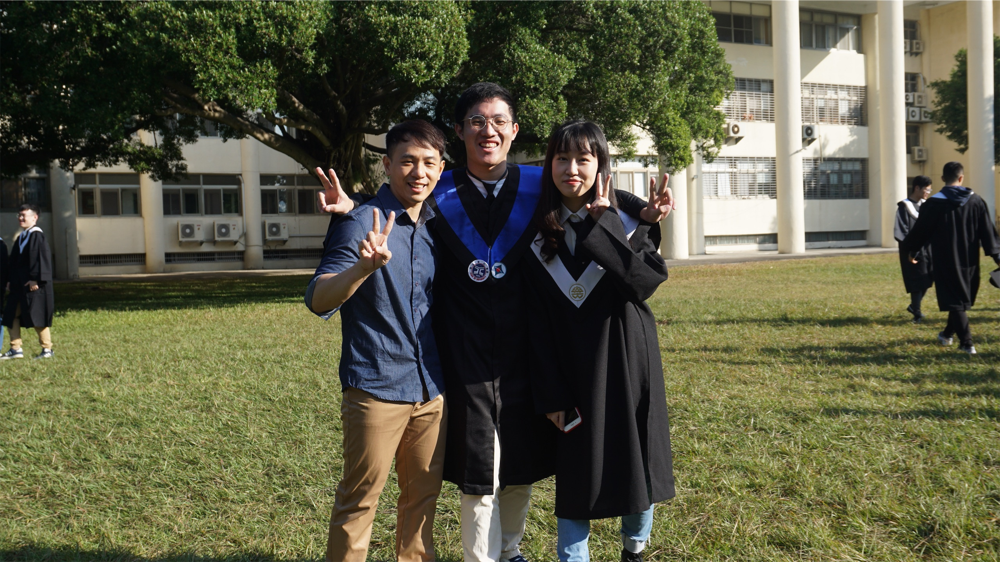
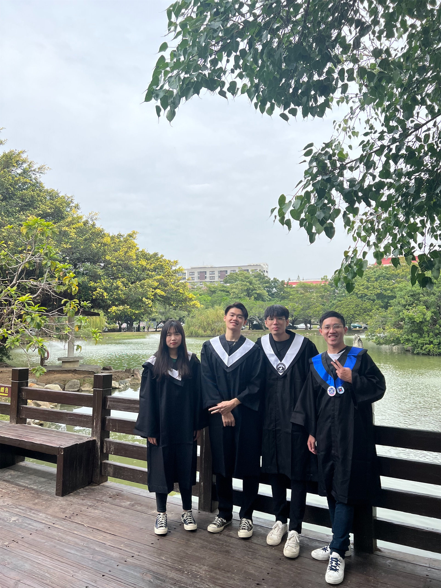
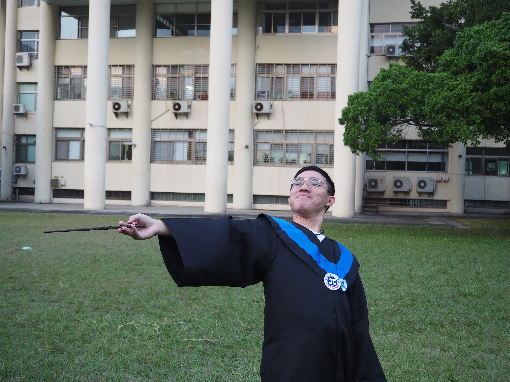

上午 10 點 40 分，捷運台北 101 站東側的驗票閘門錄到一張學生版一卡通的進站紀錄。月台的閉路監視器拍攝到一名背著灰色背包的男子，在第 4 節車廂處候車，並在 10 點 45 分搭上了開往淡水方向的列車。11 點 07 分，圓山站出口 2 的驗票閘門為同一張一卡通驗證出站。站外監視器最後拍攝到的畫面，是他在背影，消失在庫倫街左轉的轉角。他在這段旅程中的一舉一動被各種紙本和電子的形式被記錄了下來，但沒有任何活生生的人，哪怕是站務人員、司機、或是乘客能夠出面指認他曾經存在。

這曾是我考慮在中興度過我後半段大學生活的方式：揮一揮衣袖，不帶走一片雲彩。

可是如果沒有人記得，那他還存在過嗎？

如果國文課曾經教會了我什麼，那就是上一位沒帶走那片雲彩的，最後沒能夠安全的降落。所以為了讓我能平安的抵達，我想我還是揮一揮魔杖，帶走屬於自己的一片雲彩吧。

謝謝豐富這段故事的每一位

讓一切都值得
