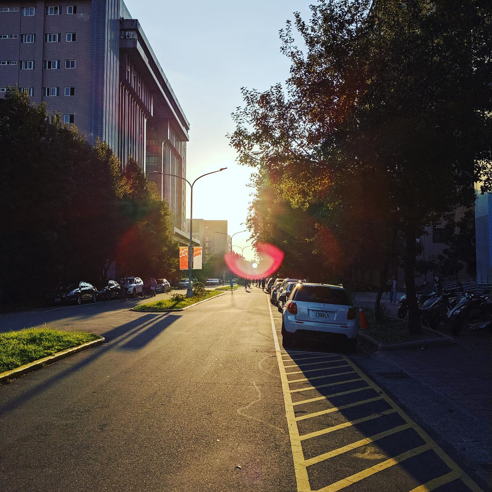

---
# https://gohugo.io/content-management/front-matter/
# https://jpanther.github.io/congo/docs/front-matter/
title: "2020 🇯🇵 日本 - 前言"
date: 2021-08-07T21:42:33+08:00
description: "緣起、為什麼是日本"
images: ["https://og.tomy.tech/api/blog?title=2020%20%F0%9F%87%AF%F0%9F%87%B5%20%E6%97%A5%E6%9C%AC%20-%20%E5%89%8D%E8%A8%80"]
series: ["2020 🇯🇵 日本"]
tags: ["🧳 旅遊"]
---

那是 2019 年的秋天，記得應該是某一堂正規語言吧，一如往常的，上課不到半個小時幾乎半個班都已經進入熟睡或是放空耍廢的模式。我盯著電腦的螢幕，發覺今天好像不是寫 code 特別順的日子，是不是乾脆跟著大家一起睡算了。轉頭張望了一陣子之後，內心突然獲得了一種難得的平靜，仔細想想過去的 2 年，我的生活大部分時候的確都是在被各式各樣東西追著跑的狀態，也難怪，在我剛進中興的這個時間點，生活的步調總算是慢下來了一點。雖然前一陣子很多的努力最後沒能兌現，但既然都算是走到一個段落了，我還是決定在這個不錯的時機點，來讓自己放個假。

於是我打消了睡意，開始在課堂上規劃我的假期。一開始的計畫原本是，找一個我還沒去過的國家，然後就照一般出國排行程的方式，排一些理所當然的行程。我打開 Google Flights 看著世界地圖，掐指算了一下去不同地方可能的花費會到哪個級距，如果以度假來說，便宜的選項玩起來可能不會太輕鬆，而舒服的選項普遍不會太便宜。

同時我也考慮到了另外一個重點，就是如果我只是找了一個沒去過的地方，去走一些大家都會走的行程，那其實對我來說好像就沒什麼紀念的意義或價值了。所以雖然我在開始前立了一個 Flag 說不要選一些聽起來很 low 的選項，但考量到預算、一個人移動的方便性、還有我後續在行程安排上可以變化的空間，我最後還是選了日本作為這趟旅程的目的地。

好啦，接下來幾篇要開始連載我的日本行ㄌ
