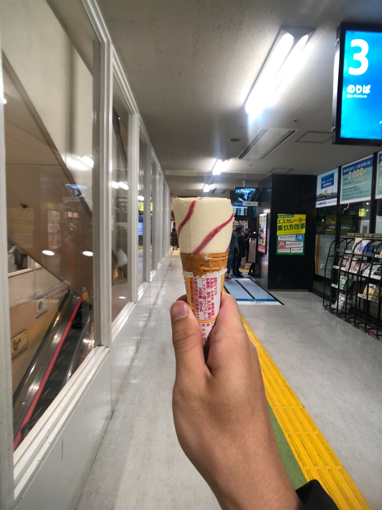
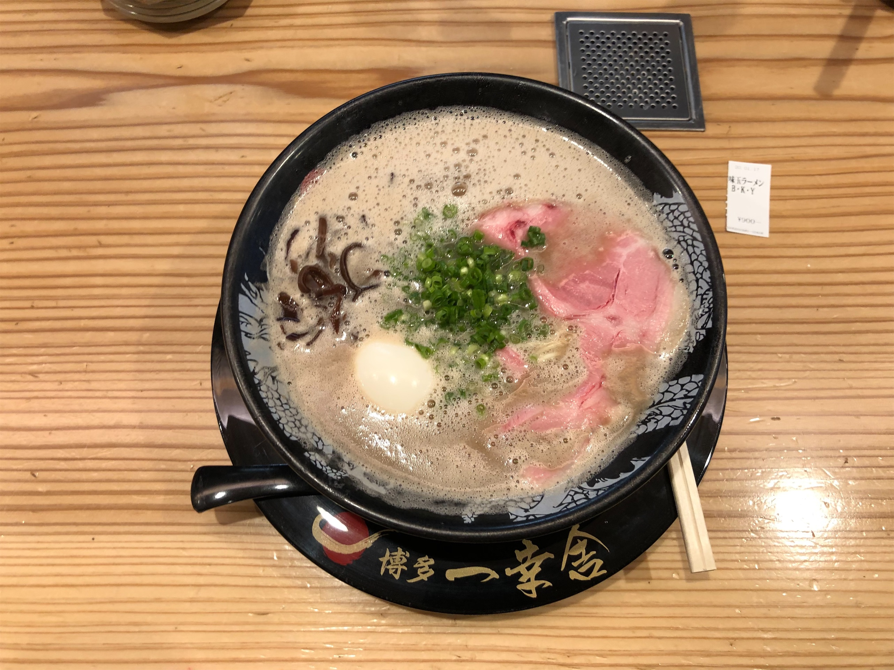
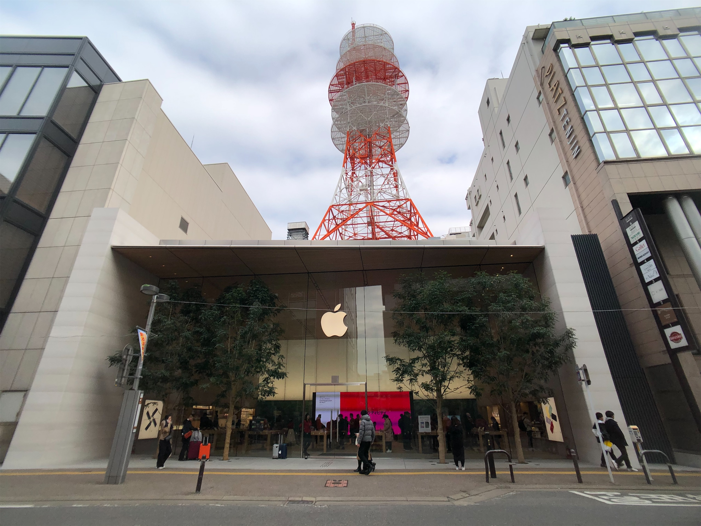
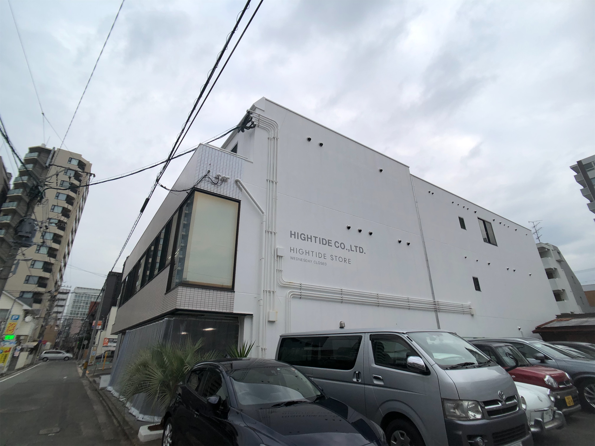
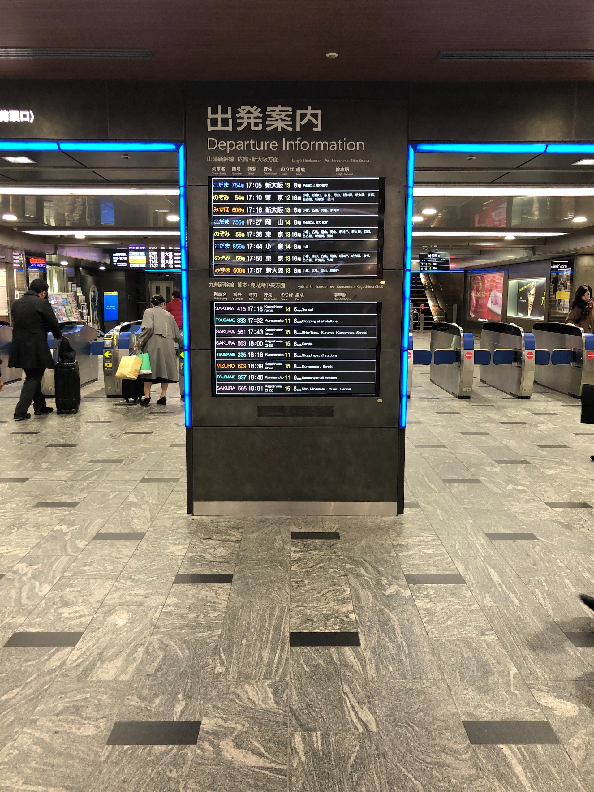
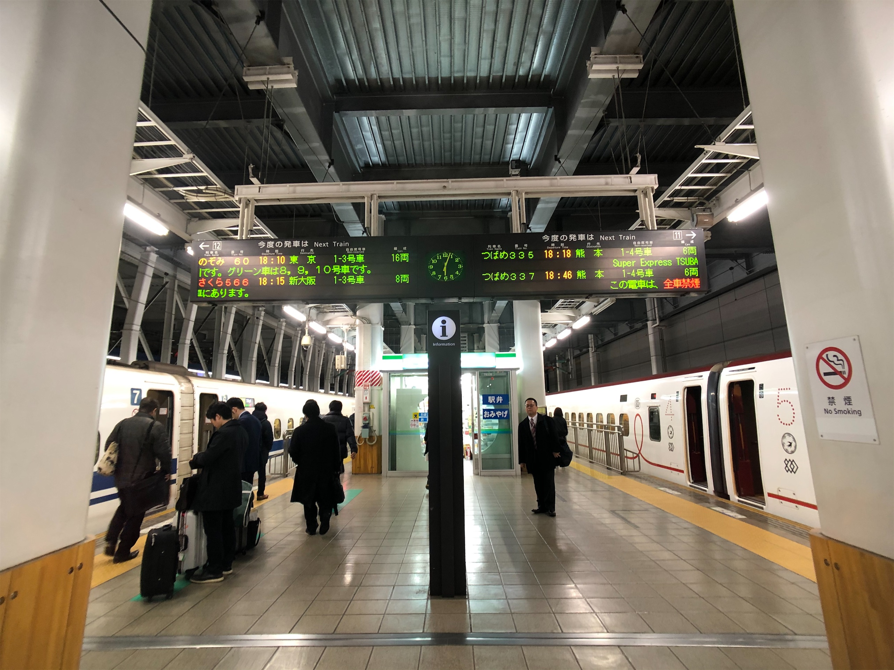
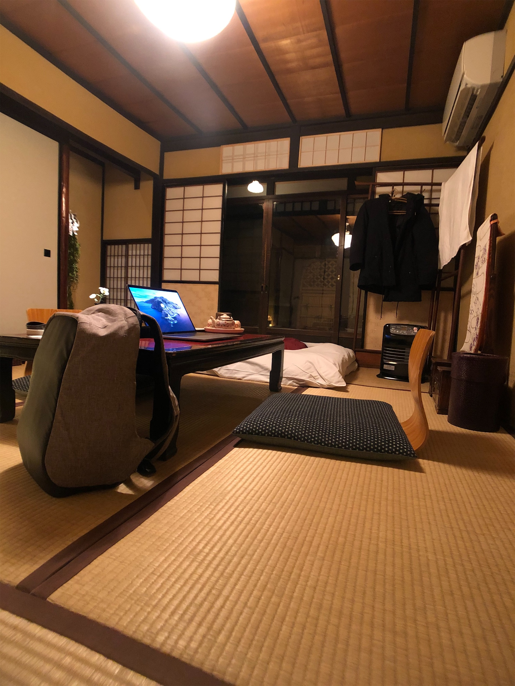

## Day 1

雖然我出發前已經在地圖上點了不少可以去的地方，但我從來沒有把這些想去的地方連成一條線，也沒有去想過我的時間究竟能允許我去多少地方。於是我一直到下了飛機，才突然意識到我其實不知道我出了機場之後要往哪個方向走。

不幸中的大幸是，博多一幸舍的本店就在博多車站步行距離大概不到 10 分鐘的地方，就很剛好的解決了我落地的第一餐，還可以順便在吃飯的時候想一下接下來要去哪裡鬼混。

說實話過了那麼久，我實在是想不太起來它的味道到底是如何。但這可能也代表了，博多拉麵的口味雖然不是大部分拉麵愛好者的首選，但一定是不同派系之中最入門，一般人接受度最高的一個選項。我本來是有想說回台灣要再找機會去新竹吃吃看有沒有不一樣，但可惜回來沒多久就因為疫情掰掰了 QQQQ

吃完拉麵下午的行程當然就是散步逛街 (?)，也剛好我想去踩的點幾乎都在天神的商圈附近，所以我就很順的沿著大馬路一路逛下去。令我滿印象深刻的是這條街上的店家單價普遍滿高的，再加上街道整齊劃一，逛起來其實頗有高級 outlet 的感覺。

Hightide 算是我少數滿常在關注的雜貨品牌，所以即便它的店沒有在順路的路線上，但我還是特別繞過去想親自去本店逛一下。一走進店裡我馬上就注意到店內在播的音樂是我也很喜歡聽的 LANY，雖然我最後沒買什麼東西，但整體逛起來的感覺是很舒服的。有的時候喜歡某一個牌子的東西，那感覺就像一個跟你喜歡一樣風格的人在設計一個東西，所以他的東西自然就會滿足你自己對某一個東西的想像吧。

下午不小心逛的太盡興，晚上回到博多車站的時候，我才發現新幹線到京都最快可能也都要 10 點了，因為之前民宿有寫信來前交代萬交代如果要延遲住宿一定要提前通知不然會進不去，於是我還在車站內兜了好幾圈找到旅客服務櫃檯借電話，然後那個民宿的婆婆似乎還不太會講英文，所以搞了老半天最後電話還是櫃檯的服務人員幫我翻譯的 ¯\\\_(ツ)\_/¯

終於搞定之後，就開心的去買便當上車前往京都辣

")

