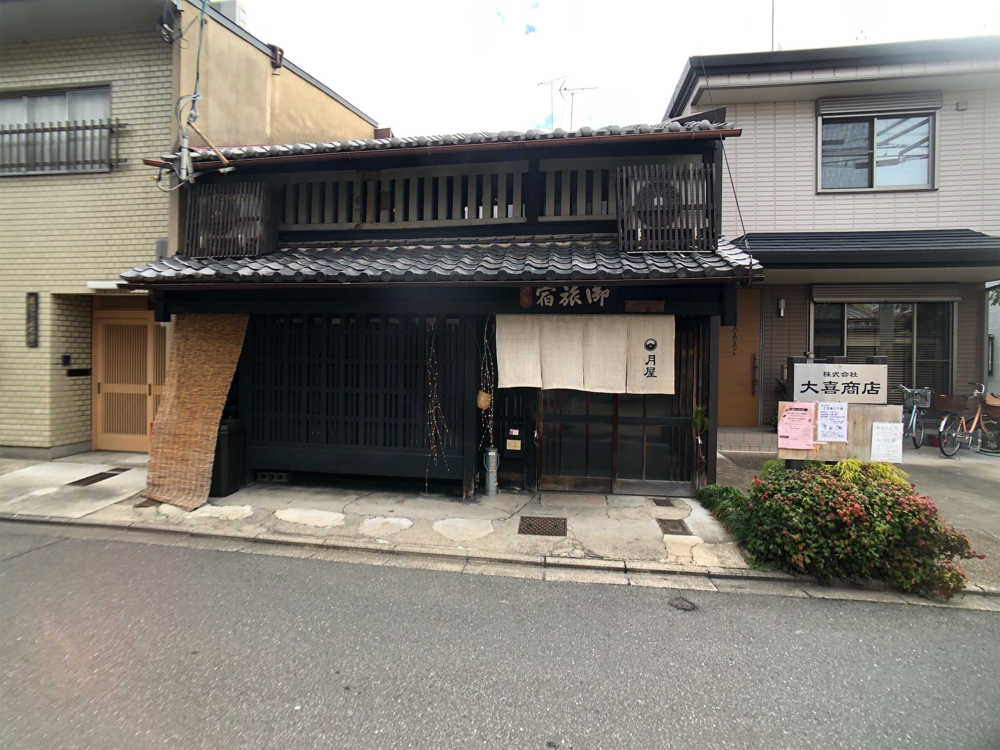
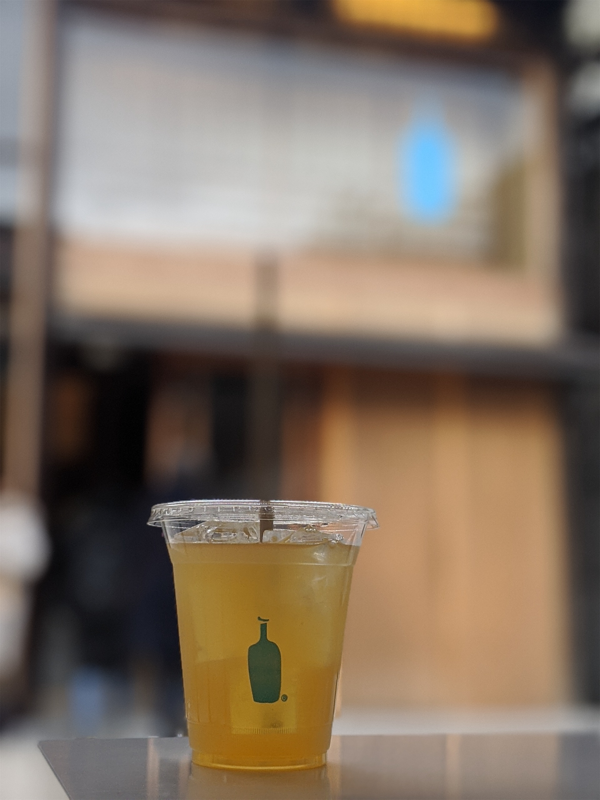
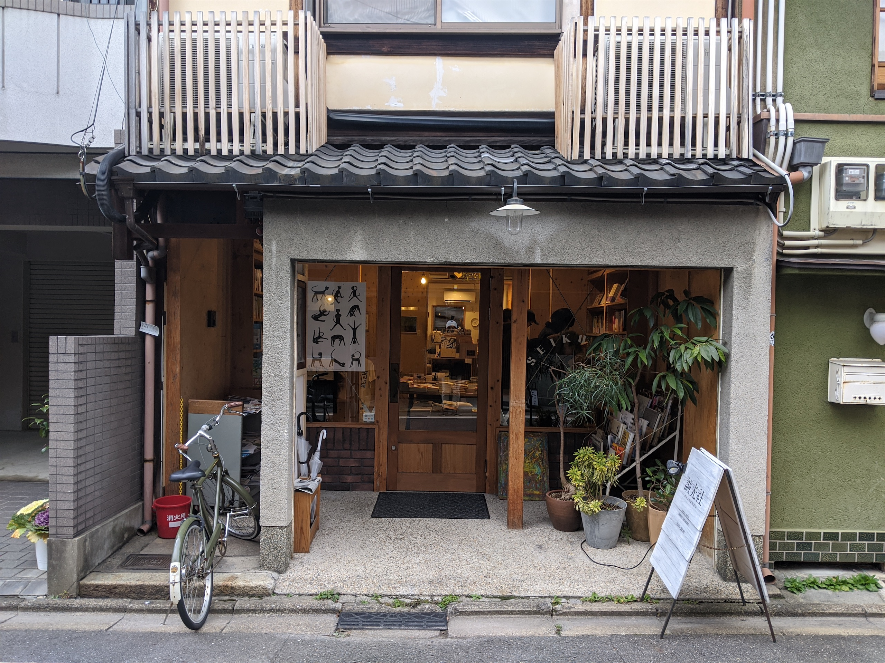
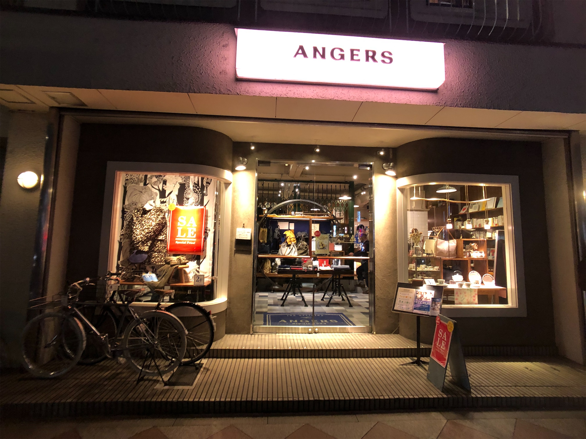
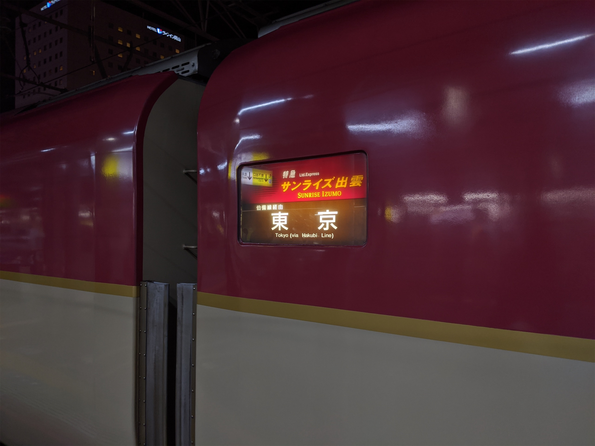

雖然我在上一集最後有提到我還是順利到達京都了，但到的時候其實也超過 10 點了。那天晚上住的是我特別找到一間有百年歷史的老房子翻修成的民宿，我走進去的時候才發現接待的是一個看起來應該是屋主的老奶奶，整個人看起來已經超想睡的，要不是為了等我 check-in 可能平常這時間根本不會是醒著的，結果超時 check-in 還只收我 ¥500，害我心裡有點過意不去...... (我真的不是故意的，誰知道尖峰時刻的新幹線這麼難劃 QQQQQ)

## Day 2

第二天一早去了宇治平等院的附近，逛起來說實在沒什麼特別的記憶點，但我嘗試了我人生中的第二隻抹茶冰淇淋。

我人生中的第一隻抹茶冰淇淋，應該是在我還非常小的時候，我只記得我跟我媽說想吃抹茶口味的，她馬上極力勸阻我你吃那麼甜才不會喜歡這種口味的東西，但我小時候就是脾氣超大的，最後還是買了，然後舔一口就丟給我爸了 XDDDDDD。

第二隻抹茶冰淇淋吃起來倒是意外的還不錯，我當時以為是因為在宇治，所以會特別好吃，但我回來之後有在台北再嘗試了一次，發現其實跟我在宇治吃到的沒有太大的不同，所以證明其實我的味蕾還是有隨著年齡的增長，在增加我對無糖食物的接受度 吧。

下午又去踩了幾個我有興趣的點，藍瓶咖啡、蔦屋書店、還有一些小的獨立書店或是選物店，看到了蠻多以前沒看過的酷東西。雖然都不是什麼我現在會用得上，或是特別容易上火的東西，但我覺得事後我在買其他鬼東西的時候，變得比較懂的去看出一個產品可能的雷點，這段路上看到這些哩哩摳摳的細節所累積的經驗，其實久了還是會有不小的收穫。

## Day 3

<figcaption class="text-center">你在南方的豔陽裡，鴿子紛飛 (?)</figcaption>

第三天轉戰大阪。不知道為什麼我的地圖上大阪的點特別的稀少，所以我這一天在大阪的行程算是相對寬鬆的，早上睡到半自然醒，然後去了大阪城公園，然後就很隨性的在公園的大噴水池前面吃著 LAWSON 的烤串當早午餐，然後一邊看日本小孩餵鴿子和追著鴿子跑 XDDDDDD。不知道是我在台灣很少有這麼 chill 的行程，還是我總覺得台灣人好像不太喜歡在公園遛小孩，這麼熱鬧的公園場景好像實在是沒在台灣看過

下午就是 100% 的逛街行程，去 BIC Camera 繞了一大圈，田調了一下最近日本有但台灣可能還沒有的電子玩具，當作我未來的買新給西的參考。為了從岡山發車的臥鋪列車，所以我下午 4 點多就開始慢慢往西移動了。

")

在前往岡山的路上有中停了一段時間在神戶，是我特別安排的夜間散步行程。

從新神戶車站出來往市中心方向走一點點的地方就是北野異人館和英國館的街區，雖然晚上的時候這些地方都沒有開，但這條街逛起來其實還是滿寫意的 (?)。

不知道是從什麼時候開始，我開始喜歡上在一個人去外地旅遊的夜晚，戴著耳機，散步在可能繁榮又或是安靜的街道上，就好像我轉生成另一個世界的人了，過著跟我平常不一樣的生活。

