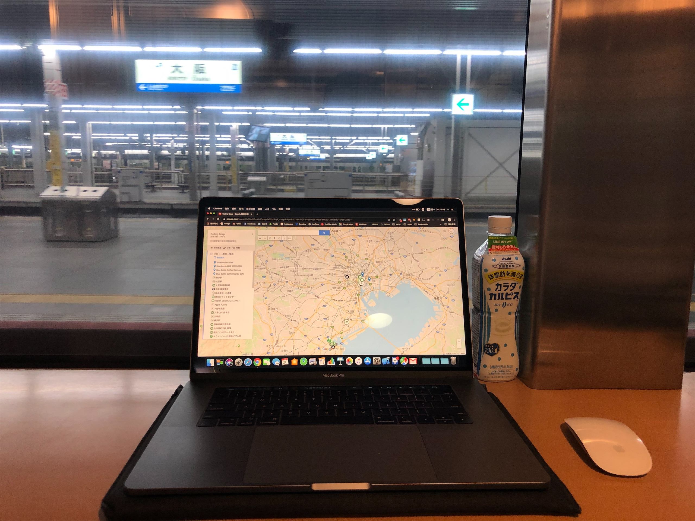
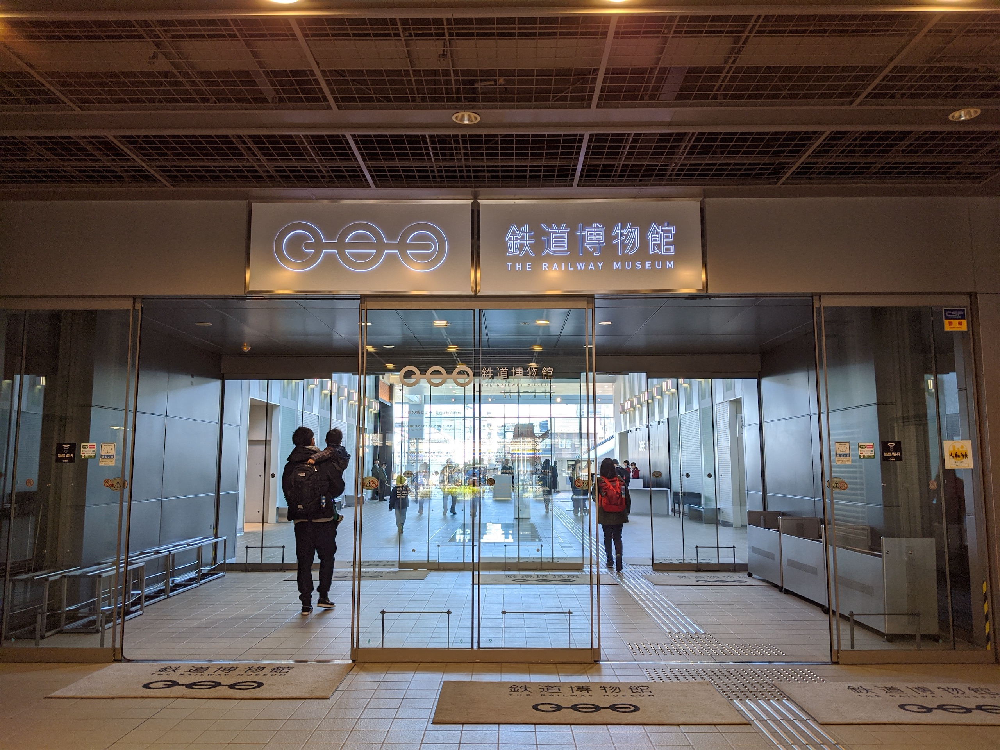
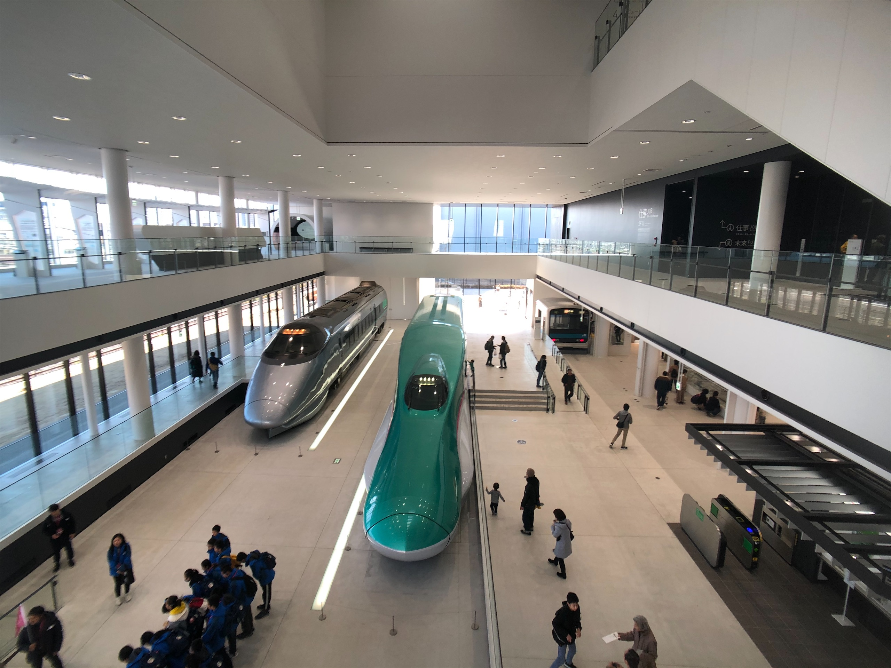
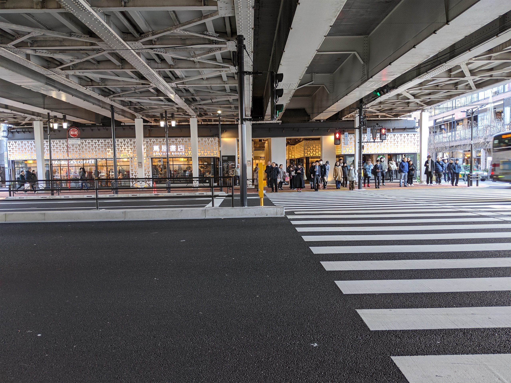
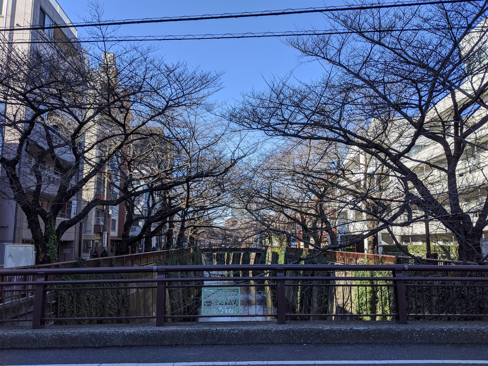
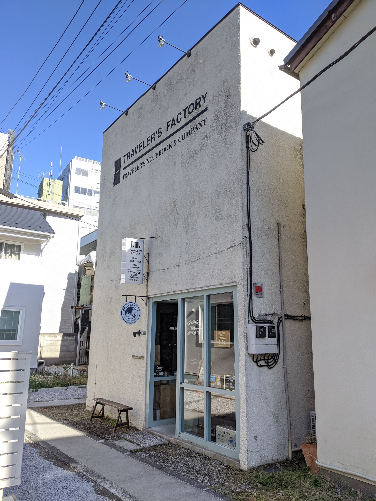
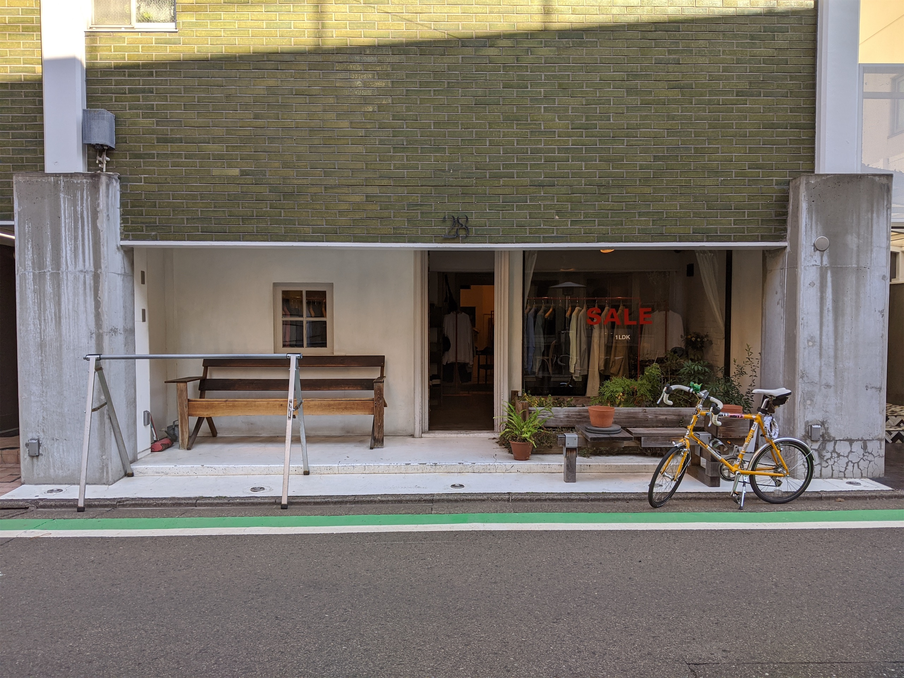

## Day 4

<figcaption class="text-center">這小王八蛋一定想不到他的 21 歲生日會在真實世界的那台列車上醒來</figcaption>

285 系列車是我們家少數不是新幹線的列車組，少了流線型的車頭和簡潔的配色，它當然就不是我小時候最喜歡拿起來把玩的那一列火車。但因為它的車頭是方形的，再加上它可以放比其他列車更大顆的電池，所以~~可以用來撞我弟的車~~比較不容易出軌

這個型號的車輛對應的路線就是サンライズ瀬戸・出雲號。有兩個名字的原因是因為這班列車其實是兩部列車併結，一起從東京出發，到岡山分離，前半段的瀨戶號會接著由瀬戸大橋往四國的方向前進，而後半段的出雲號則會走山陰線到出雲市。如果你是對日本地理比較熟悉的人，在看上一集行經的路線時可能就會發現，我在抵達京都之後，沒有繼續往中部地區，而是繞回來往大阪、神戶，為的就是要在最後從岡山上車，看兩輛列車在這裡併結。

關東第一天的行程還是跟鐵路脫不了關係 (到底有多愛XD) ——大宮鐵道博物館。

其實那天白天的行程本來是還想再去另外兩個博物館，一個是橫濱的原鉄道模型博物館，另外一個是合味道紀念館。但不知道是鐵道博物館太大還是因為是鐵道所以我逛比較久，後面兩個根本沒時間去 QQQ。

但鐵博館內容蠻豐富的，車棚有很多很經典的列車都可以走進去看，另外還有兩棟展覽館可以逛，到最後面頂樓還有一個露天的觀景台可以近距離看到旁邊經過的新幹線和在來線。整體而言規劃非常完善，一方面是內容，你想得到的和你想不到的都有，另一方面是它完全可以滿足家長週末帶小孩出門所有可能的需求，在這裡泡上一整天其實並不困難，我覺得台灣似乎還有任何一個博物館或是觀光工廠有成功做到這件事。

## Day 5

隔天又是一個跟在福岡類似的掃街行程，這次是在中目黑。中目黑最近最有名的景點就是星巴克在目黑川的河岸邊開了一間超大的典藏咖啡工坊，估計是疫情前台灣網紅海外打卡次數最高的熱點。但我第一次認識中目黑其實是再上一趟來東京的時候。

當時去的是位在目黑川對面，代官山的蔦屋書店，這家蔦屋書店的位置距離最近的地鐵站要走路至少要大概 10 分鐘，走起來的感覺以外的和東京的其他街道很不一樣，有種東京版天母的感覺，沿路上也有很多門面上看不太出來是在賣什麼葫蘆又有點酷酷的店。

這次會決定再來這裡掃街，當然也還是因為這些酷酷的店，比方說 Traveler's Factory 的文具店，雖然中目黑沒有像代官山那麼有神秘感，但河岸的風光很漂亮，附近臨時找到的午餐也意外的好吃，應該是我未來到東京都還會再次造訪的地方。

